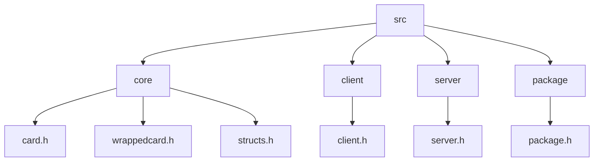
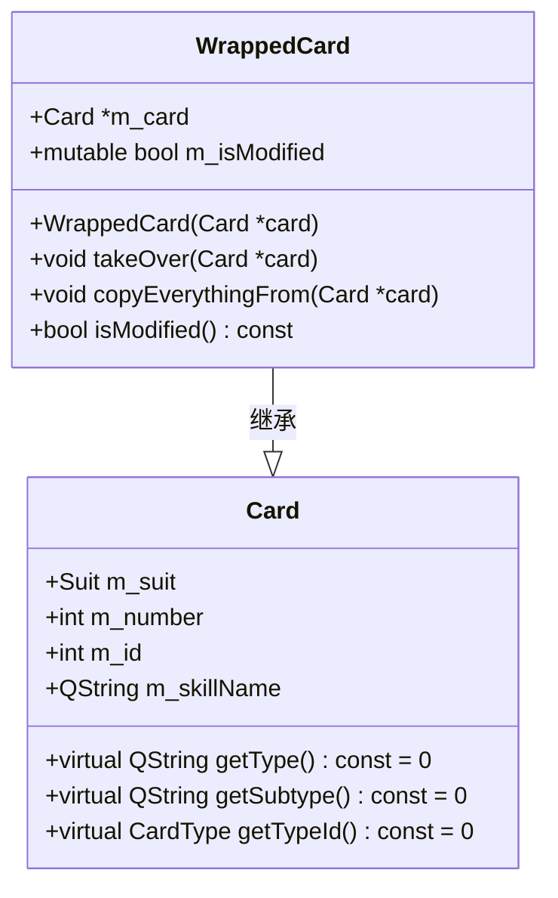
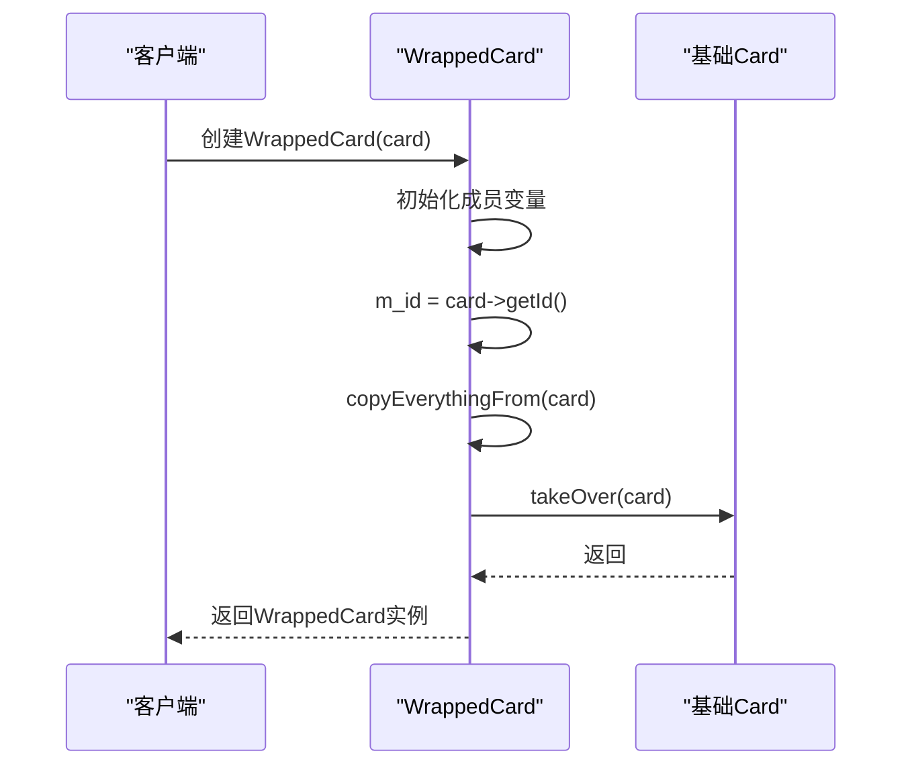
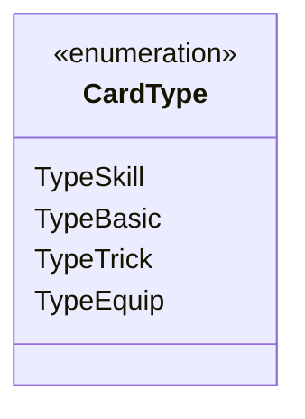
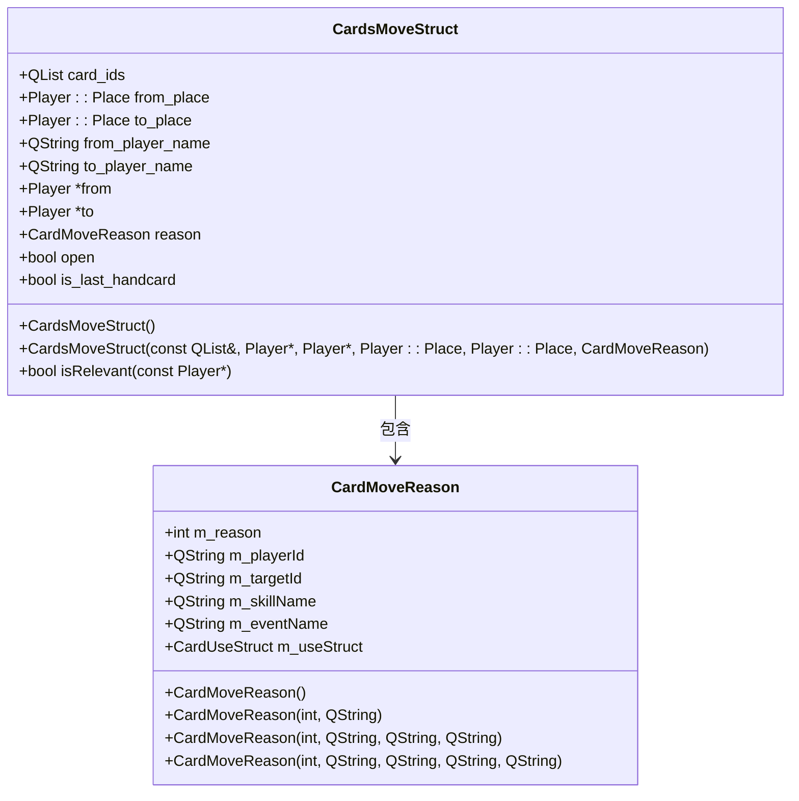
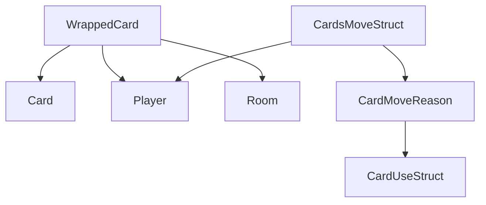

# 卡牌结构

<cite>
**本文档中引用的文件**   
- [wrappedcard.h](file://src/core/wrappedcard.h)
- [card.h](file://src/core/card.h)
- [wrappedcard.cpp](file://src/core/wrappedcard.cpp)
- [structs.h](file://src/core/structs.h)
</cite>

## 目录
1. [简介](#简介)
2. [项目结构](#项目结构)
3. [核心组件](#核心组件)
4. [架构概述](#架构概述)
5. [详细组件分析](#详细组件分析)
6. [依赖分析](#依赖分析)
7. [性能考虑](#性能考虑)
8. [故障排除指南](#故障排除指南)
9. [结论](#结论)

## 简介
本文档深入解析了卡牌游戏系统中卡牌数据结构的设计与实现。重点分析了`WrappedCard`类如何封装基础`Card`对象并添加运行时状态（如花色、点数、拥有者等）。文档详细描述了卡牌类型枚举、使用目标规则、技能关联机制的实现原理。同时，提供了卡牌在不同游戏阶段（判定区、装备区、弃牌堆）的状态转换图，并结合代码示例说明了卡牌移动（`CardsMoveStruct`）时的数据一致性保障策略。最后，记录了卡牌序列化过程中的常见错误及性能优化建议。

## 项目结构
项目结构清晰地分为多个模块，包括AI选择器、构建文件、扩展包、核心源码、资源文件等。核心卡牌逻辑位于`src/core`目录下，其中`card.h`和`wrappedcard.h`是卡牌系统的核心头文件。

**图源**
- [card.h](file://src/core/card.h)
- [wrappedcard.h](file://src/core/wrappedcard.h)

**节源**
- [card.h](file://src/core/card.h)
- [wrappedcard.h](file://src/core/wrappedcard.h)

## 核心组件
卡牌系统的核心组件包括`Card`基类、`WrappedCard`包装类以及`CardsMoveStruct`移动结构体。`Card`类定义了卡牌的基本属性和行为，`WrappedCard`类在此基础上增加了运行时状态管理，`CardsMoveStruct`则用于描述卡牌的移动操作。

**节源**
- [card.h](file://src/core/card.h)
- [wrappedcard.h](file://src/core/wrappedcard.h)
- [structs.h](file://src/core/structs.h)

## 架构概述
卡牌系统的架构采用面向对象设计，通过继承和封装实现功能扩展。`WrappedCard`继承自`Card`，并持有一个`Card`指针，实现了对基础卡牌的包装和扩展。

**图源**
- [card.h](file://src/core/card.h#L39-L246)
- [wrappedcard.h](file://src/core/wrappedcard.h#L40-L309)

## 详细组件分析

### WrappedCard类分析
`WrappedCard`类是卡牌系统的核心，它通过包装一个基础`Card`对象来实现运行时状态的管理。当创建`WrappedCard`时，会复制基础卡牌的所有属性，并在运行时维护修改后的状态。

**图源**
- [wrappedcard.cpp](file://src/core/wrappedcard.cpp#L22-L27)
- [wrappedcard.h](file://src/core/wrappedcard.h#L40-L309)

#### 卡牌类型枚举
卡牌系统定义了四种基本类型，通过`CardType`枚举实现。

**图源**
- [card.h](file://src/core/card.h#L77-L80)

### 卡牌移动分析
`CardsMoveStruct`结构体用于描述卡牌的移动操作，包含源位置、目标位置、移动原因等信息。

**图源**
- [structs.h](file://src/core/structs.h#L249-L343)

## 依赖分析
卡牌系统依赖于玩家系统、房间系统和技能系统。`WrappedCard`类依赖于`Card`类，`CardsMoveStruct`依赖于`Player`和`CardMoveReason`。

**图源**
- [wrappedcard.h](file://src/core/wrappedcard.h)
- [structs.h](file://src/core/structs.h)

**节源**
- [wrappedcard.h](file://src/core/wrappedcard.h)
- [structs.h](file://src/core/structs.h)

## 性能考虑
在卡牌系统中，性能优化主要体现在以下几个方面：
1. 使用内联函数减少函数调用开销
2. 通过指针引用避免对象复制
3. 使用Q_ASSERT进行调试断言
4. 合理使用const关键字保证数据安全

## 故障排除指南
常见问题及解决方案：
1. **卡牌状态不同步**：确保`WrappedCard`的`m_card`指针正确指向基础卡牌
2. **移动操作无效**：检查`CardsMoveStruct`的`reason`字段是否正确设置
3. **类型转换失败**：使用`isKindOf`方法进行安全的类型检查

**节源**
- [wrappedcard.h](file://src/core/wrappedcard.h)
- [structs.h](file://src/core/structs.h)

## 结论
本文档详细解析了卡牌数据结构的设计与实现。`WrappedCard`类通过包装模式实现了对基础卡牌的扩展，`CardsMoveStruct`结构体确保了卡牌移动操作的数据一致性。系统采用清晰的面向对象设计，具有良好的可扩展性和维护性。