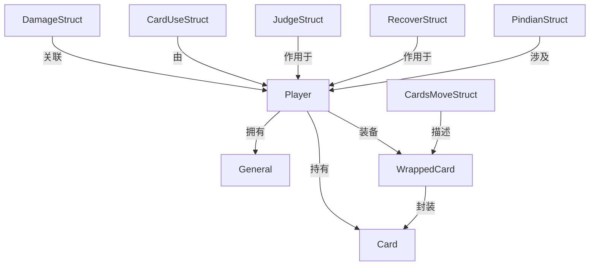

# 数据结构

<cite>
**本文档引用文件**  
- [structs.h](file://src/core/structs.h)
- [player.h](file://src/core/player.h)
- [general.h](file://src/core/general.h)
- [wrappedcard.h](file://src/core/wrappedcard.h)
</cite>

## 目录
1. [引言](#引言)
2. [核心数据结构概述](#核心数据结构概述)
3. [ServerInfoStruct 与 CardsMoveStruct 分析](#serverinfostruct-与-cardsmovestruct-分析)
4. [PlayerHandcardStruct 与 Player 类模型](#playerhandcardstruct-与-player-类模型)
5. [General 武将结构设计](#general-武将结构设计)
6. [WrappedCard 卡牌包装机制](#wrappedcard-卡牌包装机制)
7. [数据序列化与网络传输](#数据序列化与网络传输)
8. [常见误用与调试方法](#常见误用与调试方法)

## 引言

本技术文档旨在全面解析《三国杀·霸业》（QSanguosha-For-Hegemony）项目中定义的核心数据结构。文档聚焦于 `src/core/` 目录下的关键头文件，包括 `structs.h`、`player.h`、`general.h` 和 `wrappedcard.h`，深入剖析其字段含义、内存布局、生命周期及在客户端-服务器通信中的作用。

通过本文档，开发者可以清晰理解游戏运行时的数据组织方式，掌握核心结构的使用场景与最佳实践，并为功能扩展和问题排查提供坚实的技术基础。

## 核心数据结构概述

本节对项目中定义的核心数据结构进行概览，明确其在游戏逻辑中的角色与相互关系。



**图示来源**  
- [player.h](file://src/core/player.h)
- [structs.h](file://src/core/structs.h)
- [general.h](file://src/core/general.h)
- [wrappedcard.h](file://src/core/wrappedcard.h)

## ServerInfoStruct 与 CardsMoveStruct 分析

### ServerInfoStruct

在提供的代码库中，`ServerInfoStruct` 并未直接定义。其功能可能由 `Room` 类或网络协议相关的结构承担。本节重点分析 `structs.h` 中定义的 `CardsMoveStruct` 及其相关结构。

### CardsMoveStruct

`CardsMoveStruct` 结构体用于描述游戏中卡牌移动的完整信息，是客户端与服务器间同步卡牌状态的核心数据单元。

**结构定义 (src/core/structs.h)**

```cpp
struct CardsMoveStruct
{
    QList<int> card_ids; // 移动的卡牌ID列表
    Player::Place from_place; // 起始区域
    Player::Place to_place; // 目标区域
    QString from_player_name; // 起始玩家名称
    QString to_player_name; // 目标玩家名称
    QString from_pile_name; // 起始堆叠名称（如技能牌堆）
    QString to_pile_name; // 目标堆叠名称
    Player *from; // 起始玩家指针
    Player *to; // 目标玩家指针
    CardMoveReason reason; // 移动原因
    bool open; // 是否公开（是否向所有客户端发送卡牌ID）
    bool is_last_handcard; // 是否为最后一张手牌
    ...
};
```

**字段详解**

- **card_ids**: `QList<int>` 类型，存储本次移动的所有卡牌的唯一ID。这是数据同步的关键。
- **from_place/to_place**: `Player::Place` 枚举类型，定义了卡牌的来源和去向，如 `PlaceHand`（手牌区）、`PlaceEquip`（装备区）、`DiscardPile`（弃牌堆）等。
- **from_player_name/to_player_name**: `QString` 类型，记录玩家名称，用于序列化和网络传输，避免指针问题。
- **from/to**: `Player*` 类型，指向实际的玩家对象，用于服务器端逻辑处理。
- **reason**: `CardMoveReason` 结构体，详细记录了卡牌移动的触发原因，是技能、使用、弃牌还是判定等。
- **open**: `bool` 类型，控制信息可见性。若为 `false`，则只有相关玩家能看到具体卡牌ID，保证游戏公平性。
- **is_last_handcard**: `bool` 类型，标记移动的卡牌是否为玩家的最后一张手牌，用于触发“空城”等技能。

**生命周期与使用场景**

`CardsMoveStruct` 实例通常在卡牌发生移动时由服务器创建，通过 `Room::moveCardsAtomic` 等方法触发。该结构会被序列化为 `QVariant`，并通过网络协议发送给所有客户端。客户端根据此结构更新UI，播放动画。

**内存布局示意图**

```
+---------------------+
| CardsMoveStruct     |
+---------------------+
| card_ids: QList<int>|
| from_place: enum    |
| to_place: enum      |
| from_player_name:   |
|     QString         |
| to_player_name:     |
|     QString         |
| from_pile_name:     |
|     QString         |
| to_pile_name:       |
|     QString         |
| from: Player*       |
| to: Player*         |
| reason:             |
|     CardMoveReason  |
| open: bool          |
| is_last_handcard:   |
|     bool            |
+---------------------+
```

**代码示例**

```cpp
// 服务器端：将玩家A的手牌移动到弃牌堆
CardsMoveStruct move;
move.card_ids << cardId;
move.from = playerA;
move.to = nullptr; // 移动到公共区域
move.from_place = Player::PlaceHand;
move.to_place = DiscardPile;
move.reason = CardMoveReason(CardMoveReason::S_REASON_DISCARD, playerA->objectName());
room->moveCardsAtomic(move, true); // 执行移动并广播
```

**Section sources**
- [structs.h](file://src/core/structs.h#L300-L400)

### CardMoveReason

`CardMoveReason` 是一个轻量级类，用于精确描述卡牌移动的上下文。

**关键字段**

- **m_reason**: 整数类型，主原因码，如 `S_REASON_USE`（使用）、`S_REASON_DISCARD`（弃牌）。
- **m_playerId**: 触发移动的玩家ID（不一定是卡牌来源）。
- **m_skillName**: 触发移动的技能名称，如 "dimeng"（缔盟）。
- **m_eventName**: 附加事件名，如 "lebusishu"（乐不思蜀）。

该结构体通过 `toVariant()` 和 `tryParse()` 方法实现与 `QVariant` 的互转，便于跨进程通信。

**Section sources**
- [structs.h](file://src/core/structs.h#L150-L300)

## PlayerHandcardStruct 与 Player 类模型

### PlayerHandcardStruct

与 `ServerInfoStruct` 类似，`PlayerHandcardStruct` 并未在代码中明确定义。玩家的手牌信息由 `Player` 类通过 `getHandcards()` 等方法统一管理。

### Player 类

`Player` 类是游戏中的核心实体，代表一个玩家或角色，封装了其所有状态和行为。

**类定义 (src/core/player.h)**

```cpp
class Player : public QObject
{
    Q_OBJECT
    Q_PROPERTY(...) // 大量属性声明
public:
    enum Phase { RoundStart, Start, Judge, Draw, Play, Discard, Finish, NotActive, PhaseNone };
    enum Place { PlaceHand, PlaceEquip, ... };
    enum Role { Lord, Loyalist, Rebel, Renegade };
    ...
    // 属性访问器
    int getHp() const;
    void setHp(int hp);
    QString getRole() const;
    void setRole(const QString &role);
    ...
    // 技能管理
    void acquireSkill(const QString &skill_name);
    void loseSkill(const QString &skill_name);
    bool hasSkill(const QString &skill_name) const;
    ...
    // 装备管理
    WrappedCard *getWeapon() const;
    void addCard(const Card *card, Place place);
    void removeCard(const Card *card, Place place);
    ...
    // 标记与堆叠
    void addMark(const QString &mark, int add_num = 1);
    QList<int> getPile(const QString &pile_name) const;
    ...
};
```

**属性与行为模型**

`Player` 类通过 Qt 的 `Q_PROPERTY` 宏暴露了大量属性，这些属性可被UI系统直接绑定，实现数据驱动的界面更新。

- **生命值 (hp/maxhp)**: 管理玩家当前和最大生命值，`isWounded()` 判断是否受伤。
- **身份 (role)**: 存储玩家身份（主公、忠臣等），`hasShownRole()` 判断身份是否已揭示。
- **阶段 (phase)**: 跟踪玩家当前所处的回合阶段。
- **技能 (skills)**: 通过 `acquireSkill`/`loseSkill` 动态管理技能，`hasSkill` 查询技能存在性。
- **装备 (equips)**: 提供 `getWeapon`、`getArmor` 等方法访问装备区的卡牌。
- **手牌 (handcards)**: 通过 `getHandcards()` 获取手牌列表，`isKongcheng()` 判断是否空城。
- **标记 (marks)**: 使用 `addMark`/`getMark` 管理各种游戏标记，如“连环”、“翻面”。
- **牌堆 (piles)**: 支持自定义牌堆，如“明置”、“暗置”牌堆，通过 `getPile` 访问。

**内存布局与继承**

`Player` 类继承自 `QObject`，利用其信号槽机制实现状态变更通知（如 `hp_changed()` 信号）。其内部使用 `QMap` 存储标记、牌堆和技能状态，保证了高效的查询和修改。

**代码示例**

```cpp
// 检查玩家是否可以使用杀
if (player->canSlash(target, slashCard)) {
    // 执行杀的逻辑
}

// 为玩家增加一个“连环”标记
player->addMark("chained");

// 获取玩家的武器
WrappedCard *weapon = player->getWeapon();
if (weapon) {
    qDebug() << "Weapon:" << weapon->getClassName();
}
```

**Section sources**
- [player.h](file://src/core/player.h#L50-L400)

## General 武将结构设计

`General` 类代表游戏中的武将，定义了其基础属性和技能。

**类定义 (src/core/general.h)**

```cpp
class General : public QObject
{
    Q_OBJECT
    Q_ENUMS(Gender)
    Q_PROPERTY(QString kingdom READ getKingdom CONSTANT)
    Q_PROPERTY(int maxhp READ getDoubleMaxHp CONSTANT)
    ...
public:
    enum Gender { Sexless, Male, Female, Neuter };
    General(Package *package, const QString &name, const QString &kingdom, int double_max_hp, bool male, bool hidden);
    void addSkill(Skill *skill);
    bool hasSkill(const QString &skill_name) const;
    QList<const Skill *> getSkillList(...) const;
    ...
private:
    QString kingdom;
    int double_max_hp;
    Gender gender;
    bool lord;
    QSet<QString> skill_set; // 技能集合
    ...
};
```

**设计逻辑**

- **基础属性**: 包括名称、势力 (`kingdom`)、性别 (`gender`)、体力上限 (`double_max_hp`) 和是否为主公 (`lord`)。
- **技能管理**: 使用 `QSet<QString> skill_set` 高效存储技能名称，`addSkill` 方法将技能对象与武将关联。
- **元对象系统**: 继承 `QObject` 并使用 `Q_PROPERTY`，使得武将属性可以被脚本（如Lua）或UI系统访问。
- **扩展性**: 支持双势力 (`isDoubleKingdoms`) 和隐藏武将 (`isHidden`)，为扩展模式提供支持。

**与 Player 的关系**

`Player` 类通过 `setGeneral()` 方法持有 `General` 对象的指针，从而获得武将的全部技能和属性。这种组合关系实现了玩家状态与武将定义的解耦。

**代码示例**

```cpp
// 创建一个刘备武将
General *liubei = new General(package, "liubei", "shu", 4, true, false, false);
liubei->addSkill("rende"); // 添加仁德技能
liubei->addSkill("jizhi"); // 添加集智技能

// 将武将分配给玩家
player->setGeneral(liubei);
```

**Section sources**
- [general.h](file://src/core/general.h#L20-L100)

## WrappedCard 卡牌包装机制

`WrappedCard` 是一个关键的包装类，用于在游戏房间内唯一地表示一张卡牌。

**类定义 (src/core/wrappedcard.h)**

```cpp
class WrappedCard : public Card
{
    Q_OBJECT
public:
    Q_INVOKABLE WrappedCard(Card *card); // 构造函数，接管传入的Card
    ~WrappedCard();

    // 重写父类方法，更新内部m_card和自身成员
    inline virtual void setId(int id) { m_id = id; m_card->setId(id); }
    inline virtual void setNumber(int number) { m_number = number; m_card->setNumber(number); }
    ...

    void takeOver(Card *card); // 接管新的Card对象
    void copyEverythingFrom(Card *card); // 复制所有属性

    // 继承的虚函数，直接转发给m_card
    inline virtual const Card *getRealCard() const { return m_card; }
    inline virtual void onEffect(const CardEffectStruct &effect) const { m_card->onEffect(effect); }
    ...

protected:
    Card *m_card; // 内部持有的真实卡牌对象
    mutable bool m_isModified; // 标记是否被修改过
};
```

**实现原理**

- **唯一性与隔离**: 每个游戏房间内，每张卡牌ID对应唯一的 `WrappedCard` 实例。不同房间的 `WrappedCard` 是隔离的。
- **属性代理**: `WrappedCard` 重写了 `Card` 的 `set` 方法（如 `setId`, `setSuit`），在更新自身成员变量的同时，也更新其内部的 `m_card` 对象。
- **功能转发**: 对于 `onEffect`, `validate` 等行为方法，`WrappedCard` 直接调用其内部 `m_card` 的同名方法，实现了功能的无缝代理。
- **内存管理**: 构造函数接收一个 `Card*` 并接管其所有权，析构函数负责释放 `m_card`。调用者不应再删除传入的 `Card` 对象。
- **无子卡**: 注释明确指出 `WrappedCard` 不应有子卡，它代表房间内一张独立的实体卡牌。

**作用**

`WrappedCard` 充当了卡牌数据的“活体”表示。服务器和客户端共享同一套 `WrappedCard` 实例（通过同步），确保了卡牌状态的一致性。当卡牌的花色、点数因技能被修改时，修改的是 `WrappedCard` 的成员，而其内部的 `m_card`（代表卡牌原型）保持不变。

**代码示例**

```cpp
// 创建一张杀的包装卡
Card *slash = new Slash(Card::NoSuit, 0);
WrappedCard *wrappedSlash = new WrappedCard(slash); // WrappedCard接管slash的内存

// 因技能“青釭剑”而修改花色
wrappedSlash->setSuit(Card::Spade);

// 使用时，行为由内部的Slash对象决定
CardUseStruct use;
use.card = wrappedSlash;
use.from = player;
// ... 触发onUse等方法，最终调用Slash::onUse
```

**Section sources**
- [wrappedcard.h](file://src/core/wrappedcard.h#L20-L100)

## 数据序列化与网络传输

### 序列化方式

项目广泛使用 Qt 的 `QVariant` 作为序列化载体。核心数据结构通过 `toVariant()` 和 `tryParse()` 方法实现与 `QVariant` 的互转。

- **QVariant 优势**: `QVariant` 可以容纳多种数据类型（int, QString, QList, QMap等），天然支持嵌套，非常适合表示复杂的游戏状态。
- **宏定义**: `Q_DECLARE_METATYPE` 宏将自定义结构体（如 `DamageStruct`）注册到 Qt 的元对象系统，使其能被 `QVariant` 存储。

**示例：CardsMoveStruct 序列化**

```cpp
QVariant CardsMoveStruct::toVariant() const
{
    QVariantMap map;
    map["card_ids"] = QVariant::fromValue(card_ids);
    map["from_place"] = from_place;
    map["to_place"] = to_place;
    map["from"] = from_player_name;
    map["to"] = to_player_name;
    map["reason"] = reason.toVariant(); // 递归序列化
    map["open"] = open;
    return map;
}
```

### 客户端-服务器数据传递

1.  **服务器端**: 游戏逻辑触发事件（如出牌、伤害）时，创建相应的结构体（如 `CardUseStruct`, `DamageStruct`）。
2.  **序列化**: 将结构体转换为 `QVariant`。
3.  **网络协议**: 通过 `Protocol` 类将 `QVariant` 封装成网络包，发送给客户端。
4.  **客户端**: 接收网络包，解析出 `QVariant`。
5.  **反序列化**: 调用 `tryParse()` 方法，从 `QVariant` 重建结构体。
6.  **UI更新**: 客户端根据解析出的结构体信息更新游戏画面，播放动画。

这种基于 `QVariant` 的序列化方案简洁高效，是Qt应用中常见的跨进程通信模式。

**Section sources**
- [structs.h](file://src/core/structs.h#L400-L450)
- [protocol.h](file://src/core/protocol.h) (隐含引用)

## 常见误用与调试方法

### 常见误用

1.  **直接修改 m_card**: 误以为修改 `WrappedCard` 内部的 `m_card` 会影响游戏状态。正确做法是修改 `WrappedCard` 自身的属性。
2.  **忽略 open 标志**: 在处理 `CardsMoveStruct` 时，未检查 `open` 字段，导致向无关玩家泄露了手牌信息。
3.  **错误使用 CardMoveReason**: 在判断触发条件时，错误地使用了 `m_targetId` 字段，而该字段仅用于UI，不保证准确性。
4.  **内存泄漏**: 创建 `Card` 对象后传给 `WrappedCard`，又尝试手动 `delete`，导致双重释放。
5.  **滥用指针**: 在序列化数据中直接传递 `Player*` 或 `Card*`，这在跨进程通信中是无效的，应使用 `objectName()` 或ID。

### 调试方法

1.  **日志分析**: 启用详细的日志输出，观察 `LogMessage` 的生成和处理流程，追踪事件顺序。
2.  **断点调试**: 在 `toVariant()` 和 `tryParse()` 方法处设置断点，检查序列化前后的数据一致性。
3.  **检查信号**: 监听 `Player` 类的信号（如 `hp_changed`, `phase_changed`），确认状态变更是否被正确触发。
4.  **验证技能触发**: 使用 `TriggerEvent` 枚举，确保技能在正确的事件点（如 `DamageCaused`, `CardUsed`）被注册和触发。
5.  **审查 CardMoveReason**: 当卡牌移动逻辑异常时，仔细检查 `CardMoveReason` 的 `m_reason` 和 `m_skillName`，确认移动原因是否符合预期。

通过遵循正确的使用模式和利用上述调试技巧，可以有效避免和解决数据结构相关的开发问题。

**Section sources**
- [structs.h](file://src/core/structs.h)
- [player.h](file://src/core/player.h)
- [wrappedcard.h](file://src/core/wrappedcard.h)