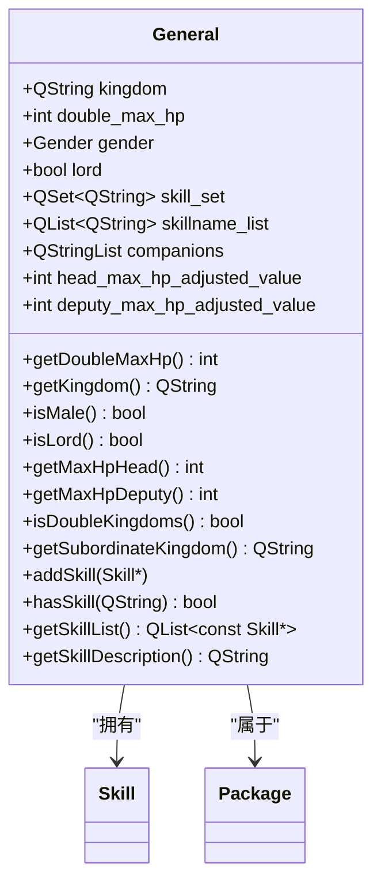

# 武将数据

<cite>
**本文档引用的文件**  
- [general.h](file://src/core/general.h)
- [general.cpp](file://src/core/general.cpp)
- [standard-wei-generals.cpp](file://src/package/standard-wei-generals.cpp)
- [standard-qun-generals.cpp](file://src/package/standard-qun-generals.cpp)
- [generalselector.cpp](file://src/server/generalselector.cpp)
- [generalmodel.cpp](file://src/dialog/generalmodel.cpp)
- [transformation-ai.lua](file://lua/ai/transformation-ai.lua)
- [customassigndialog.cpp](file://src/dialog/customassigndialog.cpp)
- [room.cpp](file://src/server/room.cpp)
</cite>

## 目录
1. [引言](#引言)
2. [武将数据结构设计](#武将数据结构设计)
3. [技能系统集成](#技能系统集成)
4. [网络传输与内存布局](#网络传输与内存布局)
5. [武将选择流程](#武将选择流程)
6. [配置错误排查](#配置错误排查)

## 引言
本项目为《三国杀》的扩展版本，核心功能围绕武将（General）数据结构展开。武将作为游戏中的核心实体，其属性、技能、势力、体力值等信息构成了游戏逻辑的基础。本文档系统性地分析武将数据的设计与实现，涵盖静态属性定义、技能组织、Lua扩展机制、网络编码、选择逻辑及常见问题排查方法，旨在为开发者提供全面的技术参考。

## 武将数据结构设计

武将数据的核心由 `General` 类实现，定义于 `src/core/general.h` 和 `src/core/general.cpp` 文件中。该类继承自 `QObject`，采用 Qt 框架的元对象系统，支持属性绑定和信号槽机制。

### 静态属性定义
武将的静态属性在构造函数中初始化，主要包括：

**武将ID**
- 通过 `objectName()` 获取，是武将的唯一标识符。
- 在构造时，若名称以 `$` 结尾，则该武将被标记为“主公”（`lord`），并自动移除 `$` 符号作为实际ID。

**称号**
- 称号通过 `getTitle()` 方法获取。
- 支持皮肤（Skin）系统，不同皮肤ID对应不同的称号。例如，`#1zhangfei` 表示张飞的皮肤1称号。
- 若未定义特定称号，则尝试从基础武将名（如 `_` 后的部分）获取。

**势力**
- 势力通过 `getKingdom()` 方法返回，如 `"wei"`（魏）、`"shu"`（蜀）、`"wu"`（吴）、`"qun"`（群）等。
- 支持双势力武将，通过 `setSubordinateKingdom()` 设置从属势力，并通过 `isDoubleKingdoms()` 判断。

**体力值**
- 基础体力值在构造函数中指定，如 `new General(this, "xiahoudun", "wei", 5)` 表示夏侯惇初始体力为5。
- 支持动态调整，通过 `setHeadMaxHpAdjustedValue()` 和 `setDeputyMaxHpAdjustedValue()` 设置主将和副将位置的体力修正值。
- 实际体力上限通过 `getMaxHpHead()` 和 `getMaxHpDeputy()` 计算得出。



**Diagram sources**
- [general.h](file://src/core/general.h#L34-L132)
- [general.cpp](file://src/core/general.cpp#L31-L49)

**Section sources**
- [general.h](file://src/core/general.h#L34-L132)
- [general.cpp](file://src/core/general.cpp#L31-L49)

## 技能系统集成

武将的技能系统是其核心玩法，通过与 Lua 脚本的深度集成，实现了高度的可扩展性。

### 技能集合的组织结构
每个武将通过 `QSet<QString> skill_set` 和 `QList<QString> skillname_list` 两个容器来管理其技能。
- `skill_set` 存储由 C++ 代码直接添加的技能对象。
- `extra_set` 存储通过 Lua 脚本或其他方式动态添加的技能名称。
- `skillname_list` 保持技能添加的顺序。

技能的添加通过 `addSkill()` 重载函数实现：
- `addSkill(Skill *skill)`：用于添加 C++ 实现的技能对象。
- `addSkill(const QString &skill_name)`：用于添加 Lua 脚本定义的技能名称。

```cpp
General *xiahoudun = new General(this, "xiahoudun", "wei", 5);
xiahoudun->addSkill(new Ganglie); // 添加C++技能
xiahoudun->addSkill("jiuchi");     // 添加Lua技能
```

### Lua脚本扩展机制
Lua 脚本是实现自定义技能的主要方式。系统通过 `DoLuaScript()` 函数加载并执行 Lua 文件，将技能注册到全局技能库中。

例如，在 `extension-doc/general_config.lua` 中可以定义新技能：
```lua
sgs["rende"] = {
    name = "仁德",
    description = "出牌阶段，你可以将任意数量的手牌交给其他角色，然后你摸等量的牌。",
}
```

在 C++ 代码中，通过 `Sanguosha->getSkill("rende")` 即可获取该技能对象，并将其添加到武将的技能列表中。

### 技能查询与可见性
`getVisibleSkillList()` 方法用于获取武将所有可见的技能列表。该方法会过滤掉不可见的技能（如某些隐藏技能），并根据当前场景（如是否为主将）返回相应的技能子集。

```mermaid
sequenceDiagram
participant C++ as C++代码
participant Lua as Lua脚本
participant Engine as 引擎
C++->>Engine : new General("zhangfei", "shu")
C++->>C++ : zhangfei->addSkill(new Paoxiao)
Lua->>Engine : DoLuaScript("general_config.lua")
Engine->>Engine : 注册技能 "jiuchi"
C++->>C++ : zhangfei->addSkill("jiuchi")
C++->>Engine : Sanguosha->getGeneral("zhangfei")
Engine-->>C++ : 返回武将对象
C++->>C++ : getVisibleSkillList()
C++-->>C++ : 返回咆哮、酒池技能列表
```

**Diagram sources**
- [general.cpp](file://src/core/general.cpp#L200-L250)
- [standard-wei-generals.cpp](file://src/package/standard-wei-generals.cpp#L1189-L1224)

**Section sources**
- [general.cpp](file://src/core/general.cpp#L200-L250)
- [standard-wei-generals.cpp](file://src/package/standard-wei-generals.cpp#L1189-L1224)

## 网络传输与内存布局

武将信息在网络传输中需要进行高效的序列化和反序列化。

### 压缩编码方案
武将信息的传输通常不直接发送完整的 `General` 对象，而是通过其唯一ID（`objectName`）进行传递。例如，在 `room.cpp` 中，当玩家更换武将时，服务器通过 `notifyProperty` 发送 `general2` 属性的变更，其值为武将的字符串ID。

```cpp
player->setActualGeneral2Name(general_name);
notifyProperty(player, player, "actual_general2");
notifyProperty(player, player, "general2", general_name);
```

客户端接收到 `general2` 属性后，通过 `Sanguosha->getGeneral(general_name)` 从本地数据库中查找并重建武将对象。

### 内存布局分析
`General` 对象的内存布局遵循 C++ 类的典型结构：
- **虚函数表指针 (vptr)**：由于继承自 `QObject`，对象头部包含一个指向虚函数表的指针。
- **成员变量**：按声明顺序排列，包括 `kingdom`（QString）、`double_max_hp`（int）、`gender`（enum）、`lord`（bool）、`skill_set`（QSet）、`skillname_list`（QList）等。
- **Qt元数据**：由于使用了 `Q_OBJECT` 宏，编译器会生成额外的元对象数据，用于支持信号槽和属性系统。

这种设计保证了数据的紧凑性和访问效率，同时利用 Qt 容器的自动内存管理，避免了手动内存操作的复杂性。

**Section sources**
- [room.cpp](file://src/server/room.cpp#L2855-L2890)
- [general.h](file://src/core/general.h#L34-L132)

## 武将选择流程

武将选择（GeneralSelector）是游戏开始前的关键环节，涉及武将的查询、匹配和AI决策。

### 武将数据的查询与匹配
武将选择界面通过 `GeneralModel` 类提供数据模型。该模型维护一个 `all_generals` 列表，包含所有可用的武将。

在 `customassigndialog.cpp` 中，通过遍历 `generals` 列表为每个武将创建一个 `QRadioButton`，并设置其显示文本和工具提示。

```cpp
for (int i = 0; i < generals.length(); i++) {
    const General *general = generals.at(i);
    QString text = QString("%1[%2]")
        .arg(Sanguosha->translate(general_name))
        .arg(Sanguosha->translate(general->getPackage()));
    QRadioButton *button = new QRadioButton(text);
    button->setToolTip(general->getSkillDescription(true));
    // ...
}
```

`getSkillDescription(true)` 方法会生成包含武将名称、势力、体力和所有技能描述的完整HTML字符串，用于工具提示。

### AI选择逻辑
AI的武将选择逻辑在 `transformation-ai.lua` 中实现。AI会评估每个可选武将的“价值”（`general_value`），并优先选择与主将有良好配合的“配对价值”（`general_pair_value`）。

```lua
for _, g2name in ipairs(generals) do
    for pairname, value in pairs(sgs.general_pair_value) do
        if (g1name .. "+" .. g2name == pairname or g2name .. "+" .. g1name == pairname) then
            if value > pairvalue then
                pairvalue = value
                pairchoice = g2name
            end
        end
    end
end
```

在 `generalselector.cpp` 中，也存在类似的配对评估逻辑，用于计算武将组合的AI评分。

```cpp
if (general1->hasSkill("rende"))        v += 10;    // 刘备
if (general1->hasSkill("guidao"))       v += 10;    // 张角
if (general1->hasSkill("zhiheng"))      v += 10;    // 孙权
if (general1->hasSkill("jianxiong"))    v += 10;    // 曹操
```

**Diagram sources**
- [customassigndialog.cpp](file://src/dialog/customassigndialog.cpp#L1644-L1694)
- [transformation-ai.lua](file://lua/ai/transformation-ai.lua#L2435-L2467)
- [generalselector.cpp](file://src/server/generalselector.cpp#L268-L278)

**Section sources**
- [customassigndialog.cpp](file://src/dialog/customassigndialog.cpp#L1644-L1694)
- [transformation-ai.lua](file://lua/ai/transformation-ai.lua#L2435-L2467)
- [generalselector.cpp](file://src/server/generalselector.cpp#L268-L278)

## 配置错误排查

在配置武将数据时，常见的错误及排查方法如下：

### 1. 武将无法显示或选择
- **检查点**：确认武将ID在 `general.h` 的构造函数中正确注册。
- **排查方法**：在 `standard-wei-generals.cpp` 或 `standard-qun-generals.cpp` 等文件中，确保 `new General(...)` 语句已执行，且武将被添加到正确的包中。

### 2. 技能无法生效
- **检查点**：确认技能名称拼写正确，且在 `addSkill()` 中使用了正确的名称或对象。
- **排查方法**：使用 `hasSkill()` 方法在调试模式下检查技能是否已成功添加。

### 3. Lua技能未加载
- **检查点**：确认 `general_config.lua` 或相关Lua文件路径正确，且 `DoLuaScript()` 被成功调用。
- **排查方法**：检查日志输出，确认Lua脚本执行无语法错误。

### 4. 网络同步失败
- **检查点**：确认武将ID是字符串常量，且在客户端和服务器端一致。
- **排查方法**：使用 `notifyProperty` 发送调试信息，检查网络包中传输的武将ID是否正确。

**Section sources**
- [general.cpp](file://src/core/general.cpp#L31-L49)
- [general.h](file://src/core/general.h#L34-L132)
- [standard-wei-generals.cpp](file://src/package/standard-wei-generals.cpp#L1189-L1224)