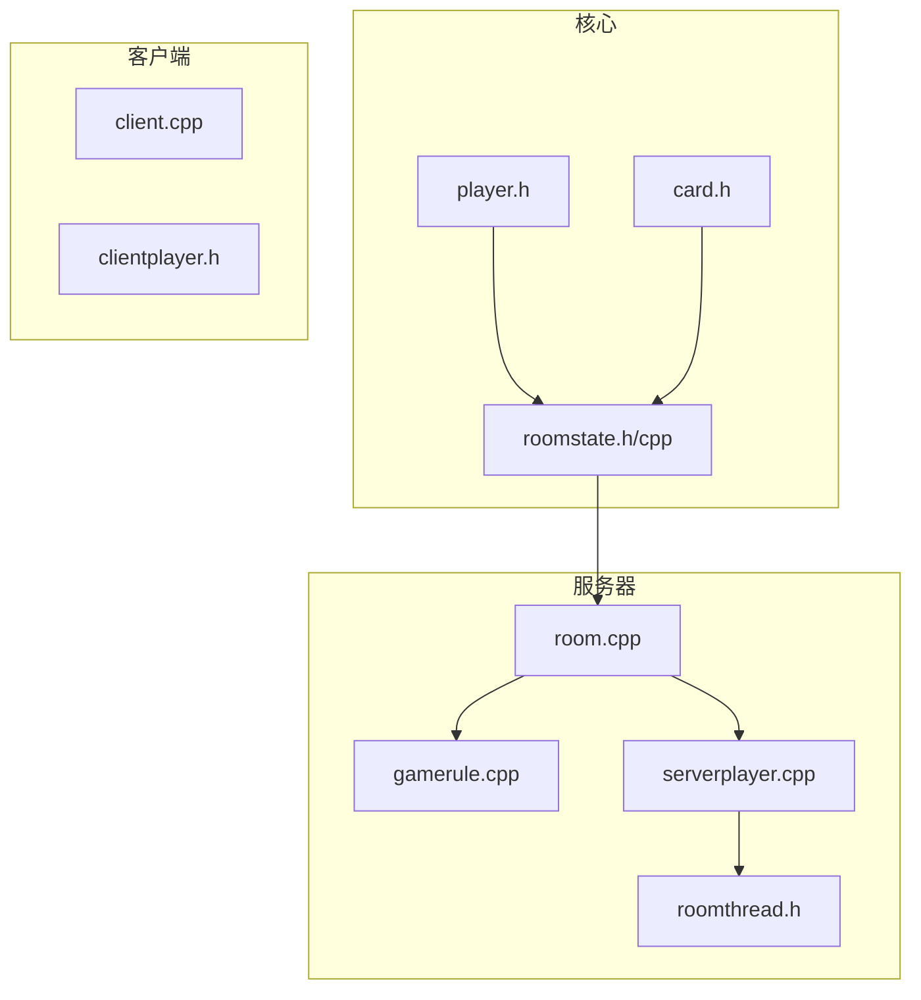
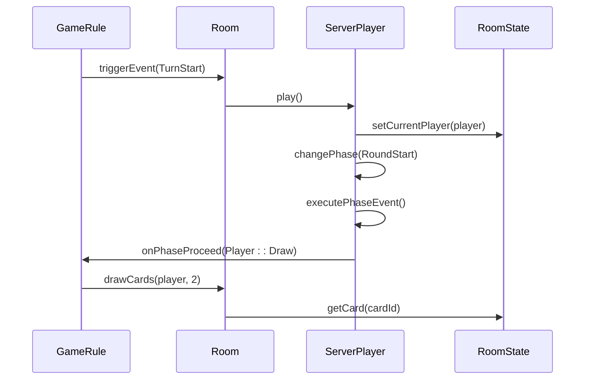
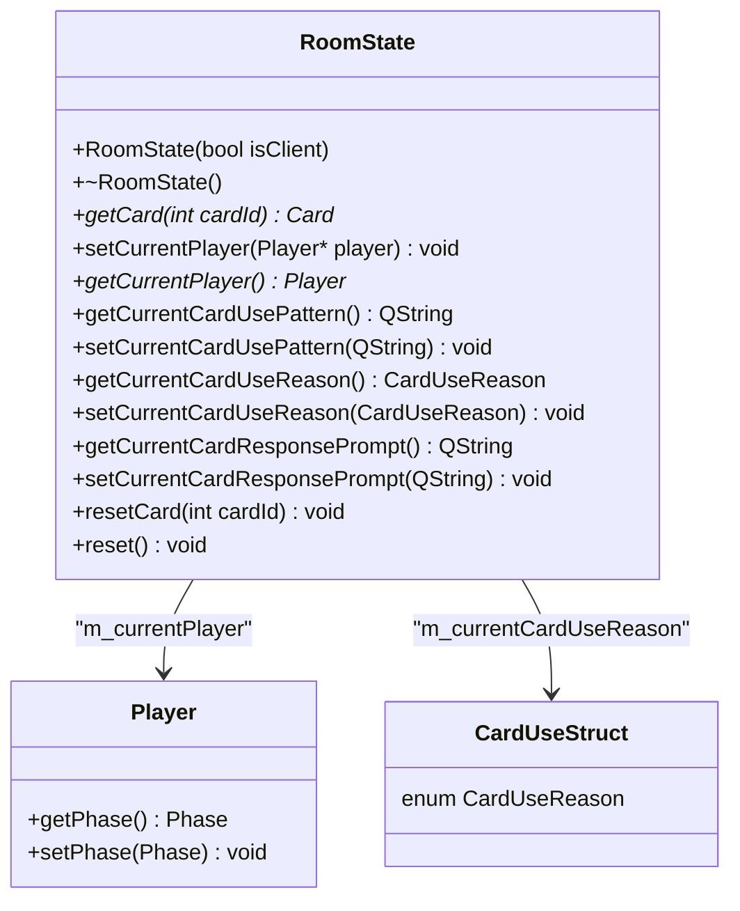
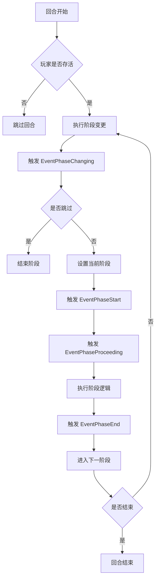
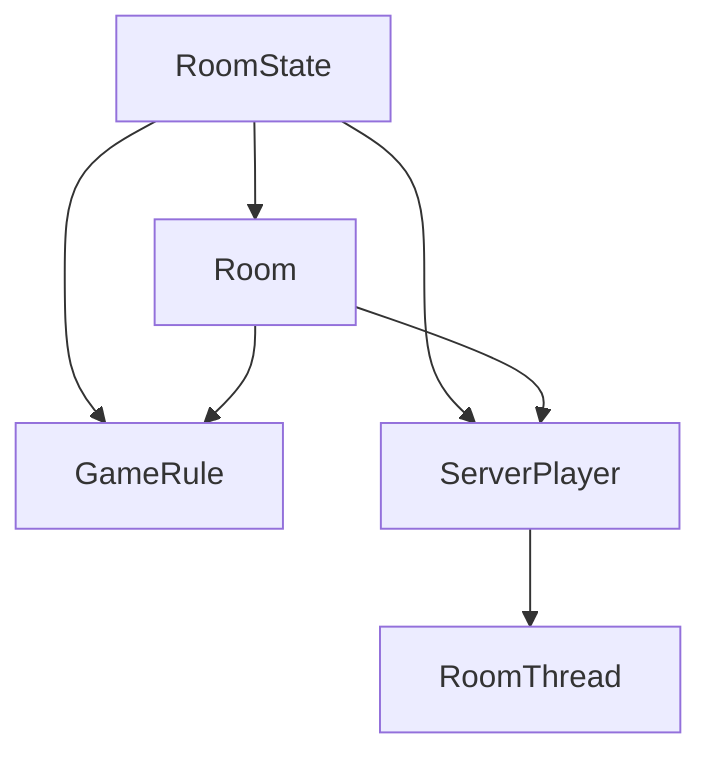

# 游戏状态

<cite>
**本文档中引用的文件**   
- [roomstate.h](file://src/core/roomstate.h#L0-L101)
- [roomstate.cpp](file://src/core/roomstate.cpp#L0-L65)
- [gamerule.cpp](file://src/server/gamerule.cpp#L0-L799)
- [serverplayer.cpp](file://src/server/serverplayer.cpp#L0-L799)
- [room.cpp](file://src/server/room.cpp#L83-L115)
</cite>

## 目录
1. [简介](#简介)
2. [项目结构](#项目结构)
3. [核心组件](#核心组件)
4. [架构概述](#架构概述)
5. [详细组件分析](#详细组件分析)
6. [依赖分析](#依赖分析)
7. [性能考虑](#性能考虑)
8. [故障排除指南](#故障排除指南)
9. [结论](#结论)

## 简介
本文档详细阐述了《三国杀》游戏服务器中 `RoomState` 类如何维护整个游戏房间的运行时状态，包括当前阶段、行动玩家、堆栈事件等关键字段。文档描述了状态转换机制如何驱动游戏流程（准备阶段→判定阶段→摸牌阶段等），并解释了状态快照在断线重连和回放系统中的应用。通过分析 `gamerule.cpp` 中的实际逻辑，说明了状态变更的触发条件与副作用，并记录了状态不一致问题的常见成因及恢复策略。

## 项目结构
项目结构遵循典型的客户端-服务器架构，核心逻辑位于 `src` 目录下。`core` 子目录包含基础数据结构和引擎逻辑，`server` 子目录包含房间管理、游戏规则和玩家逻辑，`client` 子目录处理客户端交互。`roomstate.h` 和 `roomstate.cpp` 位于 `core` 目录，是管理游戏房间运行时状态的核心文件。

**图示来源**
- [roomstate.h](file://src/core/roomstate.h#L0-L101)
- [room.cpp](file://src/server/room.cpp#L83-L115)
- [gamerule.cpp](file://src/server/gamerule.cpp#L0-L799)

## 核心组件
`RoomState` 类是游戏房间状态的核心管理者。它是一个单例，存储了虚拟武将和卡牌的状态，与引擎中加载的静态数据相分离。它维护了当前行动玩家、当前卡牌使用模式、使用原因和响应提示等关键运行时信息。

**组件来源**
- [roomstate.h](file://src/core/roomstate.h#L0-L101)
- [roomstate.cpp](file://src/core/roomstate.cpp#L0-L65)

## 架构概述
游戏状态的管理采用状态机模式。`RoomState` 负责存储和管理状态数据，`ServerPlayer` 类管理每个玩家的回合阶段，`GameRule` 类则根据预定义的事件（如 `TurnStart`, `EventPhaseStart`）来驱动状态转换。`RoomThread` 作为事件处理器，协调各个组件之间的交互。

**图示来源**
- [gamerule.cpp](file://src/server/gamerule.cpp#L0-L799)
- [serverplayer.cpp](file://src/server/serverplayer.cpp#L0-L799)
- [roomstate.h](file://src/core/roomstate.h#L0-L101)

## 详细组件分析

### RoomState 类分析
`RoomState` 类是游戏房间状态的中央存储库。它通过一个 `QHash<int, WrappedCard*>` 来管理所有卡牌的运行时状态，确保卡牌的属性（如位置、标志）在游戏过程中可以被动态修改。

#### 类结构

**图示来源**
- [roomstate.h](file://src/core/roomstate.h#L0-L101)
- [roomstate.cpp](file://src/core/roomstate.cpp#L0-L65)

### 游戏状态转换机制
游戏流程由玩家的回合阶段驱动。`ServerPlayer::play()` 方法定义了玩家的完整行动序列（`RoundStart`, `Start`, `Judge`, `Draw`, `Play`, `Discard`, `Finish`, `NotActive`）。`GameRule` 类监听 `TurnStart` 等事件，并调用 `ServerPlayer::play()` 来启动回合。

#### 阶段执行流程

**图示来源**
- [gamerule.cpp](file://src/server/gamerule.cpp#L238-L275)
- [serverplayer.cpp](file://src/server/serverplayer.cpp#L1076-L1170)

### 状态快照与断线重连
`RoomState` 的 `reset()` 和 `resetCard()` 方法是实现状态快照和恢复的关键。`reset()` 方法会清空所有卡牌并根据引擎中的原始卡牌重新创建一个全新的状态，这可以用于游戏初始化或重置。`resetCard()` 则用于更新单张卡牌的状态。在断线重连时，服务器可以将当前的 `RoomState` 序列化后发送给客户端，客户端据此重建游戏画面。

**组件来源**
- [roomstate.cpp](file://src/core/roomstate.cpp#L0-L65)
- [room.cpp](file://src/server/room.cpp#L4750-L4790)

## 依赖分析
`RoomState` 是一个核心依赖。`Room` 类在游戏开始时 (`start()`) 会调用 `_m_roomState.reset()` 来初始化卡牌状态。`GameRule` 在执行各种游戏逻辑（如摸牌、弃牌）时，会通过 `Room` 间接访问 `RoomState` 中的卡牌数据。`ServerPlayer` 在使用卡牌时，其 `CardUseStruct` 中的卡牌引用最终也指向 `RoomState` 管理的卡牌实例。

**图示来源**
- [room.cpp](file://src/server/room.cpp#L4750-L4790)
- [gamerule.cpp](file://src/server/gamerule.cpp#L0-L799)
- [serverplayer.cpp](file://src/server/serverplayer.cpp#L0-L799)

## 性能考虑
`RoomState` 使用 `QHash` 存储卡牌，提供了 O(1) 的查找效率，这对于频繁访问卡牌状态的游戏逻辑至关重要。`reset()` 方法在游戏开始时执行一次，虽然会遍历所有卡牌，但其时间复杂度为 O(n)，在可接受范围内。应避免在游戏进行中频繁调用 `reset()`。

## 故障排除指南
**状态不一致问题**：最常见的成因是客户端与服务器的 `RoomState` 不同步。这通常发生在网络延迟或断线时。恢复策略是服务器在检测到客户端重连后，主动调用 `marshal()` 方法，将完整的房间状态（包括 `RoomState` 的关键信息）推送给客户端，强制客户端进行状态同步。

**组件来源**
- [room.cpp](file://src/server/room.cpp#L4553-L4606)
- [room.cpp](file://src/server/room.cpp#L4750-L4790)

## 结论
`RoomState` 类是《三国杀》游戏服务器中状态管理的基石。它通过集中管理卡牌和玩家的运行时状态，为复杂的游戏逻辑提供了稳定的数据基础。结合 `ServerPlayer` 的状态机和 `GameRule` 的事件驱动机制，共同构成了一个健壮、可扩展的游戏流程控制系统。其设计充分考虑了断线重连等网络场景，确保了游戏体验的连续性。