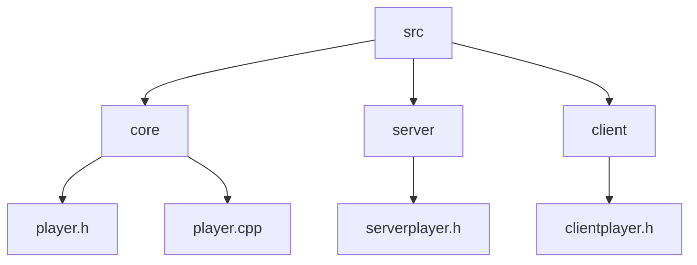
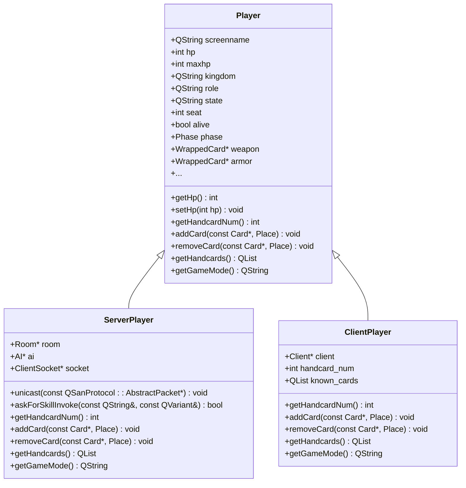
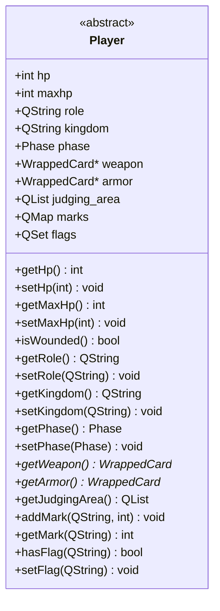
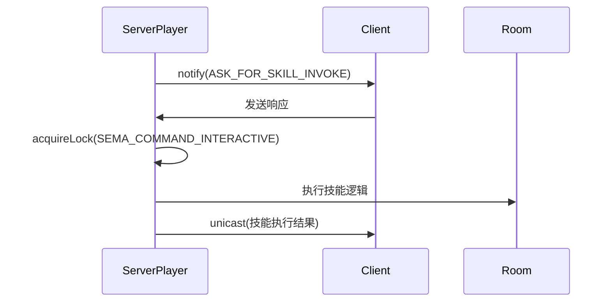
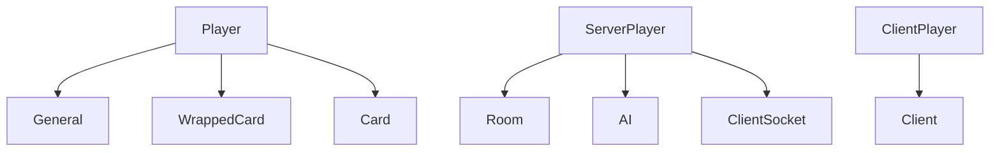

# 玩家模型

<cite>
**本文档引用文件**   
- [player.h](file://src/core/player.h)
- [player.cpp](file://src/core/player.cpp)
- [serverplayer.h](file://src/server/serverplayer.h)
- [clientplayer.h](file://src/client/clientplayer.h)
</cite>

## 目录
1. [简介](#简介)
2. [项目结构](#项目结构)
3. [核心组件](#核心组件)
4. [架构概述](#架构概述)
5. [详细组件分析](#详细组件分析)
6. [依赖分析](#依赖分析)
7. [性能考虑](#性能考虑)
8. [故障排除指南](#故障排除指南)
9. [结论](#结论)

## 简介
本项目是一个基于Qt框架的《三国杀》游戏实现，核心是玩家模型（Player）的设计与实现。该模型不仅定义了玩家的基本属性（如身份、血量、手牌等），还封装了丰富的行为方法（如出牌、响应技能、死亡处理等）。玩家模型通过继承机制区分服务器端和客户端的不同实现，并通过信号与槽机制实现状态同步。文档将深入分析Player类的属性、方法、状态变化机制以及网络同步流程。

## 项目结构
项目结构清晰地划分了不同功能模块。核心逻辑位于`src/core`目录，其中`player.h`和`player.cpp`定义了玩家的基础类。服务器端逻辑在`src/server`中，`serverplayer.h`继承自Player，增加了网络通信和AI相关功能。客户端逻辑在`src/client`中，`clientplayer.h`同样继承自Player，处理用户界面和本地状态。`include`目录包含第三方库，`lua`目录存放游戏脚本。

**图源**
- [player.h](file://src/core/player.h)
- [serverplayer.h](file://src/server/serverplayer.h)
- [clientplayer.h](file://src/client/clientplayer.h)

**章节源**
- [player.h](file://src/core/player.h)
- [serverplayer.h](file://src/server/serverplayer.h)
- [clientplayer.h](file://src/client/clientplayer.h)

## 核心组件
玩家模型的核心是`Player`类，它是一个QObject的子类，利用Qt的元对象系统（Meta-Object System）来暴露属性和信号。该类定义了玩家的所有基本属性，如血量（hp）、最大血量（maxhp）、身份（role）、状态（state）等，并通过`Q_PROPERTY`宏使其可在QML或运行时反射中访问。`Player`类本身是抽象的，因为它包含纯虚函数，如`getHandcardNum()`和`getGameMode()`，强制其子类提供具体实现。

**章节源**
- [player.h](file://src/core/player.h)
- [player.cpp](file://src/core/player.cpp)

## 架构概述
整个玩家模型采用继承和多态的设计模式。`Player`作为基类，定义了通用接口和数据结构。`ServerPlayer`和`ClientPlayer`分别继承自`Player`，实现了服务器端和客户端特有的功能。`ServerPlayer`负责处理网络消息、执行游戏规则和与AI交互；`ClientPlayer`则关注于用户输入、显示更新和与服务器的通信。这种设计实现了关注点分离，使得代码更易于维护和扩展。

**图源**
- [player.h](file://src/core/player.h)
- [serverplayer.h](file://src/server/serverplayer.h)
- [clientplayer.h](file://src/client/clientplayer.h)

## 详细组件分析

### Player类分析
`Player`类是整个模型的基石。它通过枚举定义了游戏的各个阶段（Phase），如`RoundStart`、`Start`、`Judge`、`Draw`、`Play`、`Discard`、`Finish`等。玩家的状态变化紧密围绕这些阶段进行。例如，在`Play`阶段，玩家可以使用卡牌或发动技能；在`Discard`阶段，玩家必须弃牌至手牌数不大于其当前血量。

#### 属性与状态
玩家的属性通过`Q_PROPERTY`暴露，便于外部访问和绑定。关键属性包括：
- **血量管理**：`hp`和`maxhp`分别表示当前和最大血量。`isWounded()`方法判断玩家是否受伤。
- **身份与阵营**：`role`（Lord, Loyalist, Rebel, Renegade）和`kingdom`（魏、蜀、吴、群）定义了玩家的身份和所属阵营。
- **装备区**：`weapon`、`armor`、`defensive_horse`、`offensive_horse`、`treasure`等指针指向装备区的卡牌。
- **判定区**：`judging_area`列表存储了延时锦囊（如乐不思蜀、兵粮寸断）。
- **技能系统**：`head_skills`和`deputy_skills`映射记录了主将和副将技能，`acquireSkill()`和`detachSkill()`用于动态添加和移除技能。

**图源**
- [player.h](file://src/core/player.h)

**章节源**
- [player.h](file://src/core/player.h)

### ServerPlayer类分析
`ServerPlayer`类在`Player`的基础上，增加了服务器端特有的功能。它持有一个指向`Room`的指针，用于访问房间内的其他玩家和游戏状态。`ClientSocket`用于与客户端通信。`AI`指针允许为非人类玩家提供智能决策。

#### 网络同步机制
`ServerPlayer`通过`unicast()`和`notify()`方法向特定客户端或所有客户端发送消息。`getSemaphore()`和`acquireLock()`等方法用于线程同步，确保在等待客户端响应时不会阻塞主线程。`askForSkillInvoke()`是一个关键方法，它向客户端发送技能发动请求，并等待回复，实现了客户端与服务器之间的交互。

**图源**
- [serverplayer.h](file://src/server/serverplayer.h)

**章节源**
- [serverplayer.h](file://src/server/serverplayer.h)

### ClientPlayer类分析
`ClientPlayer`类代表客户端的玩家视图。它不直接持有所有手牌信息，而是通过`handcard_num`记录手牌数量，并通过`known_cards`和`visible_cards`列表记录已知的手牌。这模拟了游戏中信息不完全透明的特点。

#### 状态同步
当服务器发送状态更新时，`ClientPlayer`会更新其内部状态，并通过信号（如`pile_changed`）通知UI进行刷新。`setCards()`方法用于接收服务器发来的手牌ID列表，更新本地视图。

**章节源**
- [clientplayer.h](file://src/client/clientplayer.h)

## 依赖分析
`Player`类依赖于`General`、`WrappedCard`、`Card`等核心类，这些类定义了武将、卡牌等游戏实体。`ServerPlayer`依赖于`Room`、`AI`、`ClientSocket`等服务器组件。`ClientPlayer`依赖于`Client`类进行网络通信。整个模型通过清晰的接口定义，降低了模块间的耦合度。

**图源**
- [player.h](file://src/core/player.h)
- [serverplayer.h](file://src/server/serverplayer.h)
- [clientplayer.h](file://src/client/clientplayer.h)

**章节源**
- [player.h](file://src/core/player.h)
- [serverplayer.h](file://src/server/serverplayer.h)
- [clientplayer.h](file://src/client/clientplayer.h)

## 性能考虑
玩家模型的设计考虑了性能。使用指针管理装备和判定区的卡牌，避免了不必要的拷贝。`QMap`和`QSet`用于高效地存储和查询技能、标记（marks）和标志（flags）。在网络同步方面，只发送必要的状态变更，而不是整个玩家对象，减少了网络流量。

## 故障排除指南
常见的状态同步问题包括：
1.  **手牌数量不一致**：检查`addCard()`和`removeCard()`方法是否在服务器和客户端被正确调用。确保`handcard_num`在`ClientPlayer`中被及时更新。
2.  **技能未正确触发**：确认`acquireSkill()`是否在正确时机被调用，并检查`hasSkill()`的返回值。利用`tag`成员变量进行调试日志记录。
3.  **回合阶段错误**：检查`setPhase()`和`changePhase()`的调用逻辑，确保没有跳过或重复阶段。`phases`列表在`ServerPlayer`中用于管理阶段队列。

**章节源**
- [player.h](file://src/core/player.h)
- [serverplayer.h](file://src/server/serverplayer.h)

## 结论
玩家模型是《三国杀》游戏的核心，它通过一个精心设计的继承体系，将通用逻辑与平台特定实现分离。`Player`基类提供了坚实的数据结构和接口，而`ServerPlayer`和`ClientPlayer`则分别在服务器和客户端实现了丰富的功能。信号与槽机制和线程同步工具确保了状态的一致性和响应性。该设计模式清晰、可扩展，为游戏的稳定运行奠定了基础。