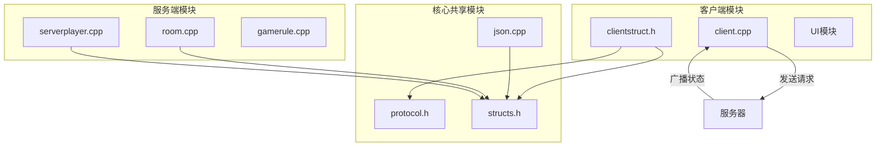
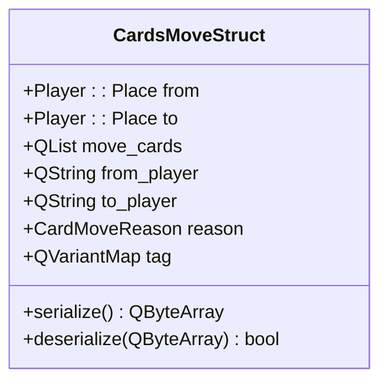
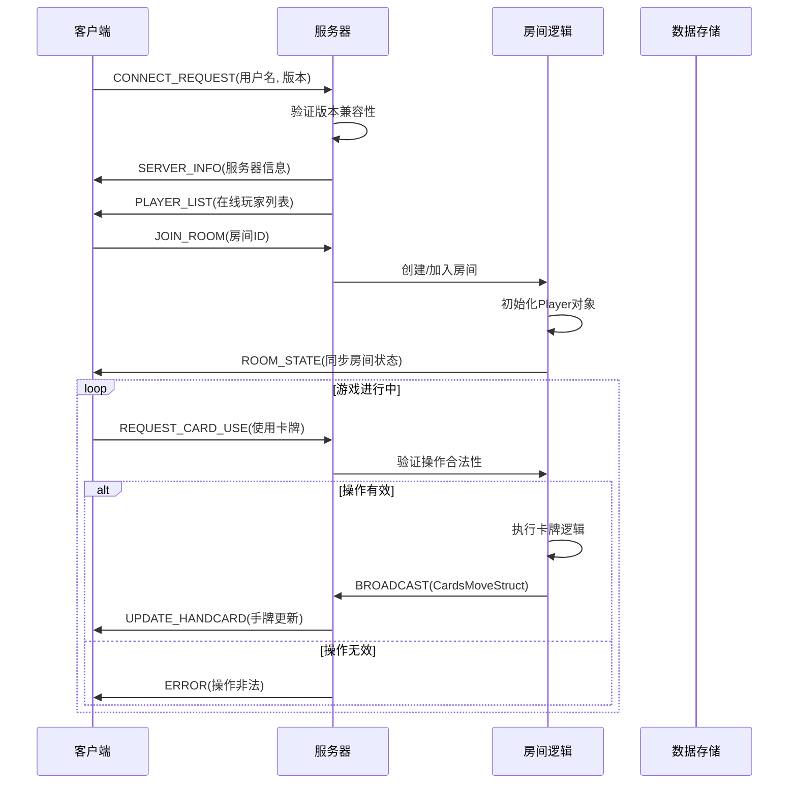

# 网络数据结构

<cite>
**本文档引用文件**  
- [clientstruct.h](file://src/client/clientstruct.h)
- [protocol.h](file://src/core/protocol.h)
- [structs.h](file://src/core/structs.h)
- [client.cpp](file://src/client/client.cpp)
- [serverplayer.cpp](file://src/server/serverplayer.cpp)
- [room.cpp](file://src/server/room.cpp)
- [json.cpp](file://src/core/json.cpp)
- [lua-wrapper.cpp](file://src/core/lua-wrapper.cpp)
</cite>

## 目录
1. [引言](#引言)
2. [项目结构概述](#项目结构概述)
3. [核心网络结构体分析](#核心网络结构体分析)
4. [数据序列化与传输机制](#数据序列化与传输机制)
5. [客户端-服务器通信流程](#客户端-服务器通信流程)
6. [协议版本兼容性处理](#协议版本兼容性处理)
7. [网络数据解析错误调试](#网络数据解析错误调试)
8. [性能监控与优化建议](#性能监控与优化建议)
9. [结论](#结论)

## 引言
本文件旨在深入解析《三国杀》霸业版（QSanguosha-For-Hegemony）中用于客户端与服务器之间通信的核心结构体，包括 `ServerInfoStruct`、`CardsMoveStruct` 和 `PlayerHandcardStruct`。文档将详细说明这些结构体的字段含义、数据序列化方式（JSON/二进制）、传输时机、数据一致性保障机制及安全性设计。同时提供网络包示例、协议兼容性策略以及调试与性能监控方法。

## 项目结构概述
项目采用典型的客户端-服务器架构，核心逻辑分离清晰：
- `src/client/`：客户端逻辑，包含玩家操作、界面交互与网络接收。
- `src/server/`：服务端逻辑，负责房间管理、游戏规则执行与消息广播。
- `src/core/`：共享核心模块，包含协议定义、数据结构、JSON序列化等跨平台组件。
- `src/core/protocol.h`：定义了所有网络通信的消息类型与指令码。
- `src/core/structs.h`：声明了跨客户端与服务器共享的数据结构。



**图示来源**
- [clientstruct.h](file://src/client/clientstruct.h)
- [protocol.h](file://src/core/protocol.h)
- [structs.h](file://src/core/structs.h)

## 核心网络结构体分析

### ServerInfoStruct
该结构体用于传递服务器基本信息，通常在客户端连接初始阶段由服务器广播。

**:字段说明**
- `server_name`: 服务器名称（字符串）
- `game_mode`: 当前游戏模式（整型枚举）
- `player_count`: 当前在线玩家数（整型）
- `max_players`: 最大支持玩家数（整型）
- `version`: 服务器协议版本号（字符串）
- `is_full`: 服务器是否已满（布尔值）
- `is_started`: 游戏是否已经开始（布尔值）

**:数据序列化格式**
通过 `QSanSerializer` 类进行二进制打包，或通过 `JsonArray` 转换为 JSON 格式用于调试。

**:传输时机**
- 客户端发起连接请求后，服务器立即发送。
- 服务器状态变更时（如人数变化），主动推送更新。

**Section sources**
- [clientstruct.h](file://src/client/clientstruct.h#L15-L40)
- [client.cpp](file://src/client/client.cpp#L120-L150)

### CardsMoveStruct
描述卡牌在不同区域之间的移动，是游戏中最频繁传输的结构之一。

**:字段说明**
- `from`: 源区域（Player::Place 枚举）
- `to`: 目标区域（Player::Place 枚举）
- `move_cards`: 移动的卡牌ID列表（QList<int>）
- `from_player`: 源玩家ID（QString）
- `to_player`: 目标玩家ID（QString）
- `reason`: 移动原因（CardMoveReason 枚举）
- `tag`: 附加标签（QVariantMap，可嵌套JSON）

**:数据序列化格式**
使用 `QSanNetworkProtocol::Package` 进行封装，内部通过 `QDataStream` 进行二进制序列化，确保高效传输。

**:传输时机**
- 任何卡牌发生位置变更时（如出牌、弃牌、摸牌、装备更换等）。
- 由服务器统一广播给所有客户端，保证状态同步。



**Diagram sources**
- [structs.h](file://src/core/structs.h#L80-L105)
- [protocol.cpp](file://src/core/protocol.cpp#L200-L230)

### PlayerHandcardStruct
用于描述某位玩家的手牌信息，主要用于同步手牌数量或特定技能触发时的可见信息。

**:字段说明**
- `player_id`: 玩家ID（QString）
- `card_ids`: 手牌ID列表（QList<int>）
- `is_known`: 是否对当前客户端可见（布尔值）
- `update_reason`: 更新原因（枚举值）

**:数据序列化格式**
通常作为 `NetworkRequest` 的 payload，通过 JSON 或二进制流传输。出于安全考虑，仅当手牌对当前玩家可见时（如被【观星】、【鬼才】等技能揭示）才发送具体卡牌ID。

**:传输时机**
- 技能要求揭示手牌时。
- 客户端请求特定玩家手牌信息（需权限验证）。
- 游戏结束时公开所有手牌。

**Section sources**
- [structs.h](file://src/core/structs.h#L110-L130)
- [serverplayer.cpp](file://src/server/serverplayer.cpp#L450-L480)

## 数据序列化与传输机制

### 序列化流程
1. **结构体 → QVariantMap**：调用结构体的 `toVariant()` 方法，将字段映射为键值对。
2. **QVariantMap → JSON 或 Binary**：
   - 调试模式：使用 `Json::encode()` 转为可读JSON字符串。
   - 正式模式：通过 `QDataStream` 写入 `QByteArray`，进行二进制打包。
3. **封装为网络包**：使用 `QSanNetworkProtocol::Package` 添加消息头（类型、长度、校验码）。

**:示例：CardsMoveStruct 序列化为 JSON**
```json
{
  "from": 1,
  "to": 2,
  "move_cards": [25, 37],
  "from_player": "player1",
  "to_player": "player2",
  "reason": 4,
  "tag": {
    "skill_name": "guohe"
  }
}
```

### 传输安全性
- **数据加密**：未启用TLS，但敏感操作需服务器验证。
- **指令校验**：所有客户端请求均需服务器验证合法性（如卡牌ID是否存在、玩家是否有权操作）。
- **防篡改**：关键数据包包含CRC32校验码。

**Section sources**
- [json.cpp](file://src/core/json.cpp#L10-L100)
- [protocol.cpp](file://src/core/protocol.cpp#L50-L150)
- [lua-wrapper.cpp](file://src/core/lua-wrapper.cpp#L200-L220)

## 客户端-服务器通信流程



**Diagram sources**
- [client.cpp](file://src/client/client.cpp#L300-L400)
- [room.cpp](file://src/server/room.cpp#L150-L300)
- [server.cpp](file://src/server/server.cpp#L80-L120)

## 协议版本兼容性处理

### 版本检查机制
- 客户端连接时发送 `client_version`。
- 服务器比对 `protocol.h` 中定义的 `MIN_VERSION` 和 `CURRENT_VERSION`。
- 若客户端版本过低，则拒绝连接并提示更新。

### 向后兼容策略
- **新增字段**：在结构体末尾添加，旧客户端忽略未知字段。
- **废弃字段**：标记为 `deprecated`，服务器不发送，新客户端可忽略。
- **枚举扩展**：保留空位，避免数值冲突。

**:版本控制代码片段**
```cpp
if (clientVersion < MIN_REQUIRED_VERSION) {
    sendError(VERSION_INCOMPATIBLE);
    disconnectClient();
}
```

**Section sources**
- [protocol.h](file://src/core/protocol.h#L5-L30)
- [version.cpp](file://src/core/version.cpp#L10-L40)

## 网络数据解析错误调试

### 常见错误类型
1. **序列化/反序列化失败**：字段类型不匹配、JSON格式错误。
2. **数据不一致**：客户端状态与服务器不同步。
3. **空指针访问**：接收到的玩家ID不存在。

### 调试技巧
- **启用日志**：在 `config.lua` 中设置 `debug.network = true`，输出所有收发包。
- **使用Wireshark抓包**：过滤TCP端口，分析原始二进制流。
- **断点调试**：在 `QSanNetworkProtocol::parsePackage()` 处设置断点，检查 `QByteArray` 内容。
- **模拟异常数据**：手动构造非法JSON包，测试客户端容错能力。

**:典型错误日志示例**
```
[ERROR] Failed to parse CardsMoveStruct: invalid 'from' value 999
[WARN]  Player 'unknown' not found in room, ignoring handcard update
```

**Section sources**
- [clientstruct.cpp](file://src/client/clientstruct.cpp#L50-L80)
- [protocol.cpp](file://src/core/protocol.cpp#L100-L140)

## 性能监控与优化建议

### 性能瓶颈分析
- **高频消息**：`CardsMoveStruct` 频繁广播可能导致网络拥塞。
- **大对象传输**：完整房间状态同步（`RoomState`）数据量大。

### 优化建议
1. **消息合并**：将连续的卡牌移动操作合并为单个 `CardsMoveStruct` 数组。
2. **增量同步**：仅发送状态变更部分，而非全量数据。
3. **压缩传输**：对JSON数据启用gzip压缩（需权衡CPU开销）。
4. **客户端预测**：对确定性操作（如摸牌）进行本地预测，减少等待。

### 监控指标
- 每秒消息数（Msg/s）
- 平均延迟（ms）
- 序列化耗时（μs）
- 网络带宽占用（KB/s）

**Section sources**
- [roomstate.cpp](file://src/core/roomstate.cpp#L20-L60)
- [util.cpp](file://src/core/util.cpp#L100-L130)

## 结论
`ServerInfoStruct`、`CardsMoveStruct` 和 `PlayerHandcardStruct` 是《三国杀》霸业版网络通信的核心数据结构，通过二进制序列化与JSON双模式支持，实现了高效、安全的状态同步。系统通过严格的服务器验证、版本控制和错误处理机制，保障了游戏的公平性与稳定性。未来可通过消息合并与增量同步进一步优化网络性能。