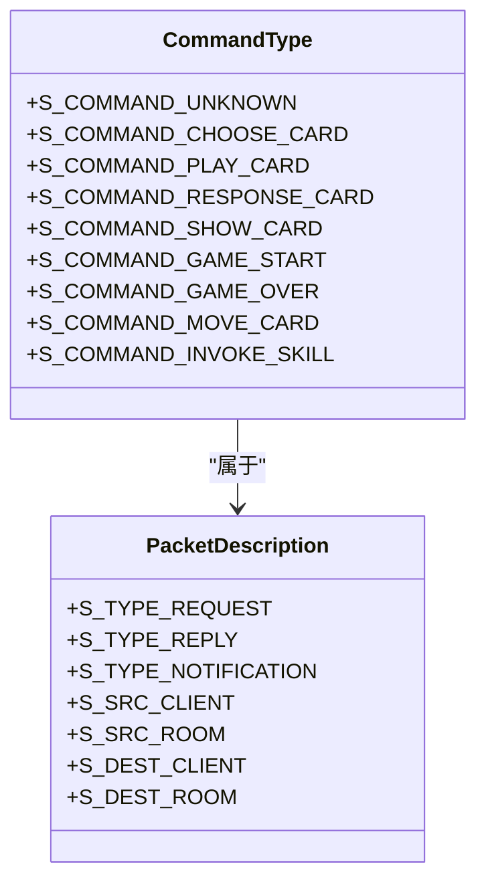
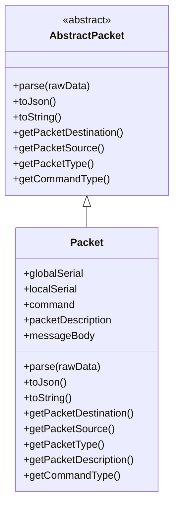
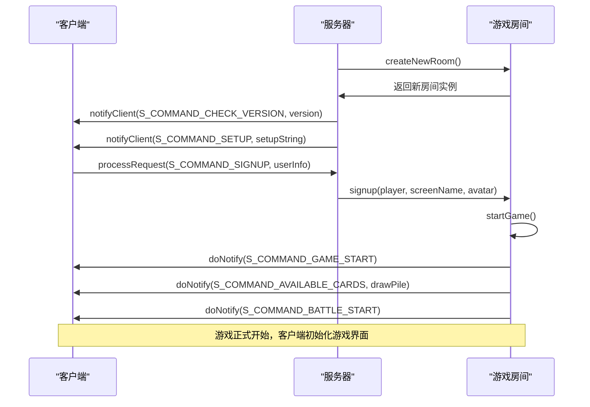
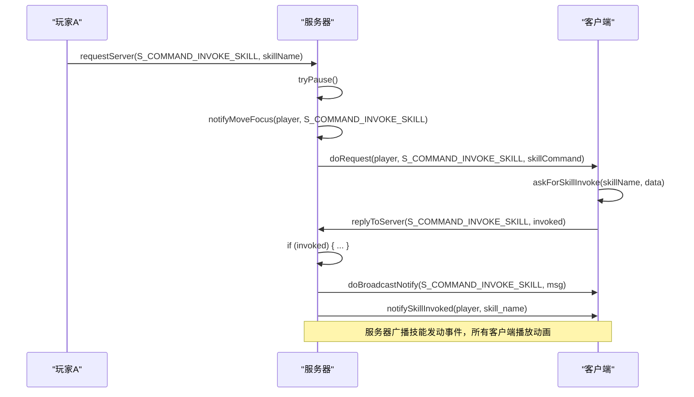

# 网络协议

<cite>
**本文档引用的文件**   
- [protocol.h](file://src/core/protocol.h#L1-L330)
- [client.cpp](file://src/client/client.cpp#L1-L2625)
- [server.cpp](file://src/server/server.cpp#L1-L204)
- [room.cpp](file://src/server/room.cpp#L4670-L4971)
</cite>

## 目录
1. [协议概述](#协议概述)
2. [协议消息类型](#协议消息类型)
3. [消息序列化与传输](#消息序列化与传输)
4. [关键交互场景](#关键交互场景)
5. [可靠性保障机制](#可靠性保障机制)
6. [协议扩展与兼容性](#协议扩展与兼容性)
7. [调试与抓包技巧](#调试与抓包技巧)

## 协议概述

本协议定义了《三国杀》游戏客户端与服务器之间的通信规范，采用基于JSON的二进制数据包格式，通过TCP/IP进行可靠传输。协议设计遵循请求-响应、通知-广播的模式，确保游戏状态在所有客户端间保持同步。

**Section sources**
- [protocol.h](file://src/core/protocol.h#L1-L330)

## 协议消息类型

协议消息类型在`protocol.h`中通过`CommandType`枚举定义，分为请求、回复和通知三类，每类消息具有特定的语义和处理流程。

### 消息类型分类



**Diagram sources **
- [protocol.h](file://src/core/protocol.h#L41-L96)

**Section sources**
- [protocol.h](file://src/core/protocol.h#L41-L96)

### 核心消息类型详解

#### S_GAME_STARTED (游戏开始)
- **消息类型**: 通知 (S_TYPE_NOTIFICATION)
- **来源**: 服务器 (S_SRC_ROOM)
- **目标**: 所有客户端 (S_DEST_CLIENT)
- **消息体**: 空或包含初始游戏数据
- **语义**: 通知所有客户端游戏已正式开始，客户端应切换到游戏进行状态。

#### S_MOVE_CARDS (移动卡牌)
- **消息类型**: 通知 (S_TYPE_NOTIFICATION)
- **来源**: 服务器 (S_SRC_ROOM)
- **目标**: 所有客户端 (S_DEST_CLIENT)
- **消息体**: `CardsMoveStruct` 结构的JSON数组
- **语义**: 通知客户端卡牌的移动事件，包括卡牌ID、来源玩家、目标玩家、来源区域、目标区域和移动原因。

#### S_SKILL_INVOKED (技能发动)
- **消息类型**: 通知 (S_TYPE_NOTIFICATION)
- **来源**: 服务器 (S_SRC_ROOM)
- **目标**: 所有客户端 (S_DEST_CLIENT)
- **消息体**: 包含技能名称和发动玩家的JSON数组
- **语义**: 通知所有客户端某位玩家发动了特定技能，用于触发客户端的技能动画和音效。

## 消息序列化与传输

协议使用`QVariantMap`和`QJson`进行消息的序列化与反序列化，核心数据结构为`Packet`类。

### Packet数据结构



**Diagram sources **
- [protocol.h](file://src/core/protocol.h#L200-L250)

**Section sources**
- [protocol.h](file://src/core/protocol.h#L200-L250)

### 序列化流程

```mermaid
flowchart TD
Start([创建Packet实例]) --> SetCommand["设置命令类型<br/>command = S_COMMAND_GAME_START"]
SetCommand --> SetBody["设置消息体<br/>messageBody = QVariantMap"]
SetBody --> Serialize["调用toJson()方法"]
Serialize --> Json["生成JSON字符串<br/>{\"globalSerial\":1, \"localSerial\":0, \"packetDescription\":272, \"command\":65, \"messageBody\":{}}"]
Json --> Send["通过socket发送"]
Send --> End([完成])
```

**Diagram sources **
- [protocol.h](file://src/core/protocol.h#L250-L300)
- [client.cpp](file://src/client/client.cpp#L100-L150)

## 关键交互场景

### 游戏开始流程



**Diagram sources **
- [server.cpp](file://src/server/server.cpp#L127-L161)
- [room.cpp](file://src/server/room.cpp#L4670-L4717)

**Section sources**
- [server.cpp](file://src/server/server.cpp#L127-L161)
- [room.cpp](file://src/server/room.cpp#L4670-L4717)

### 技能发动流程



**Diagram sources **
- [room.cpp](file://src/server/room.cpp#L1060-L1093)
- [client.cpp](file://src/client/client.cpp#L1153-L1191)

**Section sources**
- [room.cpp](file://src/server/room.cpp#L1060-L1093)
- [client.cpp](file://src/client/client.cpp#L1153-L1191)

## 可靠性保障机制

协议通过序列号、超时机制和状态同步来保障通信的可靠性。

### 序列号机制

- **全局序列号 (globalSerial)**: 由服务器维护的递增计数器，用于标识消息的全局顺序，防止消息乱序。
- **本地序列号 (localSerial)**: 在请求-响应模式中，客户端将收到的请求的`globalSerial`作为回复的`localSerial`，用于匹配请求和响应。

### 超时与重试

- **倒计时 (Countdown)**: 服务器在发送需要客户端响应的请求时，会附带一个倒计时，客户端必须在倒计时结束前回复，否则视为超时。
- **状态同步**: 客户端通过`S_COMMAND_UPDATE_CARD`、`S_COMMAND_UPDATE_PILE`等消息与服务器同步卡牌和牌堆状态，确保本地状态与服务器一致。

**Section sources**
- [protocol.h](file://src/core/protocol.h#L150-L180)
- [client.cpp](file://src/client/client.cpp#L800-L850)

## 协议扩展与兼容性

### 扩展方法

1. **新增命令类型**: 在`CommandType`枚举末尾添加新的命令，避免破坏现有协议。
2. **扩展消息体**: 在`messageBody`的`QVariantMap`中添加新的键值对，旧版本客户端会忽略不认识的键。
3. **版本协商**: 通过`S_COMMAND_CHECK_VERSION`消息进行版本检查，确保客户端与服务器版本兼容。

### 兼容性处理原则

- **向前兼容**: 服务器应能处理旧版本客户端发送的消息。
- **向后兼容**: 新版本客户端应能正确处理旧版本服务器发送的消息，忽略未知字段。
- **优雅降级**: 当版本不兼容时，应提供明确的错误提示，而非直接断开连接。

**Section sources**
- [protocol.h](file://src/core/protocol.h#L1-L330)
- [server.cpp](file://src/server/server.cpp#L127-L161)

## 调试与抓包技巧

### 抓包分析

1. 使用Wireshark等工具捕获本地回环网络流量。
2. 过滤TCP端口（通常是8080或自定义端口）。
3. 分析TCP流，将二进制数据转换为JSON格式进行解读。

### 调试日志

- **客户端日志**: `client.cpp`中的`processServerPacket`函数是消息处理的入口，可在此处添加日志输出。
- **服务器日志**: `server.cpp`中的`processRequest`函数是消息接收的入口，可在此处记录所有收到的消息。

### 常见问题排查

- **消息未收到**: 检查`packetDescription`的源和目标是否正确，确保消息被发送到正确的接收方。
- **状态不同步**: 检查`S_COMMAND_UPDATE_CARD`等同步消息是否正确发送和处理。
- **序列号错误**: 检查`globalSerial`和`localSerial`的生成和匹配逻辑。

**Section sources**
- [client.cpp](file://src/client/client.cpp#L1000-L1050)
- [server.cpp](file://src/server/server.cpp#L100-L150)