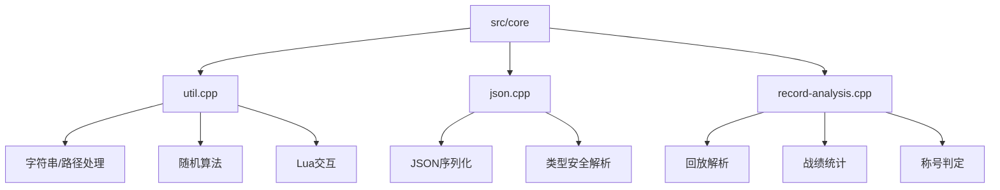
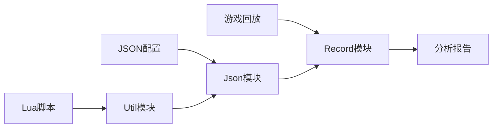
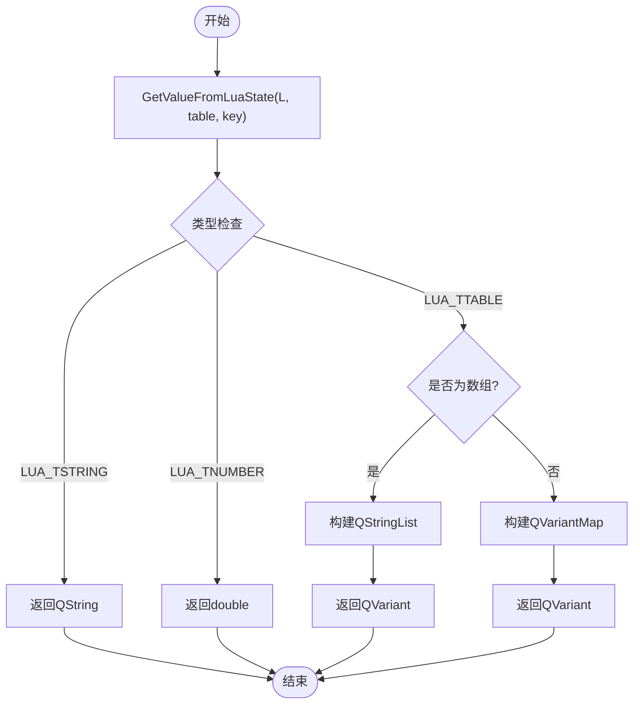
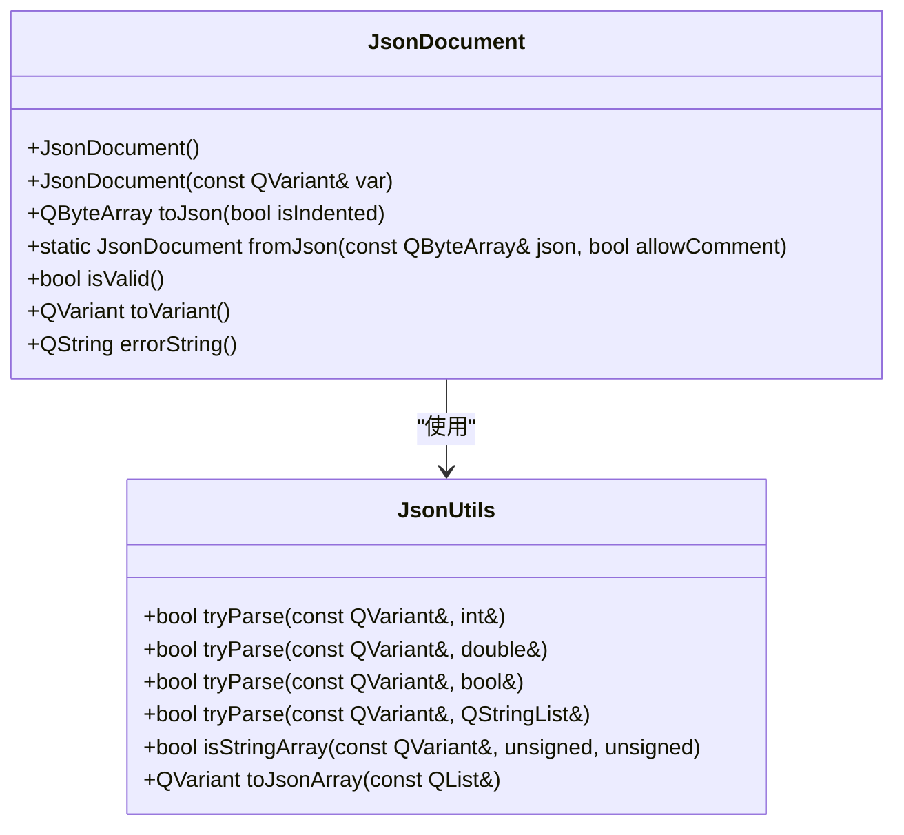
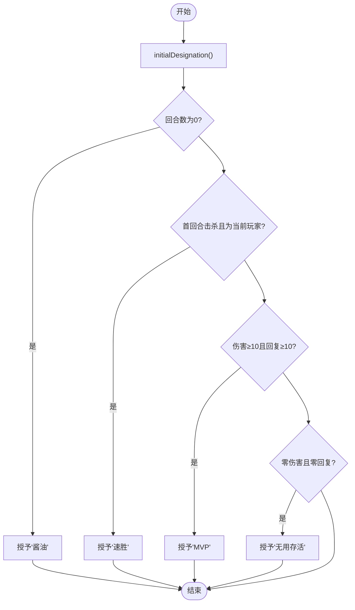
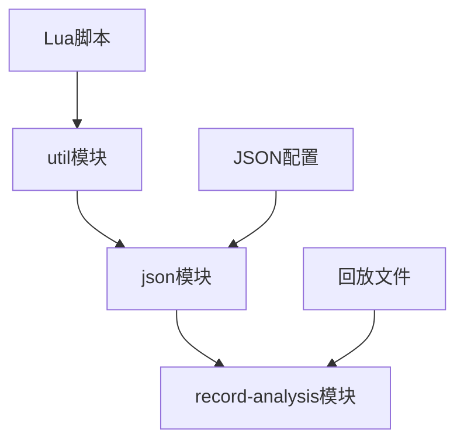

# 工具库

<cite>
**本文档中引用的文件**  
- [util.cpp](file://src/core/util.cpp#L1-L146)
- [util.h](file://src/core/util.h#L1-L57)
- [json.cpp](file://src/core/json.cpp#L1-L296)
- [json.h](file://src/core/json.h#L1-L118)
- [record-analysis.cpp](file://src/core/record-analysis.cpp#L1-L671)
- [record-analysis.h](file://src/core/record-analysis.h#L1-L100)
</cite>

## 目录
1. [简介](#简介)
2. [项目结构](#项目结构)
3. [核心组件](#核心组件)
4. [架构概览](#架构概览)
5. [详细组件分析](#详细组件分析)
6. [依赖分析](#依赖分析)
7. [性能考量](#性能考量)
8. [故障排除指南](#故障排除指南)
9. [结论](#结论)

## 简介

本项目为《三国杀》的开源实现，基于C++与Qt框架开发，支持多种游戏模式与扩展功能。核心工具库提供了字符串处理、JSON序列化/反序列化、日志分析、游戏回放解析等关键功能。本文档全面记录了`util.cpp`、`json.cpp`和`record-analysis.cpp`三个核心模块的功能、API使用方式及内部实现机制，旨在为开发者提供清晰的技术参考。

## 项目结构

项目采用分层架构，核心逻辑位于`src/core`目录下，包含工具类、协议处理、游戏引擎等模块。`util`、`json`和`record-analysis`作为基础工具组件，被广泛用于游戏状态管理、配置读取和战后分析。



**图示来源**  
- [util.cpp](file://src/core/util.cpp#L1-L146)
- [json.cpp](file://src/core/json.cpp#L1-L296)
- [record-analysis.cpp](file://src/core/record-analysis.cpp#L1-L671)

**本节来源**  
- [util.cpp](file://src/core/util.cpp#L1-L146)
- [json.cpp](file://src/core/json.cpp#L1-L296)
- [record-analysis.cpp](file://src/core/record-analysis.cpp#L1-L671)

## 核心组件

工具库包含三大核心模块：
- **util**：提供通用算法与数据转换工具
- **json**：封装JSON与C++对象的互转逻辑
- **record-analysis**：解析游戏回放并生成战后分析报告

这些模块共同支撑了游戏的配置管理、脚本扩展与数据分析功能。

**本节来源**  
- [util.h](file://src/core/util.h#L1-L57)
- [json.h](file://src/core/json.h#L1-L118)
- [record-analysis.h](file://src/core/record-analysis.h#L1-L100)

## 架构概览

整个工具库采用模块化设计，各组件职责分明，通过标准接口进行通信。`util`提供基础服务，`json`作为数据交换中间层，`record-analysis`则依赖前两者完成复杂业务逻辑。



**图示来源**  
- [util.cpp](file://src/core/util.cpp#L1-L146)
- [json.cpp](file://src/core/json.cpp#L1-L296)
- [record-analysis.cpp](file://src/core/record-analysis.cpp#L1-L671)

## 详细组件分析

### Util模块分析

`util.cpp`提供了多个通用工具函数，涵盖数据类型转换、随机算法和Lua脚本交互。

#### 工具函数说明

**qShuffle**
- **功能**：对列表进行随机洗牌
- **参数**：`QList<T> &list` - 待洗牌的列表
- **返回值**：无
- **线程安全**：否，依赖`qrand()`，需在单线程或加锁环境下使用

**GetValueFromLuaState**
- **功能**：从Lua状态机中获取指定表的键值
- **参数**：
  - `lua_State *L`：Lua状态指针
  - `const char *table_name`：表名
  - `const char *key`：键名
- **返回值**：`QVariant` - 支持字符串、数字、数组、映射等类型
- **异常处理**：自动弹出栈顶元素，避免栈溢出

**CreateLuaState**
- **功能**：创建并初始化Lua状态机
- **返回值**：`lua_State*` - 新的Lua状态指针
- **依赖**：调用`luaopen_sgs`注册自定义C++函数

**DoLuaScript**
- **功能**：执行Lua脚本文件
- **参数**：`lua_State *L, const char *script` - 状态指针与脚本路径
- **异常处理**：脚本错误时弹出错误对话框并终止程序

**数据转换函数**
- `IntList2StringList`：整型列表转字符串列表
- `StringList2IntList`：字符串列表转整型列表（转换失败返回空列表）
- `IntList2VariantList` / `VariantList2IntList`：整型与变体列表互转



**图示来源**  
- [util.cpp](file://src/core/util.cpp#L20-L80)

**本节来源**  
- [util.cpp](file://src/core/util.cpp#L1-L146)
- [util.h](file://src/core/util.h#L1-L57)

### JSON模块分析

`json.cpp`封装了JSON数据的解析与生成，提供类型安全的转换接口。

#### 类结构说明

**JsonDocument**
- **功能**：JSON文档容器
- **构造函数**：支持`QVariant`、`JsonArray`、`JsonObject`初始化
- **核心方法**：
  - `toJson(bool isIndented)`：序列化为字节数组
  - `fromJson(const QByteArray&, bool allowComment)`：从JSON字符串解析
  - `fromFilePath(const QString&, bool)`：从文件加载（支持注释）

**JsonUtils 命名空间**
提供一系列类型安全的解析函数：
- `tryParse`重载：支持`int`、`double`、`bool`、`QStringList`、`QList<int>`等类型
- `tryParse`复合类型：`QRect`、`QSize`、`QPoint`、`QColor`、`Qt::Alignment`
- `isStringArray` / `isNumberArray`：验证数组元素类型

#### JSON序列化示例

```cpp
// 自定义结构体序列化
struct PlayerInfo {
    QString name;
    int hp;
    QColor color;
};

QVariant toVariant(const PlayerInfo &info) {
    JsonObject obj;
    obj["name"] = info.name;
    obj["hp"] = info.hp;
    obj["color"] = JsonUtils::toJsonArray({color.red(), color.green(), color.blue()});
    return obj;
}

bool fromVariant(const QVariant &var, PlayerInfo &info) {
    JsonObject obj = var.value<JsonObject>();
    if (!JsonUtils::tryParse(obj["name"], info.name)) return false;
    if (!JsonUtils::tryParse(obj["hp"], info.hp)) return false;
    
    QList<int> rgb;
    if (!JsonUtils::tryParse(obj["color"], rgb) || rgb.size() < 3) return false;
    info.color.setRgb(rgb[0], rgb[1], rgb[2]);
    return true;
}
```



**图示来源**  
- [json.h](file://src/core/json.h#L1-L118)
- [json.cpp](file://src/core/json.cpp#L1-L296)

**本节来源**  
- [json.h](file://src/core/json.h#L1-L118)
- [json.cpp](file://src/core/json.cpp#L1-L296)

### 回放分析模块分析

`record-analysis.cpp`负责解析游戏回放文件（.qsgs或.png），提取玩家行为数据并生成战后分析报告。

#### 核心流程

1. **初始化**：读取回放文件，逐行解析网络协议包
2. **状态重建**：根据`S_COMMAND_SET_PROPERTY`等指令重建玩家状态
3. **数据统计**：累计伤害、回复、击杀等数据
4. **称号判定**：基于统计结果授予玩家荣誉称号

#### 关键数据结构

**PlayerRecordStruct**
- `m_screenName`：玩家昵称
- `m_generalName`：武将名称
- `m_role`：身份（主公、忠臣等）
- `m_damage`：造成伤害
- `m_damaged`：受到伤害
- `m_recover`：回复体力
- `m_kill`：击杀数
- `m_isAlive`：存活状态
- `m_designation`：荣誉称号列表

**RecAnalysis 类方法**
- `initialize`：解析回放数据流
- `getPlayer`：获取或创建玩家记录
- `setDesignation`：批量授予称号
- `addDesignation`：条件判定并授予称号
- `findPlayerOfXxx`：按数值范围查找玩家（位掩码返回）

#### 称号判定逻辑



**图示来源**  
- [record-analysis.cpp](file://src/core/record-analysis.cpp#L200-L400)

**本节来源**  
- [record-analysis.cpp](file://src/core/record-analysis.cpp#L1-L671)
- [record-analysis.h](file://src/core/record-analysis.h#L1-L100)

## 依赖分析

工具库各模块间存在明确的依赖关系：



- **util** 为最底层，提供基础算法与Lua交互
- **json** 依赖util进行数据转换，同时为上层提供数据序列化服务
- **record-analysis** 依赖前两者完成复杂的数据解析与逻辑判断

**图示来源**  
- [util.cpp](file://src/core/util.cpp#L1-L146)
- [json.cpp](file://src/core/json.cpp#L1-L296)
- [record-analysis.cpp](file://src/core/record-analysis.cpp#L1-L671)

**本节来源**  
- [util.cpp](file://src/core/util.cpp#L1-L146)
- [json.cpp](file://src/core/json.cpp#L1-L296)
- [record-analysis.cpp](file://src/core/record-analysis.cpp#L1-L671)

## 性能考量

- **qShuffle**：时间复杂度O(n)，适用于小规模列表
- **JSON解析**：使用`QJsonDocument`，性能良好，但`clearComment`会遍历整个字符串
- **回放分析**：一次性加载整个回放文件，内存占用与游戏时长成正比
- **多线程建议**：所有工具函数均非线程安全，应在主线程或加锁后调用

## 故障排除指南

- **Lua脚本错误**：检查脚本语法，确保表名与键名正确
- **JSON解析失败**：验证JSON格式，注意注释仅在`allowComment=true`时支持
- **回放无法加载**：确认文件格式（.qsgs或.png）及完整性
- **称号未授予**：检查`setDesignation`中的条件逻辑与玩家状态是否匹配

**本节来源**  
- [util.cpp](file://src/core/util.cpp#L100-L120)
- [json.cpp](file://src/core/json.cpp#L250-L280)
- [record-analysis.cpp](file://src/core/record-analysis.cpp#L500-L600)

## 结论

本工具库为《三国杀》核心功能提供了坚实的基础支持。`util`模块实现了高效的数据处理与脚本交互，`json`模块确保了配置与数据的安全交换，`record-analysis`模块则实现了复杂的游戏回放分析。三者协同工作，构成了一个稳定、可扩展的技术框架，为游戏的长期维护与发展奠定了良好基础。