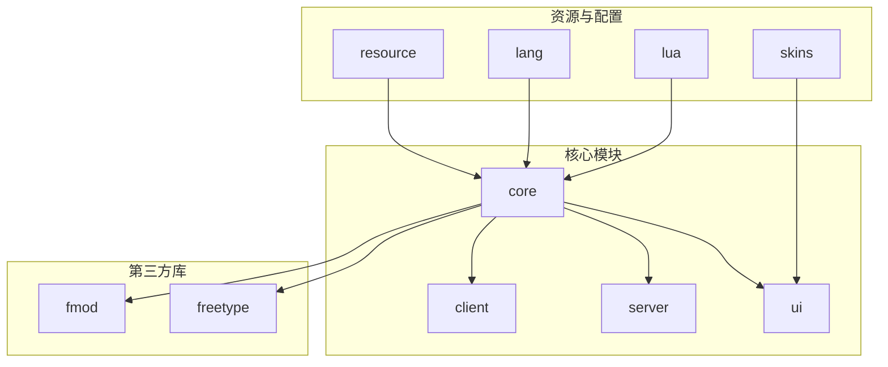
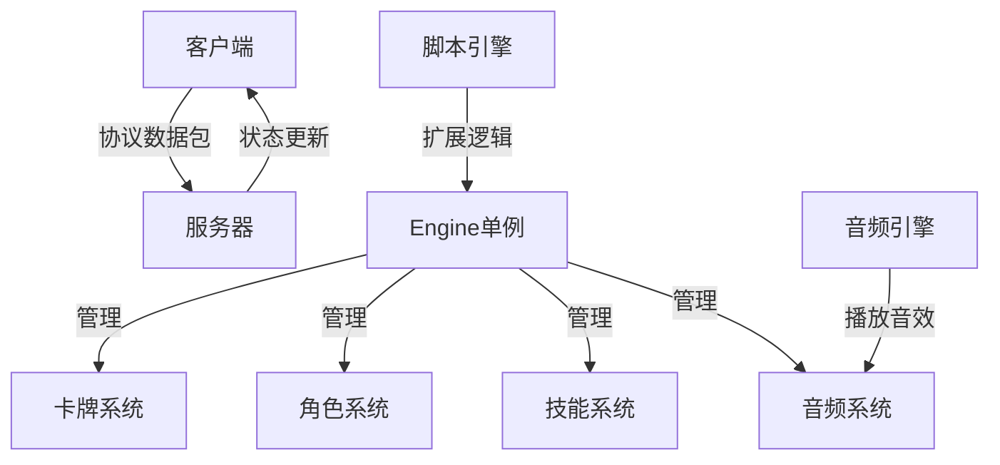
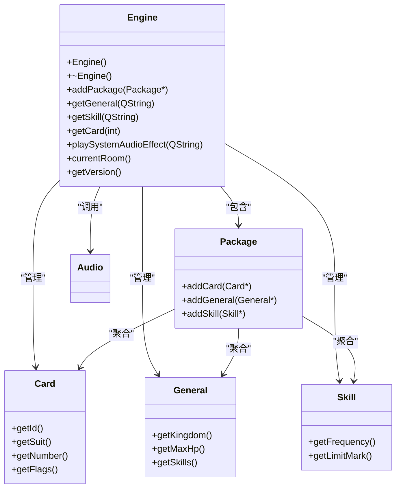
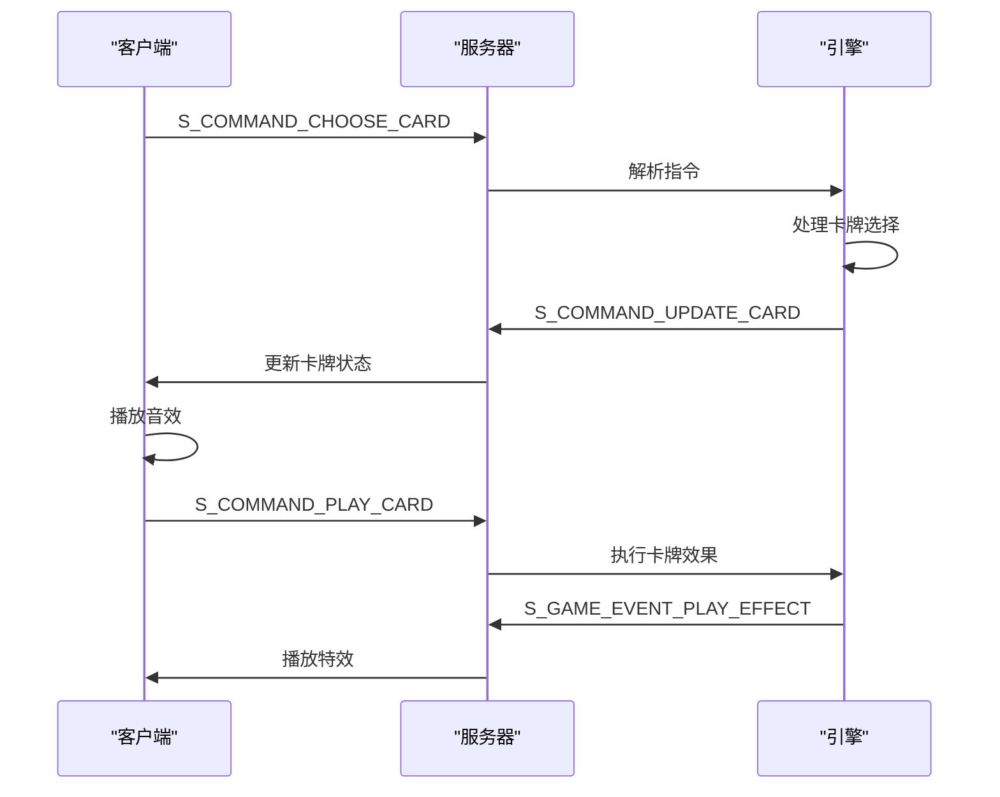
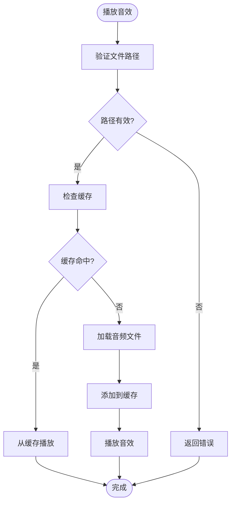
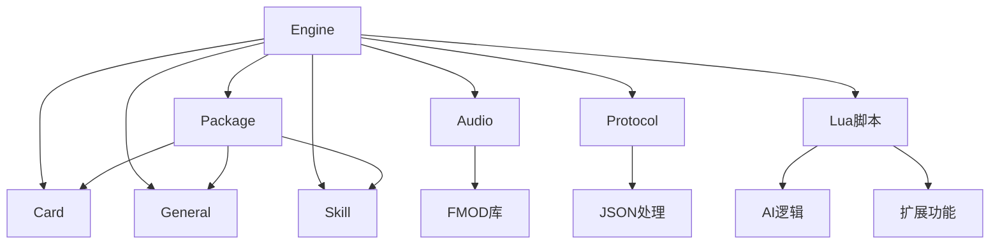

# 核心系统

<cite>
**本文档中引用的文件**   
- [engine.h](file://src/core/engine.h)
- [engine.cpp](file://src/core/engine.cpp)
- [protocol.h](file://src/core/protocol.h)
- [audio.cpp](file://src/core/audio.cpp)
- [audio.h](file://src/core/audio.h)
- [util.cpp](file://src/core/util.cpp)
</cite>

## 目录
1. [项目结构](#项目结构)
2. [核心组件](#核心组件)
3. [架构概述](#架构概述)
4. [详细组件分析](#详细组件分析)
5. [依赖分析](#依赖分析)
6. [性能考虑](#性能考虑)
7. [故障排除指南](#故障排除指南)
8. [结论](#结论)

## 项目结构

该项目是一个基于Qt框架的《三国杀》游戏实现，采用C++编写，并集成Lua脚本用于AI和扩展功能。项目结构清晰，按功能模块组织。

**图示来源**
- [engine.h](file://src/core/engine.h)
- [protocol.h](file://src/core/protocol.h)

**本节来源**
- [engine.h](file://src/core/engine.h)
- [protocol.h](file://src/core/protocol.h)

## 核心组件

核心系统由`Engine`类作为单例核心，协调卡牌、角色、技能等子系统。`protocol.h`定义了客户端与服务器间通信的数据结构。音频系统通过FMOD实现音效播放，基础工具函数在`util.cpp`中实现。

**本节来源**
- [engine.h](file://src/core/engine.h)
- [protocol.h](file://src/core/protocol.h)
- [audio.cpp](file://src/core/audio.cpp)

## 架构概述

系统采用客户端-服务器架构，通过自定义协议进行通信。`Engine`类作为全局单例，管理所有游戏对象和状态。

**图示来源**
- [engine.h](file://src/core/engine.h)
- [protocol.h](file://src/core/protocol.h)

## 详细组件分析

### 引擎系统分析

`Engine`类是整个游戏的核心，采用单例模式实现，通过全局指针`Sanguosha`访问。

**图示来源**
- [engine.h](file://src/core/engine.h)
- [engine.cpp](file://src/core/engine.cpp)

**本节来源**
- [engine.h](file://src/core/engine.h)
- [engine.cpp](file://src/core/engine.cpp)

### 网络协议分析

`protocol.h`定义了客户端与服务器通信的协议数据结构，采用JSON格式进行数据交换。

**图示来源**
- [protocol.h](file://src/core/protocol.h)

**本节来源**
- [protocol.h](file://src/core/protocol.h)

### 音频系统分析

音频系统通过FMOD库实现，封装在`Audio`类中，提供音效和背景音乐播放功能。

**图示来源**
- [audio.cpp](file://src/core/audio.cpp)
- [audio.h](file://src/core/audio.h)

**本节来源**
- [audio.cpp](file://src/core/audio.cpp)
- [audio.h](file://src/core/audio.h)

## 依赖分析

系统各组件间存在明确的依赖关系，`Engine`作为核心协调者，依赖于各个子系统。

**图示来源**
- [engine.h](file://src/core/engine.h)
- [protocol.h](file://src/core/protocol.h)
- [audio.h](file://src/core/audio.h)

**本节来源**
- [engine.h](file://src/core/engine.h)
- [protocol.h](file://src/core/protocol.h)
- [audio.h](file://src/core/audio.h)

## 性能考虑

系统在设计时考虑了性能优化，如音频缓存、对象池等机制。

- **音频缓存**: 使用`QCache`缓存已加载的音效，避免重复加载
- **对象复用**: 卡牌对象通过克隆机制复用，减少内存分配
- **单例模式**: `Engine`类作为单例，避免重复创建
- **延迟加载**: 部分资源在需要时才加载，减少启动时间

## 故障排除指南

### 常见问题

1. **音频无法播放**
   - 检查FMOD库是否正确加载
   - 验证音频文件路径是否正确
   - 检查音量设置是否为0

2. **网络连接失败**
   - 检查协议版本是否匹配
   - 验证数据包格式是否正确
   - 检查网络权限设置

3. **内存泄漏**
   - 确保`Engine`析构时正确释放FMOD资源
   - 检查卡牌对象的生命周期管理

**本节来源**
- [audio.cpp](file://src/core/audio.cpp)
- [engine.cpp](file://src/core/engine.cpp)

## 结论

该核心系统设计合理，采用模块化架构，通过`Engine`单例协调各子系统。网络协议设计完整，音频系统集成良好，基础工具库功能实用。系统具有良好的扩展性，通过Lua脚本支持AI和扩展功能。