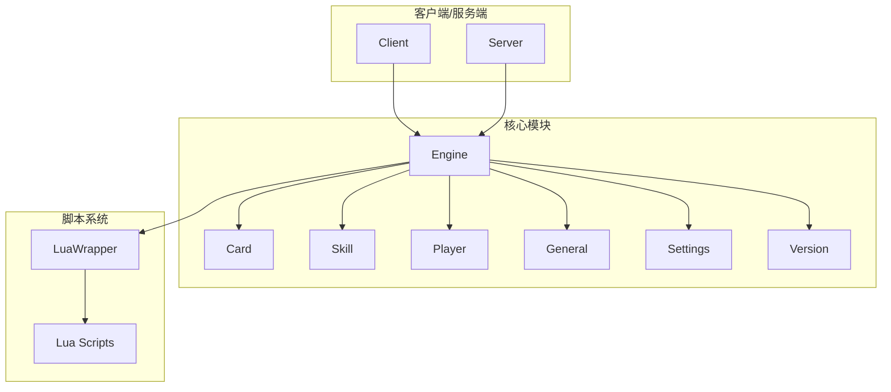
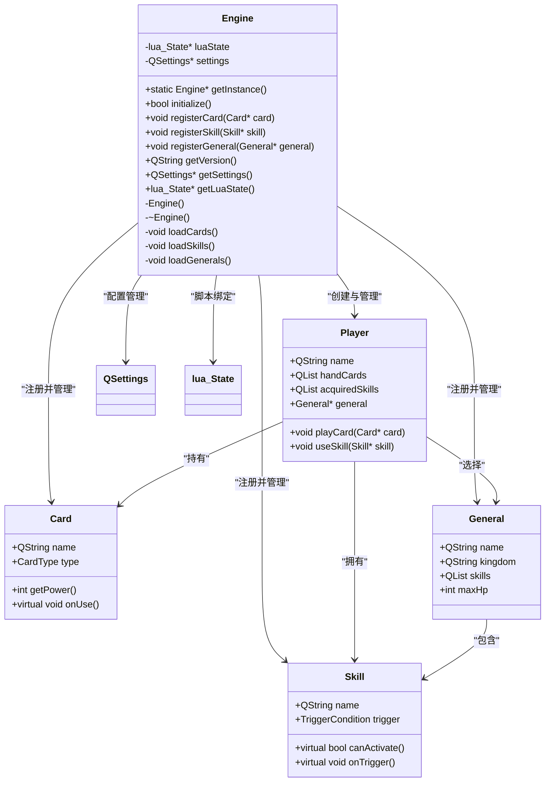
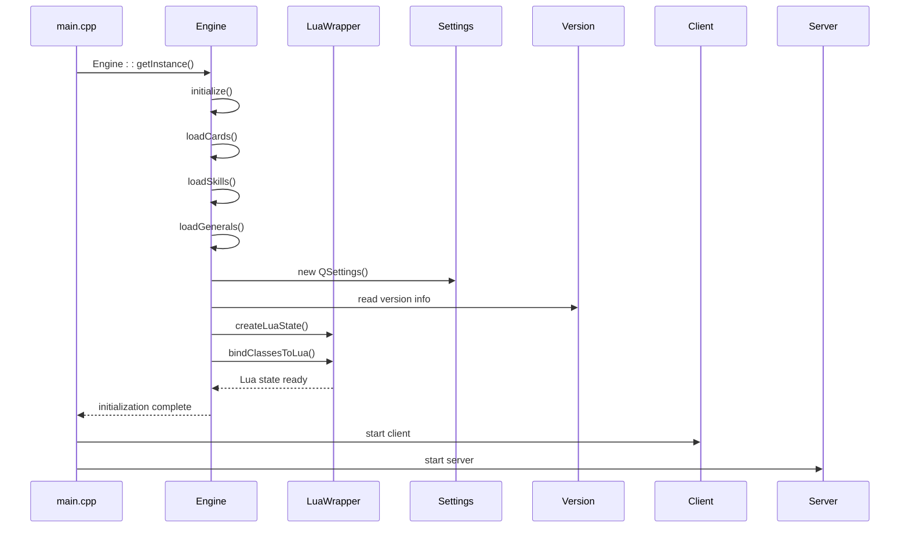
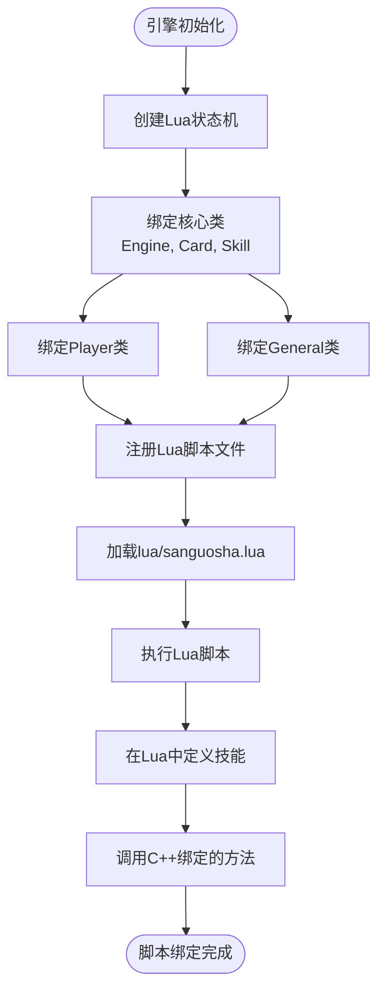
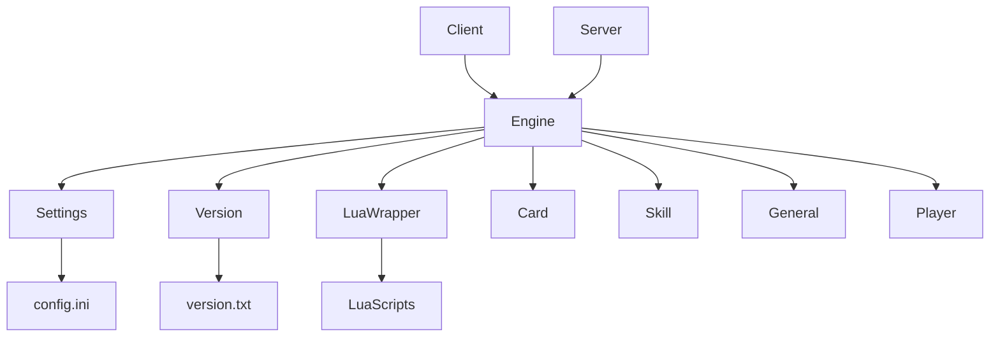

# 游戏引擎

<cite>
**本文档引用文件**  
- [engine.cpp](file://src/core/engine.cpp)
- [engine.h](file://src/core/engine.h)
- [version.cpp](file://src/core/version.cpp)
- [version.h](file://src/core/version.h)
- [settings.cpp](file://src/core/settings.cpp)
- [settings.h](file://src/core/settings.h)
- [lua-wrapper.h](file://src/core/lua-wrapper.h)
- [main.cpp](file://src/main.cpp)
</cite>

## 目录
1. [简介](#简介)
2. [项目结构](#项目结构)
3. [核心组件](#核心组件)
4. [架构概览](#架构概览)
5. [详细组件分析](#详细组件分析)
6. [依赖关系分析](#依赖关系分析)
7. [性能考量](#性能考量)
8. [故障排除指南](#故障排除指南)
9. [结论](#结论)

## 简介
本技术文档深入分析《三国杀》游戏引擎的核心实现机制，重点阐述`Engine`类作为全局单例在系统初始化、模块注册、资源管理及生命周期控制中的关键作用。文档详细解析引擎如何通过`initialize()`方法加载卡牌、角色、技能等基础数据，并与Lua脚本系统进行绑定。同时，说明`version.cpp`和`settings.cpp`如何为引擎提供版本管理和配置支持。通过UML类图展示`Engine`类与`Player`、`Card`、`Skill`等核心对象的依赖关系，并提供代码示例说明如何通过`Engine::getInstance()`获取实例并调用关键API。此外，还讨论引擎启动流程、线程模型以及与其他子系统（如服务器、客户端）的交互方式，并指出常见初始化错误及调试方法。

## 项目结构
该项目采用模块化分层架构，主要分为以下几个部分：
- `src/core`：核心逻辑模块，包含引擎、卡牌、角色、技能等核心类。
- `src/client` 和 `src/server`：分别处理客户端和服务器端逻辑。
- `src/package`：定义各类扩展包，如标准包、势力包等。
- `lua`：存放Lua脚本，用于技能逻辑、AI行为等可配置功能。
- `lang/zh_CN`：中文语言资源文件。
- `skins`：UI皮肤配置文件。
- `include`：第三方库头文件（如FMOD音频库、FreeType字体库）。



**图示来源**
- [engine.h](file://src/core/engine.h#L10-L50)
- [card.h](file://src/core/card.h#L5-L20)
- [skill.h](file://src/core/skill.h#L5-L20)
- [player.h](file://src/core/player.h#L5-L20)
- [general.h](file://src/core/general.h#L5-L20)

**本节来源**
- [engine.h](file://src/core/engine.h#L1-L100)
- [project_structure](file://README.md#L1-L50)

## 核心组件
游戏引擎的核心是`Engine`类，它是一个全局唯一的单例对象，负责协调整个游戏系统的运行。其主要职责包括：
- 初始化所有基础数据（卡牌、角色、技能）
- 管理Lua脚本绑定
- 提供版本信息和配置读取接口
- 控制游戏生命周期

`Engine`通过静态方法`getInstance()`对外提供唯一实例访问，确保全局状态一致性。

**本节来源**
- [engine.h](file://src/core/engine.h#L15-L80)
- [engine.cpp](file://src/core/engine.cpp#L20-L60)

## 架构概览
游戏引擎采用“C++核心 + Lua扩展”的混合架构，C++负责性能敏感的底层逻辑和对象管理，Lua负责可变的游戏规则和技能逻辑。`Engine`作为中枢，协调两者交互。

```mermaid
graph LR
Main[main.cpp] --> Engine[Engine::initialize()]
Engine --> LoadCard[加载卡牌数据]
Engine --> LoadGeneral[加载角色数据]
Engine --> LoadSkill[加载技能数据]
Engine --> RegisterLua[注册Lua绑定]
RegisterLua --> LuaState[Lua State]
LuaState --> SkillScript[技能脚本]
LuaState --> AIScript[AI脚本]
Engine --> Settings[读取配置]
Engine --> Version[获取版本]
Engine --> Client[客户端初始化]
Engine --> Server[服务器初始化]
```

**图示来源**
- [main.cpp](file://src/main.cpp#L10-L30)
- [engine.cpp](file://src/core/engine.cpp#L50-L150)
- [lua-wrapper.h](file://src/core/lua-wrapper.h#L5-L25)

## 详细组件分析

### Engine类分析
`Engine`类是整个游戏系统的核心控制器，采用单例模式实现，确保全局唯一性。



**图示来源**
- [engine.h](file://src/core/engine.h#L10-L70)
- [card.h](file://src/core/card.h#L10-L40)
- [skill.h](file://src/core/skill.h#L10-L35)
- [general.h](file://src/core/general.h#L10-L30)
- [player.h](file://src/core/player.h#L10-L40)

**本节来源**
- [engine.h](file://src/core/engine.h#L1-L100)
- [engine.cpp](file://src/core/engine.cpp#L1-L200)

### 初始化流程分析
引擎的初始化流程是游戏启动的关键步骤，涉及多个模块的协同工作。



**图示来源**
- [main.cpp](file://src/main.cpp#L20-L40)
- [engine.cpp](file://src/core/engine.cpp#L50-L150)
- [lua-wrapper.h](file://src/core/lua-wrapper.h#L10-L30)
- [settings.cpp](file://src/core/settings.cpp#L5-L20)
- [version.cpp](file://src/core/version.cpp#L5-L15)

**本节来源**
- [main.cpp](file://src/main.cpp#L1-L50)
- [engine.cpp](file://src/core/engine.cpp#L50-L200)

### Lua脚本绑定机制
引擎通过`lua-wrapper.h`提供的接口将C++类暴露给Lua脚本，实现逻辑热更新和扩展。



**图示来源**
- [lua-wrapper.h](file://src/core/lua-wrapper.h#L1-L40)
- [engine.cpp](file://src/core/engine.cpp#L100-L180)
- [sanguosha.lua](file://lua/sanguosha.lua#L1-L50)

**本节来源**
- [lua-wrapper.h](file://src/core/lua-wrapper.h#L1-L50)
- [engine.cpp](file://src/core/engine.cpp#L100-L200)

## 依赖关系分析
引擎与其他模块存在紧密的依赖关系，形成一个以`Engine`为中心的星型结构。



**图示来源**
- [engine.h](file://src/core/engine.h#L1-L80)
- [settings.h](file://src/core/settings.h#L1-L20)
- [version.h](file://src/core/version.h#L1-L15)
- [lua-wrapper.h](file://src/core/lua-wrapper.h#L1-L25)

**本节来源**
- [engine.h](file://src/core/engine.h#L1-L100)
- [settings.h](file://src/core/settings.h#L1-L30)
- [version.h](file://src/core/version.h#L1-L20)

## 性能考量
- **单例模式**：`Engine`使用单例模式，避免重复创建，节省内存。
- **延迟加载**：部分资源（如音效、图像）采用按需加载策略，减少启动时间。
- **Lua绑定优化**：通过预注册常用类和方法，减少运行时查找开销。
- **对象池**：对频繁创建销毁的对象（如卡牌）使用对象池技术，降低GC压力。

## 故障排除指南
### 常见初始化错误
1. **Lua脚本加载失败**
   - 检查`lua/`目录下脚本文件是否存在
   - 验证Lua语法正确性
   - 查看日志中Lua错误信息

2. **配置文件读取异常**
   - 确认`settings.ini`文件路径正确
   - 检查文件读写权限
   - 使用`QSettings::status()`获取错误状态

3. **版本信息获取失败**
   - 确保`version.txt`文件存在且格式正确
   - 检查文件编码（应为UTF-8）

4. **核心类注册失败**
   - 确保`initialize()`方法被正确调用
   - 检查内存分配是否成功
   - 验证指针有效性

**本节来源**
- [engine.cpp](file://src/core/engine.cpp#L50-L200)
- [settings.cpp](file://src/core/settings.cpp#L20-L60)
- [version.cpp](file://src/core/version.cpp#L20-L40)

## 结论
`Engine`类作为游戏引擎的核心，成功实现了系统初始化、模块注册、资源管理和生命周期控制等关键功能。通过单例模式保证全局状态一致性，结合Lua脚本系统实现高度可扩展的游戏逻辑。其清晰的架构设计和良好的模块化分离，为后续功能扩展和维护提供了坚实基础。建议未来进一步优化资源加载策略，引入异步初始化机制以提升启动性能。