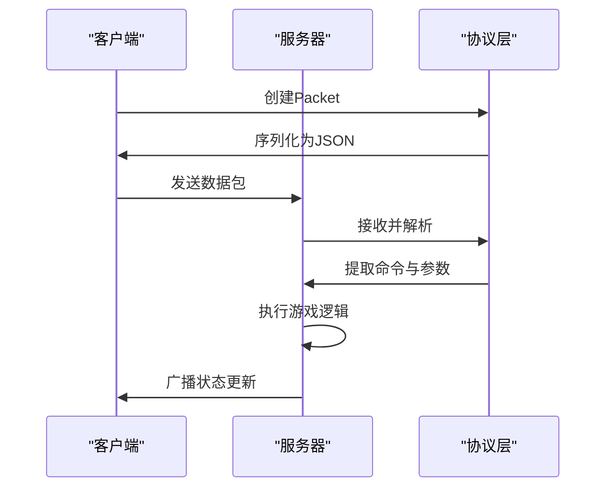
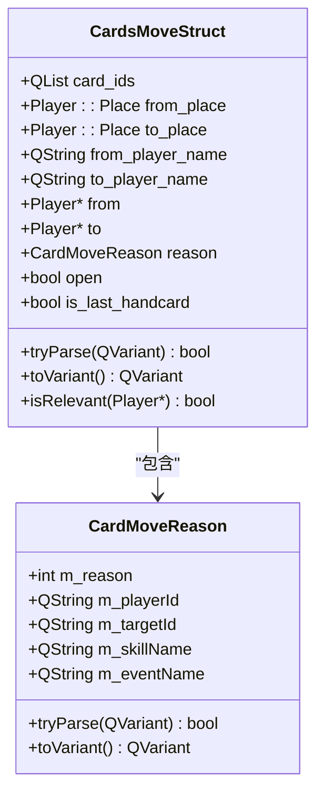
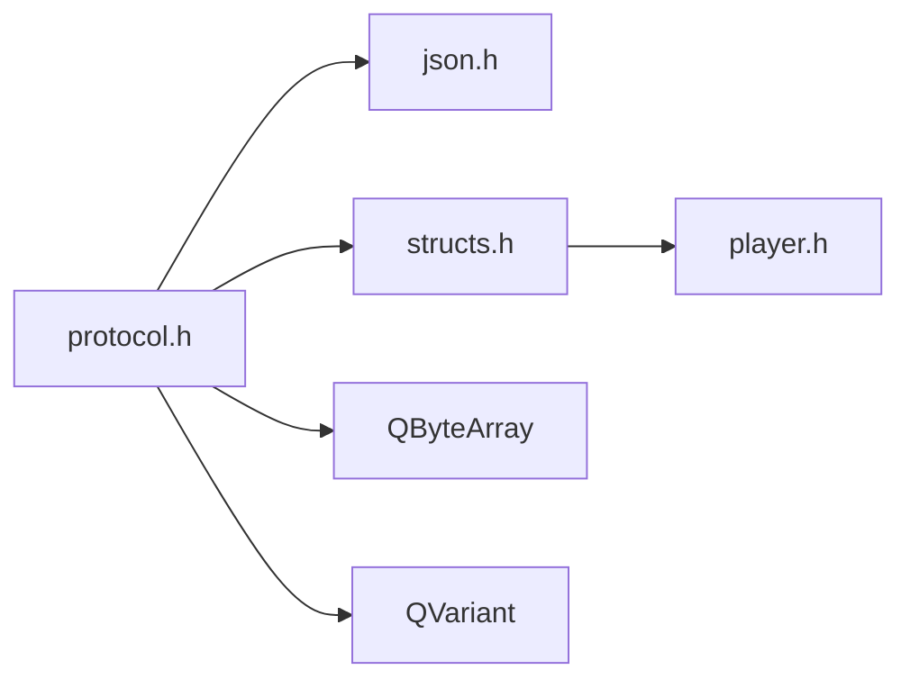

# 网络协议

<cite>
**本文档引用文件**  
- [protocol.h](file://src/core/protocol.h#L1-L330)
- [protocol.cpp](file://src/core/protocol.cpp#L1-L136)
- [clientstruct.h](file://src/client/clientstruct.h#L29-L52)
- [structs.h](file://src/core/structs.h#L249-L343)
</cite>

## 目录
1. [简介](#简介)
2. [项目结构](#项目结构)
3. [核心组件](#核心组件)
4. [架构概览](#架构概览)
5. [详细组件分析](#详细组件分析)
6. [依赖分析](#依赖分析)
7. [性能考虑](#性能考虑)
8. [故障排除指南](#故障排除指南)
9. [结论](#结论)

## 简介
本文件详细说明了《三国杀：霸业》客户端与服务器之间的网络通信协议。该协议基于二进制序列化机制，通过定义清晰的消息类型、数据结构和命令码，实现游戏状态同步、卡牌移动、技能触发等关键功能。文档涵盖协议格式、消息处理流程、安全性设计及扩展性策略，旨在为开发者提供全面的技术参考。

## 项目结构
项目采用模块化设计，主要分为客户端（client）、核心逻辑（core）、服务器（server）和UI界面（ui）四大模块。网络协议相关代码集中于`src/core`目录下的`protocol.h`和`protocol.cpp`文件中，由`QSanProtocol`命名空间统一管理。协议依赖JSON进行序列化，并通过`Packet`类封装消息传输。

```mermaid
graph TB
subgraph "客户端模块"
Client[client]
ClientStruct[clientstruct.h]
end
subgraph "核心模块"
Core[core]
Protocol[protocol.h/cpp]
Structs[structs.h]
end
subgraph "服务器模块"
Server[server]
Room[room.h/cpp]
end
Protocol --> Structs : "使用数据结构"
Client --> Protocol : "发送/接收消息"
Server --> Protocol : "处理命令"
Core --> Client : "状态更新"
Core --> Server : "游戏逻辑"
```

**图示来源**
- [protocol.h](file://src/core/protocol.h#L1-L330)
- [clientstruct.h](file://src/client/clientstruct.h#L29-L52)
- [structs.h](file://src/core/structs.h#L249-L343)

**本节来源**
- [protocol.h](file://src/core/protocol.h#L1-L330)
- [clientstruct.h](file://src/client/clientstruct.h#L29-L52)

## 核心组件
协议的核心是`QSanProtocol::Packet`类，它定义了所有网络消息的通用格式。每个数据包包含全局序列号、本地序列号、包类型、命令码和消息体。消息体使用`QVariant`类型支持多种数据结构的动态传递，如字符串、数组和自定义结构体。

此外，`CommandType`枚举定义了所有可执行的操作码，涵盖卡牌操作、技能调用、玩家状态变更等。`ServerInfoStruct`结构体用于传递服务器配置信息，如游戏模式、超时设置和扩展包列表。

**本节来源**
- [protocol.h](file://src/core/protocol.h#L1-L330)
- [protocol.cpp](file://src/core/protocol.cpp#L1-L136)
- [clientstruct.h](file://src/client/clientstruct.h#L29-L52)

## 架构概览
整个通信系统采用客户端-服务器（C/S）架构。客户端发起请求，服务器接收并处理命令，随后广播通知或返回响应。所有消息均通过`Packet`对象进行序列化和反序列化，确保跨平台兼容性。



**图示来源**
- [protocol.h](file://src/core/protocol.h#L1-L330)
- [protocol.cpp](file://src/core/protocol.cpp#L1-L136)

## 详细组件分析

### 协议消息结构分析
`Packet`类是协议的基础单元，其格式如下：
- `globalSerial`: 全局唯一序列号，用于去重和排序
- `localSerial`: 本地序列号，用于确认应答
- `packetDescription`: 包描述符，包含源、目标和类型信息
- `command`: 命令码，指示具体操作
- `messageBody`: 消息体，携带具体参数

消息体支持嵌套结构，例如`CardsMoveStruct`可用于描述卡牌移动事件。

#### 卡牌移动结构


**图示来源**
- [structs.h](file://src/core/structs.h#L249-L343)

**本节来源**
- [structs.h](file://src/core/structs.h#L249-L343)
- [protocol.h](file://src/core/protocol.h#L1-L330)

### 命令类型与操作码
`CommandType`枚举定义了所有支持的操作，主要包括：

| 操作码 | 中文说明 | 参数含义 |
|--------|----------|----------|
| S_COMMAND_PLAY_CARD | 使用卡牌 | 卡牌ID、目标玩家 |
| S_COMMAND_RESPONSE_CARD | 响应卡牌 | 响应卡牌ID |
| S_COMMAND_MOVE_CARD | 移动卡牌 | CardsMoveStruct结构 |
| S_COMMAND_INVOKE_SKILL | 触发技能 | 技能名、参数 |
| S_COMMAND_GAME_START | 游戏开始 | 无 |
| S_COMMAND_GAME_OVER | 游戏结束 | 胜利方信息 |

这些命令码通过`Packet`的消息体传递具体参数，实现精确控制。

**本节来源**
- [protocol.h](file://src/core/protocol.h#L1-L330)

### 服务器信息结构
`ServerInfoStruct`用于传递服务器配置，包括：

- **Name**: 服务器名称
- **GameMode**: 游戏模式（如标准、3v3）
- **OperationTimeout**: 操作超时时间
- **NullificationCountDown**: 无懈可击倒计时
- **Extensions**: 启用的扩展包列表
- **RandomSeat**: 是否随机座位
- **EnableCheat**: 是否启用作弊功能

该结构通过`parse`方法从字符串解析，并通过`getCommandTimeout`方法获取不同命令的超时限制。

**本节来源**
- [clientstruct.h](file://src/client/clientstruct.h#L29-L52)

## 依赖分析
协议层依赖于以下核心组件：
- `json.h`: 提供JSON序列化支持
- `structs.h`: 定义游戏相关的数据结构
- `player.h`: 玩家对象定义，用于卡牌移动中的来源与目标



**图示来源**
- [protocol.h](file://src/core/protocol.h#L1-L330)
- [structs.h](file://src/core/structs.h#L249-L343)

**本节来源**
- [protocol.h](file://src/core/protocol.h#L1-L330)
- [structs.h](file://src/core/structs.h#L249-L343)

## 性能考虑
协议设计充分考虑了网络传输效率：
- 使用紧凑的JSON格式减少带宽占用
- 支持批量消息合并，降低网络往返次数
- 消息体仅包含必要信息，避免冗余传输
- 通过`open`标志位控制卡牌ID的可见性，保护玩家隐私

在高延迟环境下，建议启用`S_COMMAND_NETWORK_DELAY_TEST`命令进行延迟检测，并适当调整`OperationTimeout`值以提升用户体验。

## 故障排除指南
常见问题及解决方案：

1. **消息解析失败**
   - 检查`Packet::parse`是否收到完整数据
   - 验证JSON格式是否符合协议规范
   - 确保消息长度不超过`S_MAX_PACKET_SIZE`

2. **命令未响应**
   - 确认`command`字段值正确
   - 检查服务器是否支持该`CommandType`
   - 查看日志是否有权限或状态限制

3. **卡牌移动不同步**
   - 验证`CardsMoveStruct`中`from_place`和`to_place`是否合法
   - 确保`reason`字段准确反映移动原因
   - 检查`open`标志位设置是否合理

**本节来源**
- [protocol.cpp](file://src/core/protocol.cpp#L1-L136)
- [protocol.h](file://src/core/protocol.h#L1-L330)

## 结论
《三国杀：霸业》的网络协议设计清晰、扩展性强，能够有效支撑复杂的卡牌游戏逻辑。通过标准化的消息格式和丰富的命令集，实现了客户端与服务器之间的高效通信。未来可通过增加版本号字段进一步增强向后兼容性，并引入压缩算法优化大数据量传输场景。