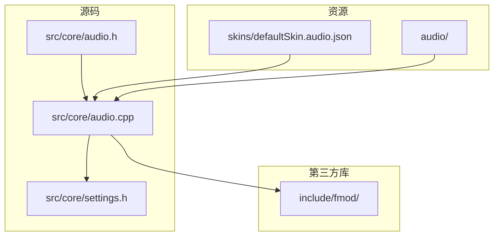
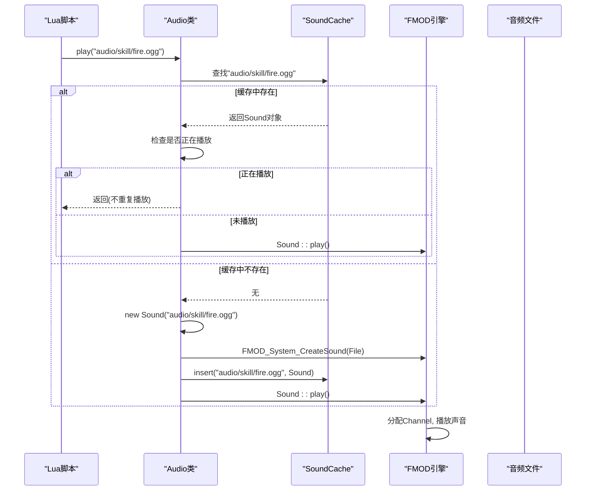
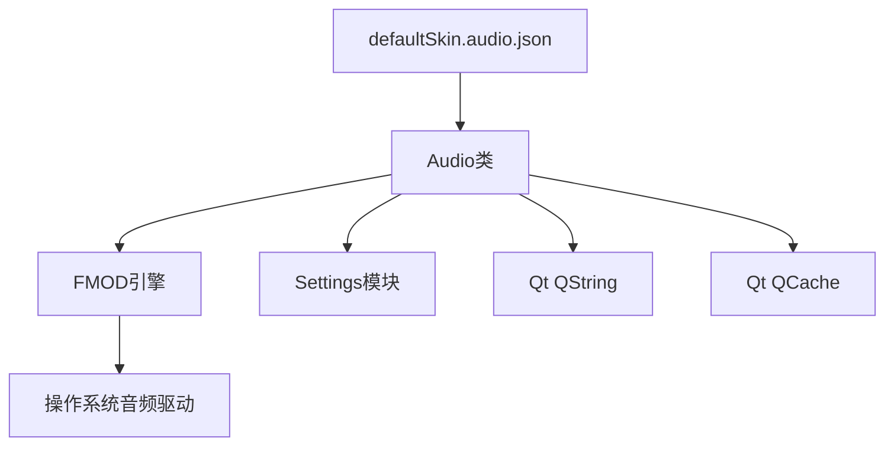

# 音频系统

<cite>
**本文档引用的文件**  
- [audio.h](file://src/core/audio.h)
- [audio.cpp](file://src/core/audio.cpp)
- [defaultSkin.audio.json](file://skins/defaultSkin.audio.json)
- [settings.h](file://src/core/settings.h)
- [fmod.h](file://include/fmod/fmod.h)
- [fmod.hpp](file://include/fmod/fmod.hpp)
</cite>

## 目录
1. [简介](#简介)
2. [项目结构](#项目结构)
3. [核心组件](#核心组件)
4. [架构概述](#架构概述)
5. [详细组件分析](#详细组件分析)
6. [依赖分析](#依赖分析)
7. [性能考虑](#性能考虑)
8. [故障排除指南](#故障排除指南)
9. [结论](#结论)

## 简介
本文档深入分析了《三国杀：霸业》游戏中的音频系统实现，重点阐述了基于FMOD音频引擎的音效与背景音乐播放控制机制。文档详细描述了音频资源的加载、声道管理、音量调节、3D音效定位等核心功能，并解析了`FMOD::System`和`FMOD::Channel`在游戏运行时的生命周期管理。同时，提供了Lua脚本调用音频接口的示例、支持的音频格式、资源目录结构以及性能优化建议。

## 项目结构
音频系统相关的代码和资源在项目中遵循清晰的分层结构：
- **头文件与实现**：位于 `src/core/` 目录下的 `audio.h` 和 `audio.cpp` 定义了音频系统的核心接口和逻辑。
- **音频资源**：位于 `audio/` 子目录下，按功能分类存放音效和背景音乐文件。
- **皮肤配置**：位于 `skins/` 目录下的 `defaultSkin.audio.json` 文件定义了不同游戏事件与具体音频文件的映射关系。
- **第三方库**：FMOD音频引擎的头文件位于 `include/fmod/` 目录下。
- **配置管理**：音量等音频设置由 `settings.h` 和 `settings.cpp` 管理。



**图示来源**
- [audio.h](file://src/core/audio.h)
- [audio.cpp](file://src/core/audio.cpp)
- [defaultSkin.audio.json](file://skins/defaultSkin.audio.json)

## 核心组件
音频系统的核心是一个名为 `Audio` 的静态类，它封装了对FMOD引擎的调用，为上层游戏逻辑提供简洁的音频播放接口。其主要功能包括初始化/释放音频系统、播放/停止音效、播放/停止/调节背景音乐音量。

**组件来源**
- [audio.h](file://src/core/audio.h#L27-L42)
- [audio.cpp](file://src/core/audio.cpp#L40-L100)

## 架构概述
音频系统采用单例模式（通过静态类实现）管理FMOD引擎。`FMOD::System` 对象是整个音频系统的入口和核心，负责管理所有声音（`FMOD::Sound`）和声道（`FMOD::Channel`）。音效通过 `Sound` 类进行缓存和管理，以避免重复加载，提高性能。背景音乐则使用独立的声道进行播放和控制。

```mermaid
classDiagram
class Audio {
+static init()
+static quit()
+static play(filename)
+static playBGM(filename)
+static setBGMVolume(volume)
+static stopBGM()
}
class Sound {
-sound : FMOD_SOUND*
-channel : FMOD_CHANNEL*
+play(doubleVolume)
+isPlaying() : bool
}
class QCache {
+insert(key, value)
+operator[](key)
}
Audio --> Sound : "创建并播放"
Audio --> QCache : "缓存音效"
Sound --> "FMOD : : Sound" : "封装"
Sound --> "FMOD : : Channel" : "播放于"
```

**图示来源**
- [audio.h](file://src/core/audio.h#L27-L42)
- [audio.cpp](file://src/core/audio.cpp#L40-L100)

## 详细组件分析

### Audio 类分析
`Audio` 类是音频系统的公共接口。

#### 初始化与销毁
`Audio::init()` 方法在游戏启动时被调用，负责创建 `FMOD::System` 实例并进行初始化。`FMOD_System_Init` 的第二个参数设置为100，表示系统最多可以同时播放100个声道。

```cpp
void Audio::init()
{
    FMOD_RESULT result = FMOD_System_Create(&System);
    if (result == FMOD_OK) FMOD_System_Init(System, 100, 0, NULL);
}
```

`Audio::quit()` 方法在游戏退出时被调用，负责清理所有缓存的音效并释放 `FMOD::System` 资源。

**组件来源**
- [audio.cpp](file://src/core/audio.cpp#L40-L50)

#### 音效播放
`Audio::play(const QString &filename)` 是播放音效的核心方法。它首先检查 `SoundCache` 缓存中是否已存在该音频文件对应的 `Sound` 对象。如果不存在，则创建新的 `Sound` 对象并插入缓存；如果存在且正在播放，则直接返回，避免重复播放。最后调用 `Sound::play()` 方法进行播放。

```cpp
void Audio::play(const QString &filename)
{
    Sound *sound = SoundCache[filename];
    if (sound == NULL) {
        sound = new Sound(filename);
        SoundCache.insert(filename, sound);
    } else if (sound->isPlaying()) {
        return;
    }

    sound->play();
}
```

`Sound` 类的构造函数使用 `FMOD_System_CreateSound` 从文件创建一个 `FMOD::Sound` 对象。`play()` 方法则通过 `FMOD_System_PlaySound` 将声音播放到一个空闲的声道上，并根据配置设置音量。

```cpp
void Sound::play(const bool doubleVolume = false)
{
    if (sound) {
        FMOD_RESULT result = FMOD_System_PlaySound(System, FMOD_CHANNEL_FREE, sound, false, &channel);
        if (result == FMOD_OK) {
            FMOD_Channel_SetVolume(channel, (doubleVolume ? 2 : 1) * Config.EffectVolume);
            FMOD_System_Update(System);
        }
    }
}
```

**组件来源**
- [audio.cpp](file://src/core/audio.cpp#L93-L100)
- [audio.cpp](file://src/core/audio.cpp#L65-L75)

#### 背景音乐播放
`Audio::playBGM(const QString &filename)` 方法专门用于播放背景音乐。它使用 `FMOD_System_CreateStream` 创建一个音频流（stream），这比 `CreateSound` 更节省内存，适合长时间播放的BGM。通过 `FMOD_Sound_SetLoopCount(BGM, -1)` 设置为无限循环播放。BGM使用一个全局的 `BGMChannel` 进行管理，确保任何时候只有一个BGM在播放。

```cpp
void Audio::playBGM(const QString &filename)
{
    FMOD_RESULT result = FMOD_System_CreateStream(System, filename.toLocal8Bit(), FMOD_LOOP_NORMAL, NULL, &BGM);
    if (result == FMOD_OK) {
        FMOD_Sound_SetLoopCount(BGM, -1);
        FMOD_System_PlaySound(System, FMOD_CHANNEL_FREE, BGM, false, &BGMChannel);
        FMOD_Channel_SetVolume(BGMChannel, Config.BGMVolume);
        FMOD_System_Update(System);
    }
}
```

`Audio::setBGMVolume()` 和 `Audio::stopBGM()` 方法通过操作 `BGMChannel` 来实现音量调节和停止播放。

**组件来源**
- [audio.cpp](file://src/core/audio.cpp#L110-L130)

### 音频事件触发流程
当游戏中的技能被发动时，音频播放的路径如下：



**图示来源**
- [audio.cpp](file://src/core/audio.cpp#L93-L100)

### Lua脚本调用示例
游戏中的Lua脚本可以通过 `sAudio` 对象调用音频接口。例如，在技能发动时播放音效：

```lua
function onSkillUse()
    -- 播放技能发动音效
    sAudio:play("audio/skill/use.ogg")
    -- 播放特定武将的台词
    sAudio:play("audio/general/zhaoyun/skill.ogg")
end

function onGameStart()
    -- 播放游戏开始背景音乐
    sAudio:playBGM("audio/music/main_theme.ogg")
end
```

映射关系也可以在 `defaultSkin.audio.json` 中定义，实现更灵活的配置：

```json
{
    "playerAudioEffect-skill-fire": "audio/skill/fire.ogg",
    "playerAudioEffect-skill-thunder": "audio/skill/thunder.ogg"
}
```

**组件来源**
- [audio.h](file://src/core/audio.h#L27-L42)
- [defaultSkin.audio.json](file://skins/defaultSkin.audio.json)

## 依赖分析
音频系统依赖于多个外部组件和内部模块。



**图示来源**
- [audio.h](file://src/core/audio.h)
- [audio.cpp](file://src/core/audio.cpp)
- [defaultSkin.audio.json](file://skins/defaultSkin.audio.json)

## 性能考虑
1.  **内存缓存**：`SoundCache` 使用 `QCache` 缓存已加载的音效，避免了频繁的文件I/O和内存分配，显著提升了性能。
2.  **流式播放**：背景音乐使用 `FMOD_System_CreateStream` 而非 `FMOD_System_CreateSound`，以流式方式加载，大大降低了内存占用。
3.  **声道复用**：通过 `FMOD_CHANNEL_FREE` 参数，FMOD引擎会自动管理声道的复用，无需开发者手动管理。
4.  **音量控制**：音量调节直接在 `FMOD::Channel` 上进行，效率高。
5.  **避免重复播放**：`Audio::play()` 方法检查音效是否正在播放，防止同一音效的多次叠加，避免音量过大和性能浪费。

## 故障排除指南
*   **问题：游戏没有声音。**
    *   检查 `Audio::init()` 是否被正确调用。
    *   检查 `FMOD_System_Init` 的返回值，确认FMOD引擎初始化成功。
    *   检查音频文件路径是否正确，文件是否存在。
    *   检查系统音量和游戏内音量设置。

*   **问题：音效播放有延迟或卡顿。**
    *   检查 `FMOD_System_Update()` 是否在游戏主循环中被频繁调用。
    *   考虑调整 `FMOD_System_SetDSPBufferSize` 来优化DSP缓冲区大小。

*   **问题：内存占用过高。**
    *   确保长时间的音频（如BGM）使用 `CreateStream` 方式加载。
    *   检查 `SoundCache` 的大小，必要时可设置缓存上限。

**组件来源**
- [audio.cpp](file://src/core/audio.cpp#L40-L50)
- [fmod.h](file://include/fmod/fmod.h)

## 结论
本音频系统通过封装FMOD引擎，为《三国杀：霸业》提供了一个高效、稳定且易于使用的音频播放解决方案。其核心设计包括使用静态类作为单例入口、利用缓存机制优化音效播放、采用流式加载处理背景音乐，以及通过清晰的接口与游戏逻辑和Lua脚本进行交互。该系统在保证音质和功能的同时，也充分考虑了性能和内存的优化。