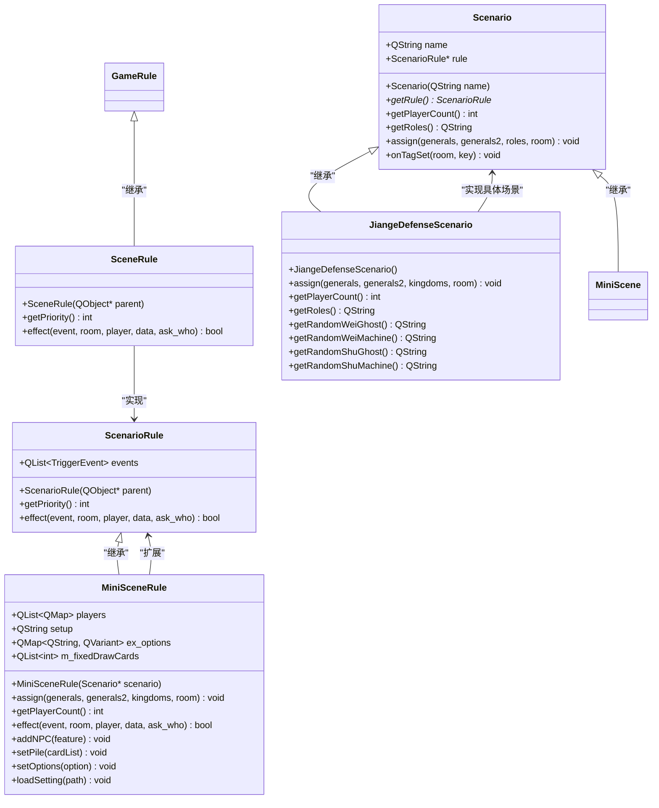
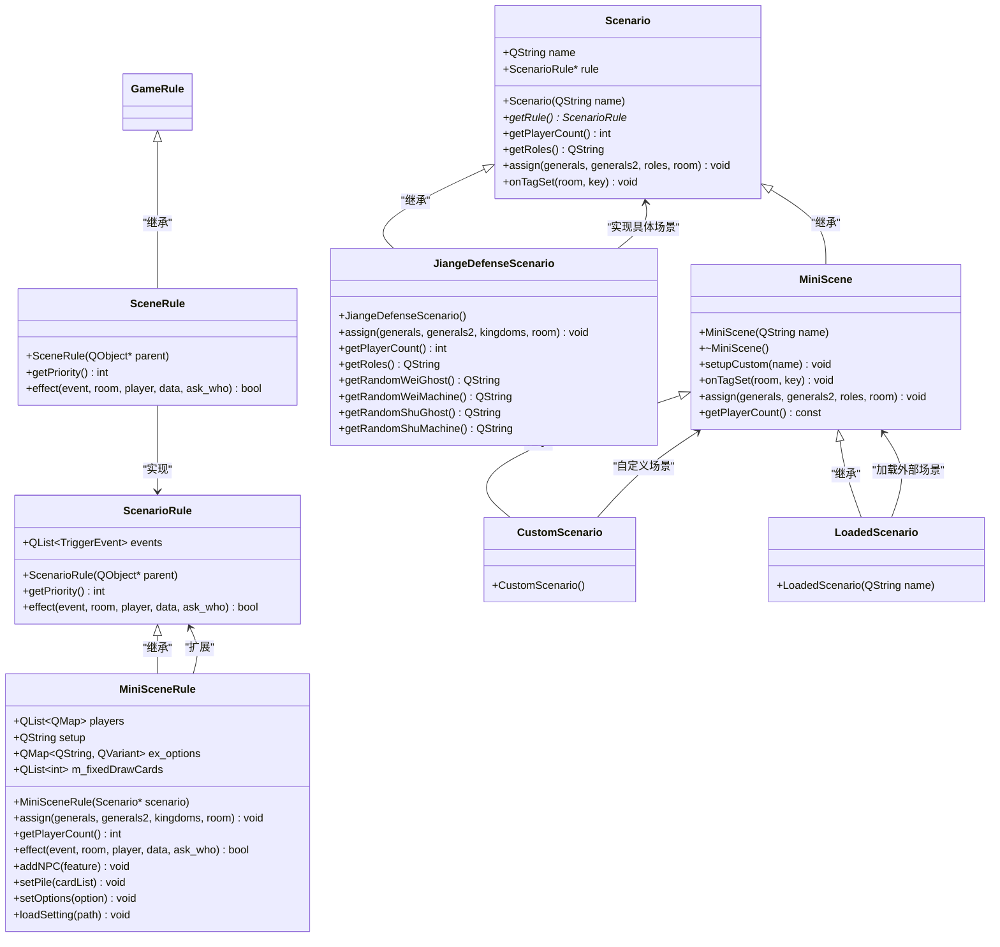
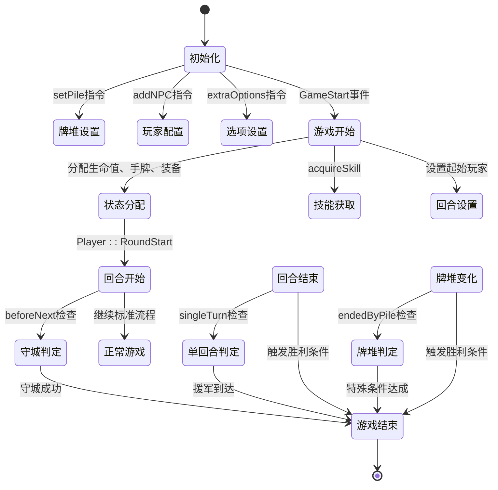

# 内置场景模式

<cite>
**本文档引用的文件**   
- [jiange-defense-scenario.cpp](file://src/scenario/jiange-defense-scenario.cpp)
- [jiange-defense-scenario.h](file://src/scenario/jiange-defense-scenario.h)
- [miniscenarios.cpp](file://src/scenario/miniscenarios.cpp)
- [miniscenarios.h](file://src/scenario/miniscenarios.h)
- [scenerule.cpp](file://src/scenario/scenerule.cpp)
- [scenerule.h](file://src/scenario/scenerule.h)
- [scenario.h](file://src/scenario/scenario.h)
</cite>

## 目录
1. [简介](#简介)
2. [核心组件分析](#核心组件分析)
3. [剑阁防御场景实现机制](#剑阁防御场景实现机制)
4. [小型场景状态机结构](#小型场景状态机结构)
5. [场景规则系统](#场景规则系统)
6. [类图：场景组件关系](#类图：场景组件关系)
7. [关键事件触发机制](#关键事件触发机制)
8. [状态转换与生命周期](#状态转换与生命周期)
9. [性能优化建议](#性能优化建议)

## 简介
本项目中的内置场景模式系统为游戏提供了特殊任务和剧情驱动的游戏模式。以“剑阁防御”为代表的特殊任务模式，通过自定义角色分配、势力设定和胜利条件，实现了与标准游戏流程不同的玩法体验。系统核心由`Scenario`基类、`ScenarioRule`规则系统和具体场景实现构成，支持动态配置和扩展。

**Section sources**
- [scenario.h](file://src/scenario/scenario.h#L1-L60)

## 核心组件分析
内置场景模式系统由三个核心组件构成：`Scenario`（场景基类）、`ScenarioRule`（场景规则）和具体场景实现类。`Scenario`定义了场景的基本接口和通用行为，`ScenarioRule`负责处理场景特有的事件和逻辑，具体场景类则实现特定玩法。



**Diagram sources**
- [scenario.h](file://src/scenario/scenario.h#L1-L60)
- [scenerule.h](file://src/scenario/scenerule.h#L1-L35)
- [miniscenarios.h](file://src/scenario/miniscenarios.h#L1-L101)
- [jiange-defense-scenario.h](file://src/scenario/jiange-defense-scenario.h#L1-L24)

**Section sources**
- [scenario.h](file://src/scenario/scenario.h#L1-L60)
- [scenerule.h](file://src/scenario/scenerule.h#L1-L35)

## 剑阁防御场景实现机制
“剑阁防御”场景通过`JiangeDefenseScenario`类实现，该类继承自`Scenario`并重写了角色分配、玩家数量和角色配置等核心方法。

### 场景初始化
`JiangeDefenseScenario`的构造函数创建了一个专用的规则对象`JiangeDefenseScenarioRule`，该规则监听`GameStart`事件，用于在游戏开始时执行特殊逻辑。

```cpp
JiangeDefenseScenario::JiangeDefenseScenario()
    : Scenario("jiange_defense")
{
    rule = new JiangeDefenseScenarioRule(this);
}
```

### 角色与势力分配
`assign`方法实现了复杂的角色分配逻辑，将8名玩家分为魏、蜀两个阵营，并为每个玩家分配特定角色类型（鬼、机、人）。系统首先为在线玩家（human）随机分配阵营，然后为AI玩家分配剩余角色。

```cpp
void JiangeDefenseScenario::assign(QStringList &generals, QStringList &generals2, QStringList &kingdoms, Room *room) const
{
    QMap<QString, QStringList> roles;
    QStringList wei_roles, shu_roles;
    wei_roles << "ghost" << "machine" << "human" << "human";
    shu_roles << "ghost" << "machine" << "human" << "human";
    roles.insert("wei", wei_roles);
    roles.insert("shu", shu_roles);
    // ... 角色分配逻辑
}
```

### 特殊角色生成
场景提供了四个私有方法用于生成魏蜀阵营的特殊角色：
- `getRandomWeiGhost()`：从魏国鬼将列表中随机选择
- `getRandomWeiMachine()`：从魏国机关列表中随机选择
- `getRandomShuGhost()`：从蜀国鬼将列表中随机选择
- `getRandomShuMachine()`：从蜀国神兽列表中随机选择

```cpp
QString JiangeDefenseScenario::getRandomWeiGhost() const
{
    QStringList ghosts;
    ghosts << "jg_xiahoudun" << "jg_zhangliao" << "jg_caozhen" << "jg_xiahou" << "jg_sima" << "jg_zhanghe";
    return ghosts.at(qrand() % ghosts.length());
}
```

**Section sources**
- [jiange-defense-scenario.cpp](file://src/scenario/jiange-defense-scenario.cpp#L0-L175)
- [jiange-defense-scenario.h](file://src/scenario/jiange-defense-scenario.h#L1-L24)

## 小型场景状态机结构
`MiniScene`和`MiniSceneRule`类构成了小型游戏模式的状态机框架，支持通过配置文件定义复杂的初始状态和游戏流程。

### 状态机核心组件
`MiniSceneRule`继承自`ScenarioRule`，监听`GameStart`、`EventPhaseStart`和`FetchDrawPileCard`三个关键事件，实现了基于阶段和条件的状态转换。

```cpp
MiniSceneRule::MiniSceneRule(Scenario *scenario)
    : ScenarioRule(scenario)
{
    events << GameStart << EventPhaseStart << FetchDrawPileCard;
}
```

### 游戏初始化流程
`GameStart`事件触发时，`MiniSceneRule`执行完整的场景初始化，包括：
1. 设置牌堆顺序（`m_fixedDrawCards`）
2. 为玩家分配初始手牌、装备和判定牌
3. 设置玩家生命值、技能和状态
4. 处理特殊选项（如随机座位、牌堆剩余处理）

```cpp
bool MiniSceneRule::effect(TriggerEvent triggerEvent, Room *room, ServerPlayer *player, QVariant &, ServerPlayer *) const
{
    if (triggerEvent == GameStart) {
        // 初始化牌堆
        foreach (int id, m_fixedDrawCards) {
            if (drawPile.contains(id)) {
                drawPile.removeOne(id);
                drawPile.prepend(id);
            } else {
                room->moveCardTo(Sanguosha->getCard(id), NULL, Player::DrawPile, true);
            }
        }
        
        // 为每个玩家设置初始状态
        for (int j = 0; j < players.length(); j++) {
            ServerPlayer *sp = players.at(j);
            // 设置生命值
            str = this->players.at(i)["maxhp"];
            if (str == QString()) str = QString::number(sp->getGeneralMaxHp());
            sp->setMaxHp(str.toInt());
            
            // 分配初始手牌
            str = this->players.at(i)["hand"];
            if (str != QString()) {
                QStringList hands = str.split(",");
                DummyCard dummy(StringList2IntList(hands));
                room->obtainCard(sp, &dummy);
            }
            
            // 安装装备
            str = this->players.at(i)["equip"];
            QStringList equips = str.split(",");
            foreach (const QString &equip, equips) {
                bool ok;
                equip.toInt(&ok);
                if (!ok)
                    room->installEquip(sp, equip);
                else
                    room->moveCardTo(Sanguosha->getCard(equip.toInt()), NULL, sp,
                    Player::PlaceEquip, CardMoveReason(CardMoveReason::S_REASON_UNKNOWN, QString()));
            }
        }
        return true;
    }
    return false;
}
```

### 动态配置加载
系统支持从外部文件加载场景配置，`loadSetting`方法解析文本文件，支持`setPile`、`extraOptions`等指令。

```cpp
void MiniSceneRule::loadSetting(QString path)
{
    QFile file(path);
    if (file.open(QIODevice::ReadOnly)) {
        players.clear();
        setup.clear();

        QTextStream stream(&file);
        while (!stream.atEnd()) {
            QString aline = stream.readLine();
            if (aline.isEmpty()) continue;

            if (aline.startsWith("setPile"))
                setPile(aline.split(":").at(1));
            else if (aline.startsWith("extraOptions")) {
                aline.remove("extraOptions:");
                QStringList options = aline.split(" ");
                foreach (const QString &option, options) {
                    if (options.isEmpty()) continue;
                    QString key = option.split(":").first(), value = option.split(":").last();
                    ex_options[key] = QVariant::fromValue(value);
                }
            } else
                addNPC(aline);
        }
        file.close();
    }
}
```

**Section sources**
- [miniscenarios.cpp](file://src/scenario/miniscenarios.cpp#L0-L382)
- [miniscenarios.h](file://src/scenario/miniscenarios.h#L1-L101)

## 场景规则系统
场景规则系统通过`SceneRule`和`ScenarioRule`类实现，为特殊场景提供覆盖标准游戏流程的能力。

### 基础规则实现
`SceneRule`是场景规则的基类，继承自`GameRule`，其优先级为-2，确保在其他游戏规则之前执行。

```cpp
int SceneRule::getPriority() const
{
    return -2;
}
```

### 扩展包技能激活
`SceneRule`在`GameStart`事件中自动为所有玩家激活以扩展包名为前缀的技能，实现了场景专属技能的自动加载。

```cpp
bool SceneRule::effect(TriggerEvent triggerEvent, Room* room, ServerPlayer *player, QVariant &data, ServerPlayer *) const
{
    if (!player && triggerEvent == GameStart) {
        foreach (const QString &extension, extensions) {
            bool forbid_package = Config.value("ForbidPackages").toStringList().contains(extension);
            if (ban_packages.contains(extension) || forbid_package) continue;

            QString skill = QString("#%1").arg(extension);
            if (extension.startsWith("scene") && Sanguosha->getSkill(skill)) {
                foreach(ServerPlayer *p, room->getPlayers())
                    room->acquireSkill(p, skill);
            }
        }
    }
    return GameRule::effect(triggerEvent, room, player, data, player);
}
```

**Section sources**
- [scenerule.cpp](file://src/scenario/scenerule.cpp#L0-L54)
- [scenerule.h](file://src/scenario/scenerule.h#L1-L35)

## 类图：场景组件关系


**Diagram sources**
- [scenario.h](file://src/scenario/scenario.h#L1-L60)
- [scenerule.h](file://src/scenario/scenerule.h#L1-L35)
- [miniscenarios.h](file://src/scenario/miniscenarios.h#L1-L101)
- [jiange-defense-scenario.h](file://src/scenario/jiange-defense-scenario.h#L1-L24)

## 关键事件触发机制
系统通过`effect`方法实现关键事件的触发与广播，以下是几个重要事件的处理机制。

### 守城成功判定
在`MiniSceneRule`中，通过`beforeNext`配置项实现守城成功判定。当指定玩家在回合开始时未行动，则判定守城成功。

```cpp
if (player->getPhase() == Player::RoundStart && this->players.first()["beforeNext"] != QString()) {
    if (player->tag["playerHasPlayed"].toBool()) {
        QString role = HegemonyMode::GetMappedRole(this->players.first()["beforeNext"]);
        room->gameOver(role);
    } else player->tag["playerHasPlayed"] = true;
}
```

### 援军到达判定
通过`singleTurn`配置项实现援军到达判定。当指定玩家完成其唯一回合后，立即触发游戏结束。

```cpp
if (player->getPhase() != Player::NotActive) return false;
if (player->getState() == "robot" || this->players.first()["singleTurn"] == QString())
    return false;
QString role = HegemonyMode::GetMappedRole(this->players.first()["singleTurn"]);
room->gameOver(role);
return true;
```

### 牌堆耗尽判定
通过`endedByPile`配置项实现牌堆特殊判定。当指定卡牌从牌堆中消失时，触发游戏结束。

```cpp
if (this->players.first()["endedByPile"] != QString()) {
    const QList<int> &drawPile = room->getDrawPile();
    foreach (int id, m_fixedDrawCards) {
        if (drawPile.contains(id))
            return false;
    }
    QString role = HegemonyMode::GetMappedRole(this->players.first()["endedByPile"]);
    room->gameOver(role);
    return true;
}
```

**Section sources**
- [miniscenarios.cpp](file://src/scenario/miniscenarios.cpp#L0-L382)

## 状态转换与生命周期


**Diagram sources**
- [miniscenarios.cpp](file://src/scenario/miniscenarios.cpp#L0-L382)

## 性能优化建议
1. **减少重复查找**：在`assign`方法中，多次调用`Sanguosha->getGeneral()`获取武将信息，建议在方法开始时缓存常用武将对象。
2. **优化随机数生成**：`qrand()`函数在多线程环境下可能存在性能问题，建议使用更现代的随机数生成器。
3. **批量操作**：牌堆操作和玩家属性设置可以考虑批量处理，减少网络广播次数。
4. **配置缓存**：`loadSetting`方法每次都会重新读取文件，对于频繁使用的场景，建议实现配置缓存机制。
5. **事件过滤**：`MiniSceneRule`监听了多个事件，但在`effect`方法中只处理特定情况，建议根据配置动态调整监听的事件列表。