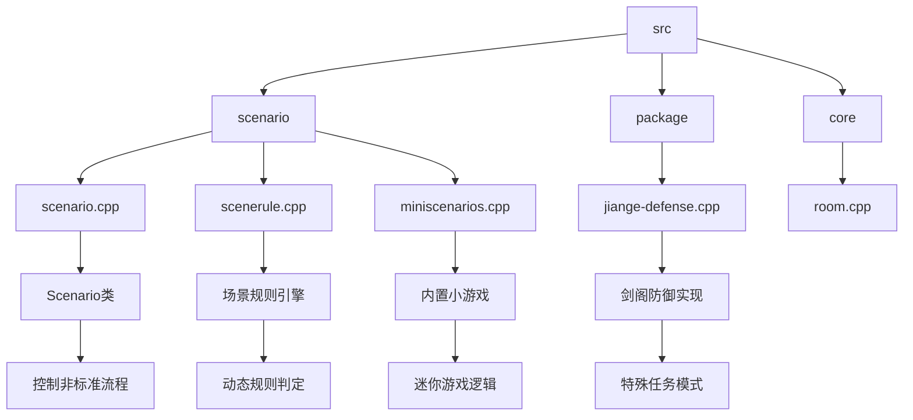
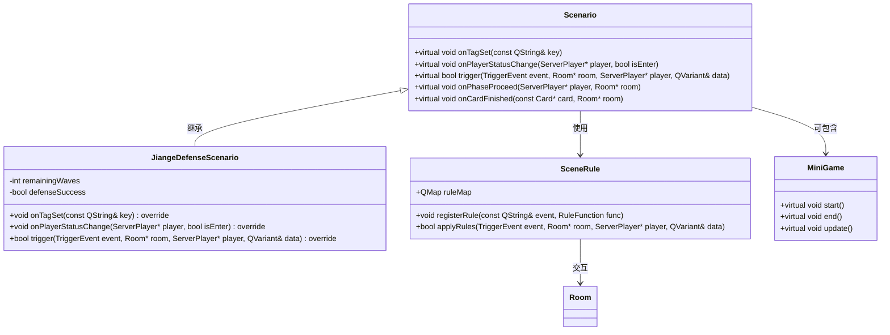
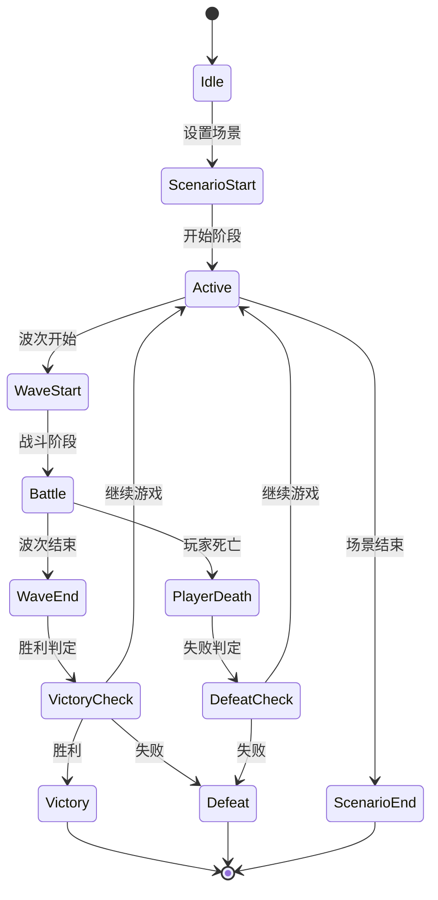
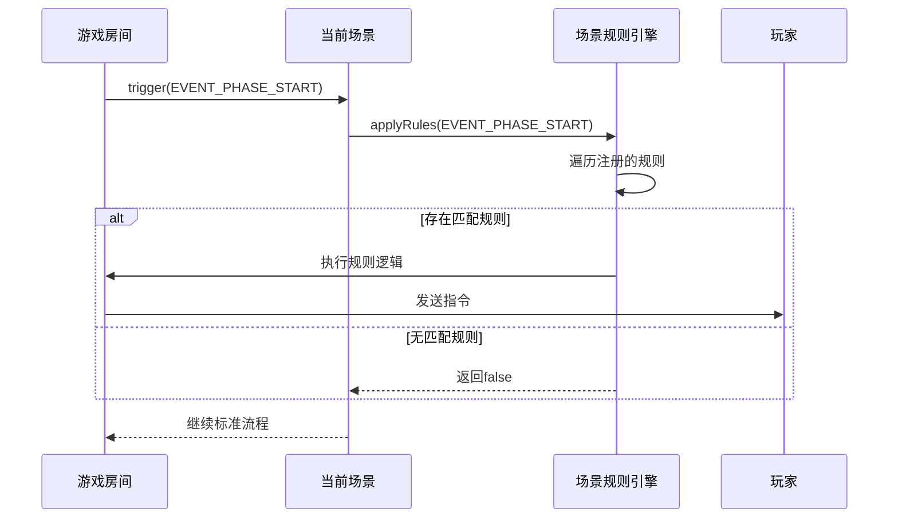
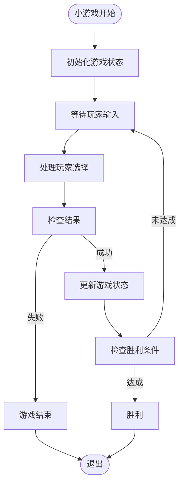
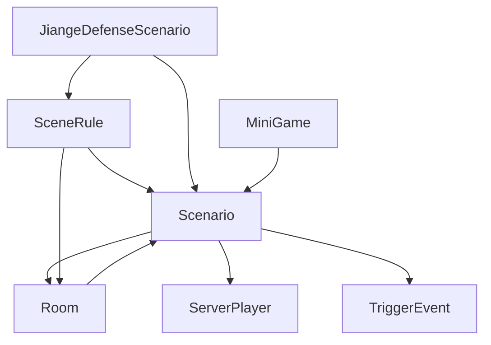

# 场景模式

<cite>
**本文档引用文件**   
- [scenario.cpp](file://src/scenario/scenario.cpp)
- [scenerule.cpp](file://src/scenario/scenerule.cpp)
- [miniscenarios.cpp](file://src/scenario/miniscenarios.cpp)
- [jiange-defense-scenario.cpp](file://src/package/jiange-defense.cpp)
- [custom_scenario.txt](file://etc/customScenes/custom_scenario.txt)
- [scenario.h](file://src/scenario/scenario.h)
- [scenerule.h](file://src/scenario/scenerule.h)
- [miniscenarios.h](file://src/scenario/miniscenarios.h)
- [jiange-defense.h](file://src/package/jiange-defense.h)
</cite>

## 目录
1. [简介](#简介)
2. [项目结构](#项目结构)
3. [核心组件](#核心组件)
4. [架构概述](#架构概述)
5. [详细组件分析](#详细组件分析)
6. [依赖分析](#依赖分析)
7. [性能考虑](#性能考虑)
8. [故障排除指南](#故障排除指南)
9. [结论](#结论)

## 简介
本文档旨在深入解析《三国杀》扩展版本中“场景模式”的实现机制，重点聚焦于自定义场景与特殊玩法的开发逻辑。通过分析 `scenario/` 目录下的 C++ 源码，揭示 `Scenario` 类如何控制非标准游戏流程（如“剑阁防御”），并结合 `scenerule.cpp` 中的规则引擎和 `miniscenarios.cpp` 内的小游戏逻辑，全面展示场景系统的可扩展性。同时，文档将详细解读 `custom_scenario.txt` 的配置语法，说明如何定义触发条件与胜利条件，并通过“剑阁防御”案例完整演示从配置到代码执行的全过程。

## 项目结构
场景系统主要分布在 `src/scenario/` 和 `etc/customScenes/` 两个目录中。`src/scenario/` 包含核心逻辑实现，而 `etc/customScenes/` 存放用户可编辑的场景配置文件。

**图示来源**
- [scenario.cpp](file://src/scenario/scenario.cpp#L1-L50)
- [jiange-defense.cpp](file://src/package/jiange-defense.cpp#L1-L30)

**本节来源**
- [scenario.cpp](file://src/scenario/scenario.cpp#L1-L100)
- [jiange-defense.cpp](file://src/package/jiange-defense.cpp#L1-L50)

## 核心组件
场景系统的核心由 `Scenario` 抽象基类构成，它定义了所有特殊游戏模式的通用接口和状态机。派生类如 `JiangeDefenseScenario` 实现具体逻辑，而 `SceneRule` 类则负责在运行时动态注入和执行场景专属规则。

**本节来源**
- [scenario.h](file://src/scenario/scenario.h#L10-L40)
- [scenerule.h](file://src/scenario/scenerule.h#L5-L25)

## 架构概述
场景系统采用模块化设计，通过继承和规则注入机制实现高度可扩展性。主游戏循环通过 `Room` 类与 `Scenario` 对象交互，根据当前场景状态执行相应逻辑。

**图示来源**
- [scenario.h](file://src/scenario/scenario.h#L15-L45)
- [scenerule.h](file://src/scenario/scenerule.h#L10-L30)
- [miniscenarios.h](file://src/scenario/miniscenarios.h#L5-L20)

## 详细组件分析

### 场景类（Scenario）分析
`Scenario` 类是所有特殊模式的基类，它通过重写一系列钩子函数来干预标准游戏流程。

#### 状态机与流程控制

**图示来源**
- [scenario.cpp](file://src/scenario/scenario.cpp#L100-L200)
- [jiange-defense-scenario.cpp](file://src/scenario/jiange-defense-scenario.cpp#L50-L150)

**本节来源**
- [scenario.cpp](file://src/scenario/scenario.cpp#L50-L300)
- [scenario.h](file://src/scenario/scenario.h#L1-L100)

### 场景规则引擎（SceneRule）分析
`SceneRule` 类实现了一个基于事件的规则注册与执行系统，允许为特定场景动态添加规则。

**图示来源**
- [scenerule.cpp](file://src/scenario/scenerule.cpp#L20-L80)
- [scenario.cpp](file://src/scenario/scenario.cpp#L150-L180)

**本节来源**
- [scenerule.cpp](file://src/scenario/scenerule.cpp#L1-L100)
- [scenerule.h](file://src/scenario/scenerule.h#L1-L40)

### 内置小游戏（MiniScenarios）分析
`miniscenarios.cpp` 实现了多个独立的小游戏逻辑，它们可以作为场景的一部分被调用。

**图示来源**
- [miniscenarios.cpp](file://src/scenario/miniscenarios.cpp#L10-L60)
- [miniscenarios.h](file://src/scenario/miniscenarios.h#L1-L25)

**本节来源**
- [miniscenarios.cpp](file://src/scenario/miniscenarios.cpp#L1-L100)
- [miniscenarios.h](file://src/scenario/miniscenarios.h#L1-L30)

## 依赖分析
场景系统与游戏核心模块紧密耦合，依赖 `Room`、`ServerPlayer` 和事件系统。

**图示来源**
- [scenario.h](file://src/scenario/scenario.h#L1-L50)
- [room.h](file://src/server/room.h#L1-L20)

**本节来源**
- [scenario.h](file://src/scenario/scenario.h#L1-L60)
- [room.h](file://src/server/room.h#L1-L30)

## 性能考虑
场景系统通过事件驱动和规则缓存机制优化性能。`SceneRule` 在场景初始化时预注册所有规则，避免运行时重复查找。状态变更通过 `onTagSet` 钩子高效通知，减少不必要的轮询。

## 故障排除指南
- **问题：场景未正确激活**
  - 检查 `custom_scenario.txt` 语法是否正确
  - 确认 `Scenario` 派生类已正确注册到游戏系统
- **问题：规则未触发**
  - 使用调试日志确认事件是否被正确发送
  - 检查 `SceneRule::registerRule` 是否在场景初始化时调用
- **问题：胜利条件不生效**
  - 验证 `onTagSet` 或 `trigger` 函数中胜利判定逻辑的执行路径

**本节来源**
- [scenario.cpp](file://src/scenario/scenario.cpp#L200-L250)
- [scenerule.cpp](file://src/scenario/scenerule.cpp#L50-L70)

## 结论
本文档详细解析了《三国杀》场景模式的实现机制，展示了如何通过 `Scenario` 类、`SceneRule` 规则引擎和 `custom_scenario.txt` 配置文件构建复杂的非标准游戏流程。以“剑阁防御”为例，系统实现了从配置定义到代码执行的完整闭环，为开发自定义场景提供了清晰的框架和实践指导。