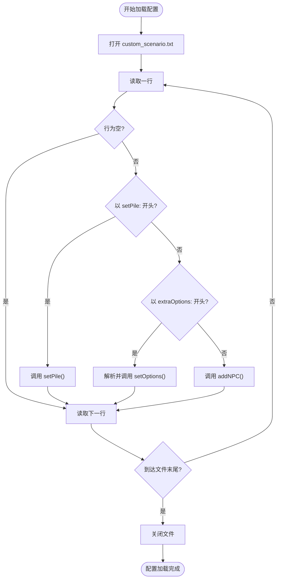

# 自定义场景配置

<cite>
**本文档引用文件**  
- [custom_scenario.txt](file://etc/customScenes/custom_scenario.txt)
- [miniscenarios.h](file://src/scenario/miniscenarios.h#L37-L100)
- [miniscenarios.cpp](file://src/scenario/miniscenarios.cpp#L328-L381)
- [scenario.cpp](file://src/scenario/scenario.cpp#L0-L87)
- [scenerule.cpp](file://src/scenario/scenerule.cpp#L0-L54)
- [sgs_ex.lua](file://lua/sgs_ex.lua#L812-L840)
- [customassigndialog.cpp](file://src/dialog/customassigndialog.cpp#L1188-L1239)
</cite>

## 目录
1. [简介](#简介)
2. [项目结构](#项目结构)
3. [核心组件](#核心组件)
4. [架构概述](#架构概述)
5. [详细组件分析](#详细组件分析)
6. [依赖分析](#依赖分析)
7. [性能考虑](#性能考虑)
8. [故障排除指南](#故障排除指南)
9. [结论](#结论)

## 简介
本文档全面讲解《三国杀》自定义场景的配置方法与执行流程，基于 `custom_scenario.txt` 文件格式和 `scenario.cpp` 的解析逻辑。文档详细描述了自定义场景的语法结构、加载机制、规则引擎对接方式，并提供完整配置示例与调试建议，旨在帮助开发者和高级玩家理解并创建复杂的自定义游戏模式。

## 项目结构
自定义场景功能主要分布在 `etc/customScenes` 配置目录与 `src/scenario` 源码模块中。配置文件以纯文本形式存储，由 C++ 代码动态加载并转换为运行时对象。系统通过 Lua 脚本扩展支持更复杂的逻辑，整体结构清晰，遵循配置与代码分离的设计原则。


**图示来源**
- [custom_scenario.txt](file://etc/customScenes/custom_scenario.txt)
- [miniscenarios.cpp](file://src/scenario/miniscenarios.cpp#L328-L381)
- [scenario.cpp](file://src/scenario/scenario.cpp#L0-L87)

**本节来源**
- [miniscenarios.cpp](file://src/scenario/miniscenarios.cpp#L328-L381)
- [project_structure](file://#L1-L10)

## 核心组件
自定义场景的核心由 `Scenario` 基类、`MiniSceneRule` 规则处理器和 `CustomScenario` 具体实现构成。`Scenario` 定义了游戏场景的基本接口，如角色分配、玩家数量获取等。`MiniSceneRule` 继承自 `ScenarioRule`，负责解析配置文件并管理 NPC 特征、卡牌堆设置等。`CustomScenario` 是预定义的自定义场景实例，通过 `setupCustom(NULL)` 加载默认配置文件。

**本节来源**
- [miniscenarios.h](file://src/scenario/miniscenarios.h#L37-L100)
- [scenario.cpp](file://src/scenario/scenario.cpp#L0-L87)

## 架构概述
系统采用分层架构，上层为配置文件，中层为 C++ 解析与规则引擎，下层为游戏核心逻辑。当用户启动自定义场景时，`CustomAssignDialog` 负责加载 `custom_scenario.txt` 文件，`MiniSceneRule` 的 `loadSetting` 方法解析文本内容，将角色、卡牌、特殊选项等信息填充到内存对象中。随后，`assign` 方法根据解析结果分配武将与角色，最终由 `GameRule` 子系统执行游戏流程。


**图示来源**
- [customassigndialog.cpp](file://src/dialog/customassigndialog.cpp#L1188-L1239)
- [miniscenarios.cpp](file://src/scenario/miniscenarios.cpp#L328-L381)
- [scenario.cpp](file://src/scenario/scenario.cpp#L0-L87)

## 详细组件分析

### 配置文件语法分析
`custom_scenario.txt` 是自定义场景的核心配置文件，其语法简洁但功能强大。每行代表一个配置指令，主要分为三类：

1.  **NPC 定义**：格式为 `general:武将名 general2:副将名 role:角色`，用于定义一个 NPC 玩家。`role:unknown` 表示角色未知。
2.  **卡牌堆设置**：以 `setPile:` 开头，后接用空格分隔的卡牌 ID 列表，用于自定义游戏开始时的牌堆。
3.  **特殊选项**：以 `extraOptions:` 开头，后接多个 `key:value` 对，用空格分隔。例如 `randomRoles:true` 可开启随机角色分配。

当前示例配置：
```
general:select general2:select role:unknown 
general:select general2:select role:unknown starter:true
```
定义了两个 NPC，均使用“选择”作为主副将，角色未知，第二个玩家被标记为起始玩家。

#### 配置解析流程图


**图示来源**
- [miniscenarios.cpp](file://src/scenario/miniscenarios.cpp#L328-L381)
- [custom_scenario.txt](file://etc/customScenes/custom_scenario.txt)

**本节来源**
- [miniscenarios.cpp](file://src/scenario/miniscenarios.cpp#L328-L381)
- [custom_scenario.txt](file://etc/customScenes/custom_scenario.txt)

### 规则引擎对接分析
`SceneRule` 类是游戏规则的核心，它继承自 `GameRule` 并在 `GameStart` 事件时被触发。`effect` 方法会遍历所有启用的扩展包，为符合条件的玩家（如场景扩展）添加对应的技能。`MiniSceneRule` 重写了 `assign` 方法，根据配置文件中的 `players` 列表来精确分配武将和角色，取代了基类 `Scenario` 的随机分配逻辑。


**图示来源**
- [scenario.cpp](file://src/scenario/scenario.cpp#L0-L87)
- [miniscenarios.h](file://src/scenario/miniscenarios.h#L37-L100)
- [scenerule.cpp](file://src/scenario/scenerule.cpp#L0-L54)

**本节来源**
- [scenario.cpp](file://src/scenario/scenario.cpp#L0-L87)
- [scenerule.cpp](file://src/scenario/scenerule.cpp#L0-L54)

## 依赖分析
自定义场景模块依赖于核心引擎（`engine.h`）、游戏房间（`room.h`）和配置系统（`settings.h`）。它通过 `Sanguosha` 全局对象获取武将和技能信息，并通过 `Room` 对象与游戏状态进行交互。UI 层的 `CustomAssignDialog` 依赖于此模块来加载和保存配置。


**图示来源**
- [miniscenarios.h](file://src/scenario/miniscenarios.h#L37-L100)
- [customassigndialog.cpp](file://src/dialog/customassigndialog.cpp#L1188-L1239)

**本节来源**
- [miniscenarios.h](file://src/scenario/miniscenarios.h#L37-L100)
- [customassigndialog.cpp](file://src/dialog/customassigndialog.cpp#L1188-L1239)

## 性能考虑
配置文件的解析是一次性操作，发生在游戏开始前，对运行时性能影响极小。`QTextStream` 逐行读取文件，内存占用低。`QMap` 和 `QList` 数据结构提供了高效的查找和遍历性能。整体设计轻量，适合快速加载和启动。

## 故障排除指南
- **问题：游戏无法启动，提示找不到配置文件。**  
  **解决方案**：检查 `etc/customScenes/custom_scenario.txt` 文件是否存在且路径正确。确保文件编码为 UTF-8。

- **问题：NPC 的武将或角色未按预期分配。**  
  **解决方案**：检查 `custom_scenario.txt` 文件中的 `general:` 和 `role:` 指令拼写是否正确。确认武将名称与游戏内 ID 完全一致。

- **问题：特殊选项（如随机角色）未生效。**  
  **解决方案**：检查 `extraOptions:` 后的 `key:value` 对是否被正确解析。可在 `miniscenarios.cpp` 的 `loadSetting` 方法中添加日志输出进行调试。

**本节来源**
- [miniscenarios.cpp](file://src/scenario/miniscenarios.cpp#L328-L381)
- [customassigndialog.cpp](file://src/dialog/customassigndialog.cpp#L1188-L1239)

## 结论
自定义场景系统通过简洁的文本配置和灵活的 C++ 逻辑，为《三国杀》提供了强大的场景定制能力。开发者可以通过修改 `custom_scenario.txt` 文件来创建各种挑战模式，如“五虎将挑战”或“单挑模式”。理解 `MiniSceneRule` 的解析流程和 `Scenario` 的分配机制是成功配置的关键。该系统设计良好，易于扩展和维护。