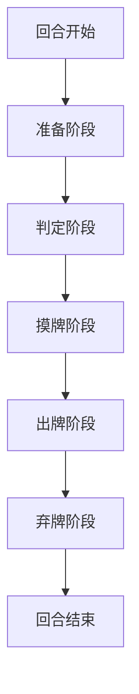
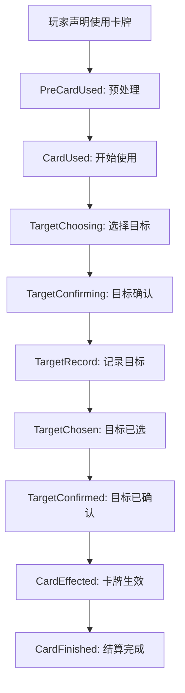
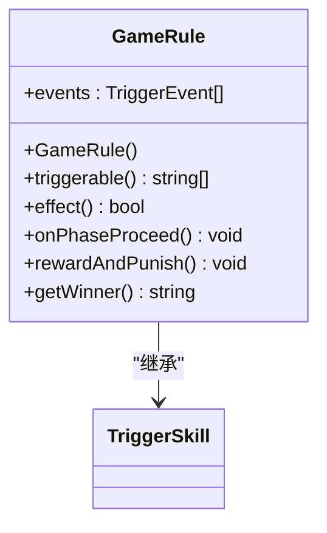

# 基础规则

<cite>
**本文档引用文件**   
- [hegemony.html](file://rule/hegemony.html)
- [rule1-card.html](file://rule/rule1-card.html)
- [rule2-wording.html](file://rule/rule2-wording.html)
- [rule3-extras.html](file://rule/rule3-extras.html)
- [gamerule.cpp](file://src/server/gamerule.cpp)
</cite>

## 目录
1. [引言](#引言)
2. [游戏目标与胜利条件](#游戏目标与胜利条件)
3. [游戏准备](#游戏准备)
4. [回合流程与阶段划分](#回合流程与阶段划分)
5. [卡牌类型与使用规则](#卡牌类型与使用规则)
6. [核心机制详解](#核心机制详解)
7. [游戏状态机与代码实现](#游戏状态机与代码实现)
8. [奖惩机制](#奖惩机制)
9. [结论](#结论)

## 引言

本文档旨在系统化阐述《三国杀》霸业模式（国战模式）的核心游戏规则。文档基于项目 `rule/` 目录下的 HTML 规则文档，并结合 `src/server/gamerule.cpp` 中的 C++ 代码实现，深入解析游戏的流程、机制与状态转换逻辑。目标是为开发者提供一份详尽的规则与代码映射指南，帮助理解如何在代码层面建模和执行复杂的卡牌游戏规则。

## 游戏目标与胜利条件

### 游戏目标

在霸业模式中，玩家的游戏目标由其角色的势力决定：
*   **普通势力**：消灭所有与自己势力不同的角色。
*   **野心家**：消灭所有其他角色，成为唯一的生还者。

**Section sources**
- [hegemony.html](file://rule/hegemony.html#L10-L12)

### 胜利条件

游戏结束的判定有严格的条件：
1.  **前提**：全场所有角色都必须已确定势力（即至少明置了一张武将牌）。
2.  **判定**：当全场只剩下一种势力的角色存活时，该势力的所有角色（包括未确定势力但与之同势力的角色）获胜。

**Section sources**
- [hegemony.html](file://rule/hegemony.html#L110-L113)

## 游戏准备

### 武将选择

1.  **发牌**：每位玩家随机获得7张武将牌（9-12人游戏时为5张）。
2.  **选择**：玩家从中选择两张**势力相同**的武将牌。
3.  **放置**：将选中的两张武将牌背面朝上放置，称为“暗置”。
4.  **主副将**：靠近体力牌的武将牌为主将，另一个为副将。玩家在游戏中由这两张武将牌共同构成。

**Section sources**
- [hegemony.html](file://rule/hegemony.html#L17-L21)

### 体力牌与起始手牌

1.  **体力上限**：角色的体力上限为两张武将牌上完整阴阳鱼的数量之和。两个单独的阴阳鱼可以组成一个完整的阴阳鱼。
2.  **体力牌**：根据计算出的体力上限，放置对应的体力牌。
3.  **起始手牌**：将游戏牌洗混后，随机分给每位玩家4张作为起始手牌。
4.  **牌堆**：剩余的牌置于中央作为牌堆。

**Section sources**
- [hegemony.html](file://rule/hegemony.html#L22-L33)

## 回合流程与阶段划分

游戏由起始玩家开始，按逆时针方向以回合为单位进行。每个玩家的回合包含多个阶段，其执行顺序由 `gamerule.cpp` 中的状态机控制。

### 回合阶段流程图



**Diagram sources**
- [gamerule.cpp](file://src/server/gamerule.cpp#L168-L250)

### 阶段详解

#### 准备阶段 (Start)

*   **时机**：回合开始时。
*   **主要行动**：
    *   玩家可以在此阶段将暗置的武将牌明置。
    *   发起“阵法召唤”（如果拥有阵法技）。
*   **代码实现**：在 `gamerule.cpp` 的 `onPhaseProceed` 函数中，`Player::Start` 阶段目前为空，但 `EventPhaseStart` 事件会触发相关逻辑。

**Section sources**
- [hegemony.html](file://rule/hegemony.html#L43)
- [rule2-wording.html](file://rule/rule2-wording.html#L108-L110)
- [gamerule.cpp](file://src/server/gamerule.cpp#L178)

#### 判定阶段 (Judge)

*   **时机**：准备阶段之后。
*   **主要行动**：依次结算角色判定区内的延时类锦囊牌（如【乐不思蜀】、【兵粮寸断】、【闪电】）。
*   **代码实现**：`gamerule.cpp` 中的 `onPhaseProceed` 函数处理此阶段。它会遍历玩家的判定区，对每张延时锦囊牌执行 `cardEffect`。

```cpp
// gamerule.cpp: onPhaseProceed 函数片段
case Player::Judge: {
    QList<const Card *> tricks = player->getJudgingArea();
    while (!tricks.isEmpty() && player->isAlive()) {
        const Card *trick = tricks.takeLast();
        // ... 移动卡牌到桌面
        bool on_effect = room->cardEffect(trick, NULL, player); // 执行卡牌效果
        if (!on_effect)
            trick->onNullified(player);
        room->freeChain();
    }
    break;
}
```

**Section sources**
- [gamerule.cpp](file://src/server/gamerule.cpp#L180-L193)

#### 摸牌阶段 (Draw)

*   **时机**：判定阶段之后。
*   **主要行动**：玩家从牌堆摸两张牌。在游戏的第一回合，起始玩家额外摸一张牌（共三张）。
*   **代码实现**：`onPhaseProceed` 函数处理此阶段。通过 `room->getThread()->trigger(DrawNCards)` 触发事件，并最终调用 `player->drawCards(num)` 执行摸牌。

```cpp
// gamerule.cpp: onPhaseProceed 函数片段
case Player::Draw: {
    int num = 2 + player->getMark("JieyueExtraDraw")*3; // 基础2张
    // ... 处理第一回合额外摸牌
    if (num > 0)
        player->drawCards(num); // 执行摸牌
    break;
}
```

**Section sources**
- [gamerule.cpp](file://src/server/gamerule.cpp#L195-L213)

#### 出牌阶段 (Play)

*   **时机**：摸牌阶段之后。
*   **主要行动**：玩家可以使用任意数量的手牌（基本牌、锦囊牌、装备牌），直到主动结束此阶段。
*   **代码实现**：`onPhaseProceed` 函数通过一个 `while` 循环实现。它调用 `room->activate(player, card_use)` 激活玩家，等待玩家选择要使用的牌。如果选择了牌，则调用 `room->useCard(card_use)` 执行使用逻辑。

```cpp
// gamerule.cpp: onPhaseProceed 函数片段
case Player::Play: {
    while (player->isAlive()) {
        CardUseStruct card_use;
        room->activate(player, card_use); // 激活玩家，等待操作
        if (card_use.card != NULL) {
            room->useCard(card_use); // 使用卡牌
            room->freeChain();
        } else
            break; // 玩家选择结束出牌阶段
    }
    break;
}
```

**Section sources**
- [gamerule.cpp](file://src/server/gamerule.cpp#L215-L225)

#### 弃牌阶段 (Discard)

*   **时机**：出牌阶段之后。
*   **主要行动**：如果玩家的手牌数超过其当前体力值，则必须弃置多余的牌，直到手牌数等于体力值。
*   **代码实现**：`onPhaseProceed` 函数计算需要弃置的牌数 `discard_num`，然后调用 `room->askForDiscard` 向玩家发起弃牌请求。

```cpp
// gamerule.cpp: onPhaseProceed 函数片段
case Player::Discard: {
    int discard_num = player->getHandcardNum() - player->getMaxCards();
    if (discard_num > 0)
        room->askForDiscard(player, "gamerule", discard_num, discard_num);
    break;
}
```

**Section sources**
- [gamerule.cpp](file://src/server/gamerule.cpp#L227-L234)

## 卡牌类型与使用规则

### 卡牌类型

根据 `rule1-card.html`，游戏牌共109张，分为三类：

| 类型 | 数量 | 示例 |
| :--- | :--- | :--- |
| **基本牌** | 54张 | 【杀】、【闪】、【桃】、【酒】 |
| **锦囊牌** | 34张 | 【无懈可击】、【桃园结义】、【铁索连环】 |
| **装备牌** | 21张 | 【诸葛连弩】、【八卦阵】、【赤兔】 |

**Section sources**
- [rule1-card.html](file://rule/rule1-card.html#L10-L78)

### 卡牌使用流程

一张卡牌从使用到结算的完整流程由 `gamerule.cpp` 中的 `CardUsed` 事件处理，其逻辑如下：



**Diagram sources**
- [gamerule.cpp](file://src/server/gamerule.cpp#L370-L450)

## 核心机制详解

### 明置与暗置

*   **暗置**：武将牌背面向上。处于暗置状态的武将牌没有技能、性别和势力。
*   **明置**：武将牌正面向上。明置后，角色获得该武将牌的技能、性别，并确定势力。
*   **明置时机**：仅限两个时机：
    1.  回合开始阶段开始时。
    2.  发动武将牌技能时。
*   **代码体现**：`gamerule.cpp` 中的 `GeneralShown` 事件会触发 `getWinner` 函数进行胜利判定，这表明明置状态是影响游戏核心逻辑的关键变量。

**Section sources**
- [hegemony.html](file://rule/hegemony.html#L44-L55)
- [rule2-wording.html](file://rule/rule2-wording.html#L60-L72)
- [gamerule.cpp](file://src/server/gamerule.cpp#L860-L862)

### 野心家规则

当一个势力的角色数量超过总人数的一半时，该势力后续明置的角色将成为“野心家”。
*   **触发**：一名角色明置武将牌时，若其势力角色数已过半，则其成为野心家。
*   **身份**：野心家为独立势力，与其他所有角色（包括其他野心家）均为敌对关系。
*   **君主影响**：当同势力的君主武将牌明置后，该势力的野心家会恢复为原势力。

**Section sources**
- [hegemony.html](file://rule/hegemony.html#L65-L75)

### 珠联璧合

*   **定义**：特定武将组合之间的特殊联系。
*   **触发时机**：当拥有珠联璧合关系的两张武将牌**第一次均明置**时。
*   **效果**：立即选择摸两张牌或回复1点体力。
*   **结算优先级**：遵循“插入结算”原则，优先于当前正在进行的事件结算。

**Section sources**
- [hegemony.html](file://rule/hegemony.html#L100-L105)
- [rule2-wording.html](file://rule/rule2-wording.html#L10-L35)

## 游戏状态机与代码实现

`gamerule.cpp` 是整个游戏规则的核心，它通过一个全局的 `TriggerSkill` 来监听和处理所有游戏事件。

### 状态机核心类



**Diagram sources**
- [gamerule.cpp](file://src/server/gamerule.cpp#L140-L165)

### 关键函数分析

#### `effect` 函数

这是状态机的主入口，通过 `switch` 语句处理所有注册的事件。

```cpp
// gamerule.cpp: effect 函数片段
bool GameRule::effect(TriggerEvent triggerEvent, Room *room, ServerPlayer *player, QVariant &data, ServerPlayer *) const
{
    // ... 全局事件处理 (GameStart)
    switch (triggerEvent) {
    case TurnStart: {
        // 处理回合开始
        break;
    }
    case EventPhaseStart: {
        // 处理阶段开始
        break;
    }
    case DamageDone: {
        // 处理伤害完成
        room->applyDamage(player, damage);
        break;
    }
    case BuryVictim: {
        // 处理角色死亡
        rewardAndPunish(killer, player);
        break;
    }
    case GameOverJudge: {
        // 判定游戏结束
        QString winner = getWinner(player);
        if (!winner.isNull()) {
            room->gameOver(winner);
            return true;
        }
        break;
    }
    // ... 其他事件
    }
    return false;
}
```

**Section sources**
- [gamerule.cpp](file://src/server/gamerule.cpp#L252-L858)

#### `getWinner` 函数

该函数实现了复杂的胜利条件判定逻辑，是游戏结束的核心。

```cpp
// gamerule.cpp: getWinner 函数片段
QString GameRule::getWinner(ServerPlayer *victim) const
{
    Room *room = victim->getRoom();
    QList<ServerPlayer *> players = room->getAlivePlayers();
    // 1. 如果仅剩一名玩家，则其势力获胜
    if (players.length() == 1) {
        // ... 收集所有同势力玩家
        return winners.join("+");
    }
    // 2. 检查是否所有存活玩家都为同一势力
    bool has_diff_kingdoms = false;
    // ... 遍历所有玩家对，检查是否存在敌对关系
    if (has_diff_kingdoms) return QString(); // 存在敌对，游戏继续
    // 3. 检查野心家规则
    if (room->doCareeristRule()) return QString();
    // 4. 所有存活玩家为友方，游戏结束
    // ... 收集所有同势力玩家
    return winners.join("+");
}
```

**Section sources**
- [gamerule.cpp](file://src/server/gamerule.cpp#L880-L950)

## 奖惩机制

当一名角色死亡时，击杀者会根据与被击杀者的关系获得奖励或受到惩罚。

### 奖惩规则

*   **击杀同势力角色**：须弃置所有手牌和装备区的牌。
*   **击杀不同势力角色**：从牌堆摸取等同于该势力存活人数的牌（包括刚击杀的角色）。

### 代码实现

`rewardAndPunish` 函数直接实现了上述规则。

```cpp
// gamerule.cpp: rewardAndPunish 函数
void GameRule::rewardAndPunish(ServerPlayer *killer, ServerPlayer *victim) const
{
    if (!killer->isFriendWith(victim)) {
        // 击杀不同势力
        int n = 1; // 包括刚击杀的victim
        foreach (ServerPlayer *p, room->getOtherPlayers(victim)) {
            if (victim->isFriendWith(p)) ++n; // 计算同势力存活人数
        }
        killer->drawCards(n);
    } else {
        // 击杀同势力
        killer->throwAllHandCardsAndEquips(); // 弃置所有牌
    }
}
```

**Section sources**
- [hegemony.html](file://rule/hegemony.html#L85-L96)
- [gamerule.cpp](file://src/server/gamerule.cpp#L864-L880)

## 结论

本文档详细解析了《三国杀》霸业模式的核心规则，并通过 `gamerule.cpp` 的代码实现，展示了如何将复杂的卡牌游戏规则转化为可执行的程序逻辑。游戏通过一个中心化的状态机（`GameRule` 类）来管理回合流程、阶段切换、卡牌结算和胜利判定。理解 `effect` 函数中的事件处理流程和 `getWinner` 函数的复杂判定逻辑，是掌握整个游戏规则引擎的关键。这份文档为开发者提供了规则与代码之间的清晰映射，有助于进行规则修改、功能扩展和问题调试。