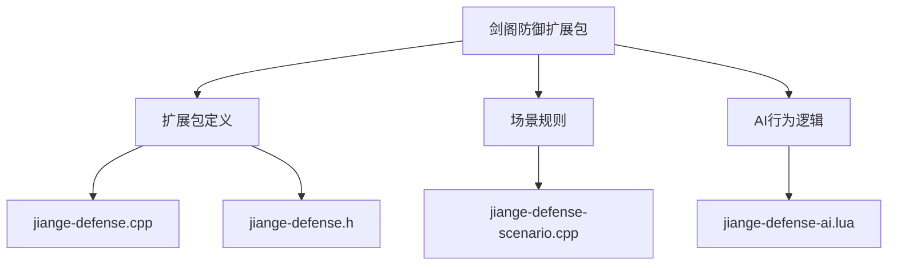
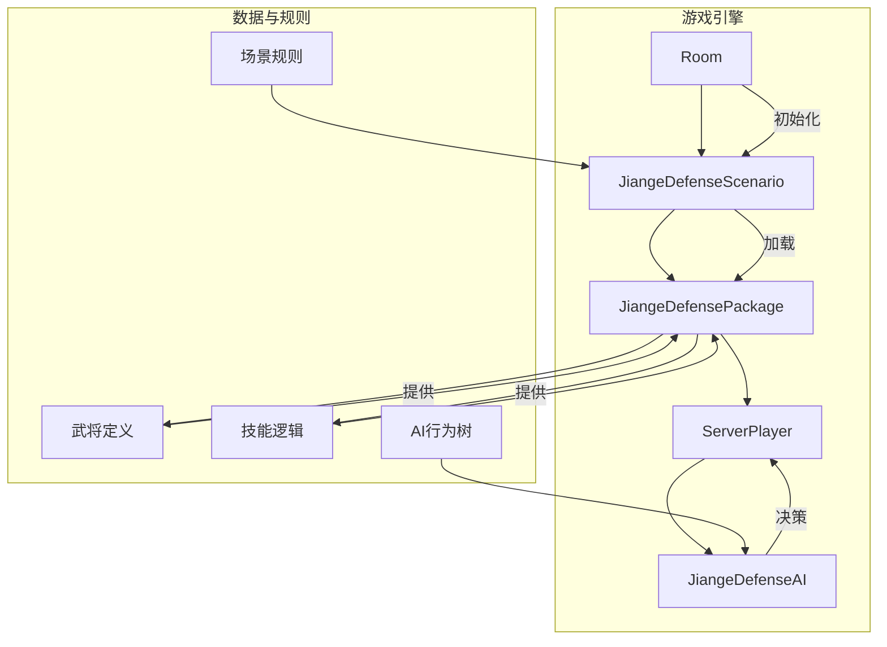
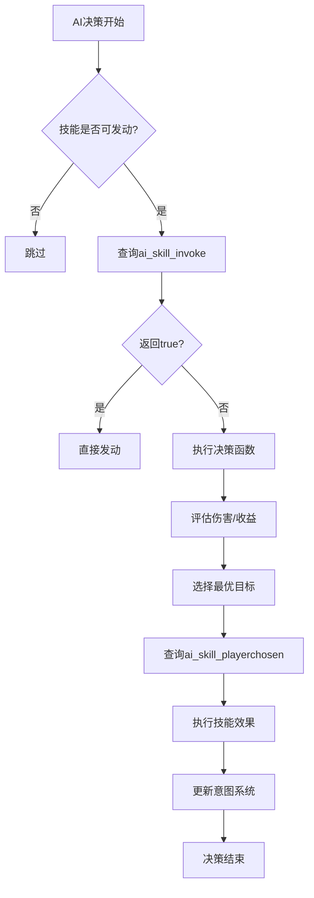
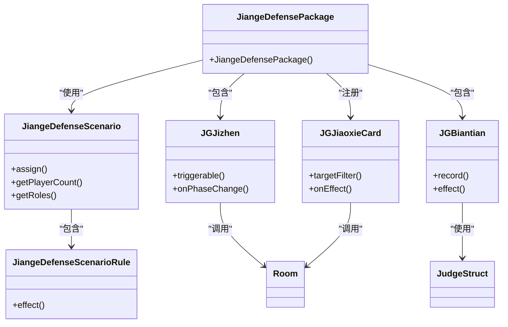

# 剑阁防御扩展包

<cite>
**本文档引用文件**  
- [jiange-defense.cpp](file://src/package/jiange-defense.cpp#L0-L2409)
- [jiange-defense.h](file://src/package/jiange-defense.h#L0-L58)
- [jiange-defense-scenario.cpp](file://src/scenario/jiange-defense-scenario.cpp#L0-L175)
- [jiange-defense-ai.lua](file://lua/ai/jiange-defense-ai.lua#L0-L507)
</cite>

## 目录
1. [引言](#引言)
2. [项目结构分析](#项目结构分析)
3. [核心组件解析](#核心组件解析)
4. [架构概览](#架构概览)
5. [详细组件分析](#详细组件分析)
6. [依赖关系分析](#依赖关系分析)
7. [性能考量](#性能考量)
8. [故障排查指南](#故障排查指南)
9. [结论](#结论)

## 引言
“剑阁防御”是《三国杀·霸业》中的一个特殊对抗模式扩展包，通过自定义武将、技能机制与场景规则，构建了以蜀魏对抗为核心的攻防博弈系统。该模式融合了传统卡牌玩法与策略塔防元素，引入“机关”“鬼将”“机械”等特殊角色类型，并通过独特的胜利条件、资源生成与防御工事机制，重塑了标准游戏流程。本文档系统化解析 `JiangeDefensePackage` 类的实现机制，重点阐述其如何与 `scenario` 系统协同工作，构建完整的攻防对抗模式，并提供开发类似场景的技术指南。

## 项目结构分析
剑阁防御扩展包的实现分布在多个模块中，主要包括：
- **C++ 扩展包定义**：位于 `src/package/jiange-defense.cpp` 和 `.h`，定义了所有武将、技能与卡牌。
- **场景规则定义**：位于 `src/scenario/jiange-defense-scenario.cpp`，负责初始化8人对战、角色分配与阵营设定。
- **AI 行为逻辑**：位于 `lua/ai/jiange-defense-ai.lua`，定义了AI在该模式下的决策树与行为偏好。

该结构体现了游戏核心逻辑（C++）与可配置规则（Lua）的分层设计，便于扩展与维护。



**图示来源**
- [jiange-defense.cpp](file://src/package/jiange-defense.cpp#L0-L2409)
- [jiange-defense.h](file://src/package/jiange-defense.h#L0-L58)
- [jiange-defense-scenario.cpp](file://src/scenario/jiange-defense-scenario.cpp#L0-L175)
- [jiange-defense-ai.lua](file://lua/ai/jiange-defense-ai.lua#L0-L507)

**本节来源**
- [jiange-defense.cpp](file://src/package/jiange-defense.cpp#L0-L2409)
- [jiange-defense-scenario.cpp](file://src/scenario/jiange-defense-scenario.cpp#L0-L175)
- [jiange-defense-ai.lua](file://lua/ai/jiange-defense-ai.lua#L0-L507)

## 核心组件解析
### JiangeDefensePackage 类
`JiangeDefensePackage` 是扩展包的核心类，继承自 `Package`，负责注册所有与“剑阁防御”模式相关的武将、技能与卡牌。

**类结构**
```cpp
class JiangeDefensePackage : public Package
{
    Q_OBJECT

public:
    JiangeDefensePackage();
};
```

该类在构造函数中实例化所有武将，并为其分配专属技能。武将分为两大阵营：
- **蜀汉阵营**：包括 `jg_liubei`、`jg_guanyu`、`jg_zhaoyun`、`jg_zhuge`、`jg_yueying`、`jg_pangtong` 及四神兽机械将（青龙、白虎、朱雀、玄武）。
- **曹魏阵营**：包括 `jg_xiahoudun`、`jg_zhangliao`、`jg_caozhen`、`jg_xiahou`、`jg_sima`、`jg_zhanghe` 及四凶兽机械将（赑屃、狻猊、饕餮、睚眦）。

此外，扩展包还注册了两个自定义卡牌类：`JGKedingCard` 和 `JGJiaoxieCard`，用于实现特定技能效果。

**本节来源**
- [jiange-defense.h](file://src/package/jiange-defense.h#L49-L55)
- [jiange-defense.cpp](file://src/package/jiange-defense.cpp#L2295-L2405)

### JiangeDefenseScenario 类
`JiangeDefenseScenario` 类继承自 `Scenario`，定义了该模式的特殊游戏规则与初始化流程。

#### 核心功能
1. **角色分配 (`assign` 方法)**：
   - 随机为8名玩家分配阵营（蜀或魏）。
   - 为每名玩家随机分配角色类型：**人类**、**鬼将** 或 **机械**。
   - 人类玩家从对应阵营的普通武将池中选择；鬼将和机械玩家则直接获得预设的特殊武将。
   - 保证每个阵营有4名玩家，且角色类型分布均衡。

2. **胜利条件 (`getRoles` 方法)**：
   - 返回 `"ZNNNNNNN"`，表示这是一个8人游戏，其中1名主公（Z）和7名内奸（N），但实际玩法中，阵营对抗取代了传统的身份局胜利条件。

3. **玩家数量 (`getPlayerCount` 方法)**：
   - 固定为8人。

4. **初始武将展示 (`JiangeDefenseScenarioRule`)**：
   - 游戏开始时，自动展示所有以 `jg_` 开头的武将，无需玩家手动亮将。

#### 特殊武将生成
该类提供了四个私有方法，用于随机生成特定阵营的鬼将或机械将：
- `getRandomWeiGhost()` / `getRandomShuGhost()`
- `getRandomWeiMachine()` / `getRandomShuMachine()`

这些方法维护了各自的武将名称列表，并通过随机索引返回结果。

**本节来源**
- [jiange-defense-scenario.cpp](file://src/scenario/jiange-defense-scenario.cpp#L0-L175)

## 架构概览
剑阁防御模式的架构是一个典型的“扩展包-场景-AI”三层结构。



**图示来源**
- [jiange-defense.cpp](file://src/package/jiange-defense.cpp#L0-L2409)
- [jiange-defense-scenario.cpp](file://src/scenario/jiange-defense-scenario.cpp#L0-L175)
- [jiange-defense-ai.lua](file://lua/ai/jiange-defense-ai.lua#L0-L507)

**本节来源**
- [jiange-defense.cpp](file://src/package/jiange-defense.cpp#L0-L2409)
- [jiange-defense-scenario.cpp](file://src/scenario/jiange-defense-scenario.cpp#L0-L175)

## 详细组件分析
### 技能机制分析
剑阁防御模式的核心玩法由一系列独特的技能驱动，这些技能在 `jiange-defense.cpp` 中定义。

#### 1. 蜀汉阵营核心技能
- **JGJizhen (集阵)**：刘备的技能。在结束阶段，若存在受伤的友方角色，则强制触发，所有受伤的友方角色各摸一张牌。这是一个团队增益技能。
- **JGBiantian (变天)**：诸葛亮的技能。在回合开始时，进行一次判定。若为红色，对所有敌方角色施加“狂风”标记（受到的火焰伤害+1）；若为黑色，对所有己方角色施加“大雾”标记（防止非雷电伤害）。
- **JGGongshen (攻神)**：黄月英的技能。在结束阶段，可选择一名带有“机械”标签的角色。若为友方，则回复1点体力；若为敌方，则造成1点火焰伤害。
- **JGQiwu (祈雾)**：庞统的技能。当使用或打出梅花牌时，可令一名受伤的友方角色回复1点体力。

#### 2. 曹魏阵营核心技能
- **JGBashi (八石)**：夏侯惇的技能。当成为【杀】或非延时锦囊的目标时，若判定有效，可选择发动技能，强制跳过摸牌阶段。
- **JGJiaoxie (绞械)**：张辽的技能。可主动发动，对一名带有“机械”标签且非空城的敌方角色使用，弃置其一张手牌。
- **JGKonghun (控魂)**：司马懿的技能。在回合开始时，可选择一名其他角色。若该角色体力值小于0，则强制发动；否则，AI会根据策略判断是否发动。

#### 3. 机械将专属技能
- **JGJiguan (机关)**：所有机械将的通用技能。当成为【乐不思蜀】的目标时，可强制取消此乐不思蜀对其的影响。
- **JGMojian (魔箭)**：青龙的技能。在出牌阶段，强制发动，对所有非友方且未被【闪】的目标使用【万箭齐发】。
- **JGZhenwei (镇卫)**：白虎的技能。距离修正技能，若目标有同阵营且已亮明“镇卫”技能的兄弟角色，则距离+1。
- **JGTianyun (天陨)**：朱雀的技能。在结束阶段，可选择一名敌方角色并失去1点体力，然后对该角色造成2点火焰伤害。

### AI 行为树设计
`jiange-defense-ai.lua` 文件定义了AI在该模式下的行为逻辑，主要通过覆盖 `sgs.ai_skill_invoke` 和 `sgs.ai_skill_playerchosen` 等全局表来实现。

#### 1. 技能发动决策 (`ai_skill_invoke`)
- 大多数技能（如 `jgjizhen`, `jgbiantian`）的 `ai_skill_invoke` 被设为 `true`，表示AI在满足条件时会自动发动。
- 复杂技能（如 `jgbashi`, `jgdanjing`）则通过函数实现更精细的判断，例如评估伤害有效性、是否需要卖血等。

#### 2. 目标选择策略 (`ai_skill_playerchosen`)
- AI通过 `ai_skill_playerchosen` 函数决定技能的目标。例如：
  - `jggongshen`：优先选择带有“藤甲”或“狂风”标记的敌方机械将，或需要回复的友方机械将。
  - `jgtianyun`：优先选择带有“藤甲”或“狂风”标记的敌方角色，或装备较多的敌人。
  - `jgjiaoxie`：优先选择手牌最多的敌方机械将。

#### 3. 意图系统 (`ai_playerchosen_intention`)
- 通过 `ai_playerchosen_intention` 设置意图值（通常为80），当AI选择某个玩家为目标时，会相应地增加或减少与其他玩家的关系值，影响后续的敌我判断。

#### 4. 技能克制 (`ai_slash_prohibit`)
- 定义了技能对【杀】的免疫逻辑。例如，`jgyuhuo_pangtong` 和 `jgyuhuo_zhuque` 会禁止火焰【杀】对其生效。



**图示来源**
- [jiange-defense-ai.lua](file://lua/ai/jiange-defense-ai.lua#L0-L507)

**本节来源**
- [jiange-defense.cpp](file://src/package/jiange-defense.cpp#L0-L2409)
- [jiange-defense-ai.lua](file://lua/ai/jiange-defense-ai.lua#L0-L507)

## 依赖关系分析
剑阁防御扩展包依赖于游戏引擎的核心模块。



**图示来源**
- [jiange-defense.cpp](file://src/package/jiange-defense.cpp#L0-L2409)
- [jiange-defense-scenario.cpp](file://src/scenario/jiange-defense-scenario.cpp#L0-L175)

**本节来源**
- [jiange-defense.cpp](file://src/package/jiange-defense.cpp#L0-L2409)
- [jiange-defense-scenario.cpp](file://src/scenario/jiange-defense-scenario.cpp#L0-L175)

## 性能考量
该扩展包的性能主要体现在以下几个方面：
1. **技能触发效率**：大量使用 `PhaseChangeSkill` 和 `TriggerSkill`，事件驱动机制高效。
2. **AI决策开销**：Lua脚本的AI决策相对轻量，但复杂的 `playerchosen` 函数可能涉及遍历玩家列表，需注意优化。
3. **内存占用**：新增的武将和技能对象在游戏加载时创建，内存占用稳定。

## 故障排查指南
1. **武将未正确加载**：检查 `jiange-defense.cpp` 中 `JiangeDefensePackage` 构造函数，确保所有 `General` 对象被正确添加。
2. **技能未触发**：检查 `triggerable` 方法的条件逻辑，确保事件类型和触发条件匹配。
3. **AI不发动技能**：检查 `jiange-defense-ai.lua` 中对应的 `ai_skill_invoke` 是否被正确定义。
4. **场景分配错误**：检查 `JiangeDefenseScenario::assign` 方法中的随机逻辑和 `BanPair` 过滤。

**本节来源**
- [jiange-defense.cpp](file://src/package/jiange-defense.cpp#L0-L2409)
- [jiange-defense-ai.lua](file://lua/ai/jiange-defense-ai.lua#L0-L507)

## 结论
“剑阁防御”扩展包通过精心设计的 `JiangeDefensePackage` 和 `JiangeDefenseScenario` 类，成功构建了一个独特的攻防对抗模式。其核心机制包括：
- **阵营与角色系统**：通过场景规则实现复杂的角色分配。
- **特殊技能体系**：结合判定、标记、伤害修改等机制，创造丰富的策略深度。
- **AI适配**：通过Lua脚本为AI提供精准的行为指导。

该模式为开发类似场景提供了完整的范例，涵盖了规则定义、状态管理与AI适配的完整技术栈，是《三国杀·霸业》扩展开发的优秀实践。