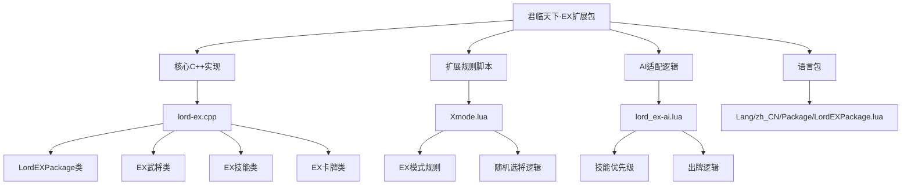
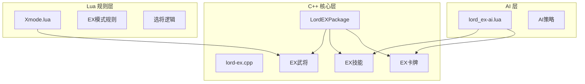
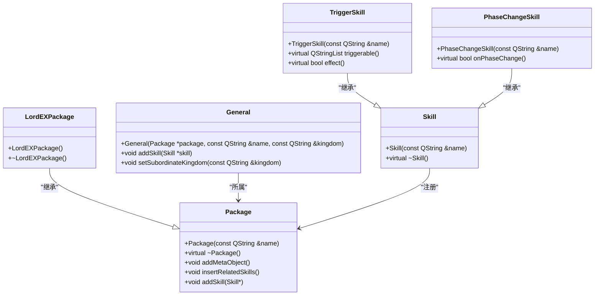
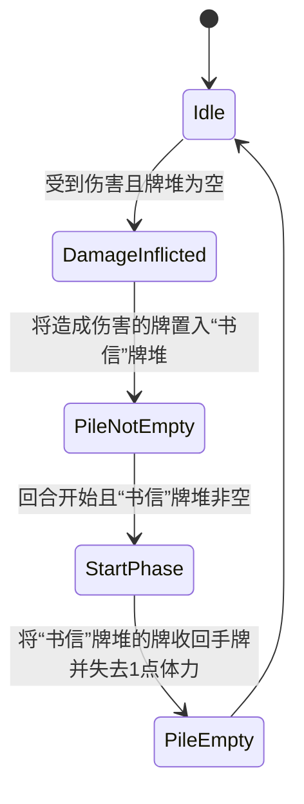
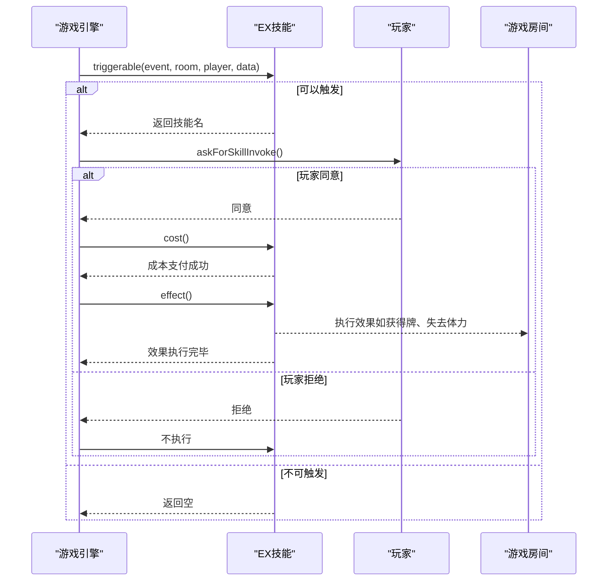
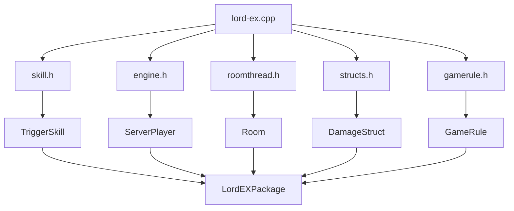

# 君临天下·EX扩展包

<cite>
**本文档引用文件**   
- [lord-ex.cpp](file://src/package/lord-ex.cpp)
- [Xmode.lua](file://extensions/Xmode.lua)
- [lord_ex-ai.lua](file://lua/ai/lord_ex-ai.lua)
- [LordEXPackage.lua](file://lang/zh_CN/Package/LordEXPackage.lua)
</cite>

## 目录
1. [引言](#引言)
2. [项目结构](#项目结构)
3. [核心组件](#核心组件)
4. [架构概述](#架构概述)
5. [详细组件分析](#详细组件分析)
6. [依赖分析](#依赖分析)
7. [性能考量](#性能考量)
8. [故障排除指南](#故障排除指南)
9. [结论](#结论)

## 引言
本文档旨在深入剖析《君临天下·EX》扩展包的实现机制，该扩展包为《三国杀·霸业》游戏引入了独特的EX模式。文档将详细阐述`LordEXPackage`类如何继承并扩展基础`Package`类，以支持刘备·EX、曹操·EX等专属武将及其特殊技能规则。我们将分析该扩展包与`Xmode.lua`脚本的交互逻辑，解释EX武将的选择机制如何与身份局规则融合。此外，文档还将结合`lord_ex-ai.lua`说明AI系统对该扩展包的适配策略，包括技能优先级评估与出牌逻辑调整。最终，文档将提供自定义EX武将的开发模板与测试验证流程。

## 项目结构
`LordEXPackage`扩展包的代码主要分布在`src/package/`目录下，其核心实现位于`lord-ex.cpp`文件中。该文件定义了`LordEXPackage`类，负责注册所有EX模式的武将、技能和卡牌。相关的Lua脚本，如`Xmode.lua`，则位于`extensions/`目录下，负责定义EX模式的游戏规则和选将逻辑。AI的适配策略在`lua/ai/`目录下的`lord_ex-ai.lua`文件中实现。语言包`LordEXPackage.lua`位于`lang/zh_CN/Package/`目录，提供了中文文本支持。

**图示来源**
- [lord-ex.cpp](file://src/package/lord-ex.cpp)
- [Xmode.lua](file://extensions/Xmode.lua)
- [lord_ex-ai.lua](file://lua/ai/lord_ex-ai.lua)

**章节来源**
- [lord-ex.cpp](file://src/package/lord-ex.cpp)
- [Xmode.lua](file://extensions/Xmode.lua)

## 核心组件
`LordEXPackage`的核心组件包括`LordEXPackage`类、`LordEXCardPackage`类以及一系列EX武将、技能和卡牌的实现。`LordEXPackage`类继承自`Package`基类，通过其构造函数注册所有EX模式的专属内容。`LordEXCardPackage`则专门用于注册EX模式的特殊卡牌，如“天子诏”。每个EX武将（如孟达、米方夫人）都通过`General`类进行定义，并通过`addSkill`方法绑定其专属技能。这些技能（如“祈愿”、“良范”）大多继承自`TriggerSkill`、`PhaseChangeSkill`等基类，实现了复杂的触发逻辑。

**章节来源**
- [lord-ex.cpp](file://src/package/lord-ex.cpp)

## 架构概述
`LordEXPackage`的架构遵循了模块化设计原则，将武将、技能、卡牌和规则分离。C++代码负责定义游戏的核心逻辑和数据结构，而Lua脚本则处理更高层次的游戏规则和流程控制。这种分离使得规则的修改更加灵活，无需重新编译整个游戏。`LordEXPackage`类作为入口点，初始化所有EX内容。当游戏进入EX模式时，`Xmode.lua`脚本被加载，它利用`LordEXPackage`中注册的武将进行随机分配和选择。

**图示来源**
- [lord-ex.cpp](file://src/package/lord-ex.cpp)
- [Xmode.lua](file://extensions/Xmode.lua)
- [lord_ex-ai.lua](file://lua/ai/lord_ex-ai.lua)

## 详细组件分析

### LordEXPackage类实现机制分析
`LordEXPackage`类是整个EX扩展包的基石。其构造函数通过一系列`new General`语句创建了孟达、米方夫人等EX武将实例，并为每个武将实例调用`addSkill`方法来绑定其专属技能。例如，为孟达（mengda）添加了“祈愿”（Qiuan）和“良范”（Liangfan）技能。技能的关联通过`insertRelatedSkills`函数实现，例如将`#liangfan-effect`作为`liangfan`技能的关联技能。此外，`LordEXPackage`还通过`addMetaObject`宏注册了所有自定义的卡牌类（如`PaiyiCard`），确保它们能在运行时被正确创建。

#### LordEXPackage类结构图

**图示来源**
- [lord-ex.cpp](file://src/package/lord-ex.cpp#L2397-L2400)

**章节来源**
- [lord-ex.cpp](file://src/package/lord-ex.cpp)

### EX武将技能状态机图
EX武将的技能通常由多个事件触发，形成一个复杂的状态机。以孟达的“良范”技能为例，其状态机如下：

**图示来源**
- [lord-ex.cpp](file://src/package/lord-ex.cpp#L15-L75)

### 与核心引擎的接口调用关系
`LordEXPackage`中的技能通过继承`TriggerSkill`等基类，与游戏核心引擎建立了紧密的接口。当特定游戏事件（如`DamageInflicted`、`EventPhaseStart`）发生时，引擎会调用`triggerable`方法来检查技能是否可以触发。如果可以，引擎会询问玩家是否发动技能（`cost`方法），并在确认后执行`effect`方法中的具体逻辑。例如，`LiangfanEffect`技能在`Damage`事件中被触发，通过检查卡牌标志来决定是否发动效果。

**图示来源**
- [lord-ex.cpp](file://src/package/lord-ex.cpp#L15-L75)

**章节来源**
- [lord-ex.cpp](file://src/package/lord-ex.cpp)

## 依赖分析
`LordEXPackage`对游戏核心库有强依赖，它包含了`skill.h`、`engine.h`、`roomthread.h`等多个头文件。这些头文件提供了`TriggerSkill`、`ServerPlayer`、`Room`等关键类的定义。`LordEXPackage`通过`Sanguosha->getCard()`、`room->obtainCard()`等接口与核心引擎交互。`Xmode.lua`脚本则依赖于`sgs.Sanguosha`全局对象来获取武将信息，并通过`room:askForGeneral()`等接口与游戏房间交互。

**图示来源**
- [lord-ex.cpp](file://src/package/lord-ex.cpp#L4-L13)

**章节来源**
- [lord-ex.cpp](file://src/package/lord-ex.cpp)

## 性能考量
由于EX模式引入了大量复杂的技能和规则，性能是一个重要考量。`LordEXPackage`中的技能应尽量避免在`triggerable`方法中进行耗时的循环或计算。例如，在`Xingzhao`技能中，`getWoundedKingdoms`函数通过遍历所有存活玩家来统计受伤的势力数量，这在8人局中可能成为性能瓶颈。建议对这类函数进行优化，例如使用缓存机制。此外，`Xmode.lua`中的随机选将逻辑也应确保其时间复杂度可控，避免因武将池过大而导致卡顿。

## 故障排除指南
在开发和测试EX扩展包时，可能会遇到以下问题：
1.  **技能无法触发**：检查`events`列表是否正确包含了触发事件，`triggerable`方法的返回值是否正确，以及玩家是否满足技能发动条件。
2.  **卡牌效果异常**：使用`room->sendLog()`输出调试信息，检查`effect`方法中的逻辑是否有误，特别是卡牌移动和伤害计算部分。
3.  **Lua脚本报错**：检查Lua语法是否正确，`sgs.Sanguosha`对象和`room`对象的方法调用是否有效，以及变量名是否拼写错误。
4.  **AI行为异常**：检查`lord_ex-ai.lua`中是否为新技能定义了正确的优先级和评估函数。

**章节来源**
- [lord-ex.cpp](file://src/package/lord-ex.cpp)
- [Xmode.lua](file://extensions/Xmode.lua)
- [lord_ex-ai.lua](file://lua/ai/lord_ex-ai.lua)

## 结论
`LordEXPackage`通过精心设计的C++和Lua代码，成功地为《三国杀·霸业》引入了EX模式。它通过继承和扩展机制，无缝集成了新的武将、技能和规则。`LordEXPackage`类作为核心，负责注册所有内容，而`Xmode.lua`则提供了灵活的规则定义。AI系统通过`lord_ex-ai.lua`文件实现了对新内容的智能适配。开发者可以遵循此模式，通过定义新的`General`和`Skill`子类，并在`LordEXPackage`的构造函数中注册它们，来轻松地扩展游戏内容。