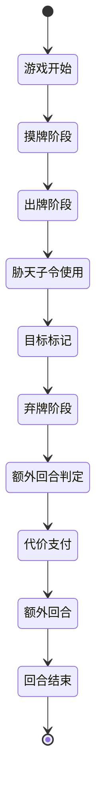

# 战略优势扩展包

<cite>
**本文档引用文件**   
- [strategic-advantage.cpp](file://src/package/strategic-advantage.cpp#L1231-L1320)
- [strategic-advantage.h](file://src/package/strategic-advantage.h#L201-L207)
- [gamerule.cpp](file://src/server/gamerule.cpp#L1000-L1100)
</cite>

## 目录
1. [战略优势扩展包概述](#战略优势扩展包概述)
2. [核心机制与规则修改](#核心机制与规则修改)
3. [StrategicAdvantagePackage类实现逻辑](#strategicadvantagepackage类实现逻辑)
4. [对Room与Player类的扩展](#对room与player类的扩展)
5. [优势条件判定机制](#优势条件判定机制)
6. [游戏流程与状态机](#游戏流程与状态机)
7. [平衡性测试与参数调优](#平衡性测试与参数调优)

## 战略优势扩展包概述

战略优势扩展包（StrategicAdvantagePackage）通过引入非对称规则机制，为游戏创造动态的战术博弈环境。该扩展包在基础规则之上，通过修改初始体力、摸牌阶段、装备效果等核心机制，使不同阵营或角色在游戏初期即形成实力差异，从而激发玩家的策略深度与临场应变能力。

该扩展包包含多种特殊装备、延时锦囊与全局效果卡牌，如“青釭剑”、“方天画戟”、“木牛流马”、“玉玺”、“胁天子令”等，配合相应的技能触发逻辑，实现对游戏节奏的精细调控。

**Section sources**
- [strategic-advantage.cpp](file://src/package/strategic-advantage.cpp#L1231-L1320)
- [strategic-advantage.h](file://src/package/strategic-advantage.h#L201-L207)

## 核心机制与规则修改

### 初始体力与摸牌阶段调整
该扩展包未直接修改初始体力值，而是通过装备与技能间接影响玩家的资源获取与生存能力。例如：
- **玉玺（JadeSeal）**：持有者在摸牌阶段额外摸一张牌，并可在出牌阶段强制查看一名对手的手牌或副将，形成信息优势。
- **木牛流马（WoodenOx）**：允许玩家将手牌置入“木牛流马”堆，后续可转移至其他无宝物的玩家，实现资源再分配。

### 装备与技能联动机制
扩展包中的装备均配备专属技能，形成“装备-技能”联动体系：
- **青釭剑（Blade）**：使用【杀】时，可强制使目标角色无法使用【闪】进行响应。
- **方天画戟（Halberd）**：使用【杀】时，可额外指定一名非友方角色为目标，实现一杀多目标的战术压制。

## StrategicAdvantagePackage类实现逻辑

### 类定义与继承结构
`StrategicAdvantagePackage` 继承自 `Package` 类，作为扩展包的容器，负责注册卡牌、技能与相关逻辑。

```cpp
class StrategicAdvantagePackage : public Package
{
    Q_OBJECT

public:
    StrategicAdvantagePackage();
};
```

### 构造函数实现
在构造函数中，通过初始化列表添加各类卡牌与技能，构建完整的扩展包内容体系。

```cpp
StrategicAdvantagePackage::StrategicAdvantagePackage()
    : Package("strategic_advantage", Package::CardPack)
{
    QList<Card *> cards;

    // 添加基本牌、锦囊牌、装备牌
    cards << new Slash(Card::Spade, 4)
          << new Peach(Card::Heart, 8)
          << new ThreatenEmperor(Card::Spade, 1)
          << new FightTogether(Card::Spade, 12)
          << new IronArmor()
          << new Blade(Card::Spade, 5)
          << new WoodenOx(Card::Diamond, 5)
          << new Halberd(Card::Diamond, 12);

    // 注册技能
    skills << new IronArmorSkill
           << new BladeSkill
           << new JadeSealSkill
           << new WoodenOxSkill
           << new WoodenOxTriggerSkill
           << new HalberdSkill
           << new HalberdTrigger
           << new ThreatenEmperorSkill;

    // 设置父对象
    foreach(Card *card, cards)
        card->setParent(this);
}
```

### 卡牌与技能注册
通过 `skills` 成员变量注册所有关联技能，并使用 `insertRelatedSkills` 建立技能间的关联关系，确保技能触发逻辑的完整性。

**Section sources**
- [strategic-advantage.cpp](file://src/package/strategic-advantage.cpp#L1231-L1320)

## 对Room与Player类的扩展

### Room类的扩展
该扩展包通过 `GameRule` 类间接影响 `Room` 的行为。`GameRule` 作为全局触发技能，监听游戏各阶段事件，实现对房间状态的动态调控。

关键事件包括：
- `GameStart`：游戏开始时初始化扩展包相关状态。
- `TurnStart`：回合开始时检查是否进入“乱斗模式”。
- `EventPhaseEnd`：阶段结束时处理“胁天子令”等延时效果。

### Player类的扩展
通过 `ServerPlayer` 类的标记（Mark）系统实现状态追踪：
- `ThreatenEmperorExtraTurn`：标记被“胁天子令”影响的玩家，使其在弃牌阶段后获得额外回合。
- `wooden_ox`：存储“木牛流马”堆中的牌ID，实现跨玩家转移。

**Section sources**
- [gamerule.cpp](file://src/server/gamerule.cpp#L1000-L1100)

## 优势条件判定机制

### 胁天子令（ThreatenEmperor）机制
“胁天子令”是实现不对称对战的核心卡牌。其判定机制如下：

1. **使用条件**：仅限大势力玩家在出牌阶段对自己使用。
2. **生效效果**：
   - 使用者立即结束当前出牌阶段。
   - 目标角色获得“ThreatenEmperorExtraTurn”标记。
3. **额外回合触发**：
   - 在目标角色的弃牌阶段结束后，若其拥有该标记，则触发 `ThreatenEmperorSkill`。
   - 玩家需弃置一张牌作为代价，即可获得一个额外的完整回合。

```cpp
class ThreatenEmperorSkill : public TriggerSkill
{
public:
    virtual TriggerList triggerable(TriggerEvent triggerEvent, Room *room, ServerPlayer *player, QVariant &) const
    {
        TriggerList list;
        if (triggerEvent != EventPhaseEnd || player->getPhase() != Player::Discard) return list;
        foreach(ServerPlayer *p, room->getAllPlayers())
            if (p->getMark("ThreatenEmperorExtraTurn") > 0)
                list.insert(p, QStringList(objectName()));
        return list;
    }

    virtual bool cost(TriggerEvent, Room *room, ServerPlayer *, QVariant &data, ServerPlayer *ask_who) const
    {
        return room->askForCard(ask_who, ".", "@threaten_emperor", data);
    }
};
```

### 优势条件状态机


**Diagram sources**
- [strategic-advantage.cpp](file://src/package/strategic-advantage.cpp#L1085-L1126)

## 游戏流程与状态机

### 游戏流程图
```mermaid
flowchart TD
A[游戏开始] --> B[摸牌阶段]
B --> C[出牌阶段]
C --> D{是否使用胁天子令?}
D --> |是| E[目标获得标记]
D --> |否| F[正常进行]
E --> G[弃牌阶段]
F --> G
G --> H{目标有标记?}
H --> |是| I[支付代价]
H --> |否| J[结束回合]
I --> K[获得额外回合]
K --> C
J --> [*]
```

**Diagram sources**
- [gamerule.cpp](file://src/server/gamerule.cpp#L1000-L1100)

## 平衡性测试与参数调优

### 平衡性测试方法
1. **胜率统计**：在AI对战模式下，统计使用与未使用“胁天子令”的胜率差异。
2. **资源消耗分析**：记录“木牛流马”转移次数与“玉玺”查看次数，评估信息优势的强度。
3. **回合效率测试**：对比拥有额外回合与正常回合的输出伤害与控制能力。

### 参数调优建议
- **胁天子令代价**：当前为弃置任意一张牌，可调整为“弃置一张装备牌”以提高门槛。
- **玉玺摸牌数**：当前为+1，可调整为“若手牌数小于体力值，则+2”以增强弱势方反扑能力。
- **方天画戟目标数**：当前为+1，可设置为“根据使用者体力值决定额外目标数”以实现动态平衡。

**Section sources**
- [strategic-advantage.cpp](file://src/package/strategic-advantage.cpp#L1231-L1320)