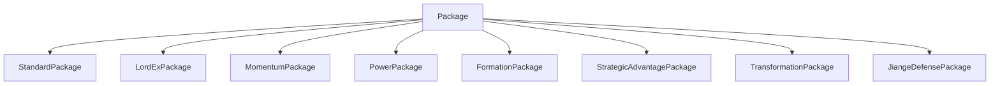
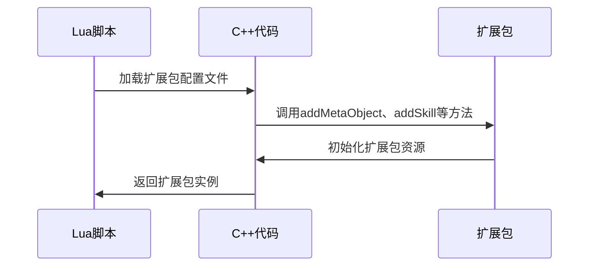
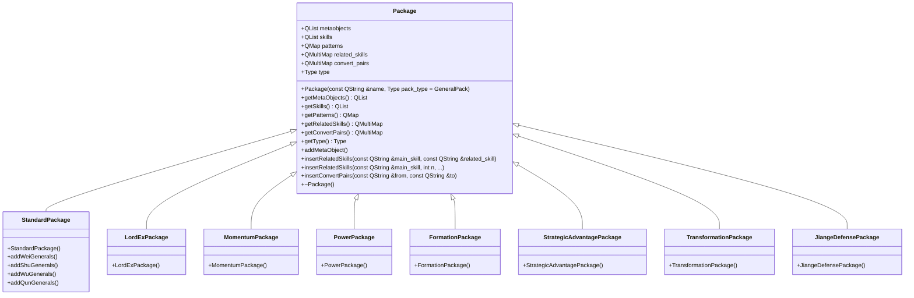

# 扩展包系统

<cite>
**本文档引用文件**  
- [package.h](file://src/package/package.h#L0-L143)
- [package.cpp](file://src/package/package.cpp#L0-L48)
- [standard-package.cpp](file://src/package/standard-package.cpp#L0-L799)
- [lord-ex.cpp](file://src/package/lord-ex.cpp#L0-L799)
- [momentum.cpp](file://src/package/momentum.cpp#L0-L799)
- [power.cpp](file://src/package/power.cpp#L0-L799)
- [standard-shu-generals.cpp](file://src/package/standard-shu-generals.cpp#L0-L799)
- [sanguosha.lua](file://lua/sanguosha.lua#L89-L124)
- [LordEXPackage.lua](file://lang/zh_CN/Package/LordEXPackage.lua)
- [MomentumPackage.lua](file://lang/zh_CN/Package/MomentumPackage.lua)
- [PowerPackage.lua](file://lang/zh_CN/Package/PowerPackage.lua)
- [StandardPackage.lua](file://lang/zh_CN/Package/StandardPackage.lua)
</cite>

## 目录
1. [引言](#引言)
2. [扩展包系统架构](#扩展包系统架构)
3. [核心组件分析](#核心组件分析)
4. [扩展包加载流程](#扩展包加载流程)
5. [扩展包类继承关系](#扩展包类继承关系)
6. [扩展包功能详解](#扩展包功能详解)
7. [自定义扩展包开发](#自定义扩展包开发)
8. [结论](#结论)

## 引言
本文档旨在全面解析《三国杀》游戏中的扩展包系统，详细阐述C++中Package类及其派生类如何实现不同扩展包的加载与管理。文档将深入分析standard-package.cpp中标准包的初始化流程，以及lord-ex、momentum、power等扩展包的模块化设计。同时，将描述每个扩展包（如神将列传、君临天下·EX、神话再临等）所引入的新武将、新卡牌和特殊规则。通过代码分析，揭示PackageFactory模式的应用，以及如何通过registerPackage()机制动态注册扩展内容。文档包含扩展包类继承关系图、加载时序图，并提供自定义扩展包开发的指导建议。

## 扩展包系统架构
扩展包系统采用面向对象的设计模式，以Package类为核心，通过继承机制实现不同扩展包的模块化管理。系统利用Qt的元对象系统（Meta-Object System）和单例模式，确保扩展包的全局唯一性和高效访问。Package类作为基类，定义了扩展包的基本属性和方法，包括技能、卡牌模式、武将元对象等。派生类如StandardPackage、LordExPackage等，通过重写基类方法，实现特定扩展包的功能。



**图源**  
- [package.h](file://src/package/package.h#L0-L143)

## 核心组件分析
### Package类
Package类是扩展包系统的核心，定义了扩展包的基本结构和行为。类中包含技能列表、卡牌模式映射、技能关联映射等成员变量，用于存储扩展包的各类资源。

```cpp
class Package : public QObject
{
    Q_OBJECT
    Q_ENUMS(Type)

public:
    enum Type
    {
        GeneralPack, CardPack, MixedPack, SpecialPack
    };

    Package(const QString &name, Type pack_type = GeneralPack)
    {
        setObjectName(name);
        type = pack_type;
    }

    QList<const QMetaObject *> getMetaObjects() const
    {
        return metaobjects;
    }

    QList<const Skill *> getSkills() const
    {
        return skills;
    }

    QMap<QString, const CardPattern *> getPatterns() const
    {
        return patterns;
    }

    QMultiMap<QString, QString> getRelatedSkills() const
    {
        return related_skills;
    }

    QMultiMap<QString, QString> getConvertPairs() const
    {
        return convert_pairs;
    }

    Type getType() const
    {
        return type;
    }

    template<typename T>
    void addMetaObject()
    {
        metaobjects << &T::staticMetaObject;
    }

    inline void insertRelatedSkills(const QString &main_skill, const QString &related_skill)
    {
        related_skills.insertMulti(main_skill, related_skill);
    }

    void insertRelatedSkills(const QString &main_skill, int n, ...);

    inline void insertConvertPairs(const QString &from, const QString &to)
    {
        convert_pairs.insertMulti(from, to);
    }

    virtual ~Package();

protected:
    QList<const QMetaObject *> metaobjects;
    QList<const Skill *> skills;
    QMap<QString, const CardPattern *> patterns;
    QMultiMap<QString, QString> related_skills;
    QMultiMap<QString, QString> convert_pairs;
    Type type;
};
```

**代码源**  
- [package.h](file://src/package/package.h#L0-L143)

### PackageAdder类
PackageAdder类用于将扩展包注册到全局哈希表中，确保扩展包的全局唯一性和高效访问。

```cpp
class PackageAdder
{
public:
    PackageAdder(const QString &name, Package *pack)
    {
        packages()[name] = pack;
    }

    static PackageHash &packages(void);
};

#define ADD_PACKAGE(name) static PackageAdder name##PackageAdder(#name, new name##Package);
```

**代码源**  
- [package.h](file://src/package/package.h#L0-L143)

## 扩展包加载流程
扩展包的加载流程始于游戏启动时，通过Lua脚本加载扩展包配置文件，然后在C++代码中注册扩展包。具体流程如下：

1. **Lua脚本加载**：游戏启动时，Lua脚本`sanguosha.lua`加载扩展包配置文件，调用`sgs.Sanguosha:addPackage(extension)`方法注册扩展包。
2. **C++代码注册**：在C++代码中，通过`ADD_PACKAGE`宏定义，将扩展包注册到全局哈希表中。
3. **扩展包初始化**：扩展包的构造函数中，调用`addMetaObject`、`addSkill`等方法，初始化扩展包的元对象、技能、卡牌模式等资源。



**图源**  
- [sanguosha.lua](file://lua/sanguosha.lua#L89-L124)
- [standard-package.cpp](file://src/package/standard-package.cpp#L0-L799)

## 扩展包类继承关系
扩展包系统采用继承机制，通过派生类实现不同扩展包的功能。基类Package定义了扩展包的基本结构和行为，派生类如StandardPackage、LordExPackage等，通过重写基类方法，实现特定扩展包的功能。



**图源**  
- [package.h](file://src/package/package.h#L0-L143)
- [standard-package.cpp](file://src/package/standard-package.cpp#L0-L799)
- [lord-ex.cpp](file://src/package/lord-ex.cpp#L0-L799)
- [momentum.cpp](file://src/package/momentum.cpp#L0-L799)
- [power.cpp](file://src/package/power.cpp#L0-L799)

## 扩展包功能详解
### 标准包（StandardPackage）
标准包是游戏的基础扩展包，包含所有基础武将、卡牌和技能。在`standard-package.cpp`中，通过调用`addWeiGenerals`、`addShuGenerals`、`addWuGenerals`、`addQunGenerals`等方法，初始化魏、蜀、吴、群四个势力的武将。

```cpp
StandardPackage::StandardPackage()
    : Package("standard")
{
    addWeiGenerals();
    addShuGenerals();
    addWuGenerals();
    addQunGenerals();

    addMetaObject<CompanionCard>();
    addMetaObject<HalfMaxHpCard>();
    addMetaObject<FirstShowCard>();
    addMetaObject<CareermanCard>();
    addMetaObject<ShowHeadCard>();
    addMetaObject<ShowDeputyCard>();

    skills << new GlobalProhibit << new NoDistanceTargetMod << new GlobalTargetMod << new GlobalRecord << new GlobalClear
           << new Skill("aozhan") << new Companion << new HalfMaxHp << new GlobalMaxCards << new FirstShow << new Careerman
           << new ShowHead << new ShowDeputy;

    patterns["."] = new ExpPattern(".|.|.|hand");
    patterns[".S"] = new ExpPattern(".|spade|.|hand");
    patterns[".C"] = new ExpPattern(".|club|.|hand");
    patterns[".H"] = new ExpPattern(".|heart|.|hand");
    patterns[".D"] = new ExpPattern(".|diamond|.|hand");

    patterns[".black"] = new ExpPattern(".|black|.|hand");
    patterns[".red"] = new ExpPattern(".|red|.|hand");

    patterns[".."] = new ExpPattern(".");
    patterns["..S"] = new ExpPattern(".|spade");
    patterns["..C"] = new ExpPattern(".|club");
    patterns["..H"] = new ExpPattern(".|heart");
    patterns["..D"] = new ExpPattern(".|diamond");

    patterns[".Basic"] = new ExpPattern("BasicCard");
    patterns[".Trick"] = new ExpPattern("TrickCard");
    patterns[".Equip"] = new ExpPattern("EquipCard");

    patterns[".Weapon"] = new ExpPattern("Weapon");
    patterns["slash"] = new ExpPattern("Slash");
    patterns["jink"] = new ExpPattern("Jink");
    patterns["peach"] = new  ExpPattern("Peach");
```

**代码源**  
- [standard-package.cpp](file://src/package/standard-package.cpp#L0-L799)

### 君临天下·EX包（LordExPackage）
君临天下·EX包引入了新的武将和技能，如“qiuan”、“liangfan”、“xingzhao”等。这些技能通过继承`TriggerSkill`、`PhaseChangeSkill`等基类，实现特定的游戏逻辑。

```cpp
class Qiuan : public TriggerSkill
{
public:
    Qiuan() : TriggerSkill("qiuan")
    {
        events << DamageInflicted;
    }

    virtual int getPriority() const
    {
        return -2;
    }

    virtual QStringList triggerable(TriggerEvent, Room *room, ServerPlayer *player, QVariant &data, ServerPlayer* &) const
    {
        if (TriggerSkill::triggerable(player) && player->getPile("letter").isEmpty()) {
            DamageStruct damage = data.value<DamageStruct>();
            const Card *card = damage.card;
            if (card && room->isAllOnPlace(damage.card, Player::PlaceTable))
                return QStringList(objectName());
        }
        return QStringList();
    }

    virtual bool cost(TriggerEvent, Room *room, ServerPlayer *player, QVariant &data, ServerPlayer *) const
    {
        if (player->askForSkillInvoke(this, data)) {
            room->broadcastSkillInvoke(objectName(), player);
            return true;
        }
        return false;
    }

    virtual bool effect(TriggerEvent, Room *, ServerPlayer *player, QVariant &data, ServerPlayer *) const
    {
        DamageStruct damage = data.value<DamageStruct>();
        player->addToPile("letter", damage.card);

        return true;
    }
};
```

**代码源**  
- [lord-ex.cpp](file://src/package/lord-ex.cpp#L0-L799)

### 神话再临包（MomentumPackage）
神话再临包引入了新的武将和技能，如“xunxun”、“wangxi”、“hengjiang”等。这些技能通过继承`PhaseChangeSkill`、`MasochismSkill`等基类，实现特定的游戏逻辑。

```cpp
class Xunxun : public PhaseChangeSkill
{
public:
    Xunxun(const QString &owner) : PhaseChangeSkill("xunxun" + owner)
    {
    }

    virtual QStringList triggerable(TriggerEvent, Room *, ServerPlayer *lidian, QVariant &, ServerPlayer* &) const
    {
        return (PhaseChangeSkill::triggerable(lidian) && lidian->getPhase() == Player::Draw) ? QStringList(objectName()) : QStringList();
    }

    virtual bool cost(TriggerEvent, Room *room, ServerPlayer *lidian, QVariant &, ServerPlayer *) const
    {
        if (lidian->askForSkillInvoke(this)) {
            room->broadcastSkillInvoke(objectName(), lidian);
            return true;
        }

        return false;
    }

    virtual bool onPhaseChange(ServerPlayer *lidian) const
    {
        Room *room = lidian->getRoom();
        room->notifySkillInvoked(lidian, objectName());

        QList<int> card_ids = room->getNCards(4);

        AskForMoveCardsStruct result = room->askForMoveCards(lidian, card_ids, QList<int>(), true, "xunxun", "", "_xunxun", 2, 2, false, false, QList<int>() << -1);

        QListIterator<int> i(result.bottom);
        i.toBack();
        while (i.hasPrevious())
            room->getDrawPile().prepend(i.previous());

        i = result.top;
        while (i.hasNext())
            room->getDrawPile().append(i.next());

        room->doBroadcastNotify(QSanProtocol::S_COMMAND_UPDATE_PILE, QVariant(room->getDrawPile().length()));
        LogMessage a;
        a.type = "#XunxunResult";
        a.from = lidian;
        room->sendLog(a);
        LogMessage b;
        b.type = "$GuanxingTop";
        b.from = lidian;
        b.card_str = IntList2StringList(result.bottom).join("+");
        room->doNotify(lidian, QSanProtocol::S_COMMAND_LOG_SKILL, b.toVariant());
        LogMessage c;
        c.type = "$GuanxingBottom";
        c.from = lidian;
        c.card_str = IntList2StringList(result.top).join("+");
        room->doNotify(lidian, QSanProtocol::S_COMMAND_LOG_SKILL, c.toVariant());
        return false;
    }
};
```

**代码源**  
- [momentum.cpp](file://src/package/momentum.cpp#L0-L799)

### 神将列传包（PowerPackage）
神将列传包引入了新的武将和技能，如“zhengbi”、“fengying”、“jieyue”等。这些技能通过继承`TriggerSkill`、`ZeroCardViewAsSkill`等基类，实现特定的游戏逻辑。

```cpp
class Zhengbi : public TriggerSkill
{
public:
    Zhengbi() : TriggerSkill("zhengbi")
    {
        events << EventPhaseStart;
        view_as_skill = new ZhengbiViewAsSkill;
    }

    virtual bool canPreshow() const
    {
        return true;
    }

    virtual void record(TriggerEvent triggerEvent, Room *room, ServerPlayer *player, QVariant &) const
    {
        if (triggerEvent == EventPhaseStart && player->getPhase()== Player::NotActive) {
            foreach (ServerPlayer *p, room->getAlivePlayers())
                room->setPlayerProperty(p, "zhengbi_targets", QVariant());
        }
    }

    virtual QStringList triggerable(TriggerEvent triggerEvent, Room *, ServerPlayer *player, QVariant &, ServerPlayer * &) const
    {
        if (triggerEvent == EventPhaseStart && player->getPhase() == Player::Play) {
            if (TriggerSkill::triggerable(player))
                return QStringList(objectName());
        }
        return QStringList();
    }

    virtual bool cost(TriggerEvent, Room *room, ServerPlayer *player, QVariant &, ServerPlayer *) const
    {
        return room->askForUseCard(player, "@@zhengbi", "@zhengbi", -1, Card::MethodNone);
    }

    virtual bool effect(TriggerEvent, Room *room, ServerPlayer *player, QVariant &, ServerPlayer *) const
    {
        QList<ServerPlayer *> players = room->getOtherPlayers(player);
        foreach (ServerPlayer *p, players) {
            if (p->hasFlag("ZhengbiTo")) {
                p->setFlags("-ZhengbiTo");
                if (p->hasShownOneGeneral()) {
                    if (p->isNude()) return false;
                    QList<int> to_give;

                    QList<const Card *> cards = p->getCards("he");

                    int trickId = -1;
                    foreach (const Card *c, cards) {
                        if (c->getTypeId() != Card::TypeBasic) {
                            trickId = c->getId();
                            break;
                        }
                    }
                    if (trickId != -1)
                        to_give << trickId;
                    else {
                        foreach (const Card *c, cards) {
                            to_give << c->getId();
                            if (to_give.length() > 1) break;
                        }
                    }

                    if (p->getCardCount(true) > 1) {
                        const Card *card = room->askForCard(p, "@@zhengbigive!", "@zhengbi-give:"+player->objectName(), QVariant(), Card::MethodNone);
                        if (card != NULL)
                            to_give = card->getSubcards();
                    }

                    DummyCard *dummy_card = new DummyCard(to_give);
                    dummy_card->deleteLater();

                    CardMoveReason reason(CardMoveReason::S_REASON_GIVE, p->objectName(), player->objectName(), objectName(), QString());
                    room->obtainCard(player, dummy_card, reason, true);
                } else {

                    QStringList assignee_list = player->property("zhengbi_targets").toString().split("+");
                    assignee_list << p->objectName();
                    room->setPlayerProperty(player, "zhengbi_targets", assignee_list.join("+"));

                }
            }
        }
        return false;
    }
};
```

**代码源**  
- [power.cpp](file://src/package/power.cpp#L0-L799)

## 自定义扩展包开发
开发自定义扩展包需要遵循以下步骤：

1. **创建扩展包类**：继承`Package`类，定义扩展包的名称和类型。
2. **注册扩展包**：使用`ADD_PACKAGE`宏定义，将扩展包注册到全局哈希表中。
3. **初始化资源**：在扩展包的构造函数中，调用`addMetaObject`、`addSkill`等方法，初始化扩展包的元对象、技能、卡牌模式等资源。
4. **编写Lua配置文件**：在`lang/zh_CN/Package`目录下，创建扩展包的Lua配置文件，定义扩展包的名称、描述、武将列表等信息。

```cpp
class MyPackage : public Package
{
public:
    MyPackage() : Package("my_package")
    {
        addMetaObject<MyGeneral>();
        skills << new MySkill;
        patterns["my_pattern"] = new ExpPattern("MyCard");
    }
};

ADD_PACKAGE(MyPackage)
```

**代码源**  
- [package.h](file://src/package/package.h#L0-L143)
- [standard-package.cpp](file://src/package/standard-package.cpp#L0-L799)

## 结论
扩展包系统通过面向对象的设计模式，实现了游戏内容的模块化管理。Package类作为基类，定义了扩展包的基本结构和行为，派生类通过继承机制，实现特定扩展包的功能。系统利用Qt的元对象系统和单例模式，确保扩展包的全局唯一性和高效访问。通过Lua脚本和C++代码的结合，实现了扩展包的动态加载和注册。开发者可以遵循文档中的指导，轻松创建自定义扩展包，丰富游戏内容。