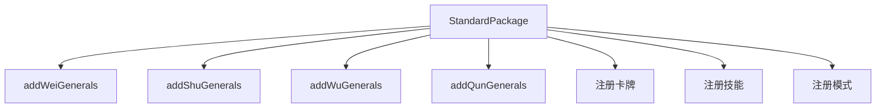
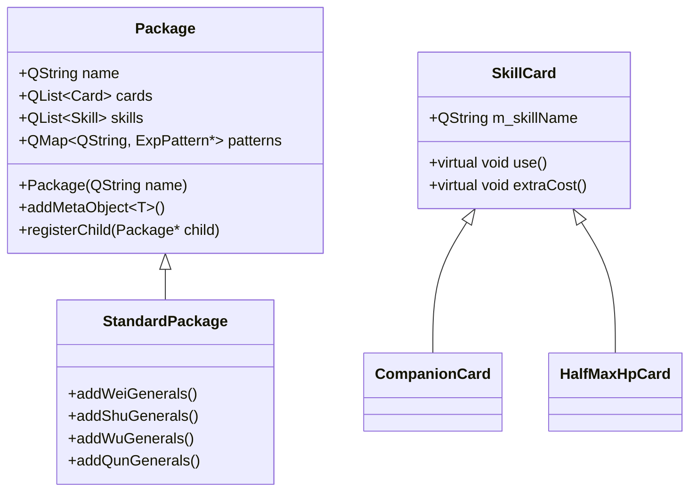
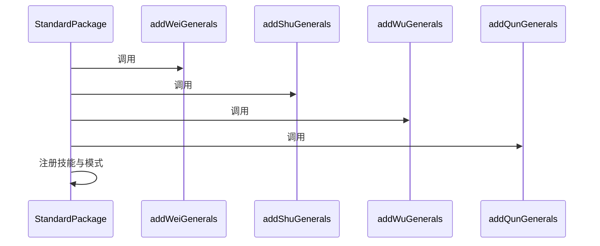
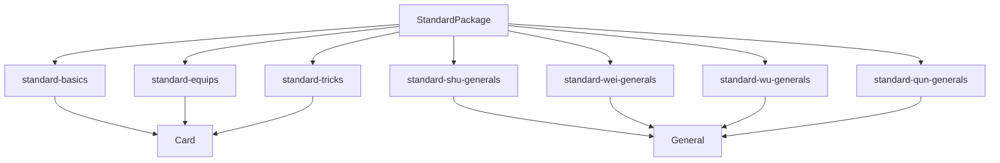

# 标准扩展包

<cite>
**本文档引用文件**  
- [standard-package.cpp](file://src/package/standard-package.cpp)
- [standard-package.h](file://src/package/standard-package.h)
- [standard-basics.cpp](file://src/package/standard-basics.cpp)
- [standard-equips.cpp](file://src/package/standard-equips.cpp)
- [standard-tricks.cpp](file://src/package/standard-tricks.cpp)
- [standard-shu-generals.cpp](file://src/package/standard-shu-generals.cpp)
- [standard-wei-generals.cpp](file://src/package/standard-wei-generals.cpp)
- [standard-wu-generals.cpp](file://src/package/standard-wu-generals.cpp)
- [standard-qun-generals.cpp](file://src/package/standard-qun-generals.cpp)
</cite>

## 目录
1. [项目结构](#项目结构)  
2. [核心组件](#核心组件)  
3. [架构概览](#架构概览)  
4. [详细组件分析](#详细组件分析)  
5. [依赖关系分析](#依赖关系分析)  
6. [性能考量](#性能考量)  
7. [故障排查指南](#故障排查指南)  
8. [结论](#结论)

## 项目结构

本项目为《三国杀》的扩展包实现，主要包含标准卡牌、装备、锦囊及武将的模块化加载机制。核心逻辑位于 `src/package/` 目录下，通过继承 `Package` 基类实现功能扩展。



**图示来源**  
- [standard-package.cpp](file://src/package/standard-package.cpp#L150-L180)

**本节来源**  
- [standard-package.cpp](file://src/package/standard-package.cpp#L1-L20)
- [standard-package.h](file://src/package/standard-package.h#L1-L10)

## 核心组件

`StandardPackage` 类是标准扩展包的核心，继承自 `Package` 基类，负责在游戏启动时注册所有标准内容。其初始化流程包括：

1. 调用 `addWeiGenerals()`、`addShuGenerals()` 等方法注册各势力武将
2. 通过 `addMetaObject<T>()` 注册技能卡牌元对象
3. 将全局技能（如 `GlobalProhibit`）添加至 `skills` 列表
4. 定义卡牌匹配模式（`patterns`），用于技能判定

```cpp
StandardPackage::StandardPackage() : Package("standard")
{
    addWeiGenerals();
    addShuGenerals();
    addWuGenerals();
    addQunGenerals();

    addMetaObject<CompanionCard>();
    // ... 其他卡牌

    skills << new GlobalProhibit << new NoDistanceTargetMod << ...;
    // ... 定义 patterns
}
```

**本节来源**  
- [standard-package.cpp](file://src/package/standard-package.cpp#L150-L180)
- [standard-package.h](file://src/package/standard-package.h#L15-L20)

## 架构概览

系统采用模块化设计，通过 `Package` 基类实现内容注册。各扩展包通过继承该类，实现 `addXxxGenerals()` 方法完成武将注册。



**图示来源**  
- [standard-package.h](file://src/package/standard-package.h#L15-L40)
- [standard-package.cpp](file://src/package/standard-package.cpp#L150-L180)

## 详细组件分析

### 标准包初始化流程

`StandardPackage` 的构造函数按顺序调用各势力武将注册方法，确保加载顺序一致。



**图示来源**  
- [standard-package.cpp](file://src/package/standard-package.cpp#L150-L160)

**本节来源**  
- [standard-package.cpp](file://src/package/standard-package.cpp#L150-L180)

### 卡牌模块加载

标准包通过 `StandardCardPackage` 类加载基础卡牌，包括：

- **基本牌**：杀、闪、桃、酒
- **装备牌**：武器、防具、坐骑
- **锦囊牌**：南蛮、万箭、无懈可击等

```cpp
QList<Card *> StandardCardPackage::basicCards()
{
    QList<Card *> cards;
    cards << new Slash(Card::Spade, 5)
          << new Jink(Card::Heart, 2)
          << new Peach(Card::Heart, 4)
          << new Analeptic(Card::Spade, 9);
    return cards;
}
```

**本节来源**  
- [standard-basics.cpp](file://src/package/standard-basics.cpp#L400-L450)

### 武将技能绑定

各势力文件（如 `standard-shu-generals.cpp`）通过 `ADD_PLAYERGENERAL` 宏注册武将及其技能。

```cpp
// 示例：刘备
class Rende : public TriggerSkill {
    // ...
};

ADD_PLAYERGENERAL(Shu, LiuBei, 1, 3, true, Male, "Rende+Jijiang");
```

技能绑定通过字符串名称关联，确保运行时正确加载。

**本节来源**  
- [standard-shu-generals.cpp](file://src/package/standard-shu-generals.cpp#L1-L50)
- [standard-wei-generals.cpp](file://src/package/standard-wei-generals.cpp#L1-L50)

## 依赖关系分析

各模块间存在明确依赖关系：



**图示来源**  
- [standard-package.cpp](file://src/package/standard-package.cpp#L1-L20)
- [standard-basics.cpp](file://src/package/standard-basics.cpp#L1-L10)

**本节来源**  
- [standard-package.cpp](file://src/package/standard-package.cpp#L1-L50)
- [standard-basics.cpp](file://src/package/standard-basics.cpp#L1-L50)

## 性能考量

- **初始化性能**：所有注册操作在构造函数中完成，避免运行时开销
- **内存管理**：使用 `QList` 和 `QMap` 管理对象，确保高效查找
- **技能触发**：通过事件驱动机制（`TriggerEvent`）减少轮询开销

## 故障排查指南

常见注册错误及调试方法：

1. **武将未显示**：检查 `ADD_PLAYERGENERAL` 宏参数是否正确
2. **技能不生效**：确认技能名称拼写与注册一致
3. **卡牌无法使用**：检查 `isAvailable()` 方法逻辑
4. **依赖缺失**：确保头文件包含正确（如 `#include "standard-basics.h"`）

**本节来源**  
- [standard-package.cpp](file://src/package/standard-package.cpp#L150-L180)
- [standard-basics.cpp](file://src/package/standard-basics.cpp#L1-L50)

## 结论

标准扩展包通过继承 `Package` 类，实现了武将、卡牌的模块化加载。其设计清晰，扩展性强，为游戏内容注册提供了统一接口。开发者可参照此模式新增内容，确保系统稳定性与一致性。