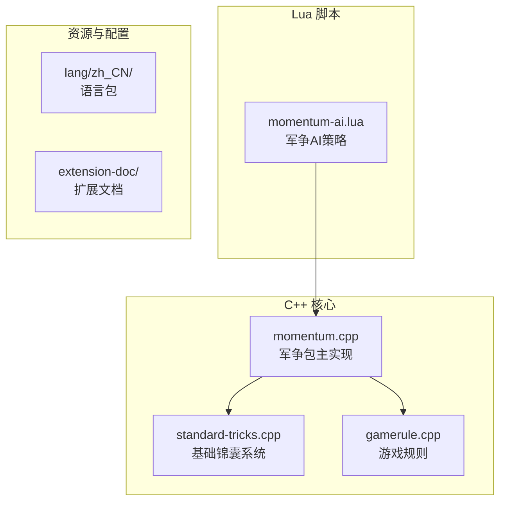
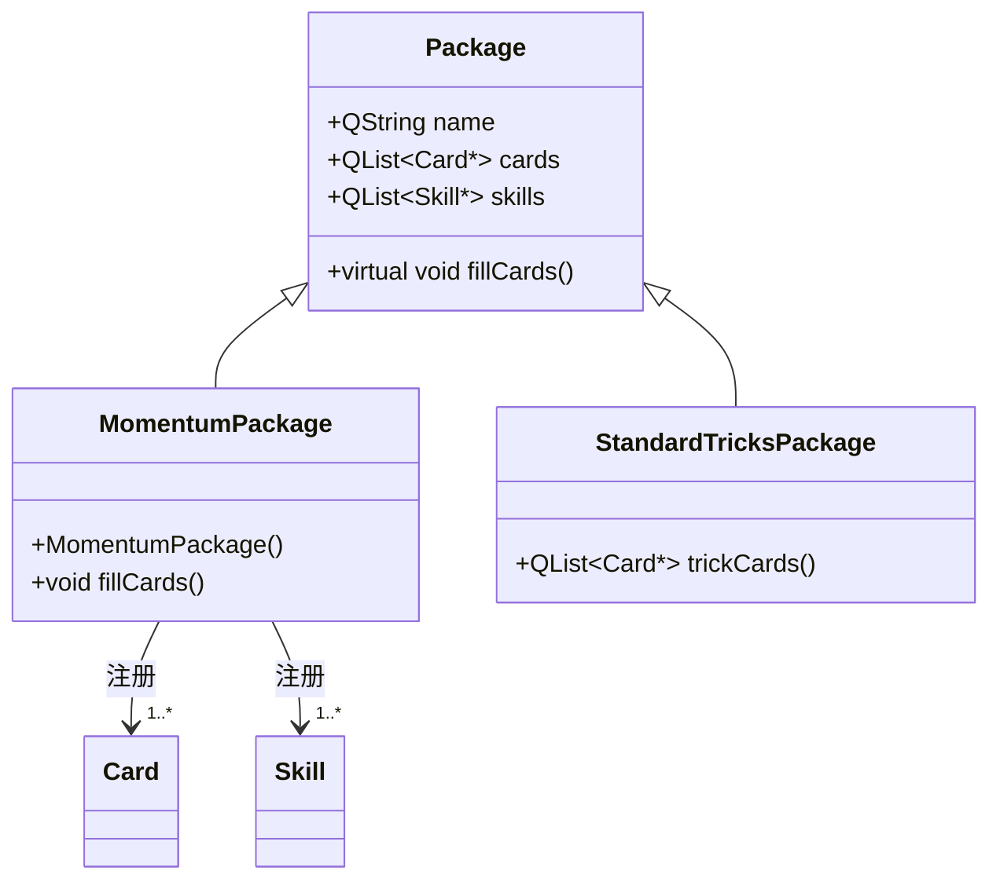
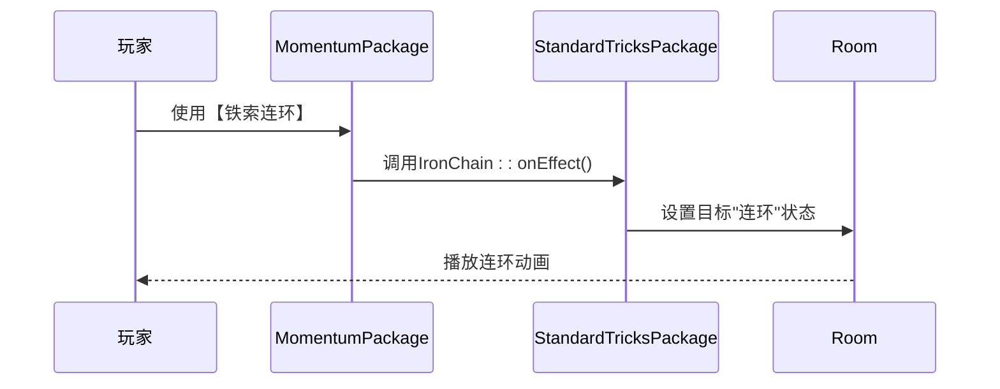

# 神话再临·军争扩展包

<cite>
**本文档引用文件**  
- [momentum.cpp](file://src/package/momentum.cpp)
- [momentum.h](file://src/package/momentum.h)
- [standard-tricks.cpp](file://src/package/standard-tricks.cpp)
- [gamerule.cpp](file://src/server/gamerule.cpp)
- [momentum-ai.lua](file://lua/ai/momentum-ai.lua)
</cite>

## 目录
1. [项目结构](#项目结构)  
2. [核心组件](#核心组件)  
3. [军争扩展包架构](#军争扩展包架构)  
4. [军争卡牌实现分析](#军争卡牌实现分析)  
5. [军争模式判定逻辑](#军争模式判定逻辑)  
6. [AI卡牌评估策略](#ai卡牌评估策略)  
7. [开发示例](#开发示例)

## 项目结构

本项目为《三国杀》的扩展实现，采用C++与Lua混合架构。核心逻辑由C++实现，AI与配置由Lua脚本驱动。军争扩展包主要涉及`src/package/`下的`momentum.cpp`与`standard-tricks.cpp`，以及`lua/ai/`下的AI脚本。



**图源**  
- [momentum.cpp](file://src/package/momentum.cpp)
- [standard-tricks.cpp](file://src/package/standard-tricks.cpp)
- [gamerule.cpp](file://src/server/gamerule.cpp)
- [momentum-ai.lua](file://lua/ai/momentum-ai.lua)

**节源**  
- [momentum.cpp](file://src/package/momentum.cpp)
- [standard-tricks.cpp](file://src/package/standard-tricks.cpp)

## 核心组件

军争扩展包的核心是`MomentumPackage`类，它继承自`Package`，负责注册24张新卡牌与武将技能。通过重写`fillCards()`方法，将新卡牌注入游戏系统。`momentum.cpp`文件中定义了`MomentumPackage`的构造函数，通过`addMetaObject`注册卡牌类，并在构造函数中创建具体卡牌实例。

**节源**  
- [momentum.cpp](file://src/package/momentum.cpp#L1510-L1511)

## 军争扩展包架构

`MomentumPackage`通过继承`Package`类，实现了军争模式的卡牌与技能扩展。其架构设计遵循模块化原则，将卡牌、技能、武将分离注册。



**图源**  
- [momentum.cpp](file://src/package/momentum.cpp)
- [standard-tricks.cpp](file://src/package/standard-tricks.cpp)

**节源**  
- [momentum.cpp](file://src/package/momentum.cpp)
- [momentum.h](file://src/package/momentum.h)

## 军争卡牌实现分析

### 新增锦囊与装备牌

军争包新增了24张卡牌，包括【兵粮寸断】（SupplyShortage）、【铁索连环】（IronChain）等。这些卡牌在`momentum.cpp`中通过`MomentumPackage`的构造函数进行注册。

```cpp
MomentumEquipPackage::MomentumEquipPackage() : Package("momentum_equip", CardPack)
{
    PeaceSpell *dp = new PeaceSpell;
    dp->setParent(this);

    skills << new PeaceSpellSkill << new PeaceSpellSkillDecrease << new PeaceSpellSkillMaxCards;
    insertRelatedSkills("PeaceSpell", 2, "#PeaceSpell-decrease", "#PeaceSpell-max");
}
```

**节源**  
- [momentum.cpp](file://src/package/momentum.cpp#L1480-L1500)

### 与基础锦囊系统的协同

军争卡牌与`standard-tricks.cpp`中的基础锦囊系统协同工作。例如，`IronChain`类在`standard-tricks.cpp`中定义，而其技能效果在`momentum.cpp`中通过`PeaceSpellSkill`等类实现。



**图源**  
- [momentum.cpp](file://src/package/momentum.cpp)
- [standard-tricks.cpp](file://src/package/standard-tricks.cpp)

**节源**  
- [momentum.cpp](file://src/package/momentum.cpp)
- [standard-tricks.cpp](file://src/package/standard-tricks.cpp)

## 军争模式判定逻辑

军争模式特有的判定逻辑主要体现在距离计算与技能触发上。例如，`Hengjiang`技能在造成伤害后，会为当前回合玩家增加标记，影响后续抽牌。

```cpp
class Hengjiang : public MasochismSkill
{
public:
    Hengjiang() : MasochismSkill("hengjiang") {}

    virtual QStringList triggerable(TriggerEvent, Room *room, ServerPlayer *player, QVariant &data, ServerPlayer* &) const
    {
        if (!TriggerSkill::triggerable(player)) return QStringList();
        ServerPlayer *current = room->getCurrent();
        if (!current || current->isDead() || current->getPhase() == Player::NotActive || current->getMaxCards() < 1) return QStringList();
        DamageStruct damage = data.value<DamageStruct>();
        QStringList trigger_skill;
        for (int i = 1; i <= damage.damage; i++)
            trigger_skill << objectName();
        return trigger_skill;
    }

    virtual bool cost(TriggerEvent, Room *room, ServerPlayer *player, QVariant &, ServerPlayer *) const
    {
        ServerPlayer *current = room->getCurrent();
        if (current && player->askForSkillInvoke(this, QVariant::fromValue(current))) {
            room->doAnimate(QSanProtocol::S_ANIMATE_INDICATE, player->objectName(), current->objectName());
            room->broadcastSkillInvoke(objectName(), player);
            return true;
        }
        return false;
    }

    virtual void onDamaged(ServerPlayer *target, const DamageStruct &) const
    {
        Room *room = target->getRoom();
        ServerPlayer *current = room->getCurrent();
        if (!current) return;
        room->addPlayerMark(current, "#hengjiang");
        room->addPlayerMark(target, "HengjiangInvoke");
        room->addPlayerMark(current, "Global_MaxcardsDecrease");
    }
};
```

该逻辑影响`gamerule.cpp`中的`GameRule`类，特别是在`EventPhaseChanging`事件中处理标记清除。

**节源**  
- [momentum.cpp](file://src/package/momentum.cpp#L200-L250)
- [gamerule.cpp](file://src/server/gamerule.cpp#L500-L550)

## AI卡牌评估策略

`momentum-ai.lua`文档定义了AI在军争环境下的卡牌评估权重调整策略。AI会根据当前局势动态调整卡牌使用优先级。

```lua
-- momentum-ai.lua 示例
function sgs.ai_cardneed.peace_spell(to, card, self)
    return to:isWounded() or to:getHandcardNum() < 2
end

function sgs.ai_use_value.iron_chain(card, player, cardUseReason)
    if cardUseReason == sgs.CardUseStruct_CARD_USE_REASON_PLAY then
        return 8.5
    end
    return 4.0
end
```

AI策略通过Lua脚本与C++核心交互，实现智能化决策。

**节源**  
- [momentum-ai.lua](file://lua/ai/momentum-ai.lua)

## 开发示例

### Lua脚本配置

```lua
-- 配置新卡牌
sgs.CreateCard{
    name = "peace_spell",
    suit = sgs.Card_Heart,
    number = 3,
    target_fixed = true,
    on_use = function(self, room, source, targets)
        source:drawCards(2)
        if source:isAlive() and source:getHp() > 1 then
            room:loseHp(source)
        end
    end
}
```

### C++规则验证

```cpp
// 在C++中验证卡牌效果
void PeaceSpellSkill::onEffect(const CardEffectStruct &effect) const
{
    if (triggerEvent == DamageInflicted) {
        // 免疫非基本属性伤害
        LogMessage l;
        l.type = "#PeaceSpellNatureDamage";
        room->sendLog(l);
        return true;
    } else {
        // 失去时摸两张牌并扣减体力
        player->drawCards(2, "PeaceSpell");
        if (player->isAlive() && player->getHp() > 1)
            room->loseHp(player);
    }
}
```

该集成方法确保Lua配置与C++规则的一致性，实现高效开发。

**节源**  
- [momentum.cpp](file://src/package/momentum.cpp)
- [momentum-ai.lua](file://lua/ai/momentum-ai.lua)