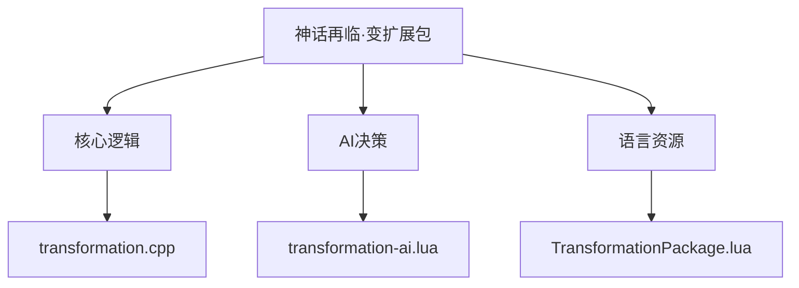
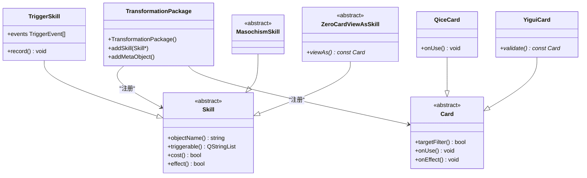
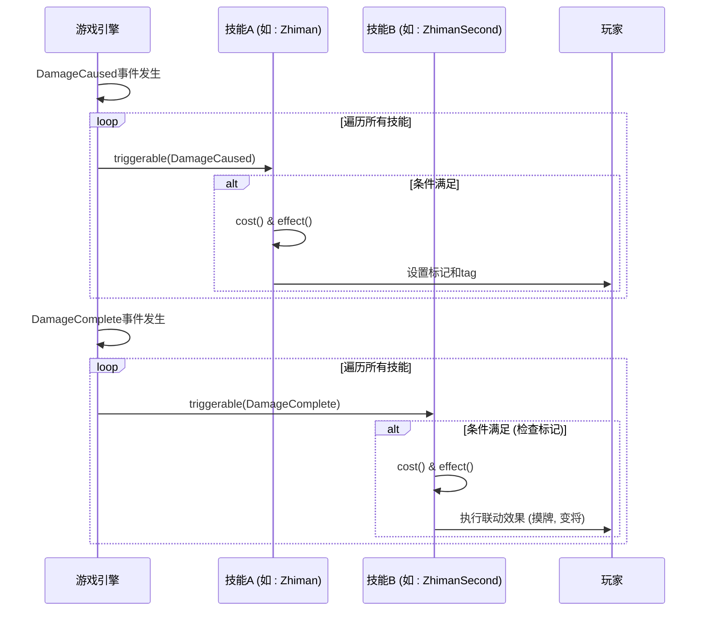
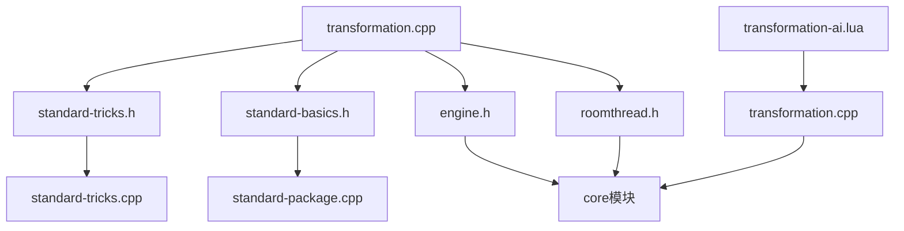

# 神话再临·变扩展包

<cite>
**本文档引用文件**   
- [transformation.cpp](file://src\package\transformation.cpp)
- [transformation-ai.lua](file://lua\ai\transformation-ai.lua)
- [TransformationPackage.lua](file://lang\zh_CN\Package\TransformationPackage.lua)
</cite>

## 目录
1. [引言](#引言)
2. [项目结构分析](#项目结构分析)
3. [核心组件](#核心组件)
4. [架构概述](#架构概述)
5. [详细组件分析](#详细组件分析)
6. [依赖分析](#依赖分析)
7. [性能考量](#性能考量)
8. [故障排除指南](#故障排除指南)
9. [结论](#结论)

## 引言
“神话再临·变”是《三国杀》游戏中的一个扩展包，引入了“变”势力的武将，如黄月英、马超等。该扩展包的核心机制是“技能联动”，通过观察者模式实现技能间的事件通知与响应。本技术文档旨在深入解析`TransformationPackage`类的实现原理，重点阐述其技能设计、事件系统、卡牌规则修改以及AI决策逻辑，为开发者提供一个全面的技术参考。

## 项目结构分析
根据提供的项目结构，`transformation`扩展包的核心代码位于`src/package/`目录下的`transformation.cpp`文件中。该文件定义了`TransformationPackage`类，负责注册所有“变”势力武将及其技能。相关的AI逻辑则位于`lua/ai/`目录下的`transformation-ai.lua`文件中，使用Lua脚本为这些新武将提供智能决策支持。语言资源文件`lang/zh_CN/Package/TransformationPackage.lua`则包含了所有技能和武将的中文文本。



**图表来源**
- [transformation.cpp](file://src\package\transformation.cpp)
- [transformation-ai.lua](file://lua\ai\transformation-ai.lua)
- [TransformationPackage.lua](file://lang\zh_CN\Package\TransformationPackage.lua)

**章节来源**
- [transformation.cpp](file://src\package\transformation.cpp)
- [transformation-ai.lua](file://lua\ai\transformation-ai.lua)

## 核心组件
`TransformationPackage`类是整个扩展包的入口点，它继承自`Package`类，并在构造函数中注册了所有新的武将（`General`）和技能（`Skill`）。每个武将通过`addSkill()`方法添加其专属技能，而`insertRelatedSkills()`方法则用于建立技能间的关联，例如主技能与子技能、触发技能与效果技能等。该类还通过`addMetaObject()`方法注册了自定义的卡牌类，如`QiceCard`和`YiguiCard`，以实现特殊的卡牌效果。

**章节来源**
- [transformation.cpp](file://src\package\transformation.cpp)

## 架构概述
“神话再临·变”扩展包的架构围绕着事件驱动和技能联动展开。其核心是`TransformationPackage`类，它作为容器，将武将、技能和卡牌组织在一起。技能系统通过继承`TriggerSkill`、`MasochismSkill`等基类来实现不同的触发条件和效果。当特定游戏事件（如`CardUsed`、`Damaged`）发生时，系统会遍历所有注册的技能，检查其`triggerable()`方法，若条件满足，则进入`cost()`和`effect()`阶段，执行技能效果。AI系统则通过读取Lua脚本中的决策树，为每个技能提供智能的使用建议。



**图表来源**
- [transformation.cpp](file://src\package\transformation.cpp)

## 详细组件分析
### 黄月英（集智）与马超（马术）技能设计分析
虽然“变”扩展包中并未直接包含黄月英和马超，但其技能设计原理与包内武将如荀攸（奇策）和左慈（化身）有异曲同工之妙。

**荀攸 - 奇策 (Qice)**
*   **设计原理**：`Qice`类继承自`ZeroCardViewAsSkill`，允许玩家在出牌阶段，将所有手牌当作一张锦囊牌使用。其核心是`QiceCard`类，它重写了`targetFilter`、`targetsFeasible`等方法，动态地根据玩家选择的锦囊牌来判断目标是否合法。`onUse()`方法则负责实际使用这张虚拟的锦囊牌，并在满足条件时触发“变”势力的“变将”机制。
*   **代码示例**：
    ```cpp
    // 在 transformation.cpp 中
    class Qice : public ZeroCardViewAsSkill
    {
    public:
        Qice() : ZeroCardViewAsSkill("qice") { guhuo_type = "t"; }

        virtual const Card *viewAs() const
        {
            QString c = Self->tag["qice"].toString();
            if (c != "") {
                QiceCard *card = new QiceCard;
                card->addSubcards(Self->getHandcards());
                card->setUserString(c);
                return card;
            } else
                return NULL;
        }
        // ... 其他方法
    };
    ```

**左慈 - 化身 (Huashen)**
*   **设计原理**：`Huashen`类继承自`PhaseChangeSkill`，在准备阶段触发。其核心是`AcquireGenerals()`静态方法，该方法从可用武将池中随机获取武将，并通过`room->doAnimate()`向所有玩家广播动画。`HuashenVH`类继承自`ViewHasSkill`，实现了`ViewHas()`方法，使得左慈可以“视为拥有”化身武将的技能。
*   **代码示例**：
    ```cpp
    // 在 transformation.cpp 中
    class Huashen : public PhaseChangeSkill
    {
    public:
        Huashen() : PhaseChangeSkill("huashen") { view_as_skill = new HuashenViewAsSkill; }

        static void AcquireGenerals(ServerPlayer *zuoci, int n, QString reason)
        {
            Room *room = zuoci->getRoom();
            QStringList acquired = GetAvailableGenerals(zuoci, n);
            // ... 处理获取的武将
            foreach (QString name, acquired) {
                huashens << name;
                room->handleUsedGeneral(name);
            }
            room->setPlayerProperty(zuoci, "Huashens", huashens.join("+"));
            // ... 发送通知
        }
        // ... 其他方法
    };
    ```

### 技能联动机制（观察者模式）
“变”扩展包中的技能联动是通过游戏引擎的事件系统实现的，这本质上是一种观察者模式的应用。

*   **事件发布者 (Subject)**：游戏引擎本身是事件的发布者。当`DamageStruct`被处理、卡牌被使用或玩家阶段改变时，引擎会调用`Room::trigger()`方法，广播相应的`TriggerEvent`。
*   **事件监听者 (Observer)**：每个`TriggerSkill`都是一个监听者。它们通过在构造函数中指定`events`列表（如`events << CardUsed << CardResponded;`）来“订阅”感兴趣的事件。
*   **通知与响应**：当事件发生时，引擎会遍历所有订阅了该事件的技能，调用其`triggerable()`方法进行条件检查。如果条件满足，技能会进入`cost()`和`effect()`阶段，执行其特定的逻辑，从而实现“联动”。
*   **实例：制蛮 (Zhiman)**
    `Zhiman`技能在`DamageCaused`事件时触发，标记目标。`ZhimanSecond`技能则在`DamageComplete`事件时触发，检查被标记的目标是否被马谡攻击，若是，则执行摸牌和“变将”效果。两个技能通过共享的`player->tag["zhiman_from"]`和`player->getMark("zhiman")`来传递状态信息。



**图表来源**
- [transformation.cpp](file://src\package\transformation.cpp)

**章节来源**
- [transformation.cpp](file://src\package\transformation.cpp)

### 卡牌使用规则修改与交互
“变”扩展包对卡牌使用规则进行了扩展，最典型的例子是“无懈可击”的响应链。

*   **无懈可击响应链扩展**：在`standard-tricks.cpp`中，`Nullification`卡牌的使用逻辑是基础。而“变”扩展包通过引入新的技能和卡牌，间接扩展了其应用场景。例如，`YiguiCard`（役鬼）在`validateInResponse()`方法中，允许玩家在响应阶段使用“役鬼”卡牌来响应“桃”或“酒”，这实际上创造了一个新的、更复杂的响应链。当一个“桃”被使用时，响应链可能变为：`使用桃 -> 敌方使用无懈可击 -> 左慈使用役鬼(桃) -> 敌方再次使用无懈可击`。
*   **与standard-tricks.cpp的交互**：`transformation.cpp`通过`#include "standard-tricks.h"`引入了标准锦囊牌的定义。`QiceCard`和`YiguiCard`在内部通过`Sanguosha->cloneCard()`方法克隆标准锦囊牌（如`"god_salvation"`、`"duel"`），并复用其`targetFilter`和`targetsFeasible`逻辑，确保了规则的一致性。同时，`transformation.cpp`也定义了新的卡牌类（如`LianziCard`），这些卡牌可以与`standard-tricks.cpp`中的其他卡牌（如`"drowning"`）产生互动。

**章节来源**
- [transformation.cpp](file://src\package\transformation.cpp)

### AI决策树构建方法
`transformation-ai.lua`文件为“变”扩展包中的每个技能定义了AI决策逻辑，其核心是构建一个基于优先级和条件判断的决策树。

*   **决策树构建**：以`qice_skill.getTurnUseCard`为例，AI首先会评估当前手牌数量和可用的锦囊牌。它会根据预设的策略（如鏖战时优先回血、虚弱时优先AOE）对可用的锦囊牌进行排序。然后，AI会计算使用每种锦囊牌的预期收益（`getUseValue`），并结合当前局势（如是否有桃、敌人血量）做出最终选择。整个过程是一个多层的条件判断树。
*   **实例：奇策 (Qice) AI**
    ```lua
    -- 在 transformation-ai.lua 中
    qice_skill.getTurnUseCard = function(self)
        -- ... 检查是否可以使用
        -- ... 计算各种锦囊牌的可用性
        if not has_peach and table.contains(available_tricks,"god_salvation") then
            -- 优先使用桃园结义回血
            return sgs.Card_Parse(str .. "god_salvation")
        end
        -- ... 其他条件判断
    end
    ```
    这段代码清晰地展示了一个决策树：首先检查是否有桃，如果没有，则检查是否有桃园结义，如果有，则优先选择使用它。

**章节来源**
- [transformation-ai.lua](file://lua\ai\transformation-ai.lua)

## 依赖分析
`transformation`扩展包依赖于游戏的核心模块和标准包。



**图表来源**
- [transformation.cpp](file://src\package\transformation.cpp)
- [transformation-ai.lua](file://lua\ai\transformation-ai.lua)

## 性能考量
1.  **事件遍历开销**：由于`TriggerSkill`的`triggerable()`方法会在每个事件发生时被大量调用，因此该方法的实现必须高效，避免复杂的循环和计算。
2.  **AI决策复杂度**：`transformation-ai.lua`中的决策逻辑较为复杂，尤其是在评估“变将”选择时，需要遍历所有可能的武将组合。这可能会在游戏后期导致AI思考时间变长。
3.  **内存占用**：`TransformationPackage`在构造时会创建大量的`Skill`和`Card`对象，虽然这些对象是静态的，但仍会占用一定的内存。

## 故障排除指南
*   **问题：技能未触发**
    *   **检查点**：确认`events`列表中包含正确的`TriggerEvent`；检查`triggerable()`方法的返回值是否正确；确认技能是否已被正确添加到武将上。
*   **问题：AI不使用某个技能**
    *   **检查点**：检查`transformation-ai.lua`中是否定义了该技能的`getTurnUseCard`或`ai_skill_invoke`函数；检查AI的决策条件是否过于苛刻；检查`ai_use_priority`的优先级设置是否过低。
*   **问题：卡牌效果异常**
    *   **检查点**：检查`Card`类的`targetFilter`、`targetsFeasible`和`onUse`方法的实现逻辑；确认`CardMoveReason`的使用是否正确；检查`Room`对象的`moveCardsAtomic`等方法的调用参数。

**章节来源**
- [transformation.cpp](file://src\package\transformation.cpp)
- [transformation-ai.lua](file://lua\ai\transformation-ai.lua)

## 结论
“神话再临·变”扩展包通过精巧的面向对象设计和事件驱动架构，成功实现了复杂的“技能联动”机制。`TransformationPackage`类作为核心，通过继承和组合的方式，将武将、技能和卡牌有机地结合在一起。观察者模式的应用使得技能间的交互变得灵活而强大。AI系统通过Lua脚本提供了高度可配置的决策逻辑。开发者在实现类似功能时，应遵循其设计模式，注重事件处理的效率和AI决策的合理性，以确保游戏的流畅性和平衡性。