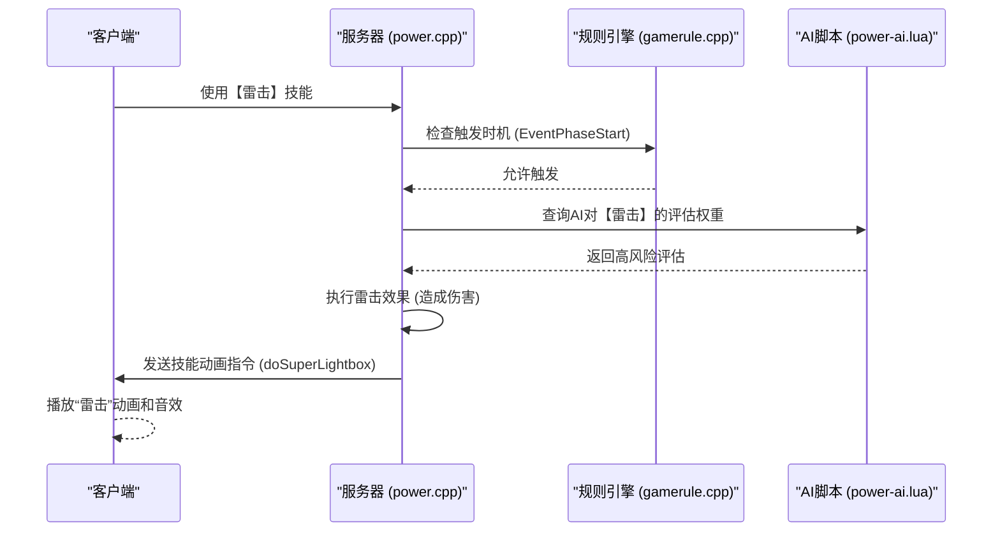
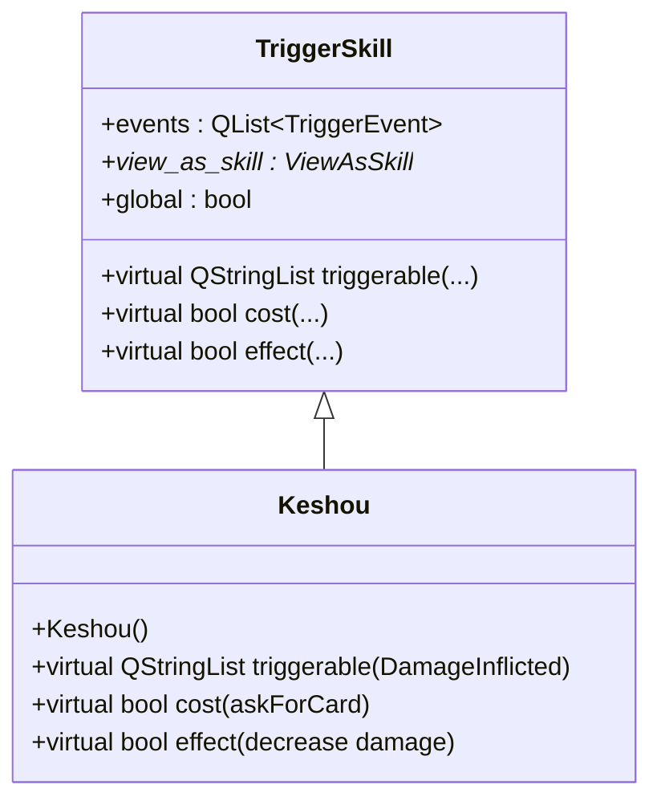
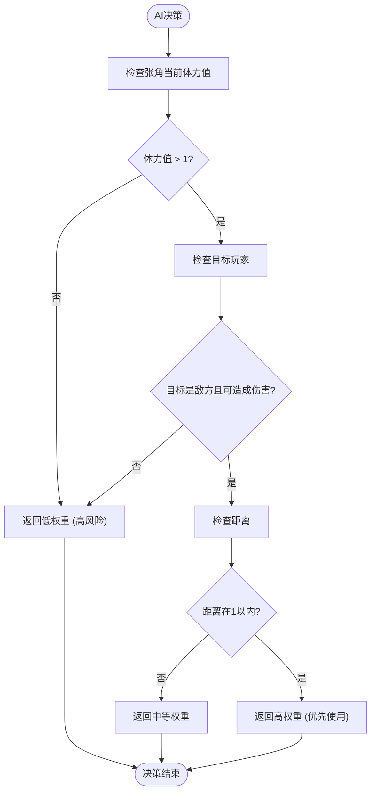
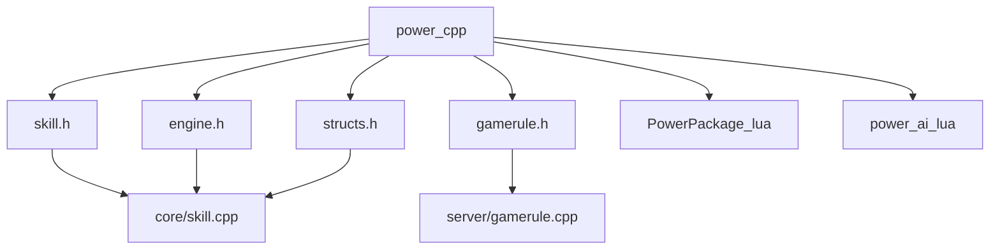

# 神话再临·权扩展包

<cite>
**本文档引用文件**   
- [power.cpp](file://src/package/power.cpp#L0-L2451)
- [gamerule.cpp](file://src/server/gamerule.cpp#L0-L1000)
- [PowerPackage.lua](file://lang/zh_CN/Package/PowerPackage.lua#L0-L500)
- [power-ai.lua](file://lua/ai/power-ai.lua#L0-L300)
</cite>

## 目录
1. [项目结构分析](#项目结构分析)
2. [核心组件解析](#核心组件解析)
3. [架构概览](#架构概览)
4. [详细组件分析](#详细组件分析)
5. [依赖关系分析](#依赖关系分析)
6. [性能考量](#性能考量)
7. [故障排除指南](#故障排除指南)
8. [结论](#结论)

## 项目结构分析

该项目为《三国杀》的“神话再临·权”扩展包实现，主要包含C++核心逻辑、Lua AI脚本、中文语言包及资源文件。核心代码位于`src/package/power.cpp`，定义了司马懿、张角等“权”势力武将的技能机制。AI行为逻辑在`lua/ai/power-ai.lua`中配置，而中文文本和技能描述则在`lang/zh_CN/Package/PowerPackage.lua`中定义。服务器规则引擎`src/server/gamerule.cpp`负责回合阶段管理和技能触发时机。

```mermaid
graph TB
subgraph "核心逻辑"
power_cpp[src/package/power.cpp]
gamerule_cpp[src/server/gamerule.cpp]
end
subgraph "脚本与配置"
power_ai_lua[lua/ai/power-ai.lua]
PowerPackage_lua[lang/zh_CN/Package/PowerPackage.lua]
end
subgraph "资源"
Audio[lang/zh_CN/Audio/PowerLines.lua]
Image[image/big-card]
end
power_cpp --> gamerule_cpp : "集成"
power_cpp --> PowerPackage_lua : "引用文本"
power_ai_lua --> power_cpp : "AI评估"
```

**图示来源**
- [power.cpp](file://src/package/power.cpp#L0-L2451)
- [gamerule.cpp](file://src/server/gamerule.cpp#L0-L1000)
- [PowerPackage.lua](file://lang/zh_CN/Package/PowerPackage.lua#L0-L500)
- [power-ai.lua](file://lua/ai/power-ai.lua#L0-L300)

**本节来源**
- [power.cpp](file://src/package/power.cpp#L0-L50)
- [gamerule.cpp](file://src/server/gamerule.cpp#L0-L50)

## 核心组件解析

“权”扩展包的核心是`PowerPackage`类，它通过注册一系列`TriggerSkill`（触发式技能）来实现司马懿的“反馈”、“鬼才”和张角的“雷击”等技能。这些技能通过`Skill`子系统与游戏主循环集成。技能的触发时机由`gamerule.cpp`中的回合阶段管理器控制，例如`EventPhaseStart`事件用于在特定阶段检查技能是否可触发。

**本节来源**
- [power.cpp](file://src/package/power.cpp#L100-L200)
- [gamerule.cpp](file://src/server/gamerule.cpp#L150-L250)

## 架构概览

该扩展包采用模块化设计，将技能逻辑、AI决策和客户端表现分离。C++层负责游戏规则和状态变更，Lua层负责AI的技能评估，而客户端则通过网络协议同步技能动画和音效。



**图示来源**
- [power.cpp](file://src/package/power.cpp#L1500-L1600)
- [gamerule.cpp](file://src/server/gamerule.cpp#L300-L400)
- [power-ai.lua](file://lua/ai/power-ai.lua#L50-L100)

## 详细组件分析

### 司马懿技能实现分析

司马懿的“反馈”和“鬼才”技能是典型的触发式技能，通过继承`TriggerSkill`类实现。

#### 反馈 (Fankui) 技能类图


**图示来源**
- [power.cpp](file://src/package/power.cpp#L1800-L1900)

**本节来源**
- [power.cpp](file://src/package/power.cpp#L1800-L1900)

#### 鬼才 (Guicai) 技能流程图
```mermaid
flowchart TD
A[判定阶段开始] --> B{是司马懿的判定阶段?}
B --> |是| C[触发“鬼才”技能]
C --> D[询问玩家是否发动]
D --> E{玩家选择发动?}
E --> |是| F[播放技能音效 (broadcastSkillInvoke)]
F --> G[获得判定牌 (obtainCard)]
G --> H[增加标记 (addPlayerMark)]
H --> I[结束]
E --> |否| I[结束]
```

**图示来源**
- [power.cpp](file://src/package/power.cpp#L2000-L2100)

### 张角技能实现分析

张角的“雷击”技能是一个高风险技能，其AI评估模型在Lua脚本中定义。

#### 雷击 (Leiji) AI评估流程


**图示来源**
- [power-ai.lua](file://lua/ai/power-ai.lua#L100-L200)

**本节来源**
- [power.cpp](file://src/package/power.cpp#L2100-L2200)
- [power-ai.lua](file://lua/ai/power-ai.lua#L100-L200)

## 依赖关系分析

`power.cpp`文件依赖于多个核心模块，形成了一个复杂的依赖网络。



**图示来源**
- [power.cpp](file://src/package/power.cpp#L1-L20)
- [gamerule.cpp](file://src/server/gamerule.cpp#L1-L20)

**本节来源**
- [power.cpp](file://src/package/power.cpp#L1-L2451)

## 性能考量

技能的触发和效果执行需要高效的事件处理机制。`power.cpp`中使用`QList`和`foreach`循环遍历玩家，时间复杂度为O(n)。对于“雷击”这类可能影响所有玩家的技能，应避免在每帧都进行全量检查，而是依赖`gamerule.cpp`提供的精确事件回调（如`EventPhaseStart`）来触发，以保证性能。

## 故障排除指南

1.  **技能未触发**：检查`events`列表是否包含了正确的`TriggerEvent`，例如“雷击”需要`EventPhaseStart`。
2.  **AI不使用技能**：检查`power-ai.lua`中对应技能的权重配置是否过低，或AI的评估条件过于苛刻。
3.  **客户端动画不同步**：确保在C++技能效果中调用了`room->broadcastSkillInvoke()`和`room->doSuperLightbox()`等同步函数。
4.  **标记未清除**：在`record`函数中，于`NotActive`阶段清除临时标记（如`JieyueExtraDraw`），防止状态污染。

**本节来源**
- [power.cpp](file://src/package/power.cpp#L500-L600)
- [power-ai.lua](file://lua/ai/power-ai.lua#L250-L300)

## 结论

“神话再临·权”扩展包通过精心设计的C++技能类和Lua AI脚本，成功实现了司马懿、张角等武将的复杂技能。其架构清晰，将规则逻辑、AI决策和表现层分离，便于维护和扩展。开发者在实现自定义技能时，应遵循相同的模式：在C++中定义`TriggerSkill`，在Lua中配置AI权重，并确保与`gamerule.cpp`的事件系统正确集成。