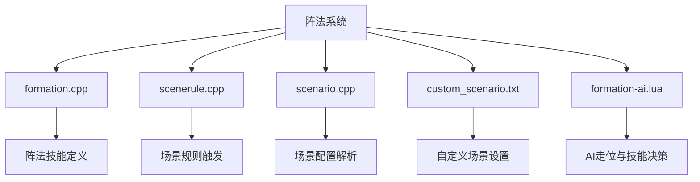
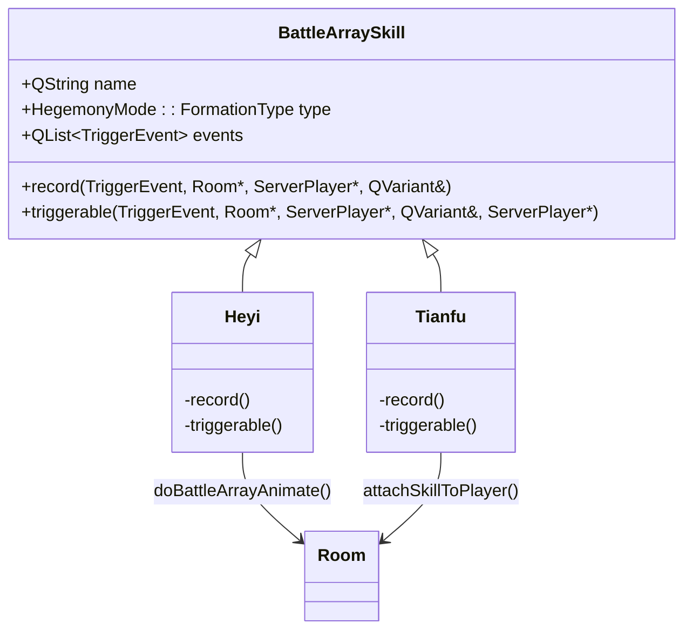
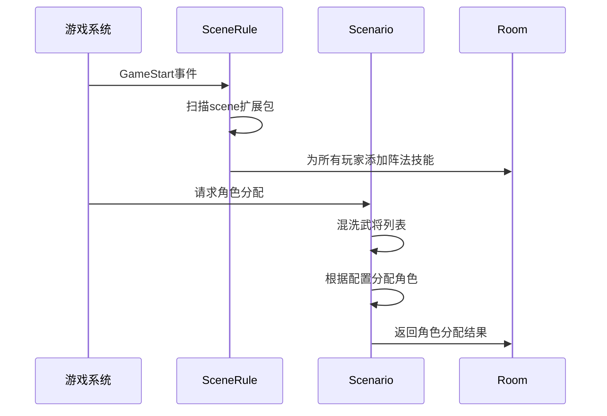
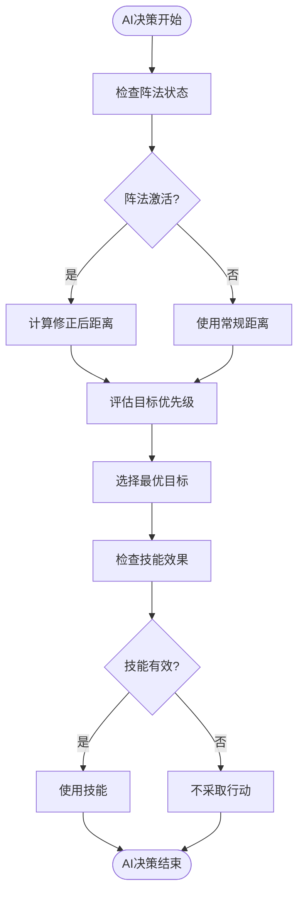

# 阵法扩展包

<cite>
**本文档引用文件**  
- [formation.cpp](file://src/package/formation.cpp#L0-L1712)
- [scenerule.cpp](file://src/scenario/scenerule.cpp#L0-L54)
- [scenario.cpp](file://src/scenario/scenario.cpp#L0-L87)
- [custom_scenario.txt](file://etc/customScenes/custom_scenario.txt#L0-L3)
- [formation-ai.lua](file://lua/ai/formation-ai.lua#L0-L825)
</cite>

## 目录
1. [项目结构分析](#项目结构分析)
2. [阵法系统核心架构](#阵法系统核心架构)
3. [FormationPackage类设计与距离计算机制](#formationpackage类设计与距离计算机制)
4. [自定义场景规则实现](#自定义场景规则实现)
5. [阵法AI决策逻辑分析](#阵法ai决策逻辑分析)
6. [新阵法开发流程](#新阵法开发流程)
7. [总结](#总结)

## 项目结构分析

本项目为《三国杀·霸业》的扩展模组，主要实现阵法系统功能。项目结构清晰，按功能模块划分：

- **src/package/**：核心阵法逻辑实现，包含`formation.cpp`等源文件
- **src/scenario/**：场景规则引擎，包含`scenerule.cpp`和`scenario.cpp`
- **etc/customScenes/**：自定义场景配置文件目录
- **lua/ai/**：AI行为脚本，包含`formation-ai.lua`
- **lang/zh_CN/**：中文语言包
- **extensions/**：扩展脚本定义

阵法系统主要涉及C++核心逻辑与Lua脚本的协同工作，通过`formation.cpp`定义阵法技能，`scenerule.cpp`处理场景初始化，`formation-ai.lua`实现AI智能决策。



**图示来源**
- [formation.cpp](file://src/package/formation.cpp#L0-L1712)
- [scenerule.cpp](file://src/scenario/scenerule.cpp#L0-L54)
- [scenario.cpp](file://src/scenario/scenario.cpp#L0-L87)
- [custom_scenario.txt](file://etc/customScenes/custom_scenario.txt#L0-L3)
- [formation-ai.lua](file://lua/ai/formation-ai.lua#L0-L825)

**本节来源**
- [project_structure](file://workspace_path)

## 阵法系统核心架构

阵法系统基于《三国杀·霸业》的扩展框架构建，通过继承`BattleArraySkill`类实现阵法效果。系统核心由三部分组成：

1. **阵法技能定义**：在`formation.cpp`中通过`BattleArraySkill`派生类实现
2. **场景规则引擎**：通过`scenerule.cpp`中的`SceneRule`类加载阵法相关技能
3. **AI决策支持**：在`formation-ai.lua`中定义AI对阵法环境的响应策略

系统采用事件驱动架构，通过监听`EventPhaseStart`、`GeneralShown`等事件触发阵法效果。阵法效果的激活依赖于玩家间的"阵法关系"（`inFormationRalation`），该关系由场景配置决定。



**图示来源**
- [formation.cpp](file://src/package/formation.cpp#L0-L1712)

**本节来源**
- [formation.cpp](file://src/package/formation.cpp#L0-L1712)

## FormationPackage类设计与距离计算机制

### 阵法技能实现

`formation.cpp`中定义了多个阵法相关技能，其中`Heyi`（鹤翼）和`Tianfu`（天覆）是典型的阵法技能：

```cpp
class Heyi : public BattleArraySkill
{
public:
    Heyi() : BattleArraySkill("heyi", HegemonyMode::Formation)
    {
        events << EventPhaseStart << GeneralShown;
    }

    virtual void record(TriggerEvent triggerEvent, Room *room, ServerPlayer *player, QVariant &data) const
    {
        if (triggerEvent == EventPhaseStart) {
            if (player != NULL && player->isAlive() && player->getPhase() == Player::RoundStart) {
                ServerPlayer *caohong = room->findPlayerBySkillName("heyi");
                if (caohong && caohong->isAlive() && caohong->hasShownSkill("heyi") && player->inFormationRalation(caohong)) {
                    room->doBattleArrayAnimate(caohong);
                    room->broadcastSkillInvoke(objectName(), caohong);
                }
            }
        } 
        // ... 其他事件处理
    }
};
```

### 距离修正机制

阵法系统通过`DistanceSkill`实现距离计算规则的修改。例如`TuntianDistance`技能：

```cpp
class TuntianDistance : public DistanceSkill
{
public:
    TuntianDistance() : DistanceSkill("#tuntian-dist")
    {
    }

    virtual int getCorrect(const Player *from, const Player *) const
    {
        if (from->hasShownSkill("tuntian"))
            return -from->getPile("field").length();
        else
            return 0;
    }
};
```

该技能将拥有"屯田"技能的玩家与其他玩家的距离减少其"field"牌堆的长度，实现了"锋矢阵"等阵法的近距离优势效果。

### 阵法关系判定

阵法效果的触发依赖于玩家间的阵法关系判定。`player->inFormationRalation(caohong)`方法用于判断两个玩家是否处于同一阵法中。这种关系由场景配置文件定义，并在游戏初始化时建立。

**本节来源**
- [formation.cpp](file://src/package/formation.cpp#L0-L1712)

## 自定义场景规则实现

### 场景规则引擎

`scenerule.cpp`中的`SceneRule`类负责处理自定义场景的初始化：

```cpp
bool SceneRule::effect(TriggerEvent triggerEvent, Room* room, ServerPlayer *player, QVariant &data, ServerPlayer *) const
{
    QStringList extensions = Sanguosha->getExtensions();
    QSet<QString> ban_packages = Config.BanPackages.toSet();

    if (!player && triggerEvent == GameStart) {
        foreach (const QString &extension, extensions) {
            bool forbid_package = Config.value("ForbidPackages").toStringList().contains(extension);
            if (ban_packages.contains(extension) || forbid_package) continue;

            QString skill = QString("#%1").arg(extension);
            if (extension.startsWith("scene") && Sanguosha->getSkill(skill)) {
                foreach(ServerPlayer *p, room->getPlayers())
                    room->acquireSkill(p, skill);
            }
        }
    }

    return GameRule::effect(triggerEvent, room, player, data, player);
}
```

该规则在游戏开始时(`GameStart`事件)自动为所有玩家加载以"scene"开头的扩展包中的技能，实现了阵法技能的全局启用。

### 场景配置解析

`scenario.cpp`中的`Scenario`类负责解析场景配置：

```cpp
void Scenario::assign(QStringList &generals, QStringList &, QStringList &roles, Room *) const
{
    generals << lord << loyalists << rebels << renegades;
    qShuffle(generals);

    foreach (const QString &general, generals) {
        if (general == lord)
            roles << "lord";
        else if (loyalists.contains(general))
            roles << "loyalist";
        else if (rebels.contains(general))
            roles << "rebel";
        else
            roles << "renegade";
    }
}
```

### 自定义场景配置

`custom_scenario.txt`文件定义了自定义场景的配置：

```
general:select general2:select role:unknown 
general:select general2:select role:unknown starter:true  
```

该配置文件指定了：
- 可选择的武将（general和general2）
- 角色身份为未知（role:unknown）
- 第二个玩家为先手（starter:true）

这种配置方式允许玩家自定义阵法对战的初始条件，包括武将选择、角色分配和先手顺序。



**图示来源**
- [scenerule.cpp](file://src/scenario/scenerule.cpp#L0-L54)
- [scenario.cpp](file://src/scenario/scenario.cpp#L0-L87)
- [custom_scenario.txt](file://etc/customScenes/custom_scenario.txt#L0-L3)

**本节来源**
- [scenerule.cpp](file://src/scenario/scenerule.cpp#L0-L54)
- [scenario.cpp](file://src/scenario/scenario.cpp#L0-L87)
- [custom_scenario.txt](file://etc/customScenes/custom_scenario.txt#L0-L3)

## 阵法AI决策逻辑分析

### AI技能调用策略

`formation-ai.lua`文件定义了AI对阵法相关技能的决策逻辑。以邓艾的"屯田"技能为例：

```lua
sgs.ai_skill_invoke.tuntian = function(self, data)
    if not (self:willShowForAttack() or self:willShowForDefence()) then
        return false
    end
    return true
end
```

该策略表明AI在准备进攻或防御时才会发动"屯田"技能，体现了资源管理的智能决策。

### 阵法配合决策

AI通过`jixi_skill.getTurnUseCard`函数实现"急袭"技能的智能使用：

```lua
jixi_skill.getTurnUseCard = function(self)
    if self.player:getPile("field"):isEmpty()
        or (self.player:getHandcardNum() >= self.player:getHp() + 2
            and self.player:getPile("field"):length() <= self.room:getAlivePlayers():length() / 2 - 1) then
        return
    end
    -- ... 技能使用逻辑
end
```

该逻辑考虑了手牌数量、体力值和场上存活玩家数量等多个因素，实现了复杂的决策判断。

### 距离与攻击范围计算

AI在决策时会考虑阵法对距离的影响：

```lua
for _, player in sgs.qlist(self.room:getOtherPlayers(self.player)) do
    if (self.player:distanceTo(player, 1) <= 1 + sgs.Sanguosha:correctCardTarget(sgs.TargetModSkill_DistanceLimit, self.player, jixisnatch))
        and self:trickIsEffective(jixisnatch, player) then
        -- 可以使用技能
    end
end
```

这里`correctCardTarget`函数会考虑阵法带来的距离修正，确保AI能够正确判断技能的有效性。

### 阵法环境下的走位策略

AI通过`huyuan_validate`函数实现曹洪"护援"技能的目标选择：

```lua
local function huyuan_validate(self, equip_type, is_handcard)
    local targets = {}
    if is_handcard then targets = self.friends else targets = self.friends_noself end
    -- ... 目标筛选逻辑
    for _, p in ipairs(targets) do
        local has_equip = false
        for _, equip in sgs.qlist(p:getEquips()) do
            if equip:isKindOf(equip_type) then
                has_equip = true
                break
            end
        end
        if not has_equip then
            return p
        end
    end
    return nil
end
```

该策略优先为缺少特定装备的队友提供支援，体现了团队协作的智能决策。



**图示来源**
- [formation-ai.lua](file://lua/ai/formation-ai.lua#L0-L825)

**本节来源**
- [formation-ai.lua](file://lua/ai/formation-ai.lua#L0-L825)

## 新阵法开发流程

### 1. 定义阵法距离矩阵

创建新的`DistanceSkill`派生类，定义阵法下的距离修正规则：

```cpp
class ChangsheDistance : public DistanceSkill
{
public:
    ChangsheDistance() : DistanceSkill("#changshe-dist")
    {
    }

    virtual int getCorrect(const Player *from, const Player *to) const
    {
        if (from->inFormationRalation(to) && from->getSeat() % 2 == to->getSeat() % 2)
            return -1; // 同列玩家距离-1
        return 0;
    }
};
```

### 2. 创建阵法技能类

继承`BattleArraySkill`创建新的阵法技能：

```cpp
class Changshe : public BattleArraySkill
{
public:
    Changshe() : BattleArraySkill("changshe", HegemonyMode::Formation)
    {
        events << EventPhaseStart << GeneralShown;
    }

    virtual void record(TriggerEvent triggerEvent, Room *room, ServerPlayer *player, QVariant &data) const
    {
        if (triggerEvent == EventPhaseStart && player->getPhase() == Player::RoundStart) {
            foreach (ServerPlayer *p, room->getAlivePlayers()) {
                if (p->inFormationRalation(player)) {
                    room->doBattleArrayAnimate(p);
                    room->broadcastSkillInvoke(objectName(), p);
                }
            }
        }
    }

    virtual QStringList triggerable(TriggerEvent, Room *, ServerPlayer *, QVariant &, ServerPlayer * &) const
    {
        return QStringList();
    }
};
```

### 3. 编写场景初始化脚本

在`custom_scenario.txt`中添加新阵法配置：

```
general:zhangliao general2:xuchu role:unknown formation:changshe
general:zhangfei general2:guanyu role:unknown formation:changshe starter:true
```

### 4. 实现AI决策逻辑

在`formation-ai.lua`中添加AI策略：

```lua
sgs.ai_skill_invoke.changshe = function(self, data)
    local player = self.player
    local friends = self:getFriendsNoself()
    local in_range_count = 0
    
    for _, friend in ipairs(friends) do
        if player:distanceTo(friend) <= 1 and friend:isWounded() then
            in_range_count = in_range_count + 1
        end
    end
    
    return in_range_count >= 2
end
```

### 5. 客户端视觉表现集成

通过`room->doBattleArrayAnimate()`触发客户端动画效果，确保阵法激活时有相应的视觉反馈。

### 6. 测试与验证

完整的开发流程需要经过以下测试：
- 阵法距离计算正确性测试
- 技能触发条件验证
- AI决策合理性评估
- 客户端视觉效果确认


**本节来源**
- [formation.cpp](file://src/package/formation.cpp#L0-L1712)
- [formation-ai.lua](file://lua/ai/formation-ai.lua#L0-L825)
- [custom_scenario.txt](file://etc/customScenes/custom_scenario.txt#L0-L3)

## 总结

阵法扩展包通过`formation.cpp`中的`FormationPackage`类实现了复杂的阵法系统，其核心机制是通过修改玩家间距离计算规则来影响游戏策略。系统利用`scenerule.cpp`和`scenario.cpp`实现自定义场景规则，并与`custom_scenario.txt`配置文件联动，实现了灵活的阵法对战配置。

`formation-ai.lua`文档详细说明了AI在阵法环境下的智能决策，包括走位策略、技能释放时机和目标选择等关键决策点。AI通过综合考虑阵法状态、距离修正、队友位置和敌人威胁等多个因素，实现了高水平的智能行为。

创建新阵法的开发流程包括：定义距离矩阵、编写阵法技能类、配置场景初始化脚本、实现AI决策逻辑和集成客户端视觉表现。这一完整的开发框架使得扩展新的阵法成为可能，为游戏策略增加了更多维度。

阵法系统的成功实现展示了《三国杀·霸业》扩展框架的强大灵活性和可扩展性，为玩家提供了更加丰富和策略性的游戏体验。