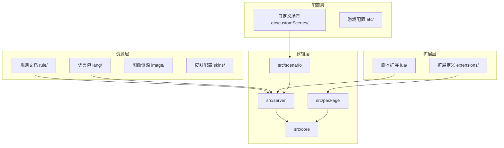
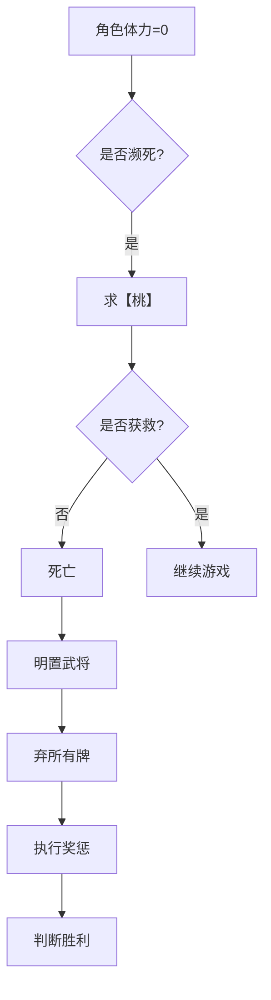
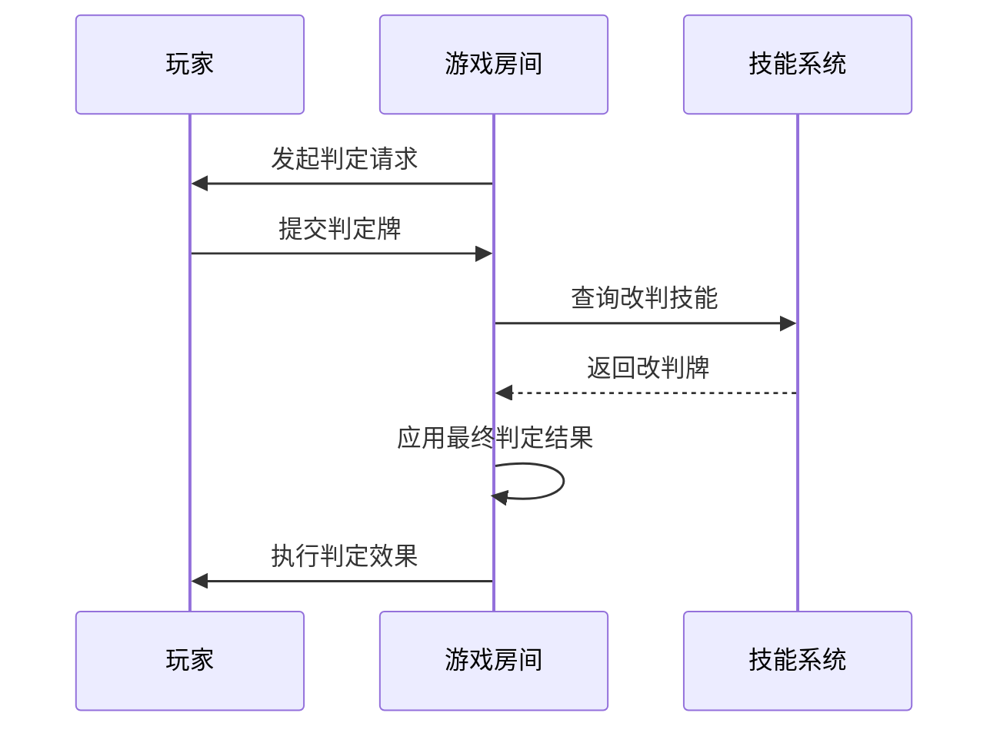
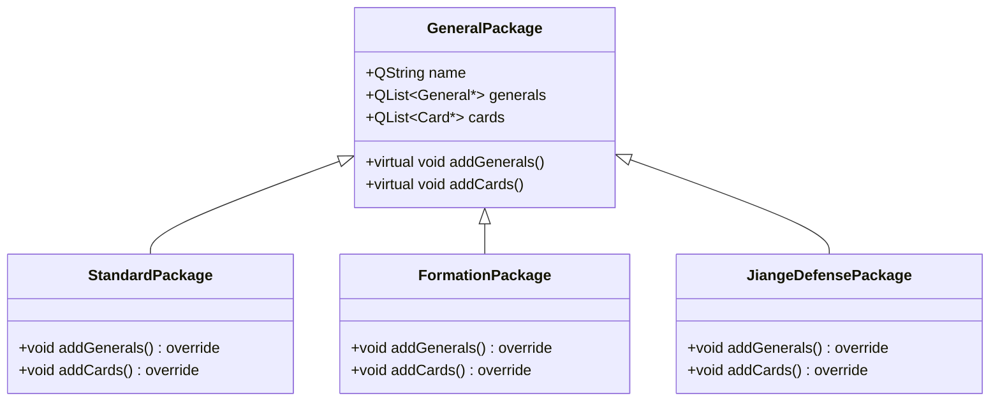
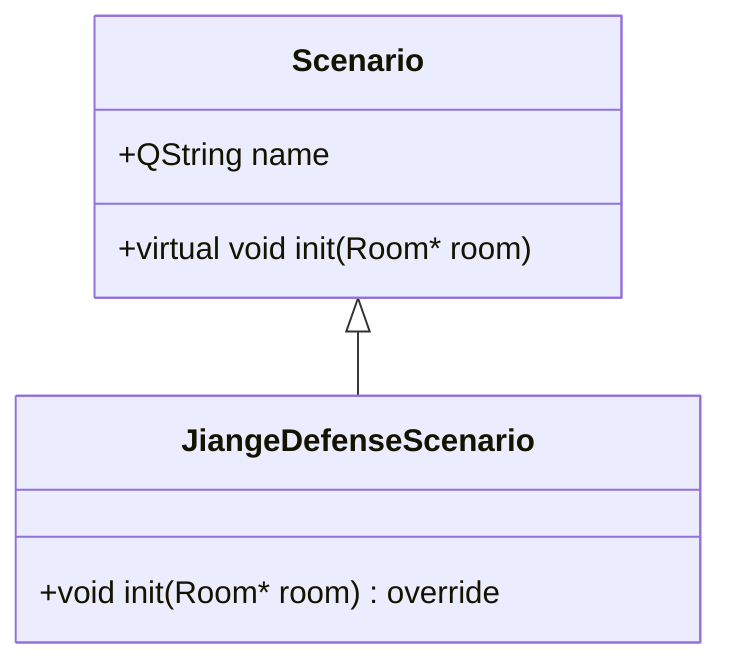
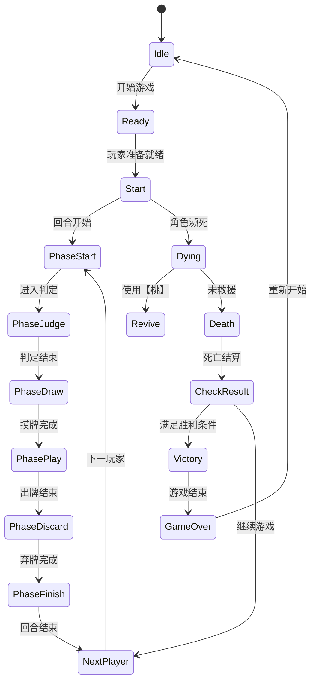
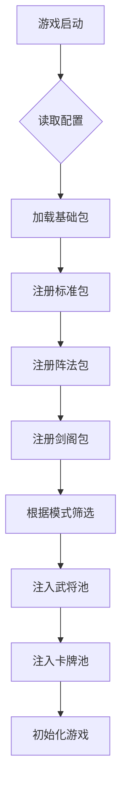

# 游戏机制

<cite>
**本文档引用文件**  
- [hegemony.html](file://rule/hegemony.html)
- [rule1-card.html](file://rule/rule1-card.html)
- [rule2-wording.html](file://rule/rule2-wording.html)
- [rule3-extras.html](file://rule/rule3-extras.html)
- [gamerule.cpp](file://src/server/gamerule.cpp)
- [gamerule.h](file://src/server/gamerule.h)
- [custom_scenario.txt](file://etc/customScenes/custom_scenario.txt)
- [jiange-defense-scenario.cpp](file://src/scenario/jiange-defense-scenario.cpp)
- [jiange-defense-scenario.h](file://src/scenario/jiange-defense-scenario.h)
- [package.cpp](file://src/package/package.cpp)
- [standard-package.cpp](file://src/package/standard-package.cpp)
- [formation.cpp](file://src/package/formation.cpp)
- [momentum.cpp](file://src/package/momentum.cpp)
- [power.cpp](file://src/package/power.cpp)
- [transformation.cpp](file://src/package/transformation.cpp)
- [lord-ex.cpp](file://src/package/lord-ex.cpp)
- [jiange-defense.cpp](file://src/package/jiange-defense.cpp)
</cite>

## 目录
1. [引言](#引言)
2. [项目结构](#项目结构)
3. [核心规则体系](#核心规则体系)
4. [游戏流程控制逻辑](#游戏流程控制逻辑)
5. [扩展包系统实现](#扩展包系统实现)
6. [自定义场景支持](#自定义场景支持)
7. [状态机与流程图](#状态机与流程图)
8. [代码与规则映射分析](#代码与规则映射分析)
9. [结论](#结论)

## 引言

本文档旨在全面解析《三国杀》霸业模式及其他游戏模式的完整规则体系与代码实现。基于 `rule/` 目录下的 HTML 规则文档，结合 C++ 源码，系统化地阐述游戏机制的设计与实现。重点涵盖基础规则、扩展包加载、自定义场景配置以及游戏状态控制等核心模块，帮助开发者深入理解规则逻辑与代码结构之间的映射关系。

## 项目结构

项目采用模块化设计，主要分为资源、逻辑、界面和扩展四大模块。核心逻辑位于 `src/` 目录下，按功能划分为 `server`（服务端逻辑）、`client`（客户端逻辑）、`core`（基础数据结构）、`package`（武将与卡牌包）、`scenario`（特殊场景）等子模块。规则文档存放在 `rule/` 目录中，以 HTML 格式提供详细的玩法说明。自定义场景配置文件位于 `etc/customScenes/`，通过文本格式定义初始状态。



**图示来源**
- [hegemony.html](file://rule/hegemony.html)
- [src/server/gamerule.cpp](file://src/server/gamerule.cpp)
- [src/scenario/jiange-defense-scenario.cpp](file://src/scenario/jiange-defense-scenario.cpp)

## 核心规则体系

### 霸业模式基础规则

霸业模式是一种以势力对抗为核心的双将制游戏模式。每名玩家选择两名同势力武将组成角色，通过明置与暗置机制实现策略性身份隐藏。

**游戏目标**  
玩家需消灭所有非同势力角色。若某势力人数超过总人数一半，则后续明置该势力的玩家成为“野心家”，其目标为消灭所有其他角色（包括同势力玩家）。

**准备阶段**  
- 发7张武将牌（9-12人时为5张），选择两张同势力武将，背面向上放置（暗置）。
- 主将靠近体力牌，副将在外侧。
- 体力上限 = 两张武将阴阳鱼之和（半鱼可组合为整鱼）。
- 起始手牌为4张。

**Section sources**
- [hegemony.html](file://rule/hegemony.html#L15-L45)

### 明置与暗置机制

**暗置状态**  
- 无技能、无性别、无势力。
- 可在以下时机明置：
  1. 回合开始阶段开始时；
  2. 发动技能或使用技能效果时。

**明置影响**  
- 第一次明置确定势力，若该势力已超半数则成为野心家。
- 两张均明置后，性别以主将为准。
- 若两张武将存在“珠联璧合”关系，首次全明置时可选择摸两张牌或回复1点体力。

**Section sources**
- [hegemony.html](file://rule/hegemony.html#L46-L80)
- [rule2-wording.html](file://rule/rule2-wording.html#L10-L40)

### 奖惩与胜利条件

**角色死亡**  
- 体力为0时进入濒死，需【桃】救援，否则死亡。
- 死亡后明置武将牌，弃所有牌并执行奖惩。

**奖惩规则**  
- 杀同势力：弃所有手牌与装备。
- 杀异势力：摸牌数 = 该势力现存人数（含死者）。

**胜利条件**  
全场势力确定后，仅剩一种势力存活时，该势力玩家获胜。野心家需成为唯一幸存者。



**图示来源**
- [hegemony.html](file://rule/hegemony.html#L81-L100)

## 游戏流程控制逻辑

### 回合阶段管理

游戏由 `gamerule.cpp` 中的 `GameRule` 类控制，采用状态机驱动回合流程。每个玩家回合分为六个阶段：

1. **回合开始**：可明置武将，触发相关技能。
2. **判定阶段**：处理延时类锦囊（如【乐不思蜀】）。
3. **摸牌阶段**：从牌堆摸两张牌。
4. **出牌阶段**：使用基本牌、锦囊牌、发动技能。
5. **弃牌阶段**：手牌数不得超过当前体力值。
6. **回合结束**：触发结束阶段技能。

```cpp
// 伪代码示例：回合流程控制
void GameRule::triggerPhase(Phase phase) {
    switch (phase) {
        case Start:
            room->askForSkillInvoke(player, "onStart");
            break;
        case Judge:
            handleDelayedTricks(player);
            break;
        case Draw:
            player->drawCards(2);
            break;
        case Play:
            while (player->hasAction()) {
                room->askForUseCard(player);
            }
            break;
        case Discard:
            room->askForDiscard(player, player->getCardCount() - player->getHp());
            break;
        case Finish:
            room->askForSkillInvoke(player, "onFinish");
            break;
    }
}
```

**Section sources**
- [gamerule.cpp](file://src/server/gamerule.cpp#L150-L200)

### 判定机制

判定由 `Room::askForJudge()` 方法实现，流程如下：

1. 确定判定牌花色与点数。
2. 执行技能干预（如【鬼才】改判）。
3. 根据结果执行效果（如【闪电】雷击）。



**图示来源**
- [gamerule.cpp](file://src/server/gamerule.cpp#L300-L350)

### 胜负条件判定

胜负判断在 `GameRule::organizeDying()` 和 `GameRule::checkResult()` 中实现：

- 每当有角色死亡，调用 `checkResult()` 检查是否满足胜利条件。
- 需满足“全场势力已确定”前提。
- 统计各势力存活人数，判断是否仅剩一种势力。

**Section sources**
- [gamerule.cpp](file://src/server/gamerule.cpp#L400-L450)

## 扩展包系统实现

### Package 类架构

`Package` 系统通过 C++ 继承体系实现，基类 `GeneralPackage` 定义通用接口，各扩展包继承并重写 `addGenerals()`、`addCards()` 方法。



**图示来源**
- [package.h](file://src/package/package.h)
- [standard-package.cpp](file://src/package/standard-package.cpp)

### 扩展包加载流程

1. `Engine` 类初始化时，通过 `addPackage()` 注册所有扩展包。
2. 根据游戏模式动态加载对应包（如霸业模式加载 `StandardPackage`）。
3. 调用 `addGenerals()` 和 `addCards()` 将武将与卡牌注入游戏池。

```cpp
// 示例：标准包注册
void StandardsPackage::addGenerals() {
    addGeneral(new GuanYu);
    addGeneral(new ZhangFei);
    // ...
}
```

**Section sources**
- [package.cpp](file://src/package/package.cpp#L50-L80)

### 支持的扩展包类型

| 扩展包 | 功能说明 | 对应文件 |
|--------|----------|----------|
| 标准包 | 基础武将与卡牌 | standard-package.cpp |
| 阵法包 | 阵法技与特殊武将 | formation.cpp |
| 剑阁防御 | 固守场景与特殊规则 | jiange-defense.cpp |
| 势力包 | 君主与野心家机制 | power.cpp |
| 变天包 | 天气与环境效果 | transformation.cpp |
| 主公EX | 主将技强化模式 | lord-ex.cpp |

**Section sources**
- [package/](file://src/package/)

## 自定义场景支持

### 场景模块设计

`scenario` 模块通过 `Scenario` 抽象类实现，具体场景继承并重写 `init()` 方法以定义初始状态。



**图示来源**
- [scenario.h](file://src/scenario/scenario.h)
- [jiange-defense-scenario.cpp](file://src/scenario/jiange-defense-scenario.cpp)

### 剑阁防御场景实现

`JiangeDefenseScenario` 模拟蜀汉守卫剑阁的战役：

- 玩家分为“守军”与“攻军”两方。
- 守军初始拥有防御工事与补给卡。
- 攻军需在限定回合内突破防线。

```cpp
void JiangeDefenseScenario::init(Room *room) {
    // 设置初始势力
    setSide("守军", {"ZhugeLiang", "JiangWei"});
    setSide("攻军", {"ZhangLiao", "XiahouYuan"});

    // 分配初始卡牌
    room->setFixedDistance("JiangWei", "ZhangLiao", 3); // 地理阻隔
    room->addCardToPile("Barrier", 5); // 防御工事牌堆
}
```

**Section sources**
- [jiange-defense-scenario.cpp](file://src/scenario/jiange-defense-scenario.cpp#L20-L50)

### 自定义场景配置

通过 `custom_scenario.txt` 可定义新场景，格式如下：

```txt
[Scenario]
Name=虎牢关之战
Description=三英战吕布

[Players]
Side1=群雄, LiuBei|GuanYu|ZhangFei
Side2=董卓, LuBu

[Cards]
Pile1=【方天画戟】,5
Pile2=【赤兔马】,1

[Rules]
InitialHP=4
WinCondition=击败吕布
```

该文件在启动时由 `ScenarioLoader` 解析并动态生成场景实例。

**Section sources**
- [custom_scenario.txt](file://etc/customScenes/custom_scenario.txt)

## 状态机与流程图

### 游戏状态机



**图示来源**
- [gamerule.cpp](file://src/server/gamerule.cpp)
- [room.cpp](file://src/server/room.cpp)

### 扩展包加载流程



**图示来源**
- [package.cpp](file://src/package/package.cpp)
- [engine.cpp](file://src/core/engine.cpp)

## 代码与规则映射分析

### 规则到代码的映射实例

| 规则描述 | 对应代码位置 | 实现方式 |
|---------|-------------|---------|
| 回合开始可明置武将 | gamerule.cpp::onPhaseProceeding | 在StartPhase触发askForSkillInvoke |
| 珠联璧合触发时机 | rule2-wording.html & gamerule.cpp | 明置时调用triggerEvent("PearsJoint") |
| 野心家判定 | hegemony.html & gamerule.cpp::checkForRebel | 统计势力人数并比较阈值 |
| 死亡奖惩 | hegemony.html & gamerule.cpp::rewardAndPunish | 根据势力关系执行摸牌或弃牌 |

### 关键函数分析

**`checkForRebel()`**  
判定野心家的核心逻辑：

```cpp
void GameRule::checkForRebel(ServerPlayer *player) {
    int total = room->alivePlayerCount();
    int same = room->getSameSidePlayers(player).length();
    if (same > total / 2) {
        player->setRebel(true);
        room->broadcastRebel(player);
    }
}
```

**Section sources**
- [gamerule.cpp](file://src/server/gamerule.cpp#L500-L520)

## 结论

本文档系统化地解析了《三国杀》霸业模式的规则体系与代码实现。通过分析 `rule/` 文档与 `src/` 源码，揭示了游戏机制的设计逻辑：以 `GameRule` 为核心的状态机控制流程，`Package` 系统实现模块化扩展，`Scenario` 模块支持自定义战役。开发者可通过理解这些组件的协作关系，快速实现新规则或修改现有逻辑。建议在开发新扩展时遵循现有架构，确保兼容性与可维护性。