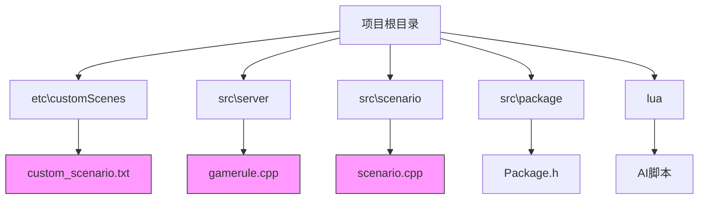
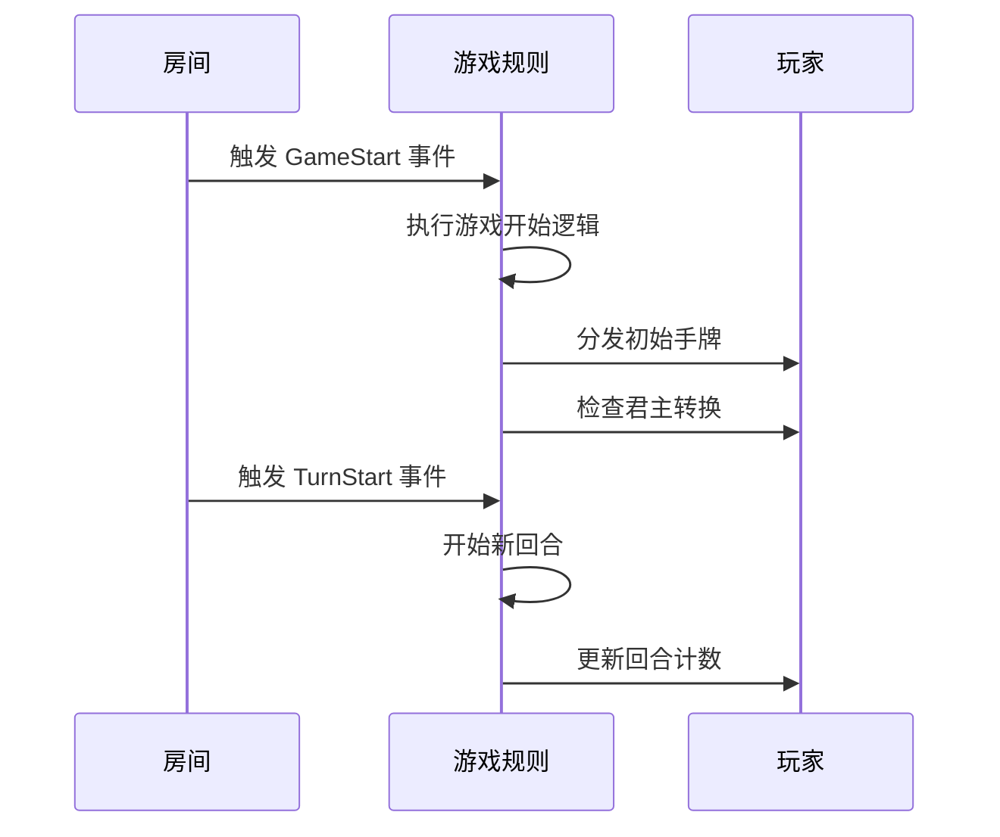
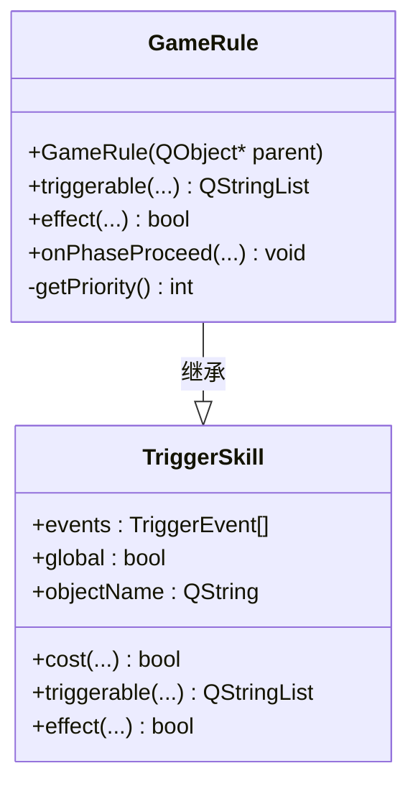
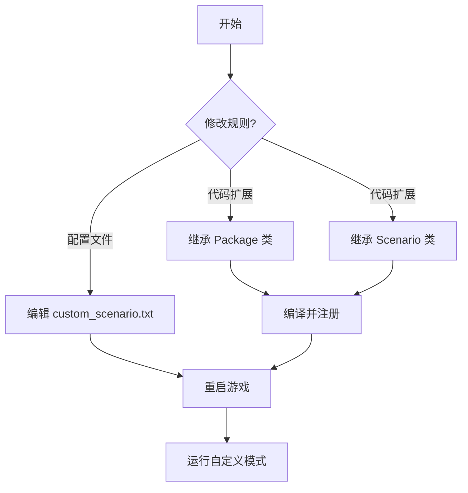
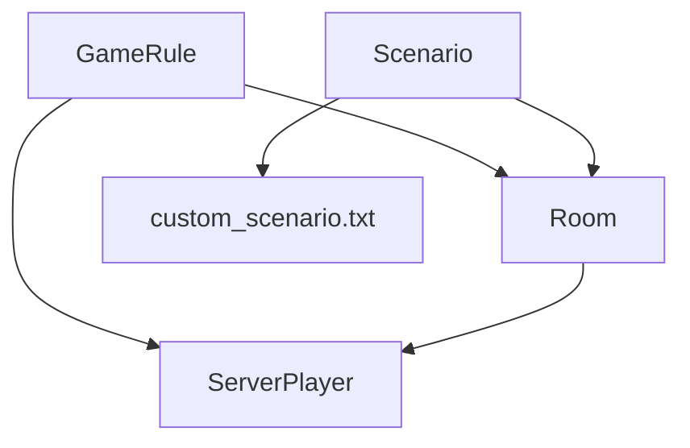

# 自定义规则

<cite>
**本文档引用文件**  
- [custom_scenario.txt](file://etc/customScenes/custom_scenario.txt)
- [gamerule.cpp](file://src/server/gamerule.cpp)
- [gamerule.h](file://src/server/gamerule.h)
- [scenario.cpp](file://src/scenario/scenario.cpp)
- [Package.h](file://src/package/package.h)
- [Scenario.h](file://src/scenario/scenario.h)
</cite>

## 目录
1. [简介](#简介)
2. [项目结构](#项目结构)
3. [核心组件](#核心组件)
4. [架构概览](#架构概览)
5. [详细组件分析](#详细组件分析)
6. [依赖分析](#依赖分析)
7. [性能考量](#性能考量)
8. [故障排除指南](#故障排除指南)
9. [结论](#结论)

## 简介
本文档旨在为《三国杀》游戏的自定义规则配置提供全面的技术指导。文档详细说明了如何通过配置文件和代码扩展实现个性化游戏规则，包括角色分配、禁用卡牌、胜利条件等。目标用户包括希望调整游戏机制的高级玩家和希望开发新游戏模式的开发者。文档基于 `QSanguosha-For-Hegemony-xxyheaven` 项目，重点分析 `custom_scenario.txt` 配置文件和 `gamerule.cpp` 核心逻辑。

## 项目结构
项目采用模块化设计，主要分为资源、脚本、源码和配置四大类。核心逻辑位于 `src` 目录下，`etc` 目录存放可配置的场景文件，`lua` 目录包含AI和扩展脚本。



**图示来源**
- [custom_scenario.txt](file://etc/customScenes/custom_scenario.txt)
- [gamerule.cpp](file://src/server/gamerule.cpp)
- [scenario.cpp](file://src/scenario/scenario.cpp)

**本节来源**
- [custom_scenario.txt](file://etc/customScenes/custom_scenario.txt)
- [gamerule.cpp](file://src/server/gamerule.cpp)

## 核心组件
核心组件包括 `GameRule` 类和 `custom_scenario.txt` 配置文件。`GameRule` 类是游戏规则的中枢，通过监听各种事件（如 `GameStart`, `TurnStart`）来执行规则逻辑。`custom_scenario.txt` 文件则允许用户在不修改代码的情况下定义自定义场景的初始规则。

**本节来源**
- [gamerule.cpp](file://src/server/gamerule.cpp)
- [custom_scenario.txt](file://etc/customScenes/custom_scenario.txt)

## 架构概览
系统架构以事件驱动为核心。`Room`（房间）对象管理游戏状态，`ServerPlayer` 对象代表玩家。`GameRule` 作为 `TriggerSkill` 的子类，注册了大量事件监听器。当事件发生时，`effect` 函数被调用，执行相应的规则。自定义场景通过 `custom_scenario.txt` 配置，由 `Scenario` 类解析并应用。



**图示来源**
- [gamerule.cpp](file://src/server/gamerule.cpp#L200-L300)
- [room.h](file://src/server/room.h)

## 详细组件分析

### GameRule 类分析
`GameRule` 类是游戏规则的实现核心。它通过继承 `TriggerSkill` 来监听游戏中的各种事件。

#### 类结构


**图示来源**
- [gamerule.cpp](file://src/server/gamerule.cpp#L100-L150)
- [gamerule.h](file://src/server/gamerule.h)

**本节来源**
- [gamerule.cpp](file://src/server/gamerule.cpp)
- [gamerule.h](file://src/server/gamerule.h)

#### 主要事件处理
`effect` 函数是规则执行的入口，根据不同的 `TriggerEvent` 执行相应逻辑：
- **GameStart**: 游戏开始时，分发手牌、初始化标记、处理君主转换。
- **TurnStart**: 回合开始时，翻面玩家、增加回合计数。
- **EventPhaseStart**: 阶段开始时，清除临时标记。
- **EventPhaseEnd**: 阶段结束时，清除历史记录。
- **DamageDone**: 造成伤害后，应用伤害并触发后续事件。

### custom_scenario.txt 配置文件分析
该文件定义了自定义场景的初始设置。

#### 语法结构
文件采用简单的键值对和指令流格式：
- `general:select`: 指定可选武将。
- `role:unknown`: 角色分配模式（未知）。
- `starter:true`: 指定起始玩家。

#### 示例与说明
```txt
general:select general2:select role:unknown 
general:select general2:select role:unknown starter:true  
```
此配置表示：所有玩家可以从 `general` 和 `general2` 包中选择武将，角色未知，且有明确的起始玩家。

**本节来源**
- [custom_scenario.txt](file://etc/customScenes/custom_scenario.txt)
- [scenario.cpp](file://src/scenario/scenario.cpp)

### 扩展实现机制分析
开发者可以通过修改 `Package` 或 `Scenario` 类来实现更复杂的规则变体。

#### Package 类
位于 `src/package/` 目录，负责管理卡牌和武将包。通过继承 `Package` 类并注册新的包，可以添加自定义卡牌和武将。

#### Scenario 类
位于 `src/scenario/` 目录，专门处理自定义场景逻辑。`CustomScenario` 类可以重写 `onTagSet` 等方法，实现特殊胜利条件或禁用特定卡牌。



**图示来源**
- [Package.h](file://src/package/package.h)
- [Scenario.h](file://src/scenario/scenario.h)

**本节来源**
- [Package.h](file://src/package/package.h)
- [Scenario.h](file://src/scenario/scenario.h)

## 依赖分析
`GameRule` 类高度依赖 `Room` 和 `ServerPlayer` 类来获取游戏状态和执行操作。`custom_scenario.txt` 的解析依赖于 `Scenario` 类。整体上，系统通过松耦合的事件机制连接各组件。



**图示来源**
- [gamerule.cpp](file://src/server/gamerule.cpp)
- [scenario.cpp](file://src/scenario/scenario.cpp)

**本节来源**
- [gamerule.cpp](file://src/server/gamerule.cpp)
- [scenario.cpp](file://src/scenario/scenario.cpp)

## 性能考量
`GameRule` 中的事件处理逻辑应尽量高效，避免在高频事件（如 `CardUsed`）中进行复杂计算。使用 `Q_ASSERT` 进行调试断言，但在发布版本中应禁用以提升性能。

## 故障排除指南
- **问题**: 自定义规则未生效。
  - **检查**: 确认游戏模式为 `custom_scenario`。
  - **检查**: 确认 `custom_scenario.txt` 文件路径和语法正确。
- **问题**: 游戏启动崩溃。
  - **检查**: 使用调试器定位 `gamerule.cpp` 中的空指针访问。
  - **检查**: 确保所有引用的武将和卡牌对象存在。

**本节来源**
- [gamerule.cpp](file://src/server/gamerule.cpp#L500-L600)
- [scenario.cpp](file://src/scenario/scenario.cpp)

## 结论
通过 `custom_scenario.txt` 配置文件和 `gamerule.cpp` 核心代码，用户和开发者可以灵活地定制《三国杀》的游戏规则。建议优先使用配置文件进行简单修改，对于复杂逻辑再进行代码扩展。遵循本文档的指导，可以安全有效地实现“双将模式”、“禁将池”等常见需求。