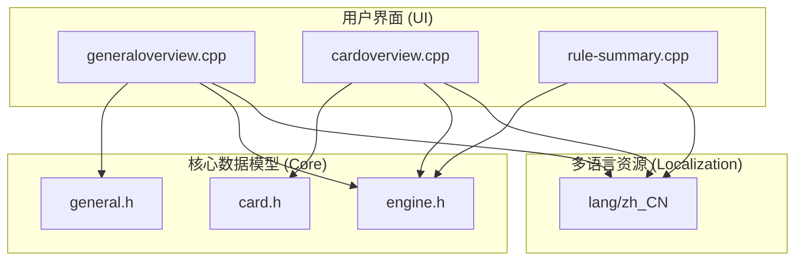
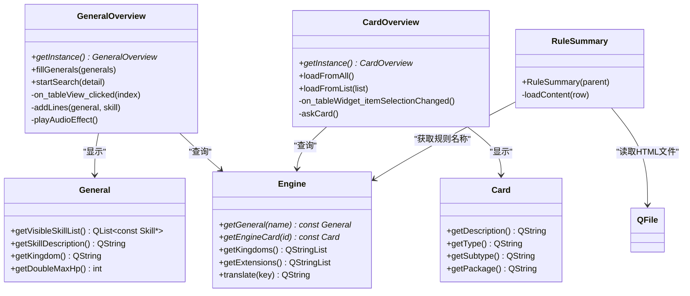
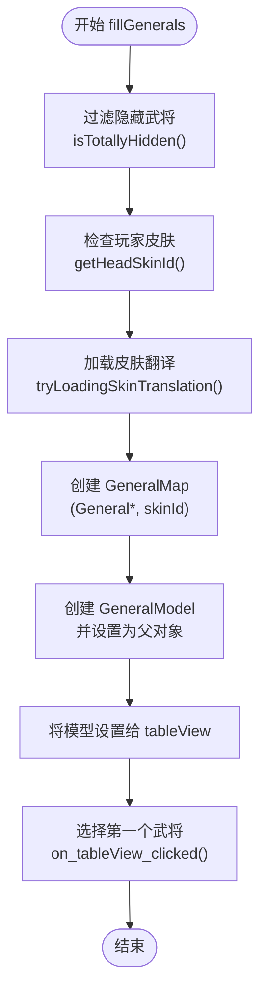
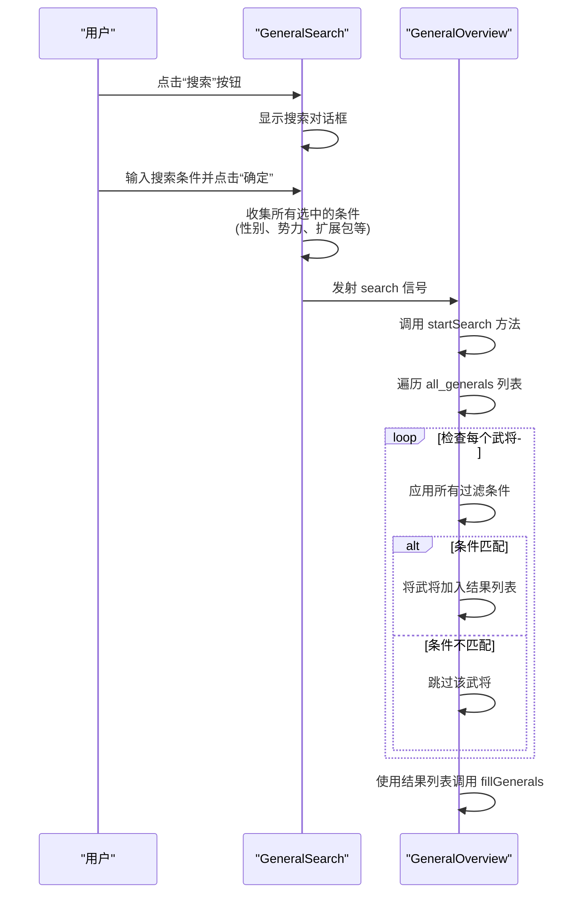
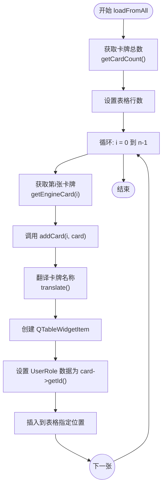
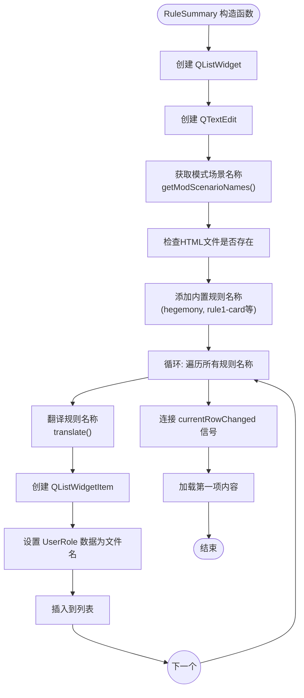
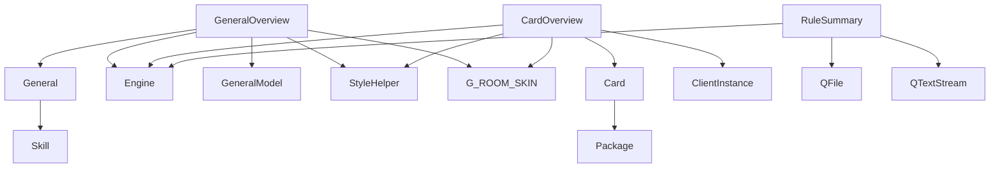

# 信息展示对话框

<cite>
**本文档引用的文件**   
- [generaloverview.cpp](file://src/dialog/generaloverview.cpp)
- [generaloverview.h](file://src/dialog/generaloverview.h)
- [cardoverview.cpp](file://src/dialog/cardoverview.cpp)
- [cardoverview.h](file://src/dialog/cardoverview.h)
- [rule-summary.cpp](file://src/dialog/rule-summary.cpp)
- [rule-summary.h](file://src/dialog/rule-summary.h)
- [general.h](file://src/core/general.h)
- [card.h](file://src/core/card.h)
- [engine.cpp](file://src/core/engine.cpp)
- [engine.h](file://src/core/engine.h)
</cite>

## 目录
1. [引言](#引言)
2. [项目结构](#项目结构)
3. [核心组件](#核心组件)
4. [架构概览](#架构概览)
5. [详细组件分析](#详细组件分析)
6. [依赖分析](#依赖分析)
7. [性能考虑](#性能考虑)
8. [故障排除指南](#故障排除指南)
9. [结论](#结论)

## 引言
本文档系统化地记录了《三国杀》游戏中三种核心信息展示对话框的实现：武将总览（GeneralOverview）、卡牌总览（CardOverview）和规则摘要（RuleSummary）。文档详细阐述了这些对话框的数据加载机制、内容组织结构、搜索过滤功能的实现方式，以及如何从核心数据模型（General、Card）提取并格式化信息用于展示。重点分析了支持多语言（lang/zh_CN）的文本渲染策略和界面性能优化技巧，如懒加载和缓存机制的应用。

## 项目结构
信息展示对话框功能主要位于项目的 `src/dialog` 目录下，与核心数据模型 `src/core` 紧密耦合。该结构体现了清晰的分层设计，将用户界面逻辑与游戏核心数据分离。

**图示来源**
- [generaloverview.cpp](file://src/dialog/generaloverview.cpp)
- [cardoverview.cpp](file://src/dialog/cardoverview.cpp)
- [rule-summary.cpp](file://src/dialog/rule-summary.cpp)
- [general.h](file://src/core/general.h)
- [card.h](file://src/core/card.h)
- [engine.h](file://src/core/engine.h)

## 核心组件
本节分析构成信息展示对话框的三个核心组件：`GeneralOverview`、`CardOverview` 和 `RuleSummary`。这些组件均继承自 `FlatDialog`，提供统一的对话框外观和行为。

**组件来源**
- [generaloverview.cpp](file://src/dialog/generaloverview.cpp#L1-L50)
- [cardoverview.cpp](file://src/dialog/cardoverview.cpp#L1-L50)
- [rule-summary.cpp](file://src/dialog/rule-summary.cpp#L1-L50)

## 架构概览
信息展示对话框的架构遵循模型-视图-控制器（MVC）模式。`General` 和 `Card` 类作为数据模型，`GeneralOverview` 和 `CardOverview` 作为视图和控制器，通过 `Engine` 单例访问全局数据。

**图示来源**
- [generaloverview.cpp](file://src/dialog/generaloverview.cpp#L100-L200)
- [cardoverview.cpp](file://src/dialog/cardoverview.cpp#L100-L150)
- [rule-summary.cpp](file://src/dialog/rule-summary.cpp#L50-L80)
- [general.h](file://src/core/general.h#L50-L100)
- [card.h](file://src/core/card.h#L50-L100)
- [engine.h](file://src/core/engine.h#L50-L100)

## 详细组件分析
本节深入分析每个信息展示对话框的实现细节，包括数据加载、内容组织和交互功能。

### 武将总览分析
`GeneralOverview` 对话框为玩家提供武将的全面信息，包括技能、配音、画师等。

#### 数据加载与内容组织
`GeneralOverview` 的数据加载通过 `fillGenerals` 方法实现。该方法接收一个武将列表，为每个武将创建一个 `GeneralModel` 实例，该模型管理武将与皮肤ID的映射关系，并作为 `QTableView` 的数据源。

**图示来源**
- [generaloverview.cpp](file://src/dialog/generaloverview.cpp#L200-L300)

#### 搜索过滤功能
`GeneralSearch` 类实现了复杂的武将搜索功能。它允许用户根据昵称、姓名、性别、势力、体力值范围和所属扩展包进行过滤。

**图示来源**
- [generaloverview.cpp](file://src/dialog/generaloverview.cpp#L50-L150)
- [generaloverview.cpp](file://src/dialog/generaloverview.cpp#L800-L900)

**武将来源**
- [generaloverview.cpp](file://src/dialog/generaloverview.cpp#L200-L350)

### 卡牌总览分析
`CardOverview` 对话框为玩家提供卡牌的详细信息，包括卡牌类型、花色、点数和描述。

#### 数据加载与内容组织
`CardOverview` 提供了两种数据加载方式：`loadFromAll()` 加载所有卡牌，`loadFromList()` 加载指定的卡牌列表。卡牌信息通过 `addCard` 方法添加到 `QTableWidget` 中。

**图示来源**
- [cardoverview.cpp](file://src/dialog/cardoverview.cpp#L150-L200)

#### 交互功能
`CardOverview` 提供了“获取卡牌”作弊功能（当服务器允许时）和播放卡牌音效的功能。音效路径由 `G_ROOM_SKIN` 根据卡牌名称和性别动态生成。

**卡牌来源**
- [cardoverview.cpp](file://src/dialog/cardoverview.cpp#L100-L250)

### 规则摘要分析
`RuleSummary` 对话框以简洁的方式展示游戏的核心规则。

#### 数据加载与内容组织
`RuleSummary` 的数据加载机制独特，它不直接从代码模型中获取数据，而是从 `rule/` 目录下的HTML文件中读取内容。

**图示来源**
- [rule-summary.cpp](file://src/dialog/rule-summary.cpp#L50-L100)

#### 内容渲染
当用户在列表中选择一项时，`loadContent` 方法被调用。该方法根据 `UserRole` 中存储的文件名，拼接出完整的HTML文件路径，然后读取文件内容并将其设置为 `QTextEdit` 的HTML内容。

**规则来源**
- [rule-summary.cpp](file://src/dialog/rule-summary.cpp#L100-L110)

## 依赖分析
信息展示对话框组件依赖于多个核心模块，形成了一个清晰的依赖图。

**图示来源**
- [generaloverview.cpp](file://src/dialog/generaloverview.cpp)
- [cardoverview.cpp](file://src/dialog/cardoverview.cpp)
- [rule-summary.cpp](file://src/dialog/rule-summary.cpp)

## 性能考虑
尽管文档中未明确提及，但可以从代码中推断出一些性能优化策略：
1.  **懒加载**: `GeneralModel` 在 `fillGenerals` 中创建，仅在需要时加载数据。
2.  **单例模式**: `GeneralOverview` 和 `CardOverview` 使用 `getInstance` 方法，确保全局只有一个实例，节省内存。
3.  **缓存**: `Engine` 类的 `translate` 方法很可能内部实现了字符串缓存，避免重复的字符串查找。
4.  **资源管理**: 在 `resetButtons` 方法中，通过 `takeAt` 和 `delete` 显式清理旧的按钮，防止内存泄漏。

## 故障排除指南
*   **问题**: 武将或卡牌信息未显示。
  *   **检查**: 确认 `Engine` 单例已正确初始化，并且 `Sanguosha` 全局指针有效。
*   **问题**: 搜索功能无响应。
  *   **检查**: 确认 `all_generals` 成员变量在 `fillGenerals` 后被正确赋值。
*   **问题**: 规则摘要无法加载。
  *   **检查**: 确认 `rule/` 目录下的HTML文件存在且路径正确。

## 结论
本文档详细分析了《三国杀》游戏中信息展示对话框的实现。`GeneralOverview`、`CardOverview` 和 `RuleSummary` 三个组件通过清晰的架构和高效的实现，为玩家提供了便捷的信息查询功能。它们充分利用了核心数据模型和多语言系统，展现了良好的模块化设计和可维护性。未来可以考虑将HTML规则文件的内容也集成到 `Engine` 的翻译系统中，以实现更统一的文本管理。