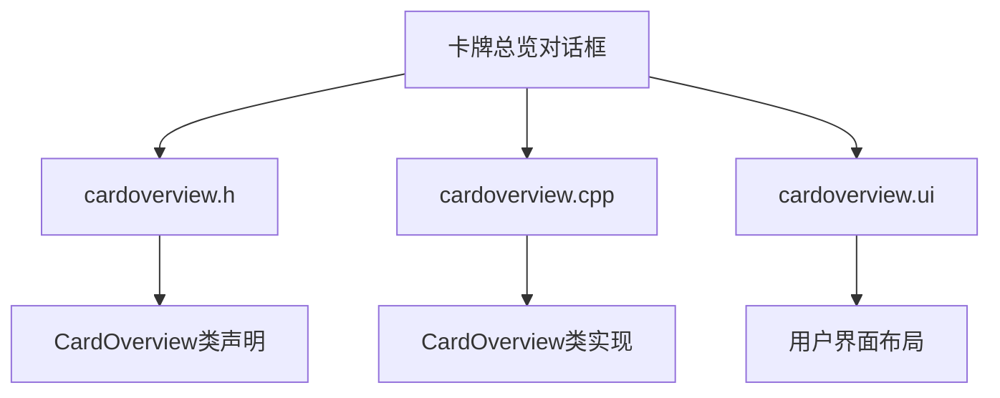
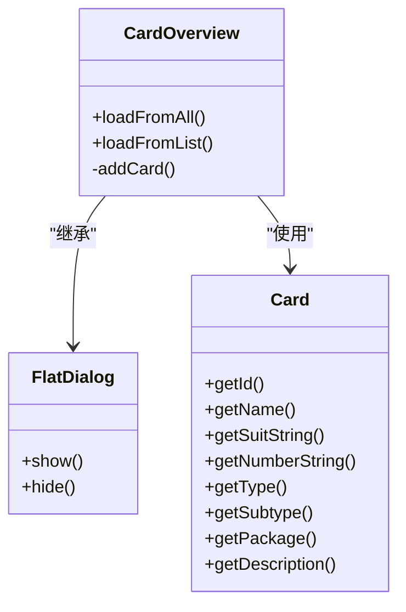
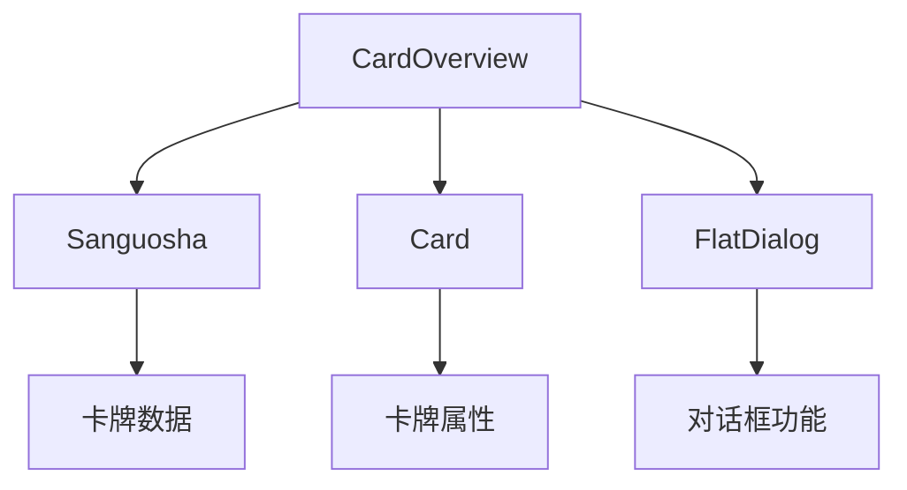

# 卡牌总览对话框

<cite>
**本文档引用文件**   
- [cardoverview.h](file://src/dialog/cardoverview.h)
- [cardoverview.cpp](file://src/dialog/cardoverview.cpp)
- [cardoverview.ui](file://src/dialog/cardoverview.ui)
- [card.h](file://src/core/card.h)
- [card.cpp](file://src/core/card.cpp)
</cite>

## 目录
1. [项目结构](#项目结构)
2. [核心组件](#核心组件)
3. [架构概述](#架构概述)
4. [详细组件分析](#详细组件分析)
5. [依赖分析](#依赖分析)
6. [性能考虑](#性能考虑)
7. [故障排除指南](#故障排除指南)
8. [结论](#结论)

## 项目结构

卡牌总览对话框（CardOverview）是游戏《三国杀》中的一个重要功能模块，用于展示所有卡牌的详细信息。该模块位于`src/dialog`目录下，主要由三个文件组成：`cardoverview.h`、`cardoverview.cpp`和`cardoverview.ui`。



**图源**
- [cardoverview.h](file://src/dialog/cardoverview.h)
- [cardoverview.cpp](file://src/dialog/cardoverview.cpp)
- [cardoverview.ui](file://src/dialog/cardoverview.ui)

## 核心组件

卡牌总览对话框的核心功能是通过`CardOverview`类来实现的。该类继承自`FlatDialog`，并提供了两个主要的加载方法：`loadFromAll()`和`loadFromList()`。`loadFromAll()`方法用于加载所有卡牌，而`loadFromList()`方法则用于加载指定的卡牌列表。

**节源**
- [cardoverview.h](file://src/dialog/cardoverview.h#L25-L67)
- [cardoverview.cpp](file://src/dialog/cardoverview.cpp#L100-L150)

## 架构概述

卡牌总览对话框的架构设计遵循了MVC（Model-View-Controller）模式。`CardOverview`类作为控制器，负责处理用户的交互请求，并调用模型（`Card`类）获取数据，然后更新视图（UI界面）。



**图源**
- [cardoverview.h](file://src/dialog/cardoverview.h#L25-L67)
- [card.h](file://src/core/card.h#L39-L246)

## 详细组件分析

### 卡牌数据加载

卡牌总览对话框通过`Sanguosha`引擎提供的接口获取卡牌数据。`Sanguosha`是一个全局对象，包含了游戏中所有的卡牌、武将等资源。`loadFromAll()`方法首先获取卡牌总数，然后逐个加载每张卡牌的信息。

```cpp
void CardOverview::loadFromAll()
{
    int n = Sanguosha->getCardCount();
    ui->tableWidget->setRowCount(n);
    for (int i = 0; i < n; i++) {
        const Card *card = Sanguosha->getEngineCard(i);
        addCard(i, card);
    }
}
```

**节源**
- [cardoverview.cpp](file://src/dialog/cardoverview.cpp#L100-L110)

### 卡牌信息展示

卡牌信息的展示主要通过`addCard()`方法完成。该方法将卡牌的各种属性（如名称、花色、点数、类型、子类型和包名）添加到表格中，并根据卡牌的包名设置背景颜色。

```cpp
void CardOverview::addCard(int i, const Card *card)
{
    QString name = Sanguosha->translate(card->objectName());
    QIcon suit_icon = QIcon(QString("image/system/suit/%1.png").arg(card->getSuitString()));
    QString point = card->getNumberString();
    QString suit_str = Sanguosha->translate(card->getSuitString());
    QString type = Sanguosha->translate(card->getType());
    QString subtype = Sanguosha->translate(card->getSubtype());
    QString package = Sanguosha->translate(card->getPackage());

    QTableWidgetItem *name_item = new QTableWidgetItem(name);
    name_item->setData(Qt::UserRole, card->getId());

    ui->tableWidget->setItem(i, 0, name_item);
    ui->tableWidget->setItem(i, 1, new QTableWidgetItem(suit_icon, suit_str));
    ui->tableWidget->setItem(i, 2, new QTableWidgetItem(point));
    ui->tableWidget->setItem(i, 3, new QTableWidgetItem(type));
    ui->tableWidget->setItem(i, 4, new QTableWidgetItem(subtype));

    QTableWidgetItem *package_item = new QTableWidgetItem(package);
    if (Config.value("LuaPackages", QString()).toString().split("+").contains(card->getPackage())) {
        package_item->setBackgroundColor(QColor(0x66, 0xCC, 0xFF));
        package_item->setToolTip(tr("<font color=%1>This is an Lua extension</font>").arg(Config.SkillDescriptionInToolTipColor.name()));
    }
    ui->tableWidget->setItem(i, 5, package_item);
}
```

**节源**
- [cardoverview.cpp](file://src/dialog/cardoverview.cpp#L150-L180)

### 卡牌描述生成

卡牌的描述信息通过`getDescription()`方法生成。该方法从`Sanguosha`引擎中获取卡牌的原始描述，并对其进行格式化处理，包括替换技能类型、花色和点数的显示颜色，以及添加转移标志。

```cpp
QString Card::getDescription(bool yellow) const
{
    QString desc = Sanguosha->translate(":" + objectName());
    if (desc == ":" + objectName())
        return desc;
    foreach (const QString &skill_type, Sanguosha->getSkillColorMap().keys()) {
        QString to_replace = Sanguosha->translate(skill_type);
        if (to_replace == skill_type) continue;
        QString color_str = Sanguosha->getSkillColor(skill_type).name();
        if (desc.contains(to_replace))
            desc.replace(to_replace, QString("<font color=%1><b>%2</b></font>").arg(color_str)
            .arg(to_replace));
    }

    for (int i = 0; i < 6; i++) {
        Card::Suit suit = (Card::Suit)i;
        QString str = Card::Suit2String(suit);
        QString to_replace = Sanguosha->translate(str);
        bool red = suit == Card::Heart
            || suit == Card::Diamond
            || suit == Card::NoSuitRed;
        if (to_replace == str) continue;
        if (desc.contains(to_replace)) {
            if (red)
                desc.replace(to_replace, QString("<font color=#FF0000>%1</font>").arg(Sanguosha->translate(str + "_char")));
            else
                desc.replace(to_replace, QString("<font color=#000000><span style=background-color:white>%1</span></font>").arg(Sanguosha->translate(str + "_char")));
        }
    }

    desc.replace("\n", "<br/>");
    if (isTransferable()) {
        desc += "<br/><br/>";
        desc += Sanguosha->translate("is_transferable");
    }
    return tr("<font color=%1><b>[%2]</b> %3</font>").arg(yellow ? "#FFFF33" : "#FF0080").arg(getName()).arg(desc);
}
```

**节源**
- [card.cpp](file://src/core/card.cpp#L382-L418)

## 依赖分析

卡牌总览对话框依赖于多个核心组件，包括`Sanguosha`引擎、`Card`类和`FlatDialog`类。`Sanguosha`引擎提供了卡牌数据的访问接口，`Card`类定义了卡牌的基本属性和方法，而`FlatDialog`类则提供了对话框的基本功能。



**图源**
- [cardoverview.h](file://src/dialog/cardoverview.h#L25-L67)
- [card.h](file://src/core/card.h#L39-L246)
- [flatdialog.h](file://src/dialog/flatdialog.h)

## 性能考虑

卡牌总览对话框在加载大量卡牌时可能会出现性能问题。为了优化性能，可以考虑以下几点：
1. **分页加载**：将卡牌列表分页显示，减少一次性加载的数据量。
2. **懒加载**：只在用户滚动到特定位置时才加载对应的卡牌信息。
3. **缓存机制**：对已加载的卡牌信息进行缓存，避免重复加载。

## 故障排除指南

如果卡牌总览对话框无法正常显示卡牌信息，可以检查以下几点：
1. **卡牌数据是否正确加载**：确保`Sanguosha`引擎能够正确获取卡牌数据。
2. **UI布局是否正确**：检查`cardoverview.ui`文件中的布局设置是否正确。
3. **翻译文件是否完整**：确保`lang/zh_CN`目录下的翻译文件包含所有卡牌的中文描述。

**节源**
- [cardoverview.cpp](file://src/dialog/cardoverview.cpp#L100-L110)
- [cardoverview.ui](file://src/dialog/cardoverview.ui)
- [lang/zh_CN](file://lang/zh_CN)

## 结论

卡牌总览对话框是《三国杀》游戏中一个重要的功能模块，它通过`CardOverview`类实现了卡牌信息的加载和展示。该模块的设计遵循了MVC模式，具有良好的可维护性和扩展性。通过合理的性能优化和故障排除，可以确保该模块在各种情况下都能稳定运行。