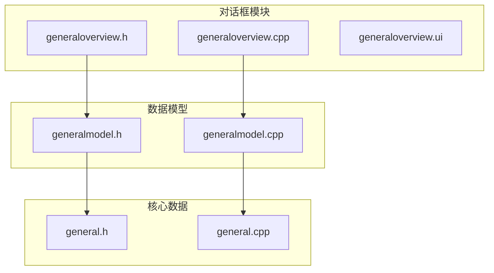
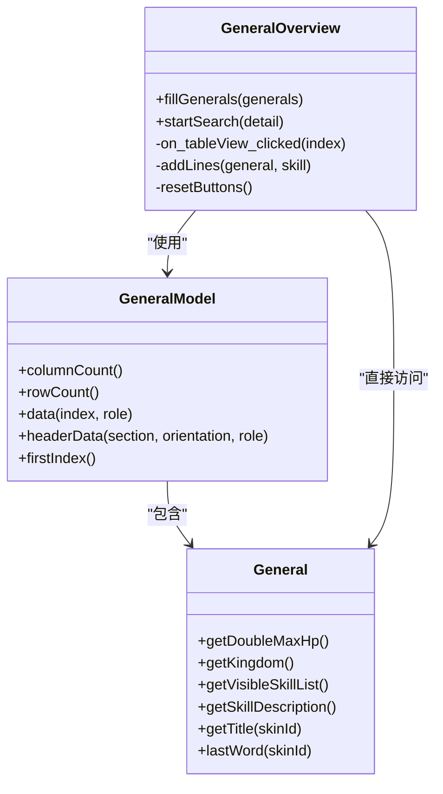
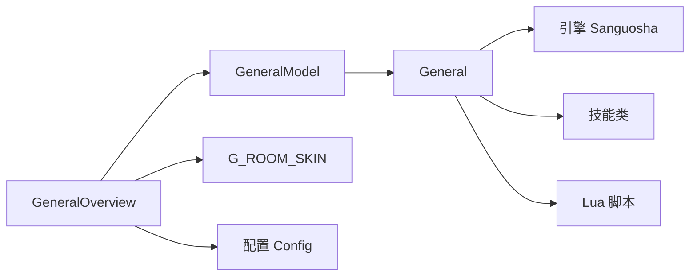

# 武将总览对话框

<cite>
**本文档引用文件**  
- [generaloverview.h](file://src/dialog/generaloverview.h)
- [generaloverview.cpp](file://src/dialog/generaloverview.cpp)
- [generalmodel.h](file://src/dialog/generalmodel.h)
- [generalmodel.cpp](file://src/dialog/generalmodel.cpp)
- [general.h](file://src/core/general.h)
- [general.cpp](file://src/core/general.cpp)
</cite>

## 目录
1. [引言](#引言)
2. [项目结构](#项目结构)
3. [核心组件](#核心组件)
4. [架构概览](#架构概览)
5. [详细组件分析](#详细组件分析)
6. [依赖分析](#依赖分析)
7. [性能考虑](#性能考虑)
8. [故障排除指南](#故障排除指南)
9. [结论](#结论)

## 引言
本文档详细说明了《三国杀》游戏中“武将总览对话框”的实现机制。该功能允许玩家浏览所有可用武将的详细信息，包括武将属性、技能描述、势力分类、语音台词等。文档重点分析了 `GeneralModel` 如何从核心数据模型 `General` 中提取并组织信息，以及如何通过 Qt 的 MVC 架构实现高效的数据渲染。同时涵盖多语言支持、搜索过滤功能及自定义扩展点。

## 项目结构
武将总览功能主要由以下文件构成，采用模块化设计，分离了数据模型、视图逻辑与界面布局：



**图示来源**  
- [generaloverview.h](file://src/dialog/generaloverview.h)
- [generalmodel.h](file://src/dialog/generalmodel.h)
- [general.h](file://src/core/general.h)

**本节来源**  
- [generaloverview.h](file://src/dialog/generaloverview.h)
- [generalmodel.h](file://src/dialog/generalmodel.h)
- [general.h](file://src/core/general.h)

## 核心组件
武将总览功能的核心组件包括 `GeneralOverview`（视图控制器）、`GeneralModel`（数据模型）和 `General`（核心武将实体）。三者通过 Qt 的信号与槽机制和 MVC 模式紧密协作。

**本节来源**  
- [generaloverview.h](file://src/dialog/generaloverview.h#L1-L50)
- [generalmodel.h](file://src/dialog/generalmodel.h#L1-L20)
- [general.h](file://src/core/general.h#L1-L30)

## 架构概览
整个武将总览功能遵循 Qt 的 MVC（Model-View-Controller）设计模式，实现了数据与视图的完全解耦。



**图示来源**  
- [generaloverview.h](file://src/dialog/generaloverview.h#L1-L124)
- [generalmodel.h](file://src/dialog/generalmodel.h#L1-L63)
- [general.h](file://src/core/general.h#L1-L139)

## 详细组件分析

### GeneralModel 数据模型分析
`GeneralModel` 是一个继承自 `QAbstractTableModel` 的自定义数据模型，负责将 `General` 对象列表转换为 `QTableView` 可以显示的表格数据。

#### 数据结构与列定义
模型定义了六列数据，通过枚举 `ColumnType` 进行管理：

```cpp
enum ColumnType {
    TitleColumn,     // 称号
    NameColumn,      // 名称
    KingdomColumn,   // 势力
    GenderColumn,    // 性别
    MaxHpColumn,     // 体力
    PackageColumn,   // 包来源
    ColumnTypesCount // 列总数
};
```

#### 数据提供机制
`data()` 函数是模型的核心，根据 `QModelIndex` 和 `role` 返回对应的数据。它处理了多种角色：
- `Qt::UserRole`：返回武将的内部对象名（如 "caocao"），用于后续数据查找。
- `Qt::DisplayRole`：返回在表格中显示的文本内容，例如武将名称、势力等。
- `Qt::DecorationRole`：返回装饰性图标，如君主武将显示君主图标。
- `Qt::ToolTipRole`：返回工具提示文本，如隐藏武将的提示。
- `Qt::BackgroundRole`：返回背景色，如 Lua 扩展包的特殊背景色。

```mermaid
flowchart TD
Start([data() 函数调用]) --> CheckIndex["检查索引有效性"]
CheckIndex --> GetGeneral["根据行号获取 General 对象"]
GetGeneral --> CheckRole["检查 Role 类型"]
CheckRole --> |Qt::UserRole| ReturnName["返回 objectName"]
CheckRole --> |Qt::DisplayRole| GetDisplay["根据列获取显示文本"]
CheckRole --> |Qt::DecorationRole| GetIcon["返回图标"]
CheckRole --> |Qt::ToolTipRole| GetTip["返回提示文本"]
CheckRole --> |Qt::BackgroundRole| GetBg["返回背景色"]
GetDisplay --> CheckColumn["检查列类型"]
CheckColumn --> |TitleColumn| ReturnTitle["返回 getTitle()"]
CheckColumn --> |NameColumn| ReturnTransName["返回 Sanguosha->translate()"]
CheckColumn --> |KingdomColumn| ReturnKingdom["返回势力文本"]
CheckColumn --> |GenderColumn| ReturnGender["返回性别文本"]
CheckColumn --> |MaxHpColumn| ReturnHp["返回体力文本"]
CheckColumn --> |PackageColumn| ReturnPackage["返回包名"]
ReturnName --> End([返回 QVariant])
ReturnTitle --> End
ReturnTransName --> End
ReturnKingdom --> End
ReturnGender --> End
ReturnHp --> End
ReturnPackage --> End
GetIcon --> End
GetTip --> End
GetBg --> End
```

**图示来源**  
- [generalmodel.cpp](file://src/dialog/generalmodel.cpp#L30-L181)

**本节来源**  
- [generalmodel.h](file://src/dialog/generalmodel.h#L27-L60)
- [generalmodel.cpp](file://src/dialog/generalmodel.cpp#L26-L181)

### General 核心武将实体分析
`General` 类是武将数据的核心载体，封装了武将的所有静态属性和行为。

#### 属性与技能管理
- **基础属性**：通过构造函数初始化，包括势力 (`kingdom`)、双倍体力值 (`double_max_hp`)、性别 (`gender`)、是否为君主 (`lord`) 和是否隐藏 (`hidden`)。
- **技能管理**：使用 `QSet<QString>` 存储技能名，通过 `addSkill()` 添加技能，并提供 `getVisibleSkillList()` 等方法获取可见技能列表。
- **称号与翻译**：`getTitle()` 方法根据皮肤 ID 从 Lua 语言包中获取对应的称号，支持皮肤专属称号。

#### 技能描述生成
`getSkillDescription()` 方法负责生成完整的技能描述 HTML 字符串。它遍历所有可见技能，将技能名和描述用 HTML 标签格式化，并根据参数决定是否包含武将名称和相关技能。

```mermaid
sequenceDiagram
participant View as GeneralOverview
participant Model as GeneralModel
participant General as General
participant Engine as Sanguosha (引擎)
View->>Model : fillGenerals(generals)
Model->>Model : 构造并设置数据
View->>View : on_tableView_clicked(index)
View->>Model : 获取 index 对应的 objectName
Model-->>View : 返回 objectName (Qt : : UserRole)
View->>Engine : Sanguosha->getGeneral(objectName)
Engine-->>View : 返回 General 对象
View->>General : getSkillDescription()
General->>Engine : Sanguosha->translate(skill->objectName())
Engine-->>General : 返回技能名
General->>Engine : skill->getDescription()
Engine-->>General : 返回技能描述
General-->>View : 返回 HTML 格式的描述
View->>ui->skillTextEdit : 设置文本
```

**图示来源**  
- [general.cpp](file://src/core/general.cpp#L300-L400)
- [generaloverview.cpp](file://src/dialog/generaloverview.cpp#L500-L600)

**本节来源**  
- [general.h](file://src/core/general.h#L1-L139)
- [general.cpp](file://src/core/general.cpp#L1-L429)

### GeneralOverview 视图控制器分析
`GeneralOverview` 是主对话框类，负责界面交互、数据填充和事件处理。

#### 数据绑定与初始化
`fillGenerals()` 方法是数据绑定的入口。它接收一个武将列表，创建一个 `GeneralModel` 实例，并将其设置为 `tableView` 的模型。该方法还维护了一个 `all_generals` 映射，记录每个武将当前使用的皮肤 ID。

#### 搜索过滤功能
`GeneralSearch` 类实现了复杂的搜索功能，支持以下条件：
- **昵称/名称**：支持通配符 `?` 和 `*` 的模糊匹配。
- **性别/势力**：多选过滤。
- **体力值**：范围查询。
- **扩展包**：多选过滤。

搜索逻辑在 `startSearch()` 方法中实现，遍历 `all_generals` 中的所有武将，逐一检查是否满足所有条件。结果通过重新填充 `GeneralModel` 来更新视图。

#### 性能优化
- **结果缓存**：`all_generals` 映射缓存了所有武将及其皮肤状态，避免了重复查询。
- **懒加载**：皮肤翻译 (`tryLoadingSkinTranslation`) 在需要时才加载，减少启动开销。

#### 自定义扩展点
开发者可以通过以下方式扩展功能：
1. **添加新字段**：在 `GeneralModel::ColumnType` 中添加新的列枚举值，并在 `data()` 和 `headerData()` 方法中实现其逻辑。
2. **修改布局**：修改 `generaloverview.ui` 文件或在 `GeneralOverview` 构造函数中调整界面元素。
3. **添加新事件**：连接新的信号与槽，例如为按钮添加新功能。

**本节来源**  
- [generaloverview.h](file://src/dialog/generaloverview.h#L1-L124)
- [generaloverview.cpp](file://src/dialog/generaloverview.cpp#L1-L821)

## 依赖分析
武将总览功能依赖于多个核心模块，形成了清晰的依赖链。



**图示来源**  
- [generaloverview.cpp](file://src/dialog/generaloverview.cpp#L10-L20)
- [generalmodel.cpp](file://src/dialog/generalmodel.cpp#L10-L15)
- [general.cpp](file://src/core/general.cpp#L10-L25)

**本节来源**  
- [generaloverview.cpp](file://src/dialog/generaloverview.cpp#L1-L821)
- [generalmodel.cpp](file://src/dialog/generalmodel.cpp#L1-L181)
- [general.cpp](file://src/core/general.cpp#L1-L429)

## 性能考虑
- **数据模型效率**：`GeneralModel` 的 `data()` 方法时间复杂度为 O(1)，确保了表格滚动的流畅性。
- **搜索算法**：搜索为 O(n) 线性遍历，对于数百个武将来说性能可接受。若武将数量剧增，可考虑引入索引或预计算。
- **内存管理**：`GeneralModel` 在每次搜索时创建新实例，旧实例由 Qt 的父子对象机制自动销毁，避免内存泄漏。

## 故障排除指南
- **武将信息不显示**：检查 `all_generals` 映射是否正确填充，确认 `fillGenerals()` 被调用。
- **技能描述为空**：检查 Lua 语言包中技能描述的键名是否正确（如 `$skillname`）。
- **搜索无结果**：检查搜索条件的逻辑，特别是通配符替换和范围比较。
- **皮肤切换无效**：确认 `G_ROOM_SKIN.generalHasSkin()` 能正确检测皮肤文件是否存在。

**本节来源**  
- [generaloverview.cpp](file://src/dialog/generaloverview.cpp#L400-L800)
- [generalmodel.cpp](file://src/dialog/generalmodel.cpp#L30-L181)

## 结论
武将总览对话框是一个结构清晰、设计良好的 MVC 实现。它通过 `GeneralModel` 有效地将核心数据 `General` 与 `QTableView` 视图解耦，利用 Qt 的信号槽机制实现了高效的交互。其搜索功能灵活，支持多维度过滤，并通过缓存机制优化了性能。该设计为未来的功能扩展提供了良好的基础。