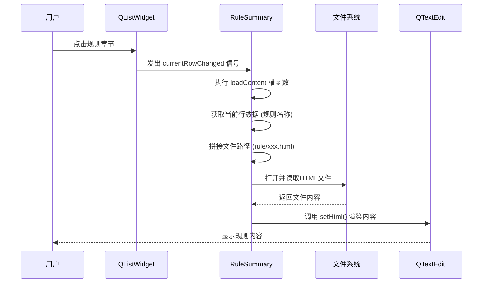
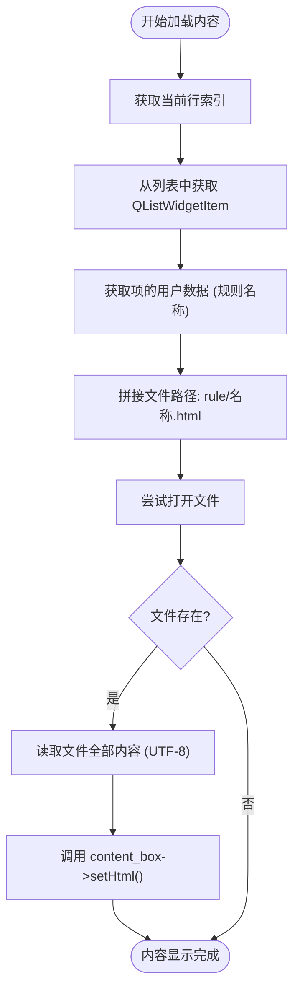
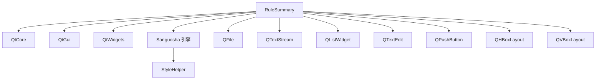

# 规则摘要对话框

<cite>
**本文档引用文件**  
- [rule-summary.h](file://src/dialog/rule-summary.h#L0-L45)
- [rule-summary.cpp](file://src/dialog/rule-summary.cpp#L0-L107)
- [hegemony.html](file://rule/hegemony.html)
- [rule1-card.html](file://rule/rule1-card.html)
- [rule2-wording.html](file://rule/rule2-wording.html)
- [rule3-extras.html](file://rule/rule3-extras.html)
- [style.css](file://rule/style.css)
</cite>

## 目录
1. [简介](#简介)
2. [项目结构](#项目结构)
3. [核心组件](#核心组件)
4. [架构概述](#架构概述)
5. [详细组件分析](#详细组件分析)
6. [依赖分析](#依赖分析)
7. [性能考量](#性能考量)
8. [故障排除指南](#故障排除指南)
9. [结论](#结论)

## 简介
“规则摘要对话框”是《三国杀·国战》游戏中的一个核心用户界面组件，用于向玩家展示游戏规则的详细说明。该对话框通过集成多个HTML格式的规则文档，提供了一个结构化、可导航的规则查阅系统。其设计目标是确保规则内容能够安全、高效地在Qt界面中渲染，并支持离线访问与快速加载。本文档全面分析该功能模块的技术实现、内容组织结构、用户交互机制以及样式兼容性处理，旨在为开发者提供清晰的维护与扩展指南。

## 项目结构
规则摘要对话框的功能实现主要依赖于两个核心目录：`src/dialog` 和 `rule`。`src/dialog` 目录下的 `rule-summary.h` 和 `rule-summary.cpp` 文件定义了对话框的类结构与业务逻辑。`rule` 目录则存放了所有以HTML格式编写的规则内容文件，这些文件构成了对话框的数据源。

```mermaid
graph TB
subgraph "源码"
A[src/dialog/rule-summary.h]
B[src/dialog/rule-summary.cpp]
end
subgraph "规则内容"
C[rule/hegemony.html]
D[rule/rule1-card.html]
E[rule/rule2-wording.html]
F[rule/rule3-extras.html]
G[rule/style.css]
end
A --> B : "头文件定义"
B --> C : "加载"
B --> D : "加载"
B --> E : "加载"
B --> F : "加载"
B --> G : "应用样式"
```

**Diagram sources**
- [rule-summary.h](file://src/dialog/rule-summary.h#L0-L45)
- [rule-summary.cpp](file://src/dialog/rule-summary.cpp#L0-L107)
- [hegemony.html](file://rule/hegemony.html)
- [rule1-card.html](file://rule/rule1-card.html)
- [rule2-wording.html](file://rule/rule2-wording.html)
- [rule3-extras.html](file://rule/rule3-extras.html)
- [style.css](file://rule/style.css)

**Section sources**
- [rule-summary.h](file://src/dialog/rule-summary.h#L0-L45)
- [rule-summary.cpp](file://src/dialog/rule-summary.cpp#L0-L107)

## 核心组件
规则摘要对话框的核心由 `RuleSummary` 类实现，该类继承自 `FlatDialog`，是一个标准的Qt模态对话框。其主要职责是管理一个侧边栏的规则列表和一个主区域的内容显示框。核心组件包括：
- **QListWidget (list)**: 位于对话框左侧，以列表形式展示所有可用的规则章节标题。
- **QTextEdit (content_box)**: 位于对话框右侧，用于渲染和显示选中规则章节的HTML内容。
- **loadContent槽函数**: 这是实现内容动态加载的关键逻辑，负责根据用户选择的列表项加载并显示对应的HTML文件。

**Section sources**
- [rule-summary.h](file://src/dialog/rule-summary.h#L0-L45)
- [rule-summary.cpp](file://src/dialog/rule-summary.cpp#L0-L107)

## 架构概述
规则摘要对话框采用了一种清晰的MVC（Model-View-Controller）变体架构。`RuleSummary` 类本身充当控制器，协调视图（列表和文本框）与模型（HTML文件）之间的交互。其工作流程如下：对话框初始化时，构建规则列表；当用户点击列表项时，触发 `currentRowChanged` 信号，该信号连接到 `loadContent` 槽函数；`loadContent` 函数根据当前行索引，拼接出对应的HTML文件路径，读取文件内容，并将其设置为 `QTextEdit` 的HTML内容进行渲染。



**Diagram sources**
- [rule-summary.cpp](file://src/dialog/rule-summary.cpp#L81-L106)

## 详细组件分析

### RuleSummary 类分析
`RuleSummary` 类的构造函数负责初始化整个对话框的UI布局和数据。

#### 初始化与布局
构造函数首先设置窗口标题，并根据操作系统调整对话框的尺寸。接着，创建 `QListWidget` 用于显示规则列表，并设置其宽度。同时，创建一个“关闭”按钮，并将其 `clicked` 信号连接到对话框的 `reject` 槽，实现关闭功能。UI布局采用 `QHBoxLayout` 将内容显示框和包含列表与按钮的 `QVBoxLayout` 并排排列。

#### 规则列表构建
规则列表的构建是通过 `Sanguosha->getModScenarioNames()` 获取所有模组场景名称，并检查对应的HTML文件是否存在。随后，将预定义的四个核心规则文件（`hegemony`, `rule1-card`, `rule2-wording`, `rule3-extras`）添加到列表中。对于列表中的每一项，使用 `Sanguosha->translate(name)` 获取其本地化后的显示名称，并将原始的文件名（如 `hegemony`）作为用户数据（`Qt::UserRole`）存储在 `QListWidgetItem` 中，以便后续加载时使用。

#### 内容加载机制
`loadContent(int row)` 是实现动态内容加载的核心槽函数。它接收当前选中项的行索引作为参数。函数首先从 `list` 的指定行获取 `QListWidgetItem`，并从中提取存储的用户数据（即规则名称）。然后，使用该名称拼接出完整的文件路径（`rule/%1.html`）。接着，创建 `QFile` 对象尝试打开该文件。如果文件成功打开，使用 `QTextStream` 以UTF-8编码读取全部内容，并最终调用 `content_box->setHtml(content)` 将HTML内容渲染到文本框中。此过程确保了内容的安全加载和离线可用性。



**Diagram sources**
- [rule-summary.cpp](file://src/dialog/rule-summary.cpp#L81-L106)

**Section sources**
- [rule-summary.cpp](file://src/dialog/rule-summary.cpp#L41-L84)

### 规则内容文件分析
规则内容以独立的HTML文件形式存放于 `rule` 目录下，这种模块化设计便于维护和更新。

- **hegemony.html**: 包含国战模式的核心规则，如游戏目标、准备阶段、游戏流程、角色死亡、奖惩方式、游戏结束条件以及“珠联璧合”和“君主规则”等关键概念。
- **rule1-card.html**: 详细列出国战模式中使用的卡牌，包括野心家牌、体力牌、武将牌和游戏牌（基本牌、锦囊牌、装备牌）的数量与具体构成。
- **rule2-wording.html**: 对国战模式中特有的术语进行精确解释，如“明置”、“暗置”、“叠置”、“珠联璧合”、“阵法技”、“围攻”等，是理解游戏机制的基础。
- **rule3-extras.html**: 提供额外的规则说明和常见问题解答，例如【空城】技能的时机变更和死亡角色亮牌规则。

所有HTML文件均引用 `style.css` 文件以确保渲染样式与应用程序的整体UI风格一致。`QTextEdit` 组件能够很好地解析和渲染这些HTML内容，实现了样式兼容性。

**Section sources**
- [hegemony.html](file://rule/hegemony.html)
- [rule1-card.html](file://rule/rule1-card.html)
- [rule2-wording.html](file://rule/rule2-wording.html)
- [rule3-extras.html](file://rule/rule3-extras.html)
- [style.css](file://rule/style.css)

## 依赖分析
规则摘要对话框的实现依赖于多个Qt核心模块和项目内部组件。



**Diagram sources**
- [rule-summary.h](file://src/dialog/rule-summary.h#L0-L45)
- [rule-summary.cpp](file://src/dialog/rule-summary.cpp#L0-L107)

**Section sources**
- [rule-summary.h](file://src/dialog/rule-summary.h#L0-L45)
- [rule-summary.cpp](file://src/dialog/rule-summary.cpp#L0-L107)

## 性能考量
该实现方案在性能方面表现良好。规则文件以静态HTML形式存储，加载时只需进行一次文件I/O操作，速度非常快。`QTextEdit` 组件对HTML的渲染效率较高，能够满足即时显示的需求。通过将内容缓存在本地文件系统，确保了离线可用性和快速响应，避免了网络延迟。列表项的用户数据存储机制也使得内容加载的查找过程非常高效。

## 故障排除指南
- **问题：规则列表为空或内容无法显示。**
  - **检查点1**：确认 `rule` 目录下的HTML文件（`hegemony.html`, `rule1-card.html` 等）是否存在且文件名拼写正确。
  - **检查点2**：检查 `rule-summary.cpp` 中 `loadContent` 函数的文件路径拼接逻辑，确保路径前缀 `rule/` 正确无误。
  - **检查点3**：确认HTML文件的编码为UTF-8，`QTextStream` 已正确设置 `setCodec("UTF-8")`。
  - **检查点4**：检查 `Sanguosha->translate(name)` 是否能正确返回翻译后的字符串，若返回空可能导致列表项显示异常。

- **问题：HTML样式未生效。**
  - **检查点**：确认HTML文件中的 `<link>` 标签指向的 `style.css` 路径是否正确（`./rule/style.css`），并确保该CSS文件存在于指定位置。

**Section sources**
- [rule-summary.cpp](file://src/dialog/rule-summary.cpp#L81-L106)

## 结论
规则摘要对话框是一个设计精良、实现高效的帮助系统组件。它通过将规则内容与UI逻辑分离，实现了内容的模块化和可维护性。利用Qt的 `QTextEdit` 组件安全地渲染HTML内容，结合简单的文件加载机制，保证了功能的稳定性和响应速度。其清晰的代码结构和明确的依赖关系，为未来的功能扩展（如添加新的规则章节）提供了便利。开发者只需在 `rule` 目录下创建新的HTML文件，并在 `rule-summary.cpp` 的列表构建逻辑中添加相应的条目即可，无需修改核心加载逻辑，确保了向后兼容性。