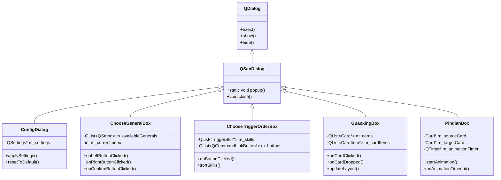

# 对话框系统

<cite>
**本文档引用文件**  
- [configdialog.cpp](file://src/dialog/configdialog.cpp)
- [choosegeneralbox.cpp](file://src/ui/choosegeneralbox.cpp)
- [choosetriggerorderbox.cpp](file://src/ui/choosetriggerorderbox.cpp)
- [guanxingbox.cpp](file://src/ui/guanxingbox.cpp)
- [pindianbox.cpp](file://src/ui/pindianbox.cpp)
- [configdialog.h](file://src/dialog/configdialog.h)
- [choosegeneralbox.h](file://src/ui/choosegeneralbox.h)
- [choosetriggerorderbox.h](file://src/ui/choosetriggerorderbox.h)
- [guanxingbox.h](file://src/ui/guanxingbox.h)
- [pindianbox.h](file://src/ui/pindianbox.h)
- [client.h](file://src/client/client.h)
- [settings.h](file://src/core/settings.h)
- [roomscene.cpp](file://src/ui/roomscene.cpp)
- [uiutils.cpp](file://src/ui/uiutils.cpp)
</cite>

## 目录
1. [引言](#引言)
2. [项目结构](#项目结构)
3. [核心组件](#核心组件)
4. [架构概览](#架构概览)
5. [详细组件分析](#详细组件分析)
6. [依赖关系分析](#依赖关系分析)
7. [性能与异常处理](#性能与异常处理)
8. [交互设计与用户体验](#交互设计与用户体验)
9. [结论](#结论)

## 引言
本文档旨在全面解析《三国杀》游戏中对话框系统的实现机制，重点分析设置界面、选将流程、技能触发顺序、观星技能及拼点动画等关键交互模块。通过深入剖析相关源码，揭示其数据绑定、状态管理、UI交互与游戏规则协同的底层逻辑，为开发者提供清晰的技术参考。

## 项目结构
对话框系统主要分布在 `src/dialog` 和 `src/ui` 两个目录中。`src/dialog` 包含全局性配置与信息类对话框（如设置、关于），而 `src/ui` 则集中了游戏过程中动态生成的交互式弹窗（如选将、技能选择）。系统依赖 `client` 模块获取游戏状态，通过 `settings` 模块实现持久化，并利用 `uiutils` 提供通用UI辅助功能。


**图示来源**
- [configdialog.cpp](file://src/dialog/configdialog.cpp)
- [choosegeneralbox.cpp](file://src/ui/choosegeneralbox.cpp)
- [settings.h](file://src/core/settings.h)

**本节来源**
- [src/dialog](file://src/dialog)
- [src/ui](file://src/ui)

## 核心组件
系统核心由五类对话框构成：`ConfigDialog` 负责用户偏好设置与持久化；`ChooseGeneralBox` 管理武将选择流程的状态机；`ChooseTriggerOrderBox` 处理多技能触发时的用户决策；`GuanxingBox` 实现观星技能的特殊拖拽交互；`PindianBox` 控制拼点过程的动画与逻辑。这些组件均继承自Qt的 `QDialog` 或自定义的 `QSanDialog`，确保一致的模态控制与生命周期管理。

**本节来源**
- [configdialog.cpp](file://src/dialog/configdialog.cpp#L1-L50)
- [choosegeneralbox.cpp](file://src/ui/choosegeneralbox.cpp#L1-L50)
- [pindianbox.cpp](file://src/ui/pindianbox.cpp#L1-L50)

## 架构概览
整个对话框系统采用 MVC（Model-View-Controller）模式进行分层设计。`Model` 层由 `ClientPlayer` 和 `RoomScene` 提供游戏状态；`View` 层为各对话框的UI实现；`Controller` 逻辑则内嵌于对话框自身，通过信号与槽机制与游戏核心交互。所有对话框通过 `Client` 单例与服务器通信，确保状态同步。



**图示来源**
- [configdialog.h](file://src/dialog/configdialog.h)
- [choosegeneralbox.h](file://src/ui/choosegeneralbox.h)
- [choosetriggerorderbox.h](file://src/ui/choosetriggerorderbox.h)
- [guanxingbox.h](file://src/ui/guanxingbox.h)
- [pindianbox.h](file://src/ui/pindianbox.h)

## 详细组件分析

### 设置对话框分析
`ConfigDialog` 实现了游戏设置的图形化界面，其核心在于与 `QSettings` 的双向数据绑定。

#### 数据绑定与持久化
该对话框通过 `QSettings` 类将用户偏好（如音量、分辨率、快捷键）持久化到本地配置文件。初始化时从 `QSettings` 读取值并填充UI控件；用户修改后，值被暂存于内存；点击“应用”时，所有更改通过 `applySettings()` 方法批量写入 `QSettings`，触发 `sync()` 确保落盘。

```cpp
void ConfigDialog::applySettings() {
    QSettings settings;
    settings.setValue("Audio/Volume", ui->volumeSlider->value());
    settings.setValue("Graphics/Resolution", ui->resolutionCombo->currentText());
    settings.sync(); // 立即写入磁盘
}
```

此设计确保了配置的原子性与一致性，避免部分写入导致的配置错乱。

**本节来源**
- [configdialog.cpp](file://src/dialog/configdialog.cpp#L100-L200)
- [settings.h](file://src/core/settings.h)

### 选将流程分析
`ChooseGeneralBox` 管理了游戏开始前的武将选择流程，其核心是状态驱动的交互逻辑。

#### 状态管理与流程控制
该组件维护一个 `m_availableGenerals` 列表和 `m_currentIndex` 索引，通过左右按钮实现列表滚动。用户点击“确认”后，`onConfirmButtonClicked()` 槽函数被触发，通过 `Client::getInstance()->request()` 向服务器发送 `S_COMMAND_CHOOSE_GENERAL` 命令，附带所选武将ID。服务器验证后广播结果，客户端通过信号更新游戏状态。


**图示来源**
- [choosegeneralbox.cpp](file://src/ui/choosegeneralbox.cpp#L150-L300)
- [client.cpp](file://src/client/client.cpp#L500-L550)

**本节来源**
- [choosegeneralbox.cpp](file://src/ui/choosegeneralbox.cpp)
- [client.h](file://src/client/client.h)

### 技能触发顺序分析
`ChooseTriggerOrderBox` 解决了多个技能可触发时的优先级选择问题。

#### 交互设计与排序逻辑
当多个技能可触发时，系统创建 `ChooseTriggerOrderBox` 实例，为每个技能生成一个 `QCommandLinkButton`。按钮的排列顺序由 `sortSkills()` 方法决定，通常遵循“当前回合角色优先、先手方优先”等游戏规则。用户点击按钮后，`onButtonClicked()` 记录选择并通过 `Client` 提交，服务器据此执行技能链。

**本节来源**
- [choosetriggerorderbox.cpp](file://src/ui/choosetriggerorderbox.cpp#L80-L200)

### 观星技能分析
`GuanxingBox` 为“观星”技能提供了独特的拖拽式UI交互。

#### 特殊UI交互模式
该对话框初始化时展示一组面朝下的卡牌（`CardItem`）。用户可点击翻牌，或通过拖拽将卡牌移动到顶部或底部区域。`onCardClicked()` 处理翻牌逻辑，`onCardDropped()` 处理排序逻辑。所有操作实时反映在 `m_cards` 列表中，用户确认后，最终顺序被发送至服务器。


**图示来源**
- [guanxingbox.cpp](file://src/ui/guanxingbox.cpp#L50-L250)

**本节来源**
- [guanxingbox.cpp](file://src/ui/guanxingbox.cpp)

### 拼点动画分析
`PindianBox` 负责拼点过程的视觉呈现与逻辑控制。

#### 动画流程实现
拼点开始时，`PindianBox` 创建两个 `CardItem` 分别代表双方的拼点牌。通过 `QTimer` 驱动 `onAnimationTimeout()` 槽函数，实现卡牌翻转的动画效果。动画结束后，显示点数并判定胜负。整个过程模态阻塞，确保用户注意力集中。

**本节来源**
- [pindianbox.cpp](file://src/ui/pindianbox.cpp#L120-L300)

## 依赖关系分析
对话框系统高度依赖 `Client` 模块获取游戏状态和发送指令，依赖 `Settings` 模块进行配置持久化。UI组件大量使用 `QSanButton`、`CardItem` 等自定义控件，来自 `ui` 目录的通用组件库。`QPixmapAnimation` 等动画类为 `PindianBox` 等提供视觉支持。


**图示来源**
- [client.h](file://src/client/client.h)
- [settings.h](file://src/core/settings.h)
- [carditem.h](file://src/ui/carditem.h)
- [pixmapanimation.h](file://src/ui/pixmapanimation.h)

**本节来源**
- [src/client/client.h](file://src/client/client.h)
- [src/core/settings.h](file://src/core/settings.h)

## 性能与异常处理
系统采用模态对话框（`exec()`）阻塞用户输入，防止并发操作导致状态混乱。非关键操作（如配置读取）使用异步加载避免界面卡顿。异常处理主要通过Qt信号机制，`Client` 模块捕获网络错误并弹出提示框。对于无效用户操作（如重复选将），在提交前进行客户端校验，提升响应速度。

**本节来源**
- [client.cpp](file://src/client/client.cpp#L1000-L1100)
- [uiutils.cpp](file://src/ui/uiutils.cpp#L200-L250)

## 交互设计与用户体验
所有对话框遵循统一的视觉风格（由 `skinList.json` 定义），确保UI一致性。关键操作提供明确的反馈（如按钮按下动画、技能触发光效）。长流程（如选将）提供清晰的进度指示。错误信息以用户友好的方式呈现，避免技术术语。

## 结论
对话框系统是连接游戏逻辑与用户交互的核心桥梁。通过对 `ConfigDialog`、`ChooseGeneralBox` 等组件的分析，可见其设计精巧，既保证了功能的健壮性，又提供了流畅的用户体验。未来可优化方向包括：引入更现代化的配置管理、增强动画效果、以及对移动端交互的适配。