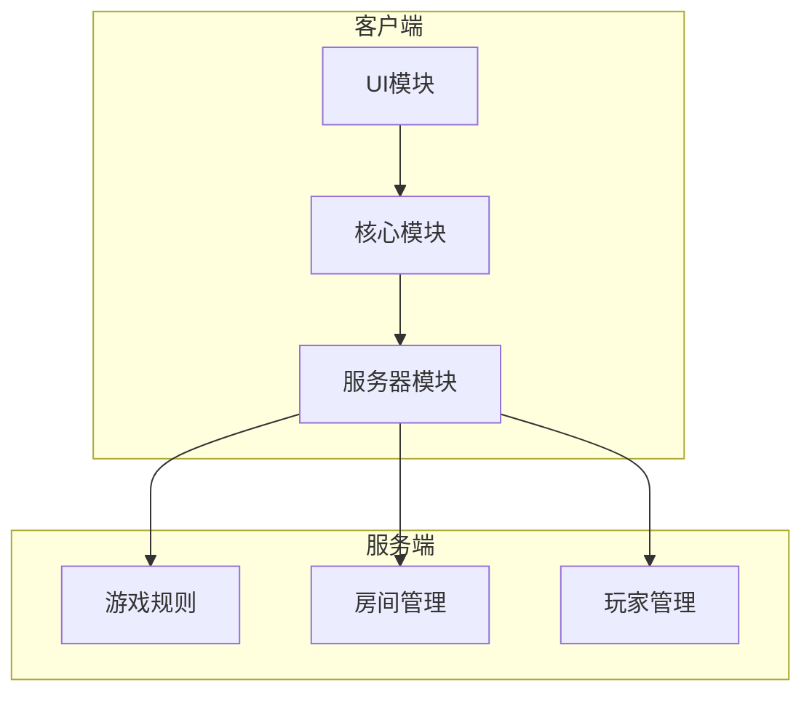
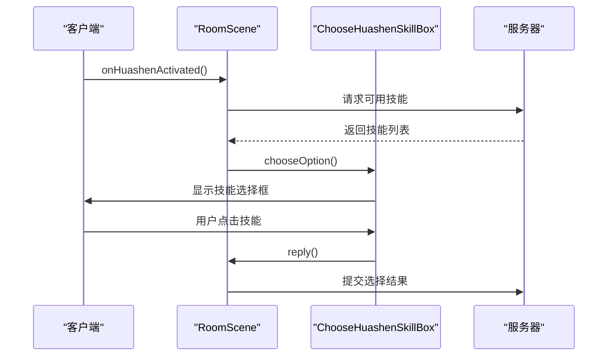
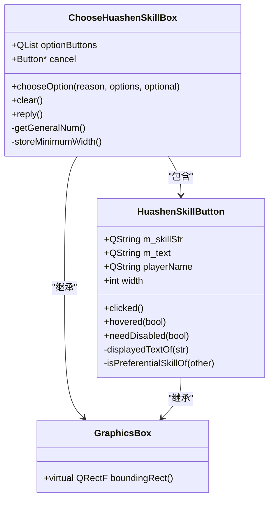
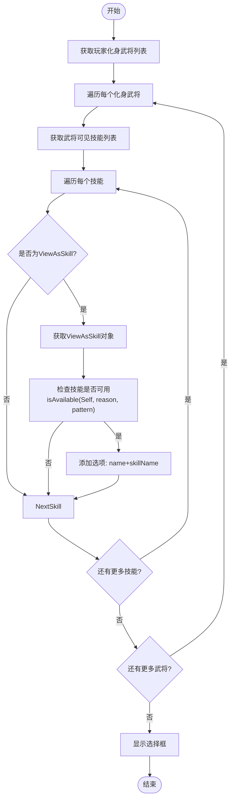
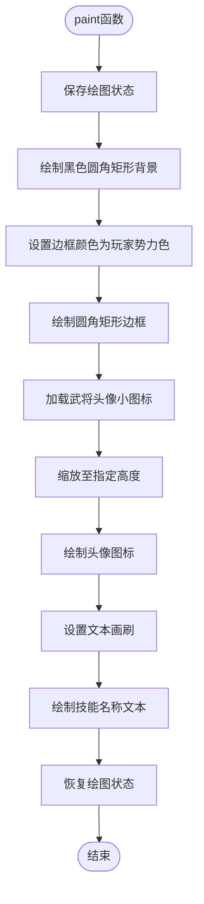
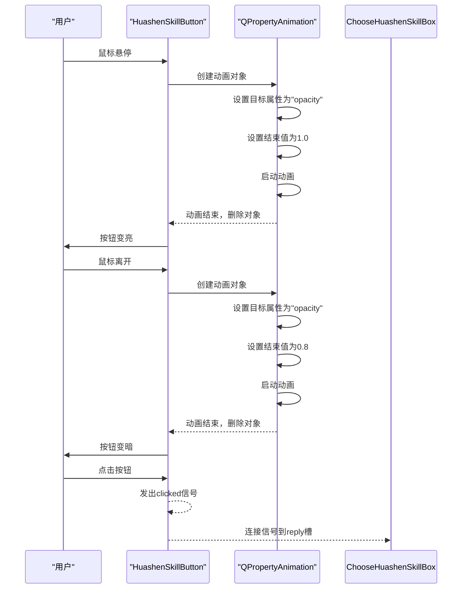
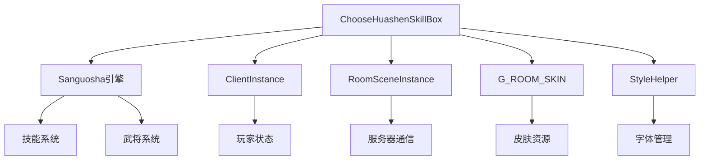

# 化身技能选择

<cite>
**本文档中引用的文件**   
- [choosehuashenskillbox.cpp](file://src/ui/choosehuashenskillbox.cpp#L1-L332)
- [choosehuashenskillbox.h](file://src/ui/choosehuashenskillbox.h#L1-L102)
- [roomscene.cpp](file://src/ui/roomscene.cpp#L3185-L3222)
- [transformation.cpp](file://src/package/transformation.cpp#L550-L770)
- [roomthread.cpp](file://src/server/roomthread.cpp#L256-L485)
</cite>

## 目录
1. [简介](#简介)
2. [项目结构](#项目结构)
3. [核心组件](#核心组件)
4. [架构概述](#架构概述)
5. [详细组件分析](#详细组件分析)
6. [依赖分析](#依赖分析)
7. [性能考虑](#性能考虑)
8. [故障排除指南](#故障排除指南)
9. [结论](#结论)

## 简介
本文档全面解析了《三国杀·霸业》中化身技能选择功能的实现机制。该功能允许玩家从其化身武将池中选择可用技能，是游戏“化身”系统的核心交互环节。文档重点阐述了`choosehuashenskillbox`模块如何与游戏核心规则集成，详细描述了技能列表的生成逻辑、用户选择的处理流程以及客户端与服务器的状态同步机制。

## 项目结构
项目采用典型的客户端-服务器架构，`choosehuashenskillbox`功能位于客户端UI层，负责处理用户与化身技能选择的交互。

**图示来源**
- [choosehuashenskillbox.cpp](file://src/ui/choosehuashenskillbox.cpp#L1-L332)
- [roomscene.cpp](file://src/ui/roomscene.cpp#L3185-L3222)

**本节来源**
- [choosehuashenskillbox.cpp](file://src/ui/choosehuashenskillbox.cpp#L1-L332)
- [project_structure](file://#L1-L100)

## 核心组件
`choosehuashenskillbox`模块由两个核心类构成：`ChooseHuashenSkillBox`和`HuashenSkillButton`。前者是主控对话框，负责管理整个选择流程；后者是单个技能按钮，负责渲染和响应用户交互。

**本节来源**
- [choosehuashenskillbox.h](file://src/ui/choosehuashenskillbox.h#L1-L102)

## 架构概述
化身技能选择功能的架构涉及客户端UI、游戏引擎和服务器逻辑的紧密协作。当玩家触发化身技能时，客户端会向服务器请求可用技能列表，服务器根据游戏规则生成选项，客户端再将这些选项渲染为可交互的按钮。

**图示来源**
- [roomscene.cpp](file://src/ui/roomscene.cpp#L3185-L3222)
- [choosehuashenskillbox.cpp](file://src/ui/choosehuashenskillbox.cpp#L210-L293)

## 详细组件分析

### ChooseHuashenSkillBox 类分析
`ChooseHuashenSkillBox`是技能选择对话框的主类，继承自`GraphicsBox`，负责管理技能按钮的布局、显示和用户交互。

#### 类图

**图示来源**
- [choosehuashenskillbox.h](file://src/ui/choosehuashenskillbox.h#L41-L100)
- [choosehuashenskillbox.cpp](file://src/ui/choosehuashenskillbox.cpp#L1-L332)

#### 技能列表生成逻辑
技能列表的生成是一个多步骤的验证过程，确保只有符合条件的技能才会出现在选择框中。

**图示来源**
- [roomscene.cpp](file://src/ui/roomscene.cpp#L3185-L3222)
- [choosehuashenskillbox.cpp](file://src/ui/choosehuashenskillbox.cpp#L246-L293)

**本节来源**
- [roomscene.cpp](file://src/ui/roomscene.cpp#L3185-L3222)
- [choosehuashenskillbox.cpp](file://src/ui/choosehuashenskillbox.cpp#L246-L293)

### HuashenSkillButton 类分析
`HuashenSkillButton`类负责单个技能按钮的渲染和交互，是用户界面的直接组成部分。

#### 按钮渲染流程

**图示来源**
- [choosehuashenskillbox.cpp](file://src/ui/choosehuashenskillbox.cpp#L70-L100)

#### 用户交互处理

**图示来源**
- [choosehuashenskillbox.cpp](file://src/ui/choosehuashenskillbox.cpp#L100-L172)

**本节来源**
- [choosehuashenskillbox.cpp](file://src/ui/choosehuashenskillbox.cpp#L70-L172)

## 依赖分析
`choosehuashenskillbox`模块依赖于多个核心系统，形成了一个复杂的依赖网络。

**图示来源**
- [choosehuashenskillbox.cpp](file://src/ui/choosehuashenskillbox.cpp#L1-L332)
- [project_structure](file://#L1-L100)

**本节来源**
- [choosehuashenskillbox.cpp](file://src/ui/choosehuashenskillbox.cpp#L1-L332)

## 性能考虑
该模块在性能方面有以下考虑：
1. **动画性能**：使用`QPropertyAnimation`实现平滑的悬停动效，动画结束后自动删除对象，避免内存泄漏。
2. **资源复用**：通过`G_ROOM_SKIN`全局对象管理皮肤资源，避免重复加载。
3. **内存管理**：在`clear()`函数中使用`deleteLater()`安全地清理按钮对象，防止野指针。
4. **布局优化**：通过`storeMinimumWidth()`预计算最小宽度，避免重复的字体度量计算。

## 故障排除指南
### 常见问题及解决方案
- **问题**：技能选择框未显示
  - **原因**：`onHuashenActivated`未被正确调用
  - **解决方案**：检查`RoomScene`中的技能按钮连接

- **问题**：技能按钮无响应
  - **原因**：`HuashenSkillButton`未正确设置接受鼠标事件
  - **解决方案**：确保`setAcceptedMouseButtons(Qt::LeftButton)`被调用

- **问题**：技能描述不正确
  - **原因**：`displayedTextOf`函数解析特殊符号（如`->`和`'`）失败
  - **解决方案**：检查字符串分割逻辑，确保正则表达式匹配正确

**本节来源**
- [choosehuashenskillbox.cpp](file://src/ui/choosehuashenskillbox.cpp#L172-L210)
- [roomscene.cpp](file://src/ui/roomscene.cpp#L3222-L3250)

## 结论
`choosehuashenskillbox`模块是《三国杀·霸业》中一个设计精良的UI组件，它通过清晰的类结构、高效的渲染逻辑和流畅的用户交互，实现了复杂的化身技能选择功能。该模块与游戏核心系统紧密集成，确保了游戏规则的正确执行。其模块化的设计使得功能易于维护和扩展，为游戏的“化身”系统提供了坚实的基础。