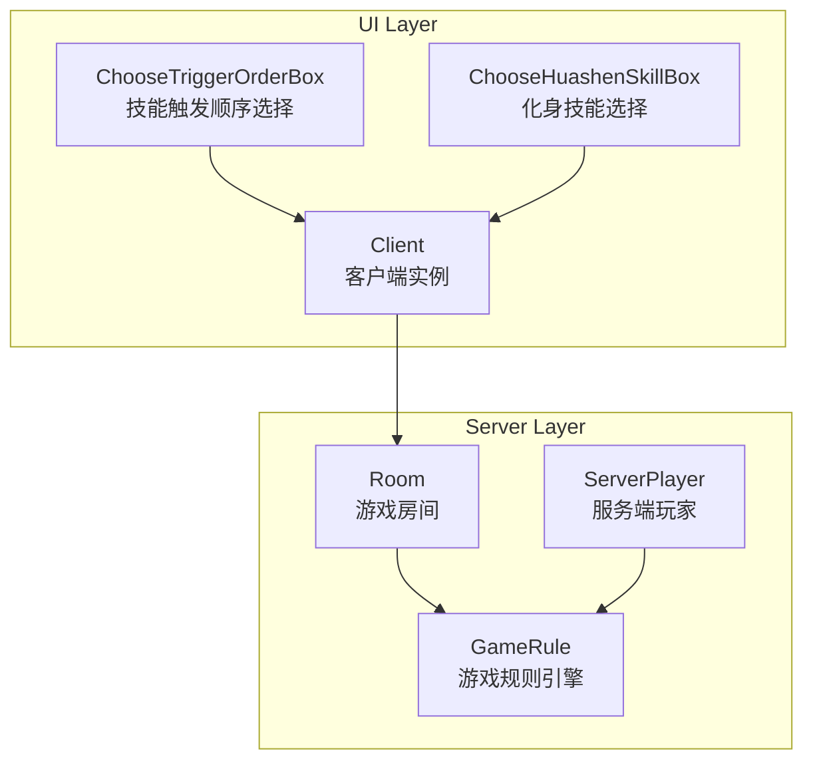

# 技能交互对话框

<cite>
**本文档引用文件**  
- [choosetriggerorderbox.cpp](file://src/ui/choosetriggerorderbox.cpp)
- [choosehuashenskillbox.cpp](file://src/ui/choosehuashenskillbox.cpp)
- [gamerule.cpp](file://src/server/gamerule.cpp)
</cite>

## 目录
1. [项目结构分析](#项目结构分析)  
2. [核心组件解析](#核心组件解析)  
3. [技能触发顺序选择机制](#技能触发顺序选择机制)  
4. [化身技能选择机制](#化身技能选择机制)  
5. [技能优先级判定与冲突处理](#技能优先级判定与冲突处理)  
6. [用户输入响应与超时处理](#用户输入响应与超时处理)  
7. [与游戏规则引擎的集成](#与游戏规则引擎的集成)  
8. [典型技能冲突场景示例](#典型技能冲突场景示例)

## 项目结构分析

本项目为《三国杀·霸业》的客户端实现，采用C++与Qt框架开发，支持Lua脚本扩展。项目结构清晰，按功能模块划分，主要目录包括：

- `src/core`：核心游戏逻辑、卡牌、武将、技能等基础类
- `src/server`：服务端逻辑，包括房间管理、规则引擎（gamerule.cpp）
- `src/ui`：用户界面组件，包含各类对话框实现
- `src/lua`：Lua脚本支持与绑定
- `lang/zh_CN`：中文语言包
- `extensions`：扩展模式脚本

重点关注 `src/ui` 目录下的对话框实现，特别是技能交互相关的 `choosetriggerorderbox.cpp` 和 `choosehuashenskillbox.cpp`，以及服务端规则控制的 `gamerule.cpp`。



**图示来源**  
- [choosetriggerorderbox.cpp](file://src/ui/choosetriggerorderbox.cpp)
- [choosehuashenskillbox.cpp](file://src/ui/choosehuashenskillbox.cpp)
- [gamerule.cpp](file://src/server/gamerule.cpp)

## 核心组件解析

### ChooseTriggerOrderBox 类
负责处理多个技能同时触发时的顺序选择。当多个技能的触发时机（TriggerEvent）相同时，系统会弹出此对话框，由玩家手动选择执行顺序。

### ChooseHuashenSkillBox 类
实现“化身”机制下的技能选择。玩家在特定条件下可激活化身技能，此对话框用于展示可选技能并接收用户选择。

### GameRule 类
游戏的核心规则引擎，继承自 `TriggerSkill`，监听全局事件（如游戏开始、回合开始、阶段变更等），是技能触发逻辑的中枢。

**组件来源**  
- [choosetriggerorderbox.cpp](file://src/ui/choosetriggerorderbox.cpp#L1-L50)
- [choosehuashenskillbox.cpp](file://src/ui/choosehuashenskillbox.cpp#L1-L50)
- [gamerule.cpp](file://src/server/gamerule.cpp#L1-L50)

## 技能触发顺序选择机制

### 功能概述
当同一事件（如 `EventPhaseStart`）触发多个技能时，`ChooseTriggerOrderBox` 会生成一个选择对话框，列出所有可触发的技能，供玩家决定执行顺序。

### 实现流程
1. **选项生成**：服务端通过 `room->askForTriggerOrder()` 发送技能列表。
2. **UI 构建**：`chooseOption()` 方法接收技能列表，为每个技能创建 `TriggerOptionButton`。
3. **用户交互**：玩家点击按钮选择技能，或点击“取消”。
4. **结果反馈**：调用 `reply()` 方法，通过 `ClientInstance->onPlayerChooseTriggerOrder()` 将选择结果发送回服务端。

### 代码分析
```cpp
void ChooseTriggerOrderBox::chooseOption(const QString &reason, const QStringList &options, const bool optional)
{
    this->options = options;
    this->optional = optional;
    title = Sanguosha->translate(reason);
    ...
    foreach (const QString &option, options) {
        QStringList pair = option.split(":");
        if (pair.last().startsWith(generalShowStringHead))
            continue;
        TriggerOptionButton *button = new TriggerOptionButton(this, pair.first(), pair.last(), width);
        ...
        connect(button, &TriggerOptionButton::clicked, this, &ChooseTriggerOrderBox::reply);
    }
    ...
}
```
该方法解析 `options` 列表，为每个技能创建按钮，并建立点击信号到 `reply()` 的连接。

**来源**  
- [choosetriggerorderbox.cpp](file://src/ui/choosetriggerorderbox.cpp#L200-L250)

## 化身技能选择机制

### 功能概述
`ChooseHuashenSkillBox` 专用于“化身”类技能的激活选择。与 `ChooseTriggerOrderBox` 类似，但更专注于单个技能的激活决策。

### 实现流程
1. **选项生成**：服务端确定可激活的化身技能列表。
2. **UI 构建**：`chooseOption()` 方法为每个技能创建 `HuashenSkillButton`。
3. **用户交互**：玩家选择技能或取消。
4. **结果反馈**：调用 `reply()` 方法，通过 `RoomSceneInstance->onHuashenSkillActivated()` 通知场景。

### 代码分析
```cpp
void ChooseHuashenSkillBox::chooseOption(const QString &reason, const QStringList &options, const bool optional)
{
    this->options = options;
    this->optional = optional;
    title = Sanguosha->translate(reason);
    ...
    foreach (const QString &option, options) {
        QStringList pair = option.split(":");
        HuashenSkillButton *button = new HuashenSkillButton(this, pair.first(), pair.last(), width);
        button->setObjectName(option);
        optionButtons << button;
    }
    ...
    connect(button, &HuashenSkillButton::clicked, this, &ChooseHuashenSkillBox::reply);
}
```
此方法结构与 `ChooseTriggerOrderBox` 高度相似，体现了代码复用的设计思想。

**来源**  
- [choosehuashenskillbox.cpp](file://src/ui/choosehuashenskillbox.cpp#L150-L200)

## 技能优先级判定与冲突处理

### 优先级判定算法
系统通过 `isPreferentialSkillOf()` 方法判断技能间的优先级关系，主要依据是技能名称中的索引信息。

```cpp
bool TriggerOptionButton::isPreferentialSkillOf(const TriggerOptionButton *other) const
{
    static QRegExp rx("([_A-Za-z]+)->sgs\\d+&\\d+");
    if (!rx.exactMatch(this->m_skillStr) || !rx.exactMatch(other->m_skillStr))
        return false;

    QString thisName = this->m_skillStr.split("->").first();
    int thisIndex = this->m_skillStr.split("&").last().toInt();
    QString otherName = other->m_skillStr.split("->").first();
    int otherIndex = other->m_skillStr.split("&").last().toInt();
    return thisName == otherName && thisIndex < otherIndex;
}
```
该算法解析技能字符串（如 `"tieqi->sgs4&1"`），提取技能名（`tieqi`）和索引（`1`），若技能名相同且索引较小，则判定为优先。

### 冲突处理策略
1. **高亮与禁用**：当鼠标悬停在一个技能上时，会检查是否有更高优先级的技能。若有，则将当前技能按钮置灰（`needDisabled(true)`），实现视觉上的优先级提示。
2. **强制触发**：对于全局强制技能（`global = true` 且 `frequency = Compulsory`），系统会自动触发，无需用户选择。

```cpp
foreach (TriggerOptionButton *otherButton, optionButtons) {
    if (otherButton->isPreferentialSkillOf(button))
        connect(button, &TriggerOptionButton::hovered, otherButton, &TriggerOptionButton::needDisabled);
}
```
此代码在创建按钮时建立连接，实现悬停时的动态禁用。

**来源**  
- [choosetriggerorderbox.cpp](file://src/ui/choosetriggerorderbox.cpp#L150-L180)

## 用户输入响应与超时处理

### 用户输入响应
- **点击事件**：`mouseReleaseEvent` 触发 `clicked()` 信号。
- **悬停事件**：`hoverEnterEvent` 和 `hoverLeaveEvent` 通过 `QPropertyAnimation` 实现按钮透明度变化，提供视觉反馈。
- **结果提交**：`reply()` 方法获取 `sender()` 的对象名（即选择的技能名），并调用客户端方法上报。

### 超时自动处理
系统支持操作超时自动处理，由 `QSanCommandProgressBar` 实现。

```cpp
if (ServerInfo.OperationTimeout != 0) {
    if (!progressBar) {
        progressBar = new QSanCommandProgressBar;
        ...
        connect(progressBar, &QSanCommandProgressBar::timedOut, this, &ChooseTriggerOrderBox::reply);
    }
    progressBar->setCountdown(QSanProtocol::S_COMMAND_TRIGGER_ORDER);
    progressBar->show();
}
```
当倒计时结束，`timedOut` 信号会触发 `reply()`，若为非必选（`optional`），则默认选择“取消”；否则选择列表中的第一个技能。

**来源**  
- [choosetriggerorderbox.cpp](file://src/ui/choosetriggerorderbox.cpp#L280-L300)

## 与游戏规则引擎的集成

### 集成方式
`ChooseTriggerOrderBox` 和 `ChooseHuashenskillBox` 作为UI组件，通过事件驱动的方式与 `GameRule` 引擎深度集成。

1. **事件监听**：`GameRule` 监听 `EventPhaseStart` 等事件。
2. **触发条件判断**：在 `triggerable()` 方法中判断是否应触发技能。
3. **发起询问**：调用 `player->askForSkillInvoke()` 或 `room->askForTriggerOrder()`。
4. **UI 展示**：这些方法最终会调用客户端的 `chooseOption()`，弹出相应的对话框。
5. **结果处理**：客户端将选择结果返回，服务端根据结果执行 `effect()` 方法。

### 关键代码示例
在 `gamerule.cpp` 中：
```cpp
class GameRule_AskForArraySummon : public TriggerSkill
{
    ...
    virtual QStringList triggerable(TriggerEvent, Room *room, ServerPlayer *player, QVariant &, ServerPlayer * &) const
    {
        if (player->getPhase() != Player::Start) return QStringList();
        ...
        return (qobject_cast<const BattleArraySkill *>(skill)->getViewAsSkill()->isEnabledAtPlay(player)) ? QStringList(objectName()) : QStringList();
    }

    virtual bool cost(TriggerEvent, Room *, ServerPlayer *player, QVariant &, ServerPlayer *) const
    {
        ...
        if (!player->askForSkillInvoke(objectName())) return false;
        ...
        return false;
    }
};
```
此代码定义了一个名为 `GameRule_AskForArraySummon` 的全局技能，当满足条件时，会调用 `askForSkillInvoke`，进而触发UI的技能选择流程。

**来源**  
- [gamerule.cpp](file://src/server/gamerule.cpp#L10-L50)
- [choosetriggerorderbox.cpp](file://src/ui/choosetriggerorderbox.cpp#L1-L50)

## 典型技能冲突场景示例

### 场景一：化身技能与常规技能同时触发
**描述**：玩家在“判定阶段”开始时，其化身技能“神判”和常规技能“反馈”均可触发。
**处理流程**：
1. 服务端检测到两个技能均可触发。
2. 调用 `room->askForTriggerOrder()`，发送技能列表。
3. 客户端弹出 `ChooseTriggerOrderBox`，显示“神判”和“反馈”两个选项。
4. 玩家选择执行顺序。
5. 服务端按选择顺序依次执行技能效果。

### 场景二：多个化身技能可选
**描述**：玩家拥有多个化身技能（如“神雷”、“神火”），在特定条件下均可激活。
**处理流程**：
1. 服务端确定可激活的技能列表。
2. 调用 `RoomSceneInstance->requestHuashenSkill()`。
3. 客户端弹出 `ChooseHuashenSkillBox`，列出所有可选技能。
4. 玩家选择一个技能进行激活。
5. 客户端上报选择结果，服务端执行激活逻辑。

### 场景三：技能优先级冲突
**描述**：玩家拥有两个同名但索引不同的技能，如 `tieqi->sgs4&1` 和 `tieqi->sgs4&2`。
**处理流程**：
1. 系统通过 `isPreferentialSkillOf()` 判断，`&1` 的技能优先级高于 `&2`。
2. 当鼠标悬停在 `&2` 技能上时，`&1` 技能按钮会高亮，而 `&2` 按钮会变灰，提示玩家应优先选择前者。
3. 玩家最终选择，系统按规则执行。

**来源**  
- [choosetriggerorderbox.cpp](file://src/ui/choosetriggerorderbox.cpp#L150-L180)
- [gamerule.cpp](file://src/server/gamerule.cpp#L10-L50)