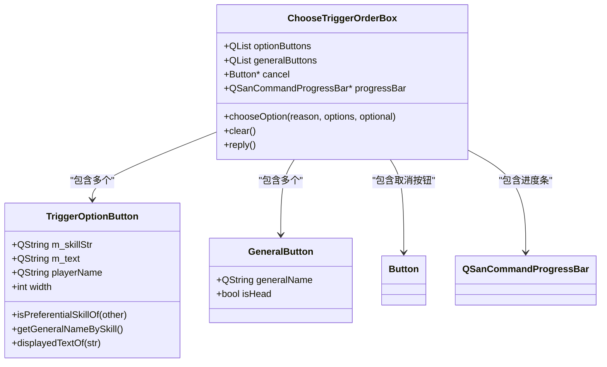
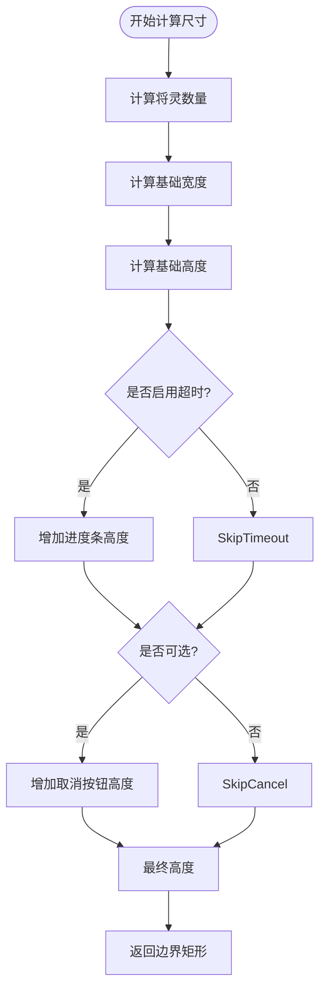
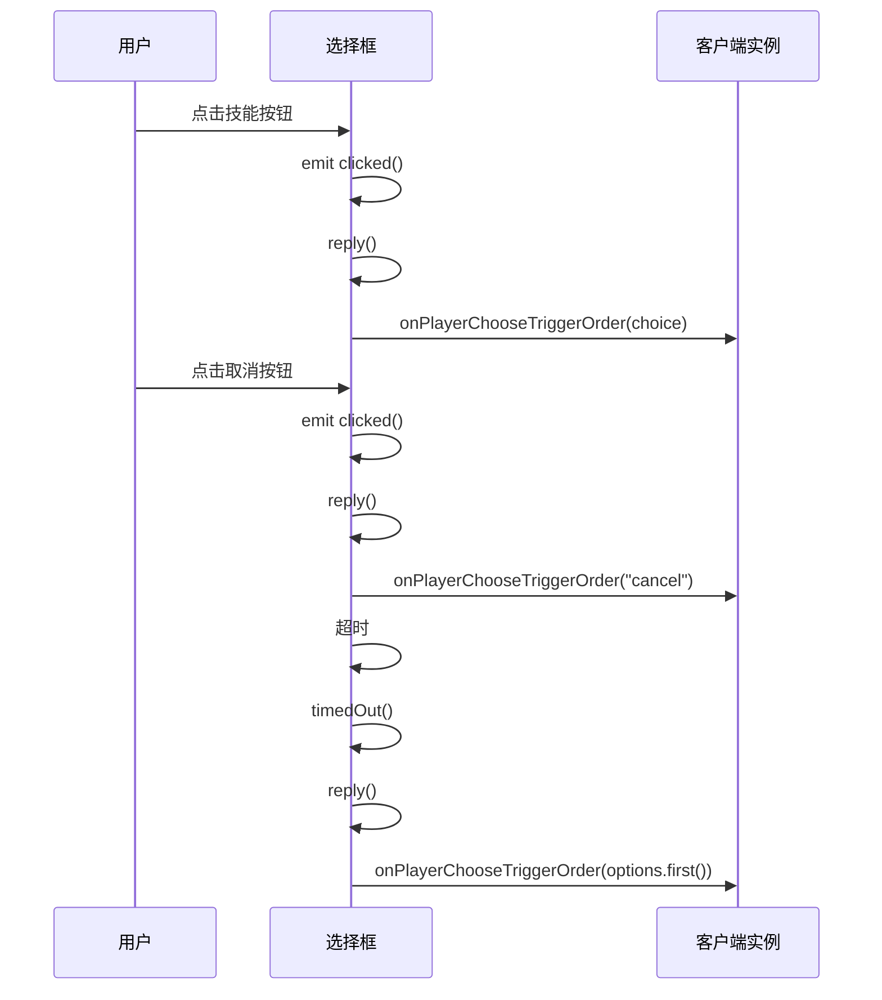

# 技能触发顺序选择

<cite>
**本文档引用文件**   
- [choosetriggerorderbox.h](file://src/ui/choosetriggerorderbox.h#L1-L130)
- [choosetriggerorderbox.cpp](file://src/ui/choosetriggerorderbox.cpp#L1-L521)
- [gamerule.cpp](file://src/server/gamerule.cpp#L1-L799)
</cite>

## 目录
1. [技能触发顺序选择机制概述](#技能触发顺序选择机制概述)
2. [核心组件分析](#核心组件分析)
3. [技能优先级判定逻辑](#技能优先级判定逻辑)
4. [UI布局与动态尺寸计算](#ui布局与动态尺寸计算)
5. [用户交互与响应机制](#用户交互与响应机制)
6. [超时自动提交与取消逻辑](#超时自动提交与取消逻辑)
7. [规则引擎联动机制](#规则引擎联动机制)

## 技能触发顺序选择机制概述

在《三国杀》游戏中，当多个技能同时满足触发条件时，系统需要提供一个清晰的界面让用户选择技能的执行顺序。`ChooseTriggerOrderBox` 类实现了这一核心功能，它通过图形化界面展示所有可触发的技能选项，并允许玩家选择执行顺序或取消操作。该机制在多技能冲突场景下尤为重要，确保了游戏逻辑的正确性和用户体验的流畅性。

**Section sources**
- [choosetriggerorderbox.h](file://src/ui/choosetriggerorderbox.h#L1-L130)
- [choosetriggerorderbox.cpp](file://src/ui/choosetriggerorderbox.cpp#L1-L521)

## 核心组件分析

### ChooseTriggerOrderBox 类结构

`ChooseTriggerOrderBox` 是一个继承自 `GraphicsBox` 的图形化组件，负责管理技能触发顺序选择的整体流程。其主要职责包括：
- 显示技能选项按钮
- 处理用户点击事件
- 管理超时进度条
- 提供取消操作按钮



**Diagram sources**
- [choosetriggerorderbox.h](file://src/ui/choosetriggerorderbox.h#L45-L130)
- [choosetriggerorderbox.cpp](file://src/ui/choosetriggerorderbox.cpp#L1-L521)

**Section sources**
- [choosetriggerorderbox.h](file://src/ui/choosetriggerorderbox.h#L45-L130)
- [choosetriggerorderbox.cpp](file://src/ui/choosetriggerorderbox.cpp#L1-L521)

## 技能优先级判定逻辑

### isPreferentialSkillOf 方法实现

`TriggerOptionButton` 类中的 `isPreferentialSkillOf` 方法用于判断当前技能是否具有优先于另一个技能的执行权。该方法通过解析技能字符串中的特殊符号来确定优先级关系。

```cpp
bool TriggerOptionButton::isPreferentialSkillOf(const TriggerOptionButton *other) const
{
    if (this == other)
        return true;

    static QRegExp rx("([_A-Za-z]+)->sgs\\d+&\\d+");
    if (!rx.exactMatch(this->m_skillStr) || !rx.exactMatch(other->m_skillStr))
        return false;

    QString thisName = this->m_skillStr.split("->").first();
    int thisIndex = this->m_skillStr.split("&").last().toInt();
    QString otherName = other->m_skillStr.split("->").first();
    int otherIndex = other->m_skillStr.split("&").last().toInt();
    return thisName == otherName && thisIndex < otherIndex;
}
```

#### 优先级判定算法示例

假设存在以下两个技能触发选项：
- `tieqi->sgs4&1`
- `tieqi->sgs4&2`

根据 `isPreferentialSkillOf` 方法的逻辑：
1. 验证正则表达式匹配：`([_A-Za-z]+)->sgs\d+&\d+`
2. 提取技能名称：`tieqi`
3. 提取索引值：`1` 和 `2`
4. 比较结果：`tieqi == tieqi` 且 `1 < 2`，因此第一个技能具有优先权

#### "->" 符号标记的目标关联技能排序

`->` 符号用于表示技能与目标之间的关联关系。例如 `tieqi->sgs4&1` 表示 "铁骑" 技能作用于第4号玩家的第1个目标。这种标记方式不仅明确了技能的作用对象，还通过索引值建立了技能的执行顺序。

**Section sources**
- [choosetriggerorderbox.cpp](file://src/ui/choosetriggerorderbox.cpp#L300-L320)

## UI布局与动态尺寸计算

### 界面布局策略

`ChooseTriggerOrderBox` 采用灵活的布局策略，根据技能数量和将灵配置动态调整界面尺寸。主要布局参数包括：
- `top_dark_bar`: 顶部暗色条高度
- `m_topBlankWidth`: 顶部空白宽度
- `bottom_blank_width`: 底部空白宽度
- `interval`: 元素间距
- `m_leftBlankWidth`: 左侧空白宽度

### 动态尺寸计算

`boundingRect` 方法负责计算整个选择框的边界矩形，其计算逻辑如下：

```cpp
QRectF ChooseTriggerOrderBox::boundingRect() const
{
    const int generalNum = getGeneralNum();
    int width = generalButtonSize.width();
    if (generalNum == 2)
        width += generalButtonSize.width() + interval;

    width = qMax(m_minimumWidth, width) + m_leftBlankWidth * 2;

    int height = m_topBlankWidth
        + (options.size() - generalNum) * optionButtonHeight
        + (options.size() - generalNum - 1) * interval
        + bottom_blank_width;

    if (ServerInfo.OperationTimeout != 0)
        height += 12;

    if (generalNum > 0)
        height += generalButtonSize.height() + interval;

    if (optional)
        height += cancel->boundingRect().height() + interval;

    return QRectF(0, 0, width, height);
}
```

该方法综合考虑了以下因素：
- 将灵按钮数量（0、1或2个）
- 技能选项数量
- 是否显示超时进度条
- 是否提供取消按钮



**Diagram sources**
- [choosetriggerorderbox.cpp](file://src/ui/choosetriggerorderbox.cpp#L400-L450)

**Section sources**
- [choosetriggerorderbox.cpp](file://src/ui/choosetriggerorderbox.cpp#L400-L450)

## 用户交互与响应机制

### 选项按钮动态生成

`chooseOption` 方法负责动态生成技能选项按钮：

```cpp
void ChooseTriggerOrderBox::chooseOption(const QString &reason, const QStringList &options, const bool optional)
{
    this->options = options;
    this->optional = optional;
    title = Sanguosha->translate(reason);

    storeMinimumWidth();

    prepareGeometryChange();

    // ... 创建将灵按钮 ...

    foreach (const QString &option, options) {
        QStringList pair = option.split(":");
        if (pair.last().startsWith(generalShowStringHead))
            continue;

        TriggerOptionButton *button = new TriggerOptionButton(this, pair.first(), pair.last(), width);
        button->setObjectName(option);
        foreach (TriggerOptionButton *otherButton, optionButtons) {
            if (otherButton->isPreferentialSkillOf(button))
                connect(button, &TriggerOptionButton::hovered, otherButton, &TriggerOptionButton::needDisabled);
        }
        optionButtons << button;
    }

    // ... 布局和显示 ...
}
```

关键步骤包括：
1. 存储选项列表和可选标志
2. 计算最小宽度
3. 准备几何变换
4. 创建将灵按钮（如有）
5. 遍历选项列表创建技能按钮
6. 建立优先级禁用连接
7. 执行居中显示

### 悬停交互效果

`TriggerOptionButton` 类实现了悬停交互效果，当鼠标悬停在一个技能按钮上时，具有优先级的其他技能按钮会自动变暗：

```cpp
void TriggerOptionButton::hoverEnterEvent(QGraphicsSceneHoverEvent *)
{
    QPropertyAnimation *animation = new QPropertyAnimation(this, "opacity");
    animation->setEndValue(1.0);
    animation->setDuration(100);
    animation->start(QAbstractAnimation::DeleteWhenStopped);
    emit hovered(true);
}
```

这种设计帮助玩家直观地理解技能之间的优先级关系。

**Section sources**
- [choosetriggerorderbox.cpp](file://src/ui/choosetriggerorderbox.cpp#L450-L500)

## 超时自动提交与取消逻辑

### QSanCommandProgressBar 集成

`ChooseTriggerOrderBox` 集成了 `QSanCommandProgressBar` 实现超时自动提交功能：

```cpp
if (ServerInfo.OperationTimeout != 0) {
    if (!progressBar) {
        progressBar = new QSanCommandProgressBar;
        progressBar->setMaximumWidth(boundingRect().width() - 16);
        progressBar->setMaximumHeight(12);
        progressBar->setTimerEnabled(true);
        progress_bar_item = new QGraphicsProxyWidget(this);
        progress_bar_item->setWidget(progressBar);
        progress_bar_item->setPos(boundingRect().center().x() - progress_bar_item->boundingRect().width() / 2, boundingRect().height() - 20);
        connect(progressBar, &QSanCommandProgressBar::timedOut, this, &ChooseTriggerOrderBox::reply);
    }
    progressBar->setCountdown(QSanProtocol::S_COMMAND_TRIGGER_ORDER);
    progressBar->show();
}
```

### 取消操作业务逻辑

取消按钮的业务逻辑通过 `reply` 方法统一处理：

```cpp
void ChooseTriggerOrderBox::reply()
{
    QString choice = sender()->objectName();
    if (choice.isEmpty()) {
        if (optional)
            choice = "cancel";
        else
            choice = options.first();
    }
    ClientInstance->onPlayerChooseTriggerOrder(choice);
}
```

处理逻辑如下：
1. 获取发送信号的对象名称
2. 如果为空且为可选模式，则选择"cancel"
3. 如果为空且为必选模式，则选择第一个选项
4. 通知客户端实例处理选择结果



**Diagram sources**
- [choosetriggerorderbox.cpp](file://src/ui/choosetriggerorderbox.cpp#L500-L521)

**Section sources**
- [choosetriggerorderbox.cpp](file://src/ui/choosetriggerorderbox.cpp#L500-L521)

## 规则引擎联动机制

### gamerule.cpp 中的规则引擎

`gamerule.cpp` 文件中的 `GameRule` 类是整个游戏规则的核心引擎，它通过监听各种触发事件来驱动游戏流程：

```cpp
GameRule::GameRule(QObject *parent)
    : TriggerSkill("game_rule")
{
    setParent(parent);

    events << GameStart << TurnStart
        << EventPhaseStart << EventPhaseProceeding << EventPhaseEnd << EventPhaseChanging
        // ... 其他事件 ...
        << BeforeCardsMove << CardsMoveOneTime;
}
```

### 事件处理流程

`effect` 方法处理各种游戏事件，其中与技能触发顺序相关的主要是 `EventPhaseStart` 事件：

```cpp
bool GameRule::effect(TriggerEvent triggerEvent, Room *room, ServerPlayer *player, QVariant &data, ServerPlayer *) const
{
    switch (triggerEvent) {
    case EventPhaseStart: {
        if (player->getPhase() == Player::NotActive) {
            // ... 清理回合标记 ...
        }
        break;
    }
    case EventPhaseProceeding: {
        onPhaseProceed(player);
        break;
    }
    // ... 其他事件处理 ...
    }
}
```

### 技能触发流程

当进入某个阶段时，规则引擎会检查是否有技能可以触发：

```cpp
virtual QStringList triggerable(TriggerEvent, Room *room, ServerPlayer *player, QVariant &, ServerPlayer * &) const
{
    if (player->getPhase() != Player::Start) return QStringList();
    if (room->getAlivePlayers().length() < 4) return QStringList();
    foreach (const Skill *skill, player->getVisibleSkillList()) {
        if (!skill->inherits("BattleArraySkill")) continue;
        return (qobject_cast<const BattleArraySkill *>(skill)->getViewAsSkill()->isEnabledAtPlay(player)) ? QStringList(objectName()) : QStringList();
    }
    return QStringList();
}
```

这种设计确保了技能触发顺序选择机制与游戏规则引擎的紧密耦合，保证了游戏逻辑的一致性和完整性。

**Section sources**
- [gamerule.cpp](file://src/server/gamerule.cpp#L1-L799)