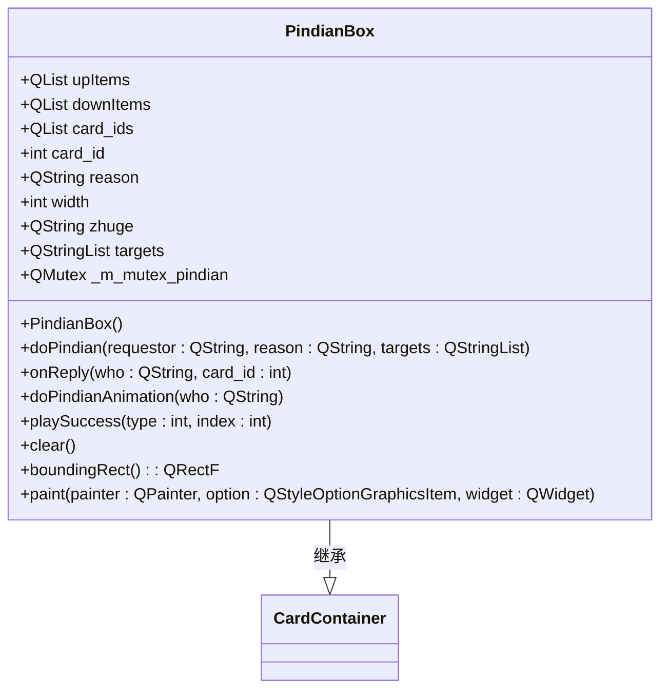
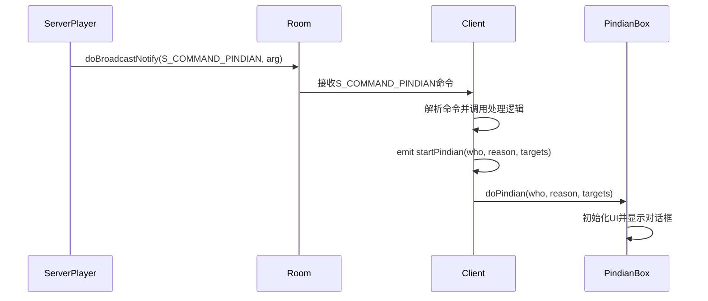
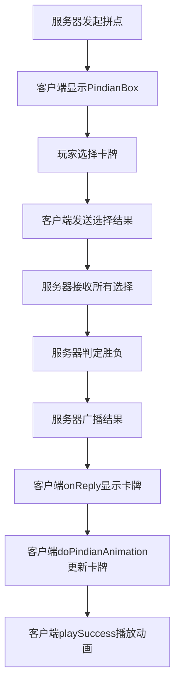

# 拼点对话框

<cite>
**本文档引用的文件**  
- [pindianbox.cpp](file://src/ui/pindianbox.cpp)
- [pindianbox.h](file://src/ui/pindianbox.h)
- [serverplayer.cpp](file://src/server/serverplayer.cpp)
- [client.cpp](file://src/client/client.cpp)
- [client.h](file://src/client/client.h)
- [protocol.h](file://src/core/protocol.h)
- [room.h](file://src/server/room.h)
</cite>

## 目录
1. [引言](#引言)
2. [核心组件分析](#核心组件分析)
3. [拼点流程的信号与槽机制](#拼点流程的信号与槽机制)
4. [异步牌选择与结果判定](#异步牌选择与结果判定)
5. [动画反馈链与UI更新](#动画反馈链与ui更新)
6. [网络通信与原子性保障](#网络通信与原子性保障)
7. [超时与重试处理策略](#超时与重试处理策略)
8. [防恶意点击机制](#防恶意点击机制)
9. [性能优化建议](#性能优化建议)
10. [总结](#总结)

## 引言

拼点是《三国杀》游戏中一种关键的交互机制，用于在两名玩家之间通过比较手牌点数来决定胜负。本技术文档全面剖析了拼点对话框（PindianBox）的实现机制，重点聚焦于 `pindianbox.cpp` 中的异步牌选择逻辑、结果即时判定、动画反馈链以及与 `ServerPlayer` 对象的信号与槽通信。文档详细说明了该组件如何确保拼点请求与响应的原子性，分析了网络中断时的重试与超时策略，并提供了防止恶意快速点击的防护措施及性能优化方案。

## 核心组件分析

拼点功能的核心实现位于 `src/ui/pindianbox.cpp` 和 `src/ui/pindianbox.h` 文件中。`PindianBox` 类继承自 `CardContainer`，负责管理拼点过程中的UI元素和用户交互。

**图示来源**
- [pindianbox.h](file://src/ui/pindianbox.h#L1-L60)
- [pindianbox.cpp](file://src/ui/pindianbox.cpp#L0-L208)

**本节来源**
- [pindianbox.h](file://src/ui/pindianbox.h#L1-L60)
- [pindianbox.cpp](file://src/ui/pindianbox.cpp#L0-L208)

## 拼点流程的信号与槽机制

拼点流程依赖于客户端与服务器之间精密的信号与槽通信，确保操作的原子性和状态同步。

1.  **服务器发起拼点请求**：当服务器端需要发起拼点时，`ServerPlayer` 对象会调用 `pindianSelect` 等方法，最终通过 `room->doBroadcastNotify(S_COMMAND_PINDIAN, arg)` 向所有客户端广播一个 `S_COMMAND_PINDIAN` 命令。
2.  **客户端接收并分发**：客户端的 `Client` 类在 `client.cpp` 中注册了对 `S_COMMAND_PINDIAN` 命令的回调函数。当收到该命令时，会触发 `handleGameEvent` 或直接调用相关处理函数。
3.  **触发UI显示**：在 `client.cpp` 的处理逻辑中，会解析命令参数，并最终通过 `emit startPindian(who, reason, targets)` 发出一个信号。
4.  **UI组件响应**：`PindianBox` 对象通过 `doPindian` 槽函数连接到 `startPindian` 信号。当信号发出时，`doPindian` 被调用，负责初始化并显示拼点对话框。

**图示来源**
- [serverplayer.cpp](file://src/server/serverplayer.cpp#L747-L822)
- [room.h](file://src/server/room.h#L220-L239)
- [client.cpp](file://src/client/client.cpp#L2137-L2169)
- [client.h](file://src/client/client.h#L444)
- [pindianbox.cpp](file://src/ui/pindianbox.cpp#L20-L60)

**本节来源**
- [serverplayer.cpp](file://src/server/serverplayer.cpp#L747-L822)
- [client.cpp](file://src/client/client.cpp#L2137-L2169)
- [pindianbox.cpp](file://src/ui/pindianbox.cpp#L20-L60)

## 异步牌选择与结果判定

拼点的核心是异步的牌选择和即时的结果判定。

1.  **异步选择**：`PindianBox::doPindian` 方法会为每个目标玩家创建一个隐藏的 `CardItem`（存储在 `upItems` 列表中），并为请求者创建一个 `CardItem`（存储在 `downItems` 列表中）。这些牌初始时是隐藏的。
2.  **响应处理**：当玩家选择并提交一张牌后，服务器会将选择结果通过网络发送回客户端。客户端的 `Client` 类接收到结果后，会调用 `PindianBox::onReply` 槽函数。
3.  **UI更新**：`onReply` 函数根据 `who` 参数判断是请求者还是目标玩家，并将对应的 `CardItem` 显示出来，同时记录下卡牌ID。
4.  **结果判定**：当所有玩家都完成选择后，服务器会计算拼点结果，并再次通过 `S_COMMAND_PINDIAN` 命令将结果广播给所有客户端。`PindianBox::doPindianAnimation` 函数被调用，它会根据结果将实际的卡牌设置到 `CardItem` 上，并调用 `update()` 触发UI重绘。

**图示来源**
- [pindianbox.cpp](file://src/ui/pindianbox.cpp#L20-L140)
- [serverplayer.cpp](file://src/server/serverplayer.cpp#L747-L822)

**本节来源**
- [pindianbox.cpp](file://src/ui/pindianbox.cpp#L20-L140)

## 动画反馈链与UI更新

拼点结果通过一系列动画和UI更新提供即时反馈。

1.  **动画触发**：`PindianBox::playSuccess` 函数是动画链的入口。它接收一个 `type` 参数（1表示成功，3表示失败）和一个 `index` 参数（目标玩家索引）。
2.  **播放动画**：该函数调用 `PixmapAnimation::GetPixmapAnimation` 为请求者和目标玩家的卡牌项播放“judgegood”或“judgebad”的动画效果。
3.  **自动清理**：在为最后一个目标玩家播放完动画后，`playSuccess` 会通过 `QTimer::singleShot(2000, this, SLOT(clear()))` 安排一个2秒后的清理任务。
4.  **资源释放**：`clear` 函数被调用后，会删除所有 `CardItem` 对象，清空列表，并隐藏对话框，完成整个拼点流程的UI清理。

**本节来源**
- [pindianbox.cpp](file://src/ui/pindianbox.cpp#L142-L178)

## 网络通信与原子性保障

整个拼点流程通过网络协议和互斥锁保证了操作的原子性。

1.  **命令定义**：在 `protocol.h` 中定义了 `S_COMMAND_PINDIAN` 命令，这是客户端与服务器通信的基石。
2.  **数据结构**：服务器端使用 `PindianStruct` 结构体来封装拼点的完整信息，包括参与者、卡牌、点数和结果。
3.  **互斥锁保护**：`PindianBox` 类内部使用了一个 `QMutex _m_mutex_pindian` 互斥锁。在 `doPindian`、`onReply`、`doPindianAnimation`、`playSuccess` 和 `clear` 等所有关键方法的开始处都调用了 `_m_mutex_pindian.lock()`，在结束前调用 `unlock()`。这确保了在多线程环境下对共享数据（如 `card_ids`、`upItems`、`downItems`）的访问是线程安全的，防止了竞态条件，从而保障了操作的原子性。

**本节来源**
- [protocol.h](file://src/core/protocol.h#L100)
- [serverplayer.cpp](file://src/server/serverplayer.cpp#L747-L822)
- [pindianbox.cpp](file://src/ui/pindianbox.cpp#L20-L178)

## 超时与重试处理策略

虽然 `pindianbox.cpp` 本身不直接处理超时，但整个系统通过上层机制来应对网络问题。

1.  **服务器端超时**：服务器在发起拼点请求后，会启动一个倒计时（Countdown）。如果在规定时间内没有收到某个玩家的响应，服务器会认为该玩家超时，并可能自动为其选择一张牌或判定其失败。
2.  **客户端重试**：如果客户端在发送选择结果时遇到网络错误（如 `NativeClientSocket` 抛出异常），`ClientSocket` 的错误处理机制会捕获该错误。虽然 `pindianbox` 不直接处理，但上层逻辑可能会提示用户或尝试重新连接。一旦连接恢复，服务器会重新同步游戏状态，确保客户端能收到正确的结果。

**本节来源**
- [serverplayer.cpp](file://src/server/serverplayer.cpp#L747-L822)
- [client.cpp](file://src/client/client.cpp#L345-L395)
- [nativesocket.cpp](file://src/util/nativesocket.cpp#L87-L131)

## 防恶意点击机制

`PindianBox` 通过以下方式防止恶意玩家通过快速点击发起多次无效请求：

1.  **单例模式与状态覆盖**：`PindianBox` 通常以单例或全局对象的形式存在。当一个新的拼点请求到来时，`doPindian` 方法会首先锁定互斥锁，然后清空之前的状态（如 `upItems`、`downItems`、`card_ids`），并用新请求的数据重新初始化。这使得旧的请求状态被完全覆盖，无法响应。
2.  **互斥锁阻塞**：由于所有关键操作都被互斥锁保护，即使有多个请求几乎同时到达，它们也会被串行化处理。第一个请求会获得锁并执行，后续请求必须等待，从而避免了并发操作导致的状态混乱。

**本节来源**
- [pindianbox.cpp](file://src/ui/pindianbox.cpp#L20-L60)

## 性能优化建议

1.  **减少UI重绘**：`update()` 调用会触发整个组件的重绘。建议在 `onReply` 和 `doPindianAnimation` 中，仅在必要时才调用 `update()`，或者考虑使用更精细的局部更新机制。
2.  **预加载动画资源**：`PixmapAnimation::GetPixmapAnimation` 在播放动画时可能会动态加载资源。建议在游戏初始化或进入房间时，预先将“judgegood”和“judgebad”等常用动画资源加载到内存中，避免在关键时刻因磁盘I/O导致卡顿。
3.  **对象池复用**：频繁地 `new` 和 `deleteLater` `CardItem` 对象会产生性能开销和内存碎片。可以实现一个 `CardItem` 对象池，在 `clear` 时不真正删除对象，而是将其回收到池中，下次 `doPindian` 时优先从池中获取，从而减少内存分配和销毁的开销。

## 总结

`PindianBox` 组件通过精心设计的信号与槽机制、线程安全的互斥锁保护以及清晰的UI状态管理，实现了高效、可靠的拼点功能。它与服务器端的 `ServerPlayer` 协同工作，确保了拼点请求与响应的原子性。虽然超时和重试由上层逻辑处理，但其内部的状态覆盖机制有效防止了恶意操作。通过实施预加载资源和对象池等优化策略，可以进一步提升其性能表现。