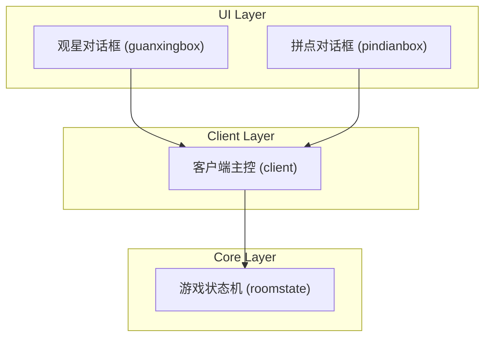
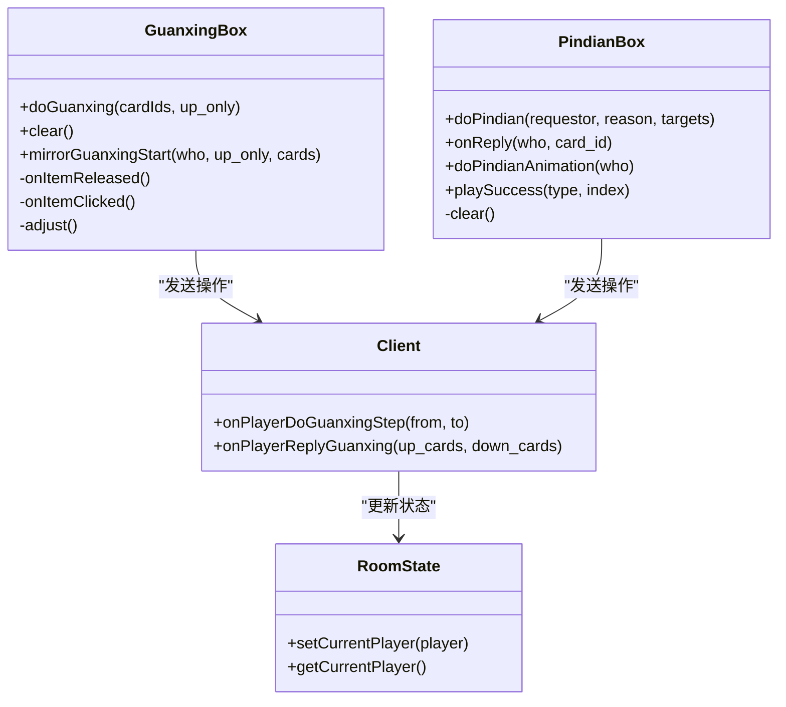
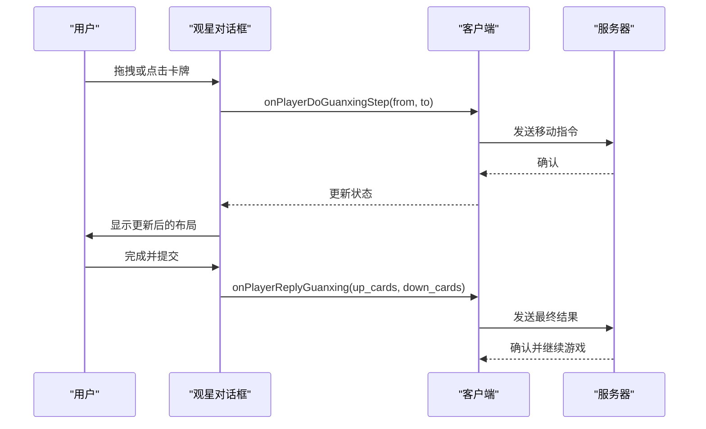
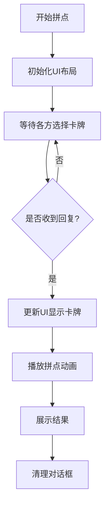
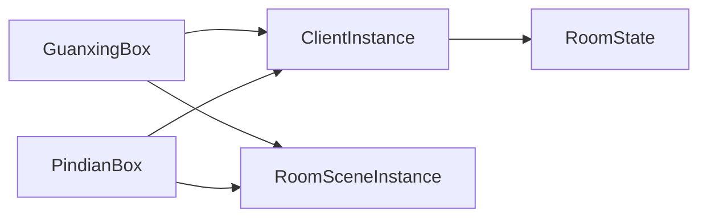

# 特殊能力对话框

<cite>
**本文档引用文件**  
- [guanxingbox.cpp](file://src/ui/guanxingbox.cpp)
- [guanxingbox.h](file://src/ui/guanxingbox.h)
- [pindianbox.cpp](file://src/ui/pindianbox.cpp)
- [pindianbox.h](file://src/ui/pindianbox.h)
- [client.cpp](file://src/client/client.cpp)
- [client.h](file://src/client/client.h)
- [roomstate.h](file://src/core/roomstate.h)
- [roomscene.h](file://src/ui/roomscene.h)
</cite>

## 目录
1. [引言](#引言)
2. [项目结构](#项目结构)
3. [核心组件](#核心组件)
4. [架构概览](#架构概览)
5. [详细组件分析](#详细组件分析)
6. [依赖分析](#依赖分析)
7. [性能考量](#性能考量)
8. [故障排除指南](#故障排除指南)
9. [结论](#结论)

## 引言
本文档全面记录了《三国杀》游戏中特殊能力对话框的实现机制，重点分析“观星”与“拼点”两种特殊技能的UI交互模式、逻辑处理及与核心游戏状态的同步机制。文档旨在为开发者提供清晰的技术实现路径，并为维护和扩展提供指导。

## 项目结构
项目采用分层架构，主要分为核心逻辑层（`core`）、客户端逻辑层（`client`）、用户界面层（`ui`）和资源层（`resource`）。特殊能力对话框位于`src/ui`目录下，作为独立的UI组件，通过信号与槽机制与`client`模块通信，实现与游戏服务器的交互。

**图示来源**
- [guanxingbox.h](file://src/ui/guanxingbox.h)
- [pindianbox.h](file://src/ui/pindianbox.h)
- [client.h](file://src/client/client.h)
- [roomstate.h](file://src/core/roomstate.h)

**本节来源**
- [project_structure](file://project_structure)

## 核心组件
本系统的核心组件是`GuanxingBox`和`PindianBox`，它们均继承自`CardContainer`，用于在游戏场景中展示和管理卡牌。这两个组件通过复杂的UI交互，实现了对游戏核心流程的中断和控制。

**本节来源**
- [guanxingbox.h](file://src/ui/guanxingbox.h#L25-L55)
- [pindianbox.h](file://src/ui/pindianbox.h#L24-L57)

## 架构概览
系统采用MVC（Model-View-Controller）模式的变体。`RoomState`作为数据模型，`GuanxingBox`和`PindianBox`作为视图，而`Client`类则充当控制器，负责协调视图与模型之间的通信。

**图示来源**
- [guanxingbox.cpp](file://src/ui/guanxingbox.cpp#L26-L363)
- [pindianbox.cpp](file://src/ui/pindianbox.cpp#L27-L208)
- [client.cpp](file://src/client/client.cpp#L2295-L2350)

## 详细组件分析

### 观星技能对话框分析
`GuanxingBox` 实现了诸葛亮“观星”技能的特殊UI交互。

#### 功能与交互
- **牌堆可视化**：`doGuanxing` 方法接收牌堆ID列表，创建`CardItem`对象并将其排列在对话框中。根据牌的数量，牌堆会自动分为一行或两行显示。
- **选择逻辑**：用户可以通过拖拽（`onItemReleased`）或点击（`onItemClicked`）来移动牌。
  - **拖拽**：根据释放位置的Y坐标判断是放入“上堆”还是“下堆”。
  - **点击**：直接在“上堆”和“下堆”之间切换。
- **动画效果**：使用`goBack(true)`方法实现牌的平滑移动动画。

#### 与核心状态同步
- **本地操作**：用户的每次移动操作都会触发`onItemReleased`或`onItemClicked`，进而调用`ClientInstance->onPlayerDoGuanxingStep(from, to)`。
- **网络同步**：`Client`类将操作序列化为JSON消息，通过`notifyServer`发送给服务器，确保所有客户端状态一致。
- **最终提交**：用户完成操作后，调用`reply()`方法，将最终的“上堆”和“下堆”牌ID列表发送给服务器。

**图示来源**
- [guanxingbox.cpp](file://src/ui/guanxingbox.cpp#L41-L180)
- [client.cpp](file://src/client/client.cpp#L2339-L2350)

**本节来源**
- [guanxingbox.cpp](file://src/ui/guanxingbox.cpp#L41-L180)
- [client.cpp](file://src/client/client.cpp#L2339-L2350)

### 拼点技能对话框分析
`PindianBox` 实现了“拼点”流程的UI交互。

#### 功能与交互
- **流程初始化**：`doPindian` 方法接收发起者、原因和目标列表，初始化UI布局，为每个目标和发起者创建一个卡牌槽位。
- **选择与比较**：参与者选择卡牌后，调用`onReply`方法，显示所选卡牌。
- **结果展示**：`doPindianAnimation` 方法用于展示拼点动画，`playSuccess` 方法通过播放“judgegood”或“judgebad”的动画来展示成功或失败。

#### 网络同步机制
- **异步响应**：`PindianBox` 使用`QMutex`（`_m_mutex_pindian`）来保证多线程环境下的数据安全，因为不同玩家的回复可能在不同时间到达。
- **状态更新**：当收到回复时，`onReply`方法会更新对应卡牌槽位的显示状态（`show()`），并记录卡牌ID。
- **动画同步**：`doPindianAnimation`由服务器指令触发，确保所有客户端的动画播放时机一致。

**图示来源**
- [pindianbox.cpp](file://src/ui/pindianbox.cpp#L32-L120)

**本节来源**
- [pindianbox.cpp](file://src/ui/pindianbox.cpp#L32-L120)

## 依赖分析
`GuanxingBox`和`PindianBox`高度依赖`Client`单例（`ClientInstance`）进行网络通信，并依赖`RoomSceneInstance`获取场景信息以进行UI定位。它们与`RoomState`没有直接依赖，而是通过`Client`间接交互，保证了UI层与核心逻辑层的解耦。

**图示来源**
- [guanxingbox.cpp](file://src/ui/guanxingbox.cpp#L41)
- [pindianbox.cpp](file://src/ui/pindianbox.cpp#L32)
- [client.cpp](file://src/client/client.cpp#L42)

**本节来源**
- [guanxingbox.cpp](file://src/ui/guanxingbox.cpp#L41)
- [pindianbox.cpp](file://src/ui/pindianbox.cpp#L32)
- [client.cpp](file://src/client/client.cpp#L42)

## 性能考量
- **内存管理**：`clear()`方法使用`deleteLater()`而非`delete`，避免在信号处理过程中直接删除对象，防止悬空指针。
- **线程安全**：`PindianBox`使用`QMutex`保护其内部状态，防止多线程并发访问导致的数据竞争。
- **布局计算**：`isOneRow()`和`itemNumberOfFirstRow()`方法根据牌堆数量和屏幕宽度动态调整布局，优化了UI的适应性。

## 故障排除指南
- **问题：观星对话框不显示**
  - **检查**：确保`ClientInstance`已正确初始化，且`doGuanxing`传入的`cardIds`列表非空。
- **问题：拼点动画不同步**
  - **检查**：确认服务器是否正确发送了`doPindianAnimation`指令，以及`PindianBox`的`_m_mutex_pindian`锁是否被正确释放。
- **问题：网络延迟导致操作丢失**
  - **容错**：系统通过`recorder`记录操作日志，在网络中断恢复后可进行状态回放，保证了操作的最终一致性。

**本节来源**
- [guanxingbox.cpp](file://src/ui/guanxingbox.cpp#L182-L188)
- [pindianbox.cpp](file://src/ui/pindianbox.cpp#L122-L128)
- [client.cpp](file://src/client/client.cpp#L2295-L2310)

## 结论
`GuanxingBox`和`PindianBox`是《三国杀》中实现复杂回合内中断逻辑的关键UI组件。它们通过精巧的事件处理、动画效果和网络同步机制，成功地将抽象的游戏规则转化为直观的用户交互。其设计遵循了高内聚、低耦合的原则，为未来扩展其他特殊技能提供了良好的范本。