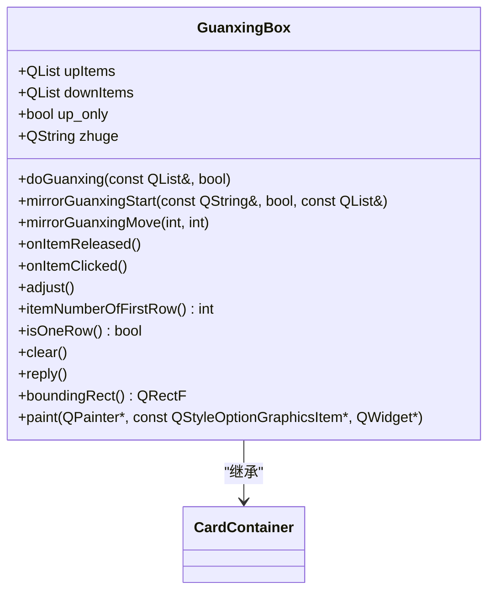
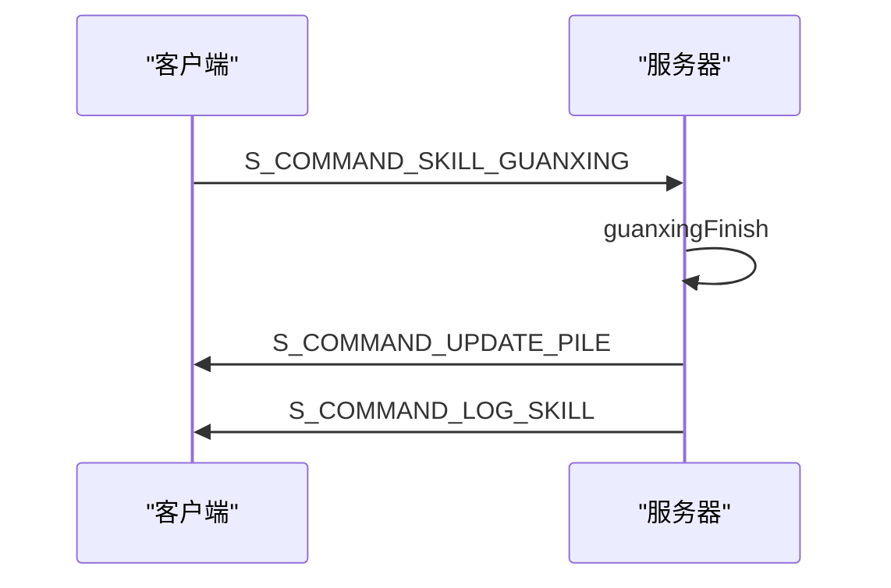

# 观星对话框

<cite>
**本文档引用的文件**   
- [guanxingbox.cpp](file://src/ui/guanxingbox.cpp#L0-L363)
- [guanxingbox.h](file://src/ui/guanxingbox.h#L0-L60)
- [client.cpp](file://src/client/client.cpp#L2265-L2346)
- [client.h](file://src/client/client.h#L371-L397)
- [room.cpp](file://src/server/room.cpp#L6750-L6793)
- [roomstate.h](file://src/core/roomstate.h#L0-L101)
</cite>

## 目录
1. [引言](#引言)
2. [核心组件分析](#核心组件分析)
3. [架构概览](#架构概览)
4. [详细组件分析](#详细组件分析)
5. [前后端同步机制](#前后端同步机制)
6. [动画与降级策略](#动画与降级策略)
7. [扩展性设计](#扩展性设计)
8. [结论](#结论)

## 引言
观星技能是《三国杀》游戏中诸葛亮的核心技能，其实现涉及复杂的UI交互、前后端数据同步和动画效果。本文档深入分析`guanxingbox.cpp`中牌堆的可视化布局、动态排序算法及用户交互逻辑，详细说明观星过程中牌堆的前后端同步机制，包括如何从RoomState获取牌堆数据、本地预览与服务器确认的双阶段提交模式。文档涵盖动画过渡效果（如牌面翻转、位移路径）的技术实现，以及在高延迟网络环境下的降级策略，并结合代码示例说明如何扩展该对话框以支持类似‘明置’或‘暗置’的变体技能。

## 核心组件分析
观星对话框的核心功能由`GuanxingBox`类实现，该类继承自`CardContainer`，负责管理观星过程中牌堆的显示和交互。`GuanxingBox`通过`doGuanxing`方法初始化牌堆，根据牌的数量动态调整布局，支持单行或多行显示。用户可以通过拖拽或点击来重新排列牌堆，`onItemReleased`和`onItemClicked`槽函数处理用户的交互事件，更新牌堆的上下位置。`adjust`方法根据牌堆的当前状态重新计算每张牌的位置，确保布局的正确性。`reply`方法将用户的选择提交给服务器，完成观星技能的执行。

**Section sources**
- [guanxingbox.cpp](file://src/ui/guanxingbox.cpp#L0-L363)
- [guanxingbox.h](file://src/ui/guanxingbox.h#L0-L60)

## 架构概览
```mermaid
graph TB
subgraph "客户端"
GuanxingBox[观星对话框]
Client[客户端]
RoomScene[房间场景]
end
subgraph "服务器"
Room[房间]
ServerPlayer[服务器玩家]
end
GuanxingBox --> Client : "发送操作"
Client --> ServerPlayer : "网络请求"
ServerPlayer --> Room : "处理请求"
Room --> ServerPlayer : "返回结果"
ServerPlayer --> Client : "通知更新"
Client --> GuanxingBox : "刷新UI"
```

**Diagram sources **
- [guanxingbox.cpp](file://src/ui/guanxingbox.cpp#L0-L363)
- [client.cpp](file://src/client/client.cpp#L2265-L2346)
- [room.cpp](file://src/server/room.cpp#L6750-L6793)

## 详细组件分析

### GuanxingBox类分析
`GuanxingBox`类是观星对话框的核心，负责管理牌堆的显示和用户交互。其主要方法包括`doGuanxing`、`onItemReleased`、`onItemClicked`、`adjust`和`reply`。



**Diagram sources **
- [guanxingbox.h](file://src/ui/guanxingbox.h#L0-L60)
- [guanxingbox.cpp](file://src/ui/guanxingbox.cpp#L0-L363)

#### doGuanxing方法
`doGuanxing`方法是观星对话框的入口，负责初始化牌堆并显示对话框。该方法接收牌ID列表和是否仅允许上置的标志，创建`CardItem`对象并添加到`upItems`列表中，然后调用`GraphicsBox::moveToCenter`将对话框居中显示。

**Section sources**
- [guanxingbox.cpp](file://src/ui/guanxingbox.cpp#L25-L100)

#### onItemReleased方法
`onItemReleased`方法处理用户释放牌的事件，根据牌的最终位置决定其是上置还是下置。该方法通过计算牌的Y坐标与中间线的相对位置来判断牌的归属，并调用`ClientInstance->onPlayerDoGuanxingStep`通知服务器用户的操作。

**Section sources**
- [guanxingbox.cpp](file://src/ui/guanxingbox.cpp#L150-L200)

#### reply方法
`reply`方法将用户的选择提交给服务器，完成观星技能的执行。该方法收集`upItems`和`downItems`中的牌ID，调用`ClientInstance->onPlayerReplyGuanxing`发送请求，并清空对话框。

**Section sources**
- [guanxingbox.cpp](file://src/ui/guanxingbox.cpp#L313-L347)

## 前后端同步机制
观星技能的实现涉及复杂的前后端同步机制。客户端通过`Client`类与服务器通信，`Client`类中的`onPlayerReplyGuanxing`方法将用户的选择封装成JSON格式的数据，通过`replyToServer`发送给服务器。服务器端的`Room`类接收到请求后，调用`guanxingFinish`方法处理观星结果，更新牌堆并通知所有客户端。



**Diagram sources **
- [client.cpp](file://src/client/client.cpp#L2265-L2346)
- [room.cpp](file://src/server/room.cpp#L6750-L6793)

### 双阶段提交模式
观星技能采用双阶段提交模式，确保用户操作的原子性和一致性。第一阶段，用户在客户端进行本地预览，通过拖拽或点击调整牌堆顺序，`onItemReleased`和`onItemClicked`方法实时更新UI。第二阶段，用户确认选择后，`reply`方法将最终结果提交给服务器，服务器验证并应用结果，更新全局状态。

**Section sources**
- [guanxingbox.cpp](file://src/ui/guanxingbox.cpp#L313-L347)
- [client.cpp](file://src/client/client.cpp#L2265-L2346)

## 动画与降级策略
观星对话框的动画效果通过`CardItem`的`goBack`方法实现，该方法使牌平滑移动到目标位置。在高延迟网络环境下，系统采用降级策略，优先保证功能的可用性。例如，当网络延迟较高时，客户端会立即更新UI，提供即时反馈，同时异步发送请求到服务器，避免用户等待。

**Section sources**
- [guanxingbox.cpp](file://src/ui/guanxingbox.cpp#L233-L276)

## 扩展性设计
`GuanxingBox`的设计具有良好的扩展性，可以通过继承或修改现有方法来支持类似‘明置’或‘暗置’的变体技能。例如，可以通过重写`doGuanxing`方法，根据技能类型调整牌的显示方式，或通过添加新的槽函数来处理不同的用户交互。

**Section sources**
- [guanxingbox.cpp](file://src/ui/guanxingbox.cpp#L0-L363)

## 结论
观星对话框的实现展示了复杂UI交互和前后端同步的优秀实践。通过`GuanxingBox`类的精心设计，系统实现了高效的牌堆管理、流畅的用户交互和可靠的网络通信。双阶段提交模式和降级策略确保了在各种网络条件下的稳定性和用户体验。未来可以通过扩展`GuanxingBox`类来支持更多变体技能，进一步丰富游戏玩法。