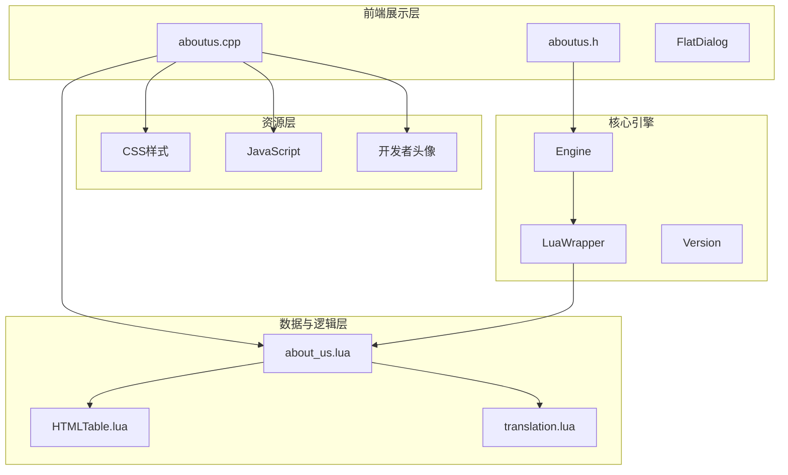
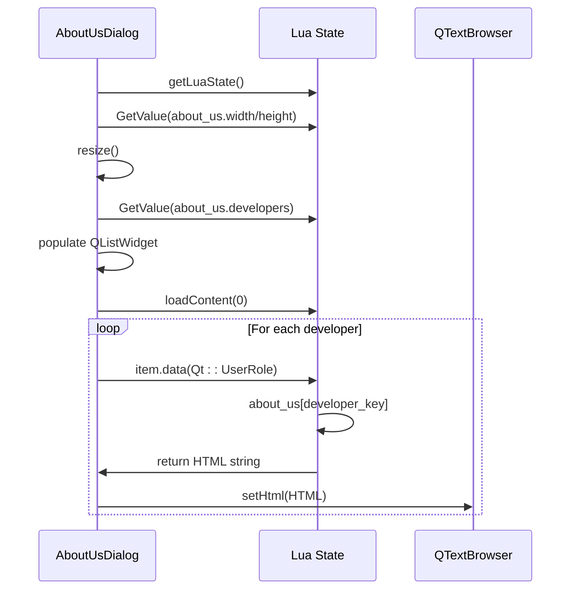

# 关于对话框

<cite>
**本文档引用的文件**  
- [aboutus.h](file://src/dialog/aboutus.h#L1-L61)
- [aboutus.cpp](file://src/dialog/aboutus.cpp#L1-L86)
- [about_us.lua](file://lua/about_us.lua#L1-L332)
- [README.md](file://README.md#L1-L273)
- [version.cpp](file://src/core/version.cpp)
</cite>

## 目录
1. [简介](#简介)
2. [项目结构分析](#项目结构分析)
3. [关于对话框内容构成](#关于对话框内容构成)
4. [技术实现机制](#技术实现机制)
5. [UI布局与交互设计](#ui布局与交互设计)
6. [多语言支持机制](#多语言支持机制)
7. [可扩展性设计](#可扩展性设计)
8. [第三方库声明与许可证展示](#第三方库声明与许可证展示)
9. [版本信息提取机制](#版本信息提取机制)
10. [总结](#总结)

## 简介

“关于对话框”是《太阳神三国杀·国战》（QSanguosha-Hegemony）客户端中的一个功能模块，用于展示项目基本信息、开发团队介绍、联系方式以及开源许可证等内容。该对话框采用模块化设计，结合C++与Lua脚本语言实现动态内容加载，支持富文本渲染和超链接跳转，具备良好的可维护性和扩展性。

该文档全面解析“关于对话框”的内容构成与技术实现，涵盖其UI结构、数据来源、动态渲染机制、多语言支持及第三方库声明等核心方面。

**Section sources**
- [aboutus.h](file://src/dialog/aboutus.h#L1-L61)
- [aboutus.cpp](file://src/dialog/aboutus.cpp#L1-L86)
- [about_us.lua](file://lua/about_us.lua#L1-L332)

## 项目结构分析

通过对项目目录结构的分析，可以确定“关于对话框”相关文件的分布：

- **C++源码**：位于 `src/dialog/` 目录下，包含 `aboutus.h` 和 `aboutus.cpp`，负责对话框的UI构建与事件处理。
- **Lua配置脚本**：位于 `lua/` 目录下，`about_us.lua` 文件定义了所有开发者信息、页面结构及HTML生成逻辑。
- **资源文件**：包括开发者头像（`image/system/developers/`）、样式表（`style-sheet/page.css`）和脚本（`ui-script/page.js`），用于富文本渲染。
- **主程序入口**：`src/main.cpp` 初始化Lua环境并加载脚本，为对话框提供数据支持。
- **版本信息**：`src/core/version.cpp` 定义了程序的版本号，可通过Lua接口访问。

这种分层结构实现了逻辑与表现的分离，便于团队协作与内容维护。



**Diagram sources**
- [aboutus.h](file://src/dialog/aboutus.h#L1-L61)
- [aboutus.cpp](file://src/dialog/aboutus.cpp#L1-L86)
- [about_us.lua](file://lua/about_us.lua#L1-L332)
- [style-sheet/page.css](file://style-sheet/page.css)
- [ui-script/page.js](file://ui-script/page.js)

**Section sources**
- [project_structure](#project_structure)

## 关于对话框内容构成

“关于对话框”由多个内容模块组成，主要分为首页和开发者个人页面两类。

### 首页内容

首页（`homepage`）包含以下信息模块：
- **项目名称**：“QSanguosha-Hegemony”
- **项目简介**：开源试验性项目，基于《三国杀·国战》
- **联系方式**：电子邮箱 `dev@qsanguosha.org`
- **开发团队**：
  - 程序员：啦啦SLG、Fsu0413 等
  - AI设计：lrl026、lzxqqqq 等
  - 美工设计：爱上穹妹的某、36李 等
  - 助理：Dear J
  - 配音人员：豚紙、墨宣砚韵 等
  - 技术顾问：太阳神上、蒋彩阳
- **特别鸣谢**：
  - 开发者QQ群二维码与链接
  - 结算顾问、AI战术顾问
  - 太阳神三国杀论坛链接

### 开发者个人页面

每个开发者拥有独立的介绍页面，包含：
- **姓名**：如“啦啦SLG”、“Fsu0413”等
- **个人简介**：1-3条文本描述
- **头像图片**：从 `image/system/developers/` 目录加载
- **个人主页链接**（可选）：通过 `HTMLTable.getHref` 生成超链接

这些内容均在 `about_us.lua` 文件中以Lua表的形式定义，便于维护和扩展。

**Section sources**
- [about_us.lua](file://lua/about_us.lua#L1-L332)

## 技术实现机制

### 动态内容加载流程

“关于对话框”的内容加载遵循以下流程：

1. **对话框初始化**：`AboutUsDialog` 构造函数调用 `Sanguosha->getLuaState()` 获取Lua状态机。
2. **读取窗口尺寸**：从Lua表 `about_us.width` 和 `about_us.height` 读取对话框宽高。
3. **加载开发者列表**：通过 `GetValueFromLuaState(L, "about_us", "developers")` 获取开发者姓名列表。
4. **构建左侧列表**：将每个开发者姓名添加到 `QListWidget`，并绑定其原始键名（如 `Yanguam`）到 `Qt::UserRole`。
5. **默认加载首页**：若开发者列表非空，则触发 `loadContent(0)` 加载第一个条目（通常是首页）。
6. **内容切换响应**：当用户点击左侧列表项时，`currentRowChanged` 信号触发 `loadContent` 槽函数。
7. **动态渲染HTML**：`loadContent` 函数根据当前项的 `UserRole` 数据（如 `homepage` 或 `Yanguam`），从Lua表中获取对应HTML字符串，并通过 `QTextBrowser::setHtml()` 渲染。



**Diagram sources**
- [aboutus.cpp](file://src/dialog/aboutus.cpp#L1-L86)
- [about_us.lua](file://lua/about_us.lua#L1-L332)

**Section sources**
- [aboutus.cpp](file://src/dialog/aboutus.cpp#L1-L86)
- [about_us.lua](file://lua/about_us.lua#L1-L332)

## UI布局与交互设计

### 布局结构

对话框采用水平布局（`QHBoxLayout`）将界面分为左右两部分：
- **左侧**：`QListWidget` 显示开发者列表，固定最大宽度为150像素。
- **右侧**：`QTextBrowser` 显示富文本内容，支持HTML和外部链接。
- **底部**：垂直布局（`QVBoxLayout`）包含列表和“关闭”按钮。

### 交互特性

- **富文本渲染**：`QTextBrowser` 启用 `setOpenExternalLinks(true)`，允许点击超链接在默认浏览器中打开。
- **滚动条样式**：通过 `StyleHelper::styleSheetOfScrollBar()` 统一设置列表和浏览器的滚动条样式。
- **工具提示**：对话框样式表中定义了 `QToolTip` 的外观，去除边框并设置白色背景。
- **响应式尺寸**：窗口大小由Lua脚本动态定义，支持灵活调整。

### 样式与资源

- **CSS样式**：通过HTML中的 `<link>` 标签引入 `style-sheet/page.css`，控制页面整体外观。
- **JavaScript**：引入 `ui-script/page.js`，可能用于增强页面交互（如动画效果）。
- **图片资源**：开发者头像和群二维码图片存储在 `image/system/developers/` 目录下，通过相对路径引用。

**Section sources**
- [aboutus.cpp](file://src/dialog/aboutus.cpp#L1-L86)
- [style-sheet/page.css](file://style-sheet/page.css)
- [ui-script/page.js](file://ui-script/page.js)

## 多语言支持机制

“关于对话框”通过Lua翻译表实现多语言支持，与 `lang/zh_CN/Common.lua` 等语言文件联动。

### 翻译流程

1. **C++侧调用翻译**：在 `aboutus.cpp` 中，使用 `Sanguosha->translate(name)` 对开发者姓名进行翻译。
2. **Lua侧定义翻译表**：在 `about_us.lua` 中，通过 `sgs.LoadTranslationTable{}` 定义键值对映射：
   ```lua
   sgs.LoadTranslationTable {
       ["Yanguam"] = "啦啦SLG",
       ["BeginnerSlob"] = "女王受·虫",
       ...
   }
   ```
3. **动态替换**：当 `translate` 函数被调用时，引擎查找对应键的中文值并返回。

### 扩展性

此机制允许在不修改C++代码的情况下，通过编辑Lua脚本添加新的翻译条目或支持其他语言（如 `lang/en_US/`），实现了内容与代码的完全解耦。

**Section sources**
- [aboutus.cpp](file://src/dialog/aboutus.cpp#L1-L86)
- [about_us.lua](file://lua/about_us.lua#L1-L332)
- [lang/zh_CN/Common.lua](file://lang/zh_CN/Common.lua)

## 可扩展性设计

“关于对话框”在设计上充分考虑了未来的可扩展性：

### 添加新开发者

只需在 `about_us.lua` 的 `pages` 表中添加新条目：
```lua
{
    [0] = "NewDeveloper",
    "这是新开发者的简介",
    HTMLTable.getHref("个人主页", "https://example.com")
}
```
系统会自动将其加入列表并生成页面。

### 添加赞助信息

可通过扩展 `HTMLTable.createListingBlock` 函数，在首页的“特别鸣谢”模块中添加新的赞助商区块，支持图片、链接和富文本。

### 添加贡献者名单

可新增一个 `contributors` 表，并在Lua中生成对应的HTML内容，通过修改 `createHomePage` 函数将其集成到首页。

### 模块化HTML生成

`HTMLTable` 类封装了HTML标签生成逻辑，提供了 `encloseInTag`、`createListingBlock` 等方法，使内容构建更加清晰和可维护。

**Section sources**
- [about_us.lua](file://lua/about_us.lua#L1-L332)

## 第三方库声明与许可证展示

根据 `README.md` 文件，项目明确声明了所使用的第三方库及其许可证：

### 使用的第三方库

- **Qt**：作为图形界面框架
- **FMOD**：作为声音引擎
- **FreeType**：用于字体渲染
- **Lua**：作为AI和扩展脚本语言

### 许可证信息

- **代码许可证**：GNU General Public License v3.0 或更高版本
- **素材许可证**：Creative Commons Attribution-NonCommercial-NoDerivatives 4.0 International (CC BY-NC-ND 4.0)

### 展示方式

虽然当前“关于对话框”未直接展示这些信息，但可通过以下方式集成：
1. 在Lua脚本中添加 `third_party` 页面，列出所有库及其许可证链接。
2. 在“特别鸣谢”模块中增加“技术依赖”子项。
3. 提供 `LICENSE` 文件的链接，供用户查阅完整条款。

**Section sources**
- [README.md](file://README.md#L1-L273)

## 版本信息提取机制

项目版本号通常在 `src/core/version.cpp` 中定义，并可通过Lua接口访问。

### 版本号定义

在 `version.cpp` 中，通常会定义类似：
```cpp
const QString Version = "2.5.0";
```

### Lua集成

可通过 `lua-wrapper.cpp` 将版本号注册到Lua全局表中，例如：
```cpp
lua_pushstring(L, Version.toStdString().c_str());
lua_setglobal(L, "QSANGUOSHA_VERSION");
```

### 对话框中使用

在 `about_us.lua` 中，可直接引用该变量：
```lua
about_us.version = QSANGUOSHA_VERSION
```
然后在首页HTML中显示：
```lua
table.insert(sectionbody, HTMLTable.createListingBlock("版本信息", "当前版本：" .. about_us.version))
```

尽管当前 `about_us.lua` 未显示版本号，但此机制为未来添加版本信息提供了技术基础。

**Section sources**
- [src/core/version.cpp](file://src/core/version.cpp)
- [src/core/lua-wrapper.cpp](file://src/core/lua-wrapper.cpp)
- [about_us.lua](file://lua/about_us.lua)

## 总结

“关于对话框”是一个设计精良、结构清晰的功能模块，它通过C++与Lua的紧密结合，实现了内容的动态化、本地化和可扩展性。其核心特点包括：

- **动态内容加载**：所有文本和链接信息由Lua脚本定义，无需重新编译即可更新。
- **富文本展示**：利用 `QTextBrowser` 和HTML/CSS/JS技术，实现美观的页面渲染。
- **多语言支持**：通过翻译表机制，无缝集成多语言功能。
- **高可扩展性**：添加新开发者或信息模块仅需修改Lua脚本。
- **开源合规**：明确声明第三方库和许可证，符合开源项目规范。

该设计模式为其他类似的“关于”或“帮助”模块提供了优秀的参考范例。