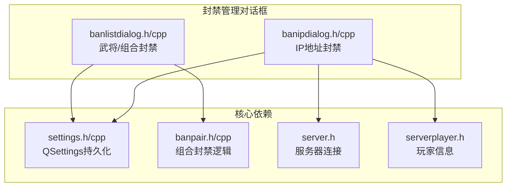
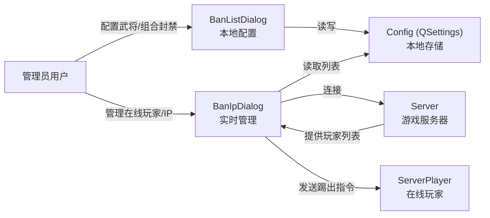
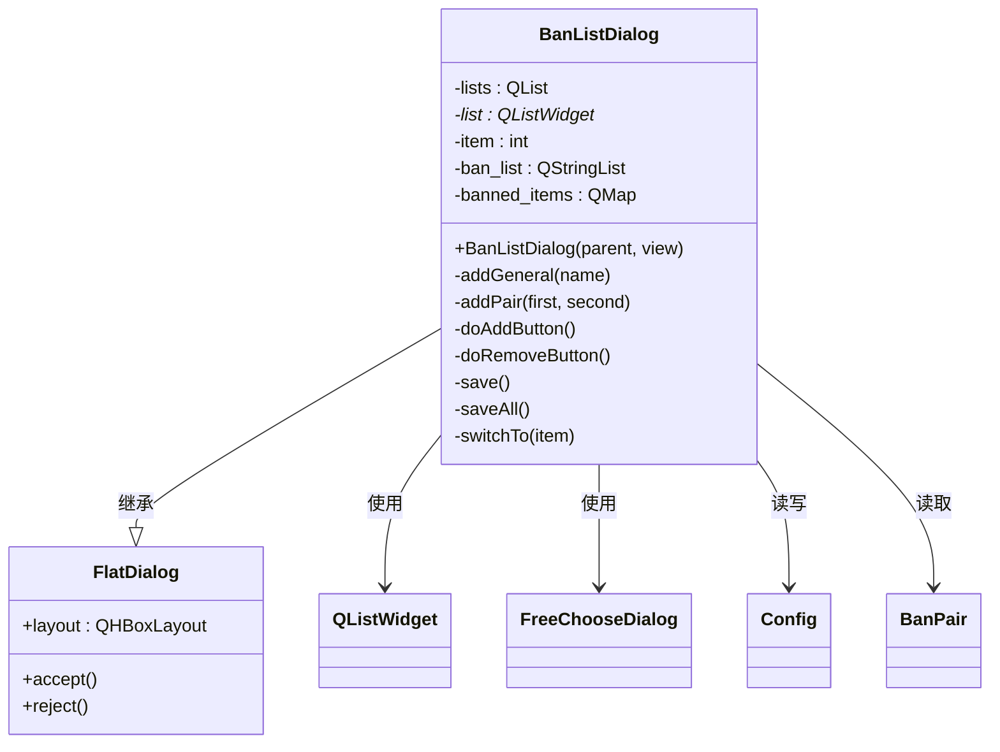
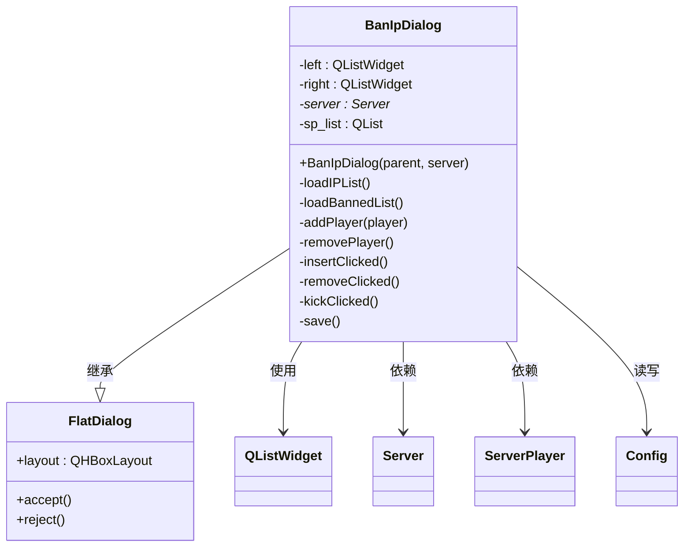
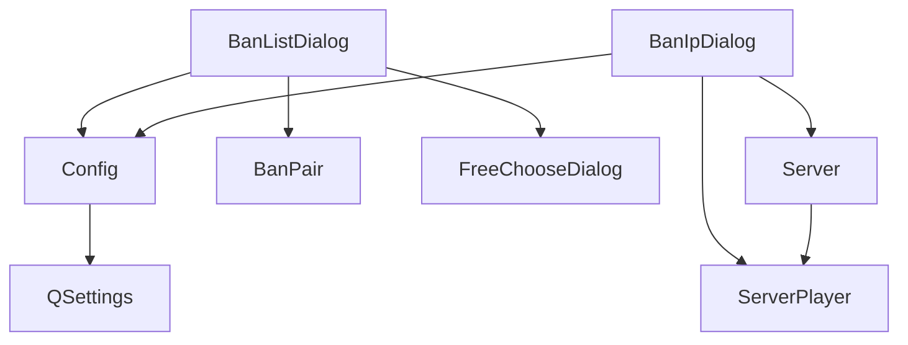

# 封禁管理对话框

<cite>
**本文档引用的文件**   
- [banlistdialog.h](file://src/dialog/banlistdialog.h#L1-L55)
- [banlistdialog.cpp](file://src/dialog/banlistdialog.cpp#L1-L180)
- [banipdialog.h](file://src/dialog/banipdialog.h#L1-L60)
- [banipdialog.cpp](file://src/dialog/banipdialog.cpp#L1-L183)
- [settings.h](file://src/core/settings.h#L1-L141)
- [settings.cpp](file://src/core/settings.cpp#L1-L170)
- [banpair.h](file://src/core/banpair.h#L1-L44)
- [banpair.cpp](file://src/core/banpair.cpp#L1-L115)
</cite>

## 目录
1. [简介](#简介)
2. [项目结构](#项目结构)
3. [核心组件](#核心组件)
4. [架构概述](#架构概述)
5. [详细组件分析](#详细组件分析)
6. [依赖分析](#依赖分析)
7. [性能考虑](#性能考虑)
8. [故障排除指南](#故障排除指南)
9. [结论](#结论)

## 简介
本文档深入解析《三国杀》游戏中的封禁管理系统，重点分析 `banlistdialog` 和 `banipdialog` 两个核心对话框的实现机制。`banlistdialog` 负责玩家账号（武将）的本地持久化封禁管理，而 `banipdialog` 则实现对IP地址的实时封禁与管理。文档将详细阐述其数据存储、权限控制、安全措施及典型使用场景。

## 项目结构
封禁管理功能主要分布在 `src/dialog` 目录下，其核心文件与相关依赖构成了一个完整的管理模块。

**图示来源**
- [banlistdialog.h](file://src/dialog/banlistdialog.h#L1-L55)
- [banipdialog.h](file://src/dialog/banipdialog.h#L1-L60)
- [settings.h](file://src/core/settings.h#L1-L141)
- [banpair.h](file://src/core/banpair.h#L1-L44)

## 核心组件
系统的核心组件包括两个对话框类 `BanListDialog` 和 `BanIpDialog`，它们均继承自 `FlatDialog`。数据持久化通过全局的 `Config` 对象（即 `Settings` 实例）完成，该对象基于 `QSettings` 实现，将封禁列表安全地存储在配置文件中。

**本节来源**
- [banlistdialog.h](file://src/dialog/banlistdialog.h#L1-L55)
- [banipdialog.h](file://src/dialog/banipdialog.h#L1-L60)
- [settings.h](file://src/core/settings.h#L1-L141)

## 架构概述
整个封禁管理系统采用客户端-服务器架构。`BanListDialog` 主要用于配置游戏规则，其数据在本地持久化，影响所有后续游戏。`BanIpDialog` 则直接与服务器交互，用于实时管理在线玩家，其操作具有即时性。

**图示来源**
- [banlistdialog.cpp](file://src/dialog/banlistdialog.cpp#L1-L180)
- [banipdialog.cpp](file://src/dialog/banipdialog.cpp#L1-L183)
- [settings.cpp](file://src/core/settings.cpp#L1-L170)

## 详细组件分析

### BanListDialog 分析
`BanListDialog` 类负责管理被禁止使用的武将和武将组合。它提供了一个标签页界面，允许管理员选择和配置封禁列表。

#### 类图

**图示来源**
- [banlistdialog.h](file://src/dialog/banlistdialog.h#L1-L55)
- [banlistdialog.cpp](file://src/dialog/banlistdialog.cpp#L1-L180)

#### 功能与流程
1.  **初始化与界面构建**：构造函数创建一个包含“武将”和“组合”两个标签页的 `QTabWidget`。每个标签页包含一个 `QListWidget` 来显示封禁项。
2.  **数据加载**：
    *   **武将**：从 `Config` 的 `Banlist/Generals` 键读取已封禁的武将列表，并调用 `addGeneral` 显示。
    *   **组合**：从 `Config` 的 `Banlist/Pairs` 键读取组合列表，并调用 `addPair` 显示。同时，它也从 `BanPair::getBanPairSet()` 获取预设的组合。
3.  **添加操作**：点击“添加”按钮会弹出 `FreeChooseDialog`，根据当前标签页类型（武将或多选）让用户选择要封禁的项，然后通过信号槽连接到 `addGeneral` 或 `addPair` 进行添加。
4.  **移除操作**：选中列表项后点击“移除”按钮，会从 `banned_items` 映射和 `QListWidget` 中删除该项。
5.  **持久化**：点击“确定”后，触发 `saveAll()`，该函数会遍历所有标签页，调用 `save()` 将当前 `QListWidget` 中的数据写回 `Config` 对应的键，并调用 `BanPair::loadBanPairs()` 更新内存中的封禁状态。

**本节来源**
- [banlistdialog.cpp](file://src/dialog/banlistdialog.cpp#L1-L180)
- [banpair.cpp](file://src/core/banpair.cpp#L1-L115)

### BanIpDialog 分析
`BanIpDialog` 类用于实时管理服务器上的玩家连接，可以查看在线玩家、将其踢出或加入IP封禁列表。

#### 类图

**图示来源**
- [banipdialog.h](file://src/dialog/banipdialog.h#L1-L60)
- [banipdialog.cpp](file://src/dialog/banipdialog.cpp#L1-L183)

#### 功能与流程
1.  **初始化与界面构建**：构造函数接收一个 `Server` 指针，并构建一个左右分栏的界面。左侧 `left` 显示在线玩家（昵称::IP），右侧 `right` 显示已封禁的IP列表。
2.  **数据加载**：
    *   **在线玩家**：通过 `loadIPList()` 遍历服务器的所有房间和玩家，将非离线和非机器人的玩家信息（昵称和IP）添加到左侧列表，并建立 `sp_list` 索引。
    *   **已封禁IP**：通过 `loadBannedList()` 从 `Config` 的 `BannedIP` 键读取列表并显示在右侧。
3.  **事件绑定**：对话框与服务器的 `newPlayer` 信号连接，当有新玩家加入时自动调用 `addPlayer` 更新列表。同时，为每个 `ServerPlayer` 的 `disconnected` 信号连接 `removePlayer`，以便玩家离开时从列表中移除。
4.  **操作流程**：
    *   **插入封禁** (`insertClicked`)：将左侧选中玩家的IP（格式化为 `::xxx.xxx.xxx.xxx`）添加到右侧的封禁列表。
    *   **移除封禁** (`removeClicked`)：从右侧封禁列表中删除选中的IP。
    *   **踢出玩家** (`kickClicked`)：向左侧选中玩家对应的 `ServerPlayer` 对象发送 `kick()` 命令，强制其断开连接。
5.  **持久化**：点击“确定”后，触发 `save()`，将右侧 `QListWidget` 中的所有IP地址写回 `Config` 的 `BannedIP` 键。

**本节来源**
- [banipdialog.cpp](file://src/dialog/banipdialog.cpp#L1-L183)
- [settings.cpp](file://src/core/settings.cpp#L1-L170)

## 依赖分析
封禁管理模块的依赖关系清晰，各组件职责分明。

**图示来源**
- [banlistdialog.h](file://src/dialog/banlistdialog.h#L1-L55)
- [banipdialog.h](file://src/dialog/banipdialog.h#L1-L60)
- [settings.h](file://src/core/settings.h#L1-L141)

## 性能考虑
*   **数据加载**：`BanListDialog` 在初始化时会一次性加载所有封禁数据，对于大型列表可能有轻微延迟，但属于可接受范围。
*   **实时性**：`BanIpDialog` 通过信号槽机制与服务器实时同步玩家状态，保证了管理界面的即时性。
*   **存储效率**：使用 `QSet` 进行内部数据去重和查找，保证了 `isBanned` 等判断操作的高效性。

## 故障排除指南
*   **问题**：在 `BanListDialog` 中无法添加武将。
  *   **检查**：确认 `FreeChooseDialog` 是否正常弹出。检查 `Sanguosha->translate()` 是否能正确返回武将名称。
*   **问题**：封禁的IP在重启后失效。
  *   **检查**：确认 `Config.setValue("BannedIP", ...)` 是否成功执行。检查配置文件（如 `config.ini`）是否具有写入权限。
*   **问题**：`BanIpDialog` 中看不到在线玩家。
  *   **检查**：确认传入的 `Server` 指针是否有效。检查服务器是否已启动并有玩家连接。

**本节来源**
- [banipdialog.cpp](file://src/dialog/banipdialog.cpp#L1-L183)
- [settings.cpp](file://src/core/settings.cpp#L1-L170)

## 结论
`banlistdialog` 和 `banipdialog` 两个对话框共同构成了一个功能完备的封禁管理系统。前者通过 `QSettings` 实现了武将和组合的本地持久化配置，后者则通过与服务器的实时交互实现了对在线玩家和IP的动态管理。两者均利用了信号槽机制保证了界面的响应性和数据的一致性，是游戏管理功能中不可或缺的部分。