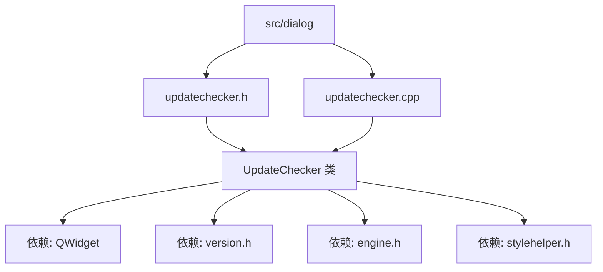
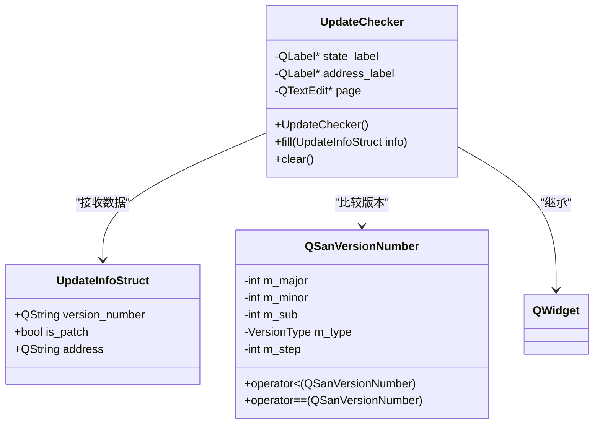
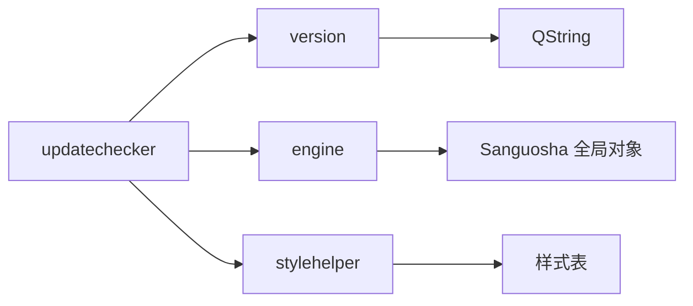

# 版本更新检查器

<cite>
**本文档引用文件**  
- [updatechecker.h](file://src/dialog/updatechecker.h)
- [updatechecker.cpp](file://src/dialog/updatechecker.cpp)
- [version.h](file://src/core/version.h)
- [version.cpp](file://src/core/version.cpp)
</cite>

## 目录
1. [简介](#简介)
2. [项目结构](#项目结构)
3. [核心组件](#核心组件)
4. [架构概述](#架构概述)
5. [详细组件分析](#详细组件分析)
6. [依赖分析](#依赖分析)
7. [性能考虑](#性能考虑)
8. [故障排除指南](#故障排除指南)
9. [结论](#结论)

## 简介
本文件详细记录了《三国杀：霸业》客户端中 `updatechecker` 模块的实现机制。该模块负责检测客户端是否为最新版本，向用户展示更新信息，并提供下载链接。文档涵盖版本检测逻辑、用户界面交互、数据结构设计以及与本地版本信息的对比机制。尽管当前代码未直接实现网络通信功能，但其设计为集成远程更新检查预留了接口。本文档旨在为开发者和维护者提供清晰的技术参考。

## 项目结构
`updatechecker` 模块是 `QSanguosha-For-Hegemony` 项目的一部分，位于 `src/dialog` 目录下。它是一个典型的 Qt Widgets 应用程序组件，主要由头文件和源文件构成，负责构建一个用于展示更新信息的用户界面。



**图示来源**
- [updatechecker.h](file://src/dialog/updatechecker.h#L1-L47)
- [updatechecker.cpp](file://src/dialog/updatechecker.cpp#L1-L91)

## 核心组件
`updatechecker` 模块的核心是 `UpdateChecker` 类，它继承自 `QWidget`，用于创建一个可嵌入到主窗口或其他对话框中的更新信息面板。该类通过 `fill` 方法接收更新信息并动态填充 UI，通过 `clear` 方法重置界面。

**组件来源**
- [updatechecker.h](file://src/dialog/updatechecker.h#L1-L47)
- [updatechecker.cpp](file://src/dialog/updatechecker.cpp#L1-L91)

## 架构概述
该模块采用 MVC（Model-View-Controller）模式的简化形式。`UpdateInfoStruct` 结构体作为数据模型，`UpdateChecker` 类既是视图也是控制器，负责渲染数据和处理用户交互。它依赖于 `Sanguosha` 全局对象来获取当前客户端的版本号。



**图示来源**
- [version.h](file://src/core/version.h#L40-L68)
- [updatechecker.h](file://src/dialog/updatechecker.h#L1-L47)
- [updatechecker.cpp](file://src/dialog/updatechecker.cpp#L1-L91)

## 详细组件分析

### UpdateChecker 类分析
`UpdateChecker` 类是此模块的主体，其主要职责是根据传入的更新信息，更新用户界面的显示内容。

#### 构造函数分析
构造函数初始化了三个 UI 组件：`state_label` 用于显示更新状态，`address_label` 用于显示下载地址（可点击链接），`page` 用于显示更新日志（HTML格式）。它使用 `QFormLayout` 布局管理器将这些组件垂直排列，并为文本编辑框设置了滚动条样式。

```cpp
UpdateChecker::UpdateChecker()
{
    state_label = new QLabel(this);
    address_label = new QLabel(this);
    page = new QTextEdit(this);
    page->setProperty("description", true); // 设置自定义属性
    page->setReadOnly(true); // 设置为只读

    QFormLayout *layout = new QFormLayout;
    layout->addRow(state_label);
    layout->addRow(tr("Download Address"), address_label);
    layout->addRow(tr("What's New"), page);

    setLayout(layout);

    const QString style = StyleHelper::styleSheetOfScrollBar();
    page->horizontalScrollBar()->setStyleSheet(style);
    page->verticalScrollBar()->setStyleSheet(style);
}
```

**组件来源**
- [updatechecker.cpp](file://src/dialog/updatechecker.cpp#L20-L37)

#### fill 方法分析
`fill` 方法是业务逻辑的核心。它接收一个 `UpdateInfoStruct` 类型的参数 `info`，并根据当前版本与远程版本的比较结果来更新 UI。

1.  **版本比较**：通过 `Sanguosha->getVersionNumber()` 获取当前客户端的版本号，并与 `info.version_number` 进行比较。比较操作依赖于 `QSanVersionNumber` 类重载的 `<` 运算符。
2.  **状态显示**：如果远程版本号更高，则根据 `info.is_patch` 字段判断是补丁更新还是完整客户端更新，并设置相应的状态文本。如果已是最新版本，则显示“已是最新版本”。
3.  **链接处理**：如果不是最新版本，则将 `address_label` 设置为可点击的超链接，指向 `info.address`。
4.  **更新日志显示**：尝试读取本地的 `info.html` 文件，并将其内容以 HTML 格式显示在 `page` 组件中。如果无法读取或已是最新版本，则显示纯文本提示。

```cpp
void UpdateChecker::fill(UpdateInfoStruct info)
{
    QString state;
    bool lastest = false;
    if (info.version_number > Sanguosha->getVersionNumber()) {
        QString postfix = " : " + info.version_number;
        if (info.is_patch)
            state = tr("New Patch Available") + postfix;
        else
            state = tr("New Client Available") + postfix;
    } else {
        state = tr("Lastest Version Already");
        lastest = true;
    }
    state_label->setText(state);

    if (lastest) {
        address_label->setText(tr("Lastest Version Already"));
    } else {
        address_label->setOpenExternalLinks(true);
        address_label->setText(QString("<a href='%1' style = \"color:#0072c1; \">%1</a> <br/>").arg(info.address));
    }

    QFile file("info.html");
    if (!lastest && file.open(QIODevice::ReadOnly)) {
        QTextStream stream(&file);
        stream.setCodec("UTF-8");
        QString content = stream.readAll();
        page->setHtml(content);
    } else {
        page->setText(tr("Lastest Version Already"));
    }
}
```

**组件来源**
- [updatechecker.cpp](file://src/dialog/updatechecker.cpp#L39-L89)

#### clear 方法分析
`clear` 方法非常简单，仅用于清空三个 UI 组件的显示内容，将界面恢复到初始状态。

```cpp
void UpdateChecker::clear()
{
    state_label->clear();
    address_label->clear();
    page->clear();
}
```

**组件来源**
- [updatechecker.cpp](file://src/dialog/updatechecker.cpp#L91-L96)

### QSanVersionNumber 类分析
`QSanVersionNumber` 类是版本号比较的核心。它将版本号（如 "1.2.3-beta1"）解析为一个结构化的对象，包含主版本号、次版本号、修订号、版本类型（alpha, beta, official）和步进号。

#### 版本解析
`tryParse` 方法使用正则表达式 `(\\d+)\\.(\\d+)\\.(\\d+)\\-([a-z]+)(\\d+)?` 来解析版本字符串。例如，"1.5.2-beta3" 会被解析为 `m_major=1`, `m_minor=5`, `m_sub=2`, `m_type=beta`, `m_step=3`。

#### 版本比较
`operator<` 和 `operator==` 是决定更新逻辑的关键。比较时，首先按 `m_major`、`m_minor`、`m_sub` 依次比较。如果这些数字都相等，则比较 `m_type`（`alpha < beta < official`），最后比较 `m_step`。

```mermaid
flowchart TD
A[开始比较] --> B{主版本号不同?}
B --> |是| C[主版本号大的版本更新]
B --> |否| D{次版本号不同?}
D --> |是| E[次版本号大的版本更新]
D --> |否| F{修订号不同?}
F --> |是| G[修订号大的版本更新]
F --> |否| H{版本类型不同?}
H --> |是| I[版本类型大的版本更新<br/>(alpha < beta < official)]
H --> |否| J{步进号不同?}
J --> |是| K[步进号大的版本更新]
J --> |否| L[版本相同]
```

**组件来源**
- [version.h](file://src/core/version.h#L1-L69)
- [version.cpp](file://src/core/version.cpp#L1-L40)

## 依赖分析
`updatechecker` 模块依赖于项目中的多个核心组件。



**图示来源**
- [updatechecker.cpp](file://src/dialog/updatechecker.cpp#L1-L91)
- [version.h](file://src/core/version.h#L1-L69)

## 性能考虑
该模块的性能开销极低。主要操作是字符串比较和简单的 UI 更新。读取 `info.html` 文件是唯一的 I/O 操作，但由于文件通常很小，且只在需要显示更新日志时才读取，因此对性能影响可以忽略不计。版本号的比较是纯内存操作，效率很高。

## 故障排除指南
*   **问题：更新检查器未显示任何内容**
    *   **检查点**：确保 `UpdateChecker` 对象已被正确创建并添加到父窗口中。
    *   **检查点**：确认是否调用了 `fill` 方法并传入了有效的 `UpdateInfoStruct` 数据。
*   **问题：下载链接无法点击**
    *   **检查点**：确认 `address_label->setOpenExternalLinks(true)` 已被调用。
    *   **检查点**：检查 `info.address` 字符串是否为有效的 URL。
*   **问题：更新日志未显示**
    *   **检查点**：确认 `info.html` 文件存在于程序的当前工作目录下。
    *   **检查点**：检查 `info.html` 文件的编码是否为 UTF-8。
    *   **检查点**：确认文件有读取权限。

**组件来源**
- [updatechecker.cpp](file://src/dialog/updatechecker.cpp#L65-L75)

## 结论
`updatechecker` 模块是一个设计简洁、职责明确的 UI 组件。它成功地将版本检测的逻辑与用户界面分离，通过一个清晰的 `fill` 接口接收数据。虽然当前实现依赖于外部提供的更新信息（可能由另一个负责网络请求的模块获取），但其结构为未来的功能扩展（如集成自动检查、下载管理）奠定了良好的基础。代码遵循了 Qt 的编程规范，可读性和可维护性较高。