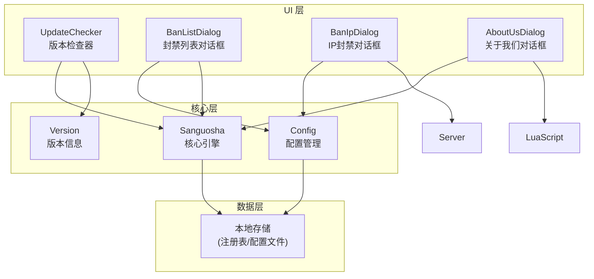
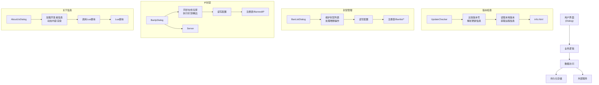
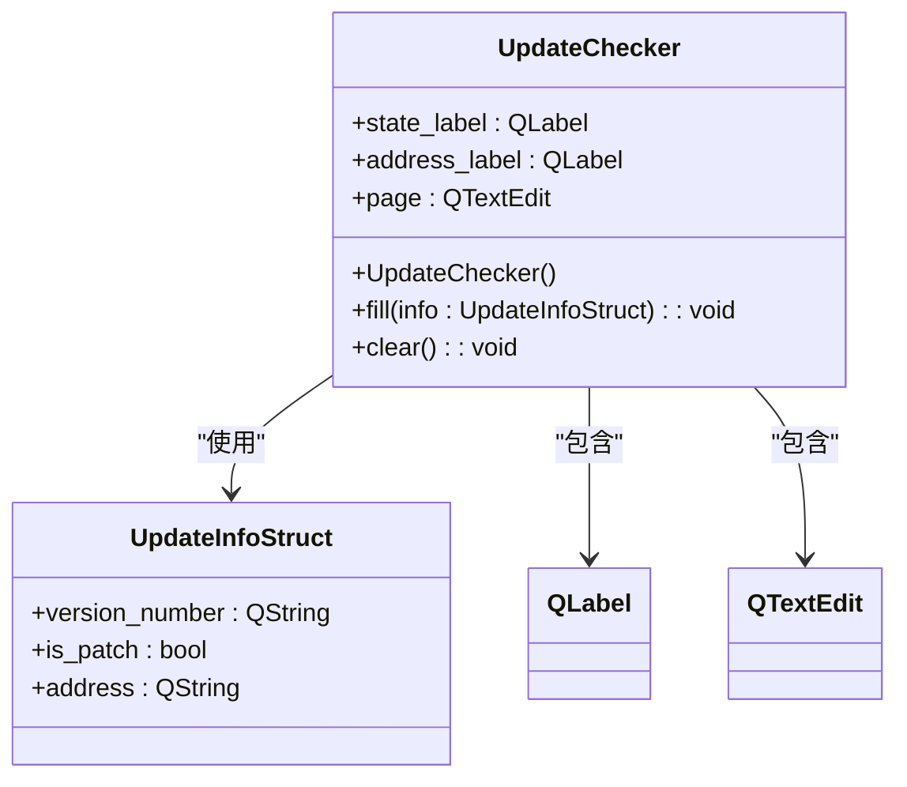
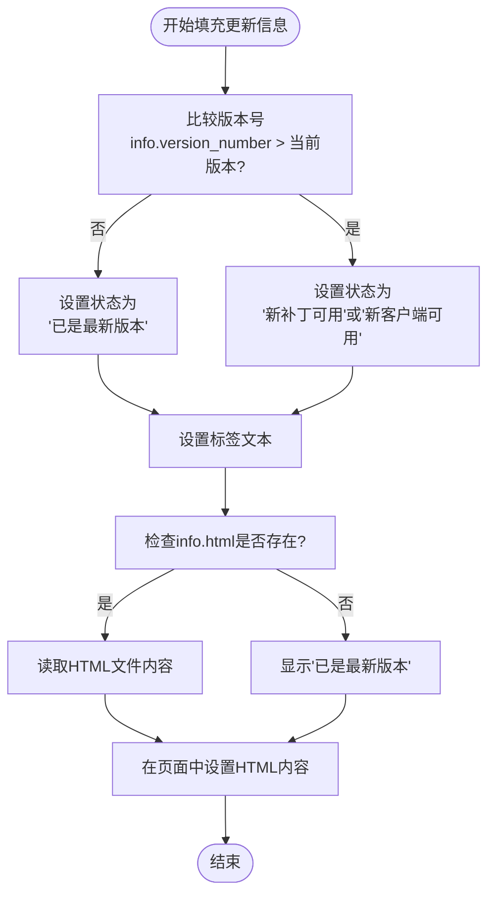
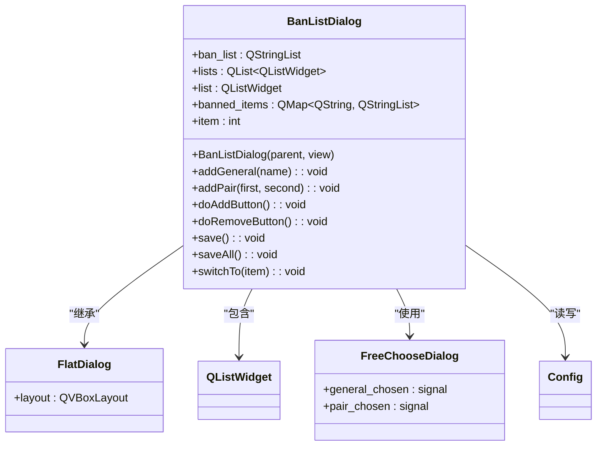
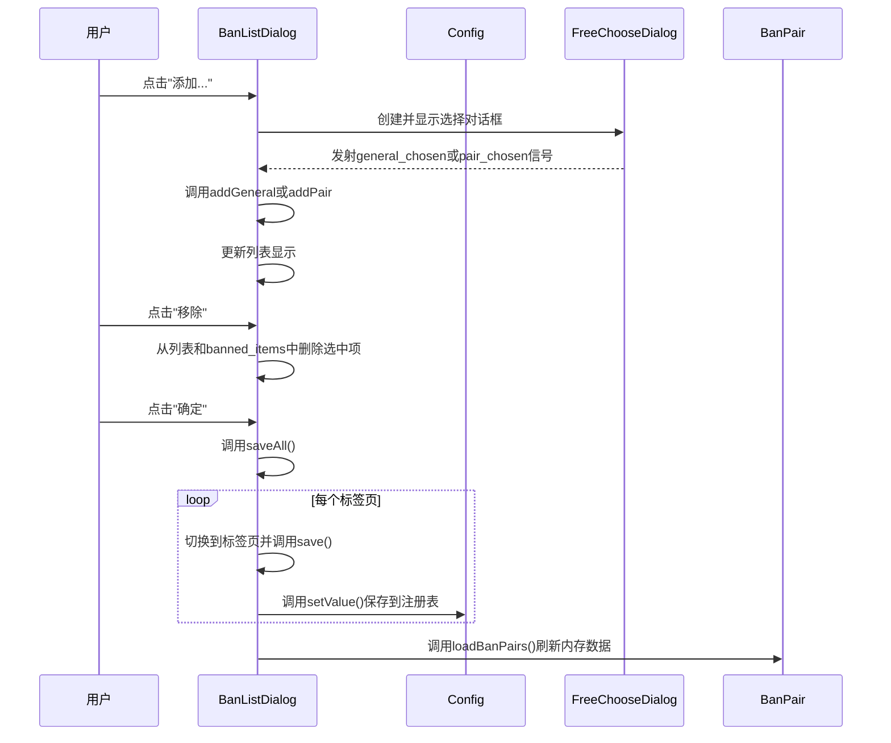
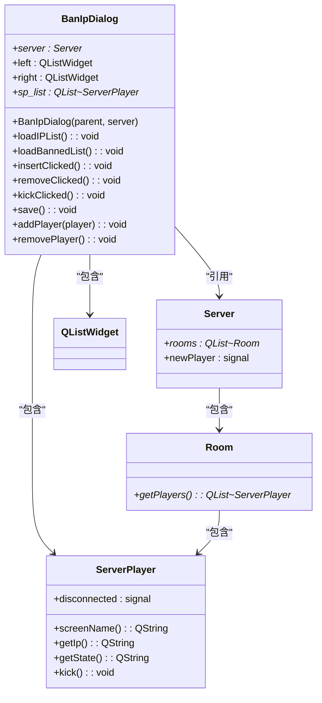
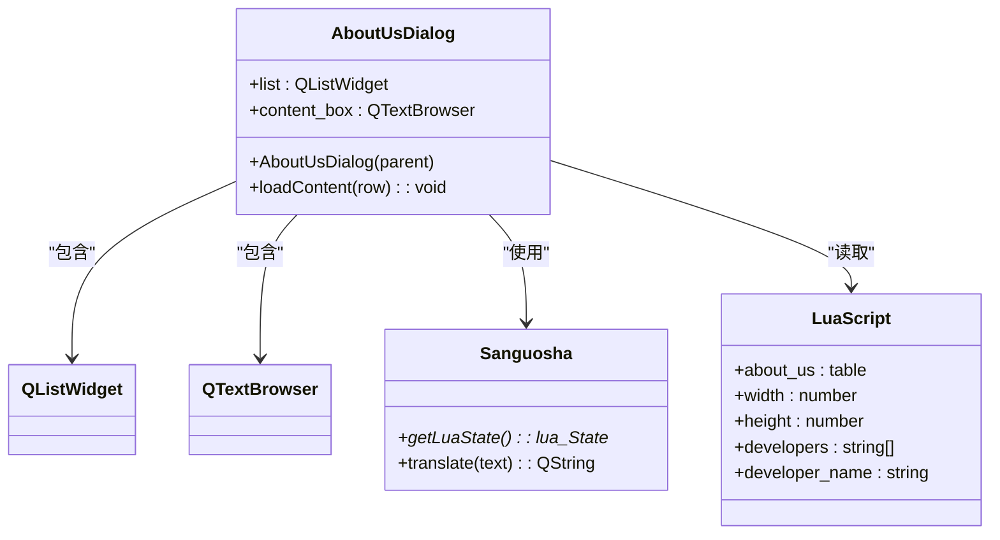
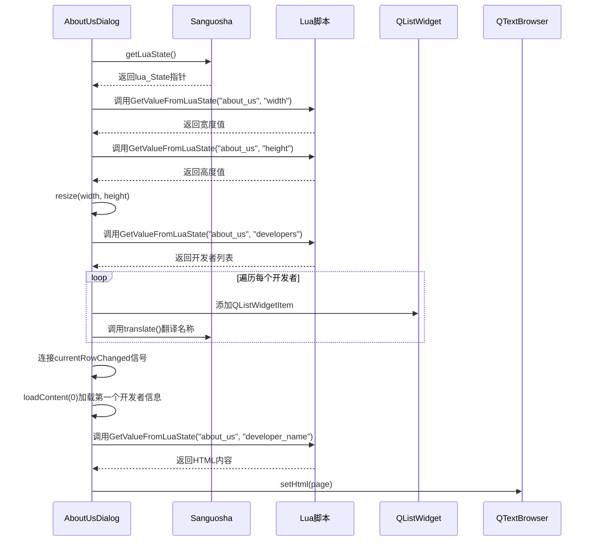
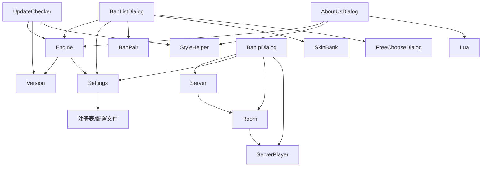

# 系统工具对话框

<cite>
**本文档引用文件**  
- [updatechecker.cpp](file://src/dialog/updatechecker.cpp)
- [updatechecker.h](file://src/dialog/updatechecker.h)
- [banlistdialog.cpp](file://src/dialog/banlistdialog.cpp)
- [banlistdialog.h](file://src/dialog/banlistdialog.h)
- [banipdialog.cpp](file://src/dialog/banipdialog.cpp)
- [banipdialog.h](file://src/dialog/banipdialog.h)
- [aboutus.cpp](file://src/dialog/aboutus.cpp)
- [aboutus.h](file://src/dialog/aboutus.h)
- [version.h](file://src/core/version.h)
- [engine.h](file://src/core/engine.h)
- [settings.h](file://src/core/settings.h)
- [config.lua](file://lua/config.lua)
- [about_us.lua](file://lua/about_us.lua)
</cite>

## 目录
1. [简介](#简介)
2. [项目结构](#项目结构)
3. [核心组件](#核心组件)
4. [架构概览](#架构概览)
5. [详细组件分析](#详细组件分析)
6. [依赖分析](#依赖分析)
7. [性能考虑](#性能考虑)
8. [故障排除指南](#故障排除指南)
9. [结论](#结论)

## 简介
本文档全面记录了《三国杀》游戏客户端中系统级工具对话框的实现机制。重点分析了版本检测与更新提醒（updatechecker）、武将与组合封禁管理（banlistdialog）、IP地址封禁控制（banipdialog）以及项目信息展示（aboutus）四大功能模块。文档详细说明了这些工具如何与外部服务交互、数据持久化策略、管理员权限控制实现方式，并涵盖安全考虑与用户体验设计。

## 项目结构
系统工具对话框功能主要集中在`src/dialog`目录下，通过Qt框架实现图形用户界面，与核心引擎、配置系统和服务器模块紧密协作。



**图示来源**
- [updatechecker.cpp](file://src/dialog/updatechecker.cpp#L1-L91)
- [banlistdialog.cpp](file://src/dialog/banlistdialog.cpp#L1-L179)
- [banipdialog.cpp](file://src/dialog/banipdialog.cpp#L1-L182)
- [aboutus.cpp](file://src/dialog/aboutus.cpp#L1-L86)

## 核心组件
系统工具对话框由四个核心组件构成，分别负责不同的系统级功能：
- **版本检查器**：自动检测新版本并提供更新信息。
- **封禁列表对话框**：管理被禁止使用的武将和武将组合。
- **IP封禁对话框**：管理服务器端的IP地址封禁列表。
- **关于我们对话框**：展示项目信息和开发者名单。

**组件来源**
- [updatechecker.cpp](file://src/dialog/updatechecker.cpp#L1-L91)
- [banlistdialog.cpp](file://src/dialog/banlistdialog.cpp#L1-L179)
- [banipdialog.cpp](file://src/dialog/banipdialog.cpp#L1-L182)
- [aboutus.cpp](file://src/dialog/aboutus.cpp#L1-L86)

## 架构概览
系统工具对话框采用分层架构，上层为Qt UI组件，中层为业务逻辑处理，底层为数据持久化和外部服务交互。



**图示来源**
- [updatechecker.cpp](file://src/dialog/updatechecker.cpp#L1-L91)
- [banlistdialog.cpp](file://src/dialog/banlistdialog.cpp#L1-L179)
- [banipdialog.cpp](file://src/dialog/banipdialog.cpp#L1-L182)
- [aboutus.cpp](file://src/dialog/aboutus.cpp#L1-L86)

## 详细组件分析

### 版本检查器分析
`UpdateChecker`类负责检测客户端是否有新版本可用，并向用户展示更新信息。

#### 类图


**图示来源**
- [updatechecker.cpp](file://src/dialog/updatechecker.cpp#L1-L91)
- [updatechecker.h](file://src/dialog/updatechecker.h)

#### 功能流程


**组件来源**
- [updatechecker.cpp](file://src/dialog/updatechecker.cpp#L1-L91)

### 封禁列表对话框分析
`BanListDialog`允许管理员配置被禁止使用的武将和武将组合。

#### 类图


**图示来源**
- [banlistdialog.cpp](file://src/dialog/banlistdialog.cpp#L1-L179)
- [banlistdialog.h](file://src/dialog/banlistdialog.h)

#### 操作流程


**组件来源**
- [banlistdialog.cpp](file://src/dialog/banlistdialog.cpp#L1-L179)

### IP封禁对话框分析
`BanIpDialog`为服务器管理员提供管理连接玩家和IP封禁的功能。

#### 类图


**图示来源**
- [banipdialog.cpp](file://src/dialog/banipdialog.cpp#L1-L182)
- [banipdialog.h](file://src/dialog/banipdialog.h)

#### 管理流程
```mermaid
flowchart TD
Init([初始化]) --> CheckServer["检查服务器实例"]
CheckServer --> |存在| ConnectSignal["连接newPlayer信号"]
CheckServer --> |不存在| ShowWarning["显示警告信息"]
ConnectSignal --> LoadIP["调用loadIPList()"]
LoadIP --> LoadBanned["调用loadBannedList()"]
LoadBanned --> Display["显示对话框"]
subgraph "添加封禁"
User1[用户选择玩家] --> ClickInsert[点击"插入到封禁列表"]
ClickInsert --> GetIP["获取选中玩家IP"]
GetIP --> CheckLocal["检查是否为本地回环地址"]
CheckLocal --> |是| WarnLocal["显示警告，禁止封禁"]
CheckLocal --> |否| CheckExist["检查是否已在封禁列表"]
CheckExist --> |存在| Skip["跳过"]
CheckExist --> |不存在| AddToList["添加到右侧列表"]
end
subgraph "移除封禁"
User2[用户选择封禁IP] --> ClickRemove[点击"从封禁列表移除"]
ClickRemove --> RemoveItem["从列表中删除该项"]
end
subgraph "踢出玩家"
User3[用户选择在线玩家] --> ClickKick[点击"从服务器踢出"]
ClickKick --> GetPlayer["获取ServerPlayer对象"]
GetPlayer --> Verify["验证名称和IP匹配"]
Verify --> Kick["调用player->kick()"]
end
ClickOK[点击"确定"] --> SaveAll["调用save()"]
SaveAll --> ExtractIPs["提取右侧列表所有IP"]
ExtractIPs --> SaveToConfig["保存到Config/BannedIP"]
```

**组件来源**
- [banipdialog.cpp](file://src/dialog/banipdialog.cpp#L1-L182)

### 关于我们对话框分析
`AboutUsDialog`从Lua脚本动态加载项目信息和开发者资料。

#### 类图


**图示来源**
- [aboutus.cpp](file://src/dialog/aboutus.cpp#L1-L86)
- [aboutus.h](file://src/dialog/aboutus.h)

#### 内容加载流程


**组件来源**
- [aboutus.cpp](file://src/dialog/aboutus.cpp#L1-L86)

## 依赖分析
系统工具对话框组件之间存在清晰的依赖关系，主要依赖核心引擎、配置系统和外部服务。



**图示来源**
- [updatechecker.cpp](file://src/dialog/updatechecker.cpp#L1-L91)
- [banlistdialog.cpp](file://src/dialog/banlistdialog.cpp#L1-L179)
- [banipdialog.cpp](file://src/dialog/banipdialog.cpp#L1-L182)
- [aboutus.cpp](file://src/dialog/aboutus.cpp#L1-L86)

## 性能考虑
各工具对话框在设计时已考虑性能影响：
- **版本检查器**：仅在启动时执行一次版本比较，避免频繁网络请求。
- **封禁列表对话框**：使用`QSet`去重，确保数据一致性，减少重复写入。
- **IP封禁对话框**：通过信号槽机制实时同步玩家列表，避免轮询开销。
- **关于我们对话框**：采用惰性加载，仅在用户切换开发者时才读取对应内容。

## 故障排除指南
### 常见问题
1. **更新提示不显示新版本**
   - 检查`info.html`文件是否存在且可读
   - 确认版本号格式正确（如"2.5.0"）
   - 验证`UpdateInfoStruct`中的`version_number`字段

2. **封禁列表无法保存**
   - 检查程序是否有写入注册表的权限
   - 确认`Config`对象已正确初始化
   - 验证`saveAll()`方法是否被正确调用

3. **IP封禁对话框无法加载玩家**
   - 确保`server`指针不为空
   - 检查`newPlayer`信号是否正确连接
   - 验证`Room`和`ServerPlayer`的状态是否正常

4. **关于信息显示乱码**
   - 确认Lua脚本中的文本编码为UTF-8
   - 检查`QTextBrowser`的字符集设置
   - 验证`translate()`函数是否正确处理中文

**组件来源**
- [updatechecker.cpp](file://src/dialog/updatechecker.cpp#L1-L91)
- [banlistdialog.cpp](file://src/dialog/banlistdialog.cpp#L1-L179)
- [banipdialog.cpp](file://src/dialog/banipdialog.cpp#L1-L182)
- [aboutus.cpp](file://src/dialog/aboutus.cpp#L1-L86)

## 结论
系统工具对话框模块设计合理，功能完整，通过清晰的分层架构实现了版本管理、封禁控制和信息展示等关键系统功能。各组件遵循单一职责原则，依赖关系明确，数据持久化策略可靠。建议未来可增加更新检查的自动重试机制、封禁列表的导入导出功能，以及关于信息的在线更新能力，以进一步提升用户体验和管理效率。