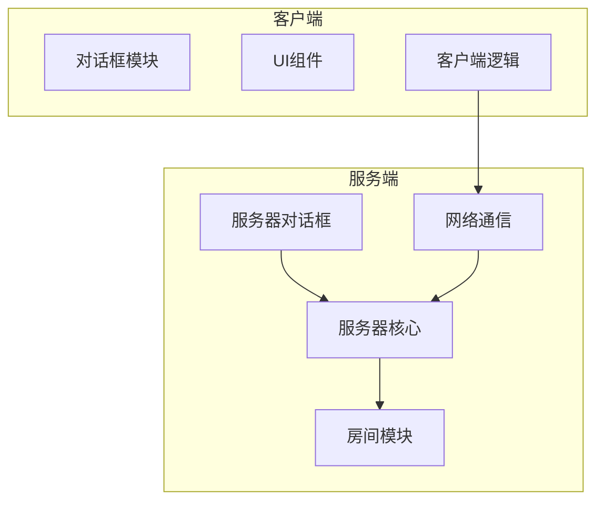
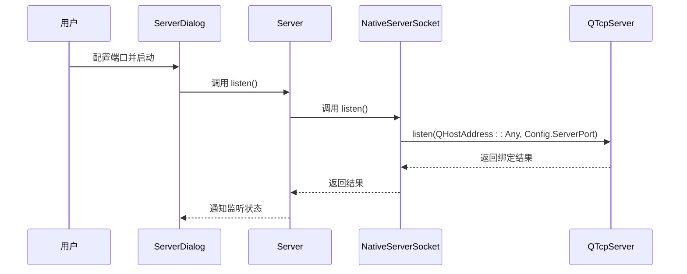
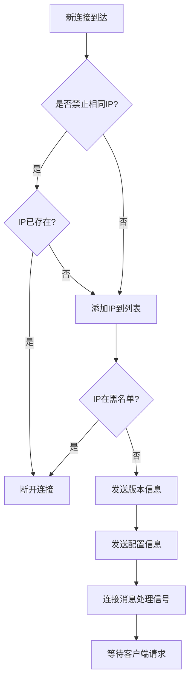
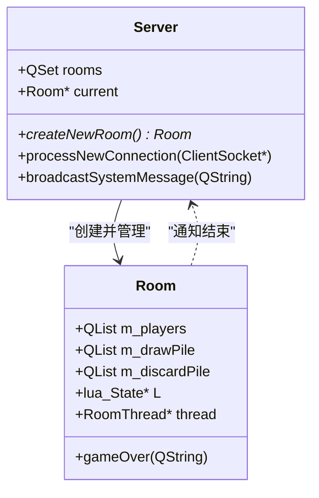

# 服务器管理对话框

<cite>
**本文档中引用的文件**  
- [serverdialog.cpp](file://src/dialog/serverdialog.cpp)
- [server.cpp](file://src/server/server.cpp)
- [room.cpp](file://src/server/room.cpp)
- [nativesocket.cpp](file://src/util/nativesocket.cpp)
- [nativesocket.h](file://src/util/nativesocket.h)
- [socket.h](file://src/util/socket.h)
</cite>

## 目录
1. [项目结构](#项目结构)  
2. [核心功能概述](#核心功能概述)  
3. [服务器启动参数配置](#服务器启动参数配置)  
4. [端口绑定与监听机制](#端口绑定与监听机制)  
5. [客户端连接请求处理流程](#客户端连接请求处理流程)  
6. [与room.cpp和server.cpp的交互接口](#与roomcpp和servercpp的交互接口)  
7. [服务器状态广播逻辑](#服务器状态广播逻辑)  
8. [玩家加入/退出事件响应机制](#玩家加入退出事件响应机制)  
9. [多房间并发管理设计模式](#多房间并发管理设计模式)  
10. [服务器安全策略支持现状与扩展建议](#服务器安全策略支持现状与扩展建议)

## 项目结构

本项目为《三国杀》的扩展版本，采用C++与Qt框架开发，支持多平台运行。项目结构清晰，模块化程度高，主要分为以下几个部分：

- **ai-selector**: AI策略配置文件
- **builds**: 构建相关资源
- **etc\customScenes**: 自定义场景配置
- **extension-doc**: 扩展功能文档（Lua脚本）
- **extensions**: 扩展包定义
- **image\big-card**: 卡牌图像资源
- **include**: 第三方库头文件（FMOD音频、FreeType字体、VLD内存检测）
- **lang\zh_CN**: 中文语言包
- **lua**: 游戏逻辑与AI脚本
- **resource\android**: Android资源文件
- **rule**: 游戏规则文档
- **skins**: UI皮肤配置
- **src**: 核心源码目录
  - **breakpad**: 崩溃报告系统
  - **client**: 客户端逻辑
  - **core**: 核心引擎
  - **dialog**: 对话框界面（含`serverdialog.cpp`）
  - **lua**: Lua绑定
  - **package**: 武将与卡牌包
  - **scenario**: 剧情模式
  - **server**: 服务端核心（含`server.cpp`、`room.cpp`）
  - **ui**: 用户界面组件
  - **util**: 工具类（含网络套接字）
- **style-sheet**: 样式表
- **ui-script**: 前端脚本



**Diagram sources**  
- [serverdialog.cpp](file://src/dialog/serverdialog.cpp)
- [server.cpp](file://src/server/server.cpp)
- [room.cpp](file://src/server/room.cpp)

**Section sources**  
- [serverdialog.cpp](file://src/dialog/serverdialog.cpp)
- [server.cpp](file://src/server/server.cpp)

## 核心功能概述

`serverdialog.cpp` 实现了服务器创建与房间管理的核心功能，是服务端配置的入口界面。该模块负责收集用户配置，初始化服务器参数，并通过 `server.cpp` 启动监听，最终由 `room.cpp` 管理具体游戏房间。

主要功能包括：
- 服务器基础参数配置（名称、端口、超时）
- 游戏模式选择（标准、剧情等）
- 扩展包启用/禁用管理
- 高级选项设置（IP限制、AI延迟、聊天控制）
- 卡牌与武将转换规则配置
- 安全策略（IP白名单、禁止重复IP）

该模块通过信号与槽机制与服务端核心交互，确保配置生效。

**Section sources**  
- [serverdialog.cpp](file://src/dialog/serverdialog.cpp)

## 服务器启动参数配置

`serverdialog.cpp` 提供了图形化界面用于配置服务器启动参数，主要通过多个选项卡实现。

### 最大玩家数配置

最大玩家数由所选**游戏模式**决定，而非直接输入。在 `createGameModeBox()` 函数中，通过 `Sanguosha->getPlayerCount(mode)` 获取对应模式的玩家数量：

```cpp
player_count = Sanguosha->getPlayerCount(mode);
```

游戏模式在 `createGameModeBox()` 中以单选按钮形式列出，包括：
- 标准模式（8人、5人等）
- 剧情模式（Scenario mode）
- 自定义模式

### 游戏模式选择

游戏模式选择通过 `QButtonGroup` 管理，用户选择后，`config()` 函数将选中模式写入全局配置 `Config.GameMode`：

```cpp
if (mode_group->checkedButton()) {
    QString objname = mode_group->checkedButton()->objectName();
    if (objname == "scenario")
        Config.GameMode = scenario_ComboBox->itemData(scenario_ComboBox->currentIndex()).toString();
    else
        Config.GameMode = objname;
}
```

此配置将用于创建 `Room` 实例时确定游戏规则。

**Section sources**  
- [serverdialog.cpp](file://src/dialog/serverdialog.cpp#L500-L530)
- [room.cpp](file://src/server/room.cpp#L50-L60)

## 端口绑定与监听机制

端口绑定与监听由 `server.cpp` 和底层网络模块协同完成。

### 端口配置

在 `serverdialog.cpp` 的 `createAdvancedTab()` 中，用户可配置服务器端口：

```cpp
port_edit = new QLineEdit;
port_edit->setText(QString::number(Config.ServerPort));
port_edit->setValidator(new QIntValidator(1000, 65535, port_edit));
```

端口范围限制在1000-65535之间，防止使用系统保留端口。

### 绑定与监听流程

1. **NativeServerSocket 创建**：`server.cpp` 构造函数中创建 `NativeServerSocket` 实例。
2. **调用 listen()**：`Server::listen()` 调用 `NativeServerSocket::listen()`。
3. **QTcpServer 绑定**：在 `nativesocket.cpp` 中，`QTcpServer` 绑定到 `Config.ServerPort`：

```cpp
bool NativeServerSocket::listen()
{
    return server->listen(QHostAddress::Any, Config.ServerPort);
}
```

4. **信号连接**：`server->newConnection` 信号连接到 `processNewConnection` 槽函数，准备接收新连接。



**Diagram sources**  
- [serverdialog.cpp](file://src/dialog/serverdialog.cpp#L280-L285)
- [server.cpp](file://src/server/server.cpp#L50-L55)
- [nativesocket.cpp](file://src/util/nativesocket.cpp#L40-L42)

**Section sources**  
- [serverdialog.cpp](file://src/dialog/serverdialog.cpp)
- [server.cpp](file://src/server/server.cpp)
- [nativesocket.cpp](file://src/util/nativesocket.cpp)

## 客户端连接请求处理流程

客户端连接请求处理流程如下：

1. **新连接到达**：`QTcpServer` 触发 `newConnection` 信号。
2. **创建连接对象**：`NativeServerSocket::processNewConnection()` 创建 `NativeClientSocket`。
3. **发出信号**：`emit new_connection(connection);`。
4. **服务端处理**：`Server::processNewConnection()` 被调用。

### IP限制与安全检查

在 `Server::processNewConnection()` 中，进行以下检查：

- **禁止相同IP多连接**：若 `Config.ForbidSIMC` 为真，检查 `addresses` 列表是否已存在该IP。
- **IP黑名单**：检查 `Config.value("BannedIP")` 列表是否包含该IP。

```cpp
if (Config.ForbidSIMC) {
    if (addresses.contains(address)) {
        socket->disconnectFromHost();
        return;
    } else {
        addresses.append(address);
    }
}

if (Config.value("BannedIP").toStringList().contains(address)) {
    socket->disconnectFromHost();
    return;
}
```

### 初始化客户端

通过 `notifyClient()` 发送版本和配置信息：

```cpp
notifyClient(socket, S_COMMAND_CHECK_VERSION, Sanguosha->getVersion());
notifyClient(socket, S_COMMAND_SETUP, Sanguosha->getSetupString());
```

最后，连接 `message_got` 信号到 `processRequest`，准备接收客户端消息。



**Diagram sources**  
- [server.cpp](file://src/server/server.cpp#L90-L128)
- [nativesocket.cpp](file://src/util/nativesocket.cpp#L110-L115)

**Section sources**  
- [server.cpp](file://src/server/server.cpp#L90-L128)

## 与room.cpp和server.cpp的交互接口

`serverdialog.cpp` 作为配置前端，主要通过全局配置对象 `Config` 与 `server.cpp` 和 `room.cpp` 交互。

### 与server.cpp的接口

- **配置写入**：`serverdialog::config()` 函数将用户配置写入 `Config` 全局对象。
- **服务器启动**：`Server` 构造时读取 `Config` 初始化 `ServerInfo`。
- **房间创建**：`Server::createNewRoom()` 使用 `Config.GameMode` 创建新房间。

```cpp
Room *Server::createNewRoom()
{
    Room *new_room = new Room(this, Config.GameMode);
    // ...
    return new_room;
}
```

### 与room.cpp的接口

- **房间初始化**：`Room` 构造函数接收 `mode` 参数，加载对应规则。
- **配置读取**：`room.cpp` 中通过 `Config.value()` 读取各种限制（如堆叠限制、霸业选择上限）。
- **AI延迟**：`Config.AIDelay` 控制AI响应速度。

```cpp
pile_swapping_spinbox->setValue(Config.value("PileSwappingLimitation", 5).toInt());
hegemony_maxchoice_spinbox->setValue(Config.value("HegemonyMaxChoice", 7).toInt());
```

**Section sources**  
- [serverdialog.cpp](file://src/dialog/serverdialog.cpp#L658-L686)
- [server.cpp](file://src/server/server.cpp#L80-L85)
- [room.cpp](file://src/server/room.cpp#L50-L60)

## 服务器状态广播逻辑

服务器状态广播由 `Server` 类的 `broadcastSystemMessage()` 方法实现，用于向所有房间的所有客户端发送系统通知。

### 广播机制

```cpp
void Server::broadcastSystemMessage(const QString &msg)
{
    JsonArray arg;
    arg << ".";
    arg << msg;

    Packet packet(S_SRC_ROOM | S_TYPE_NOTIFICATION | S_DEST_CLIENT, S_COMMAND_SPEAK);
    packet.setMessageBody(arg);

    foreach(Room *room, rooms)
        room->broadcast(&packet);
}
```

- **消息格式**：JSON数组，第一个元素为"."（表示系统消息），第二个为实际消息内容。
- **目标**：所有房间（`rooms` 集合）。
- **命令**：`S_COMMAND_SPEAK`，客户端收到后在聊天框显示。

### 应用场景

- 客户端连接/断开通知
- 系统公告
- 房间创建/销毁通知

此机制确保所有在线玩家能及时收到全局信息。

**Section sources**  
- [server.cpp](file://src/server/server.cpp#L55-L65)

## 玩家加入/退出事件响应机制

### 玩家加入

在 `Server::processClientRequest()` 中处理 `S_COMMAND_SIGNUP` 请求：

1. **检查重连**：遍历 `name2objname` 查找同名离线玩家，尝试重连。
2. **创建新房间**：若当前房间满员或结束，则调用 `createNewRoom()`。
3. **添加玩家**：调用 `current->addSocket(socket)` 和 `current->signup()`。

```cpp
ServerPlayer *player = current->addSocket(socket);
current->signup(player, screen_name, avatar, false);
```

### 玩家退出

玩家退出由 `ClientSocket::disconnected` 信号触发：

```cpp
connect(socket, &ClientSocket::disconnected, this, &Server::cleanup);
```

`Server::cleanup()` 执行：
- 从 `addresses` 列表移除IP（若启用 `ForbidSIMC`）。
- 删除 `socket` 对象。

房间内的玩家状态变更（如死亡、离线）由 `room.cpp` 内部处理。

**Section sources**  
- [server.cpp](file://src/server/server.cpp#L110-L128)

## 多房间并发管理设计模式

系统采用**单服务器多房间**的设计模式，由 `Server` 类统一管理多个 `Room` 实例。

### 核心组件

- **Server 类**：继承 `QObject`，持有 `QSet<Room*> rooms` 集合。
- **Room 类**：继承 `QThread`，每个房间独立运行游戏逻辑。

### 生命周期管理

- **创建**：`Server::createNewRoom()` 创建 `Room` 实例并加入 `rooms` 集合。
- **连接**：`Server` 连接 `Room::game_over` 信号，房间结束时从集合中移除。
- **广播**：`Server` 可向 `rooms` 集合中所有房间广播消息。

### 资源隔离

每个 `Room` 拥有独立的：
- 玩家列表 (`m_players`)
- 抽牌堆与弃牌堆
- Lua运行环境 (`L`)
- 游戏线程 (`thread`)

此设计确保房间间互不干扰，支持高并发。



**Diagram sources**  
- [server.cpp](file://src/server/server.cpp#L40-L45)
- [room.cpp](file://src/server/room.cpp#L50-L60)

**Section sources**  
- [server.cpp](file://src/server/server.cpp)
- [room.cpp](file://src/server/room.cpp)

## 服务器安全策略支持现状与扩展建议

### 支持现状

当前已实现以下安全策略：

1. **IP白名单/黑名单**
   - **黑名单**：通过 `Config.value("BannedIP")` 实现，连接时检查。
   - **白名单**：**未直接实现**，但可通过外部防火墙或修改代码扩展。

2. **密码保护**
   - **未实现**。代码中无密码验证逻辑，任何知道IP和端口的客户端均可连接。

3. **IP限制**
   - **禁止相同IP多连接**：通过 `Config.ForbidSIMC` 和 `addresses` 列表实现。

### 扩展建议

1. **实现密码保护**
   - 在 `Server::processClientRequest()` 中，于 `S_COMMAND_SIGNUP` 前增加密码验证步骤。
   - 可在 `serverdialog.cpp` 添加“服务器密码”输入框，密码哈希后存入 `Config`。

2. **增强IP白名单**
   - 在 `ServerDialog` 的“高级”选项卡中添加“IP白名单”按钮。
   - 创建新对话框管理白名单IP列表，存储于 `Config`。

3. **连接认证机制**
   - 引入Token或密钥认证，客户端首次连接需提供有效凭证。
   - 可结合数据库存储用户凭证，实现更复杂的权限管理。

4. **日志审计**
   - 记录所有连接尝试（成功/失败）、IP地址、时间戳，便于安全审计。

当前安全机制较为基础，建议优先实现密码保护以提升服务器安全性。

**Section sources**  
- [serverdialog.cpp](file://src/dialog/serverdialog.cpp)
- [server.cpp](file://src/server/server.cpp#L90-L100)