# 网络管理对话框

<cite>
**本文档引用文件**   
- [connectiondialog.cpp](file://src/dialog/connectiondialog.cpp)
- [connectiondialog.h](file://src/dialog/connectiondialog.h)
- [serverdialog.cpp](file://src/dialog/serverdialog.cpp)
- [serverdialog.h](file://src/dialog/serverdialog.h)
- [udpdetectordialog.cpp](file://src/dialog/udpdetectordialog.cpp)
- [udpdetectordialog.h](file://src/dialog/udpdetectordialog.h)
- [nativesocket.cpp](file://src/util/nativesocket.cpp)
- [nativesocket.h](file://src/util/nativesocket.h)
</cite>

## 目录
1. [简介](#简介)
2. [项目结构](#项目结构)
3. [核心组件](#核心组件)
4. [架构概览](#架构概览)
5. [详细组件分析](#详细组件分析)
6. [依赖分析](#依赖分析)
7. [性能考虑](#性能考虑)
8. [故障排除指南](#故障排除指南)
9. [结论](#结论)

## 简介
本文档详细描述了《三国杀：霸业》网络管理对话框的架构与实现。重点分析了连接配置、服务器创建/加入、网络质量检测三大核心功能模块，涵盖网络地址验证、端口扫描、连接状态监控、错误提示等用户体验设计，以及底层网络模块的调用接口规范。同时探讨了防火墙穿透和NAT穿越等复杂网络场景的处理策略。

## 项目结构
网络管理功能主要分布在`src/dialog`目录下的三个核心对话框类中，通过`src/util`中的底层网络模块提供支持。整体结构采用模块化设计，各组件职责分明。

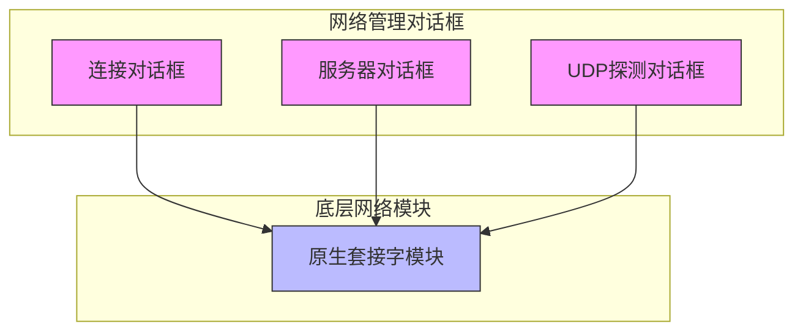

**图示来源**
- [connectiondialog.cpp](file://src/dialog/connectiondialog.cpp)
- [serverdialog.cpp](file://src/dialog/serverdialog.cpp)
- [udpdetectordialog.cpp](file://src/dialog/udpdetectordialog.cpp)
- [nativesocket.cpp](file://src/util/nativesocket.cpp)

**本节来源**
- [src/dialog](file://src/dialog)
- [src/util](file://src/util)

## 核心组件
系统包含三个核心网络对话框组件：
- **连接对话框**：负责客户端连接参数配置与连接建立
- **服务器对话框**：实现服务器创建与房间管理功能
- **UDP探测对话框**：提供局域网服务器发现与网络质量检测

底层由**原生套接字模块**提供统一的TCP/UDP网络通信接口，实现跨平台网络功能。

**本节来源**
- [connectiondialog.cpp](file://src/dialog/connectiondialog.cpp#L1-L50)
- [serverdialog.cpp](file://src/dialog/serverdialog.cpp#L1-L50)
- [udpdetectordialog.cpp](file://src/dialog/udpdetectordialog.cpp#L1-L50)

## 架构概览
系统采用分层架构设计，上层UI组件与底层网络模块分离，通过清晰的接口进行通信。连接流程遵循标准的客户端-服务器模式。

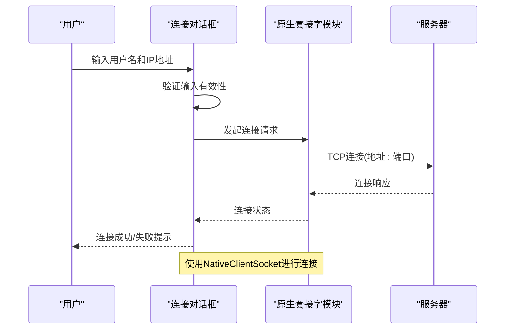

**图示来源**
- [connectiondialog.cpp](file://src/dialog/connectiondialog.cpp#L100-L150)
- [nativesocket.cpp](file://src/util/nativesocket.cpp#L50-L100)

## 详细组件分析

### 连接对话框分析
连接对话框（ConnectionDialog）负责处理客户端连接服务器的所有配置和连接流程。

#### 类结构分析
```mermaid
classDiagram
class ConnectionDialog {
+ConnectionDialog(QWidget* parent)
+~ConnectionDialog()
+hideAvatarList()
+showAvatarList()
-on_connectButton_clicked()
-on_changeAvatarButton_clicked()
-on_avatarList_doubleClicked(QModelIndex)
-on_clearHistoryButton_clicked()
-on_detectLANButton_clicked()
-Ui : : ConnectionDialog* ui
}
class FlatDialog {
+FlatDialog(QWidget* parent, bool modal)
+setWindowTitle(QString title)
+accept()
+reject()
}
ConnectionDialog --> FlatDialog : "继承"
ConnectionDialog --> Ui : : ConnectionDialog : "使用"
```

**图示来源**
- [connectiondialog.h](file://src/dialog/connectiondialog.h#L1-L30)
- [connectiondialog.cpp](file://src/dialog/connectiondialog.cpp#L1-L50)

#### 连接参数配置流程
连接对话框实现了完整的连接参数配置流程，包括用户信息、服务器地址、头像选择等。

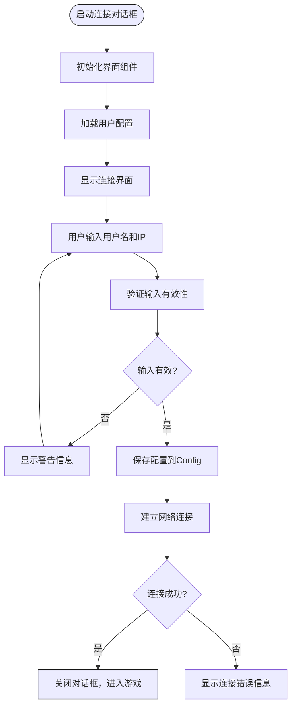

**图示来源**
- [connectiondialog.cpp](file://src/dialog/connectiondialog.cpp#L100-L150)

#### 连接建立流程
连接建立流程通过原生套接字模块实现，包含完整的错误处理机制。

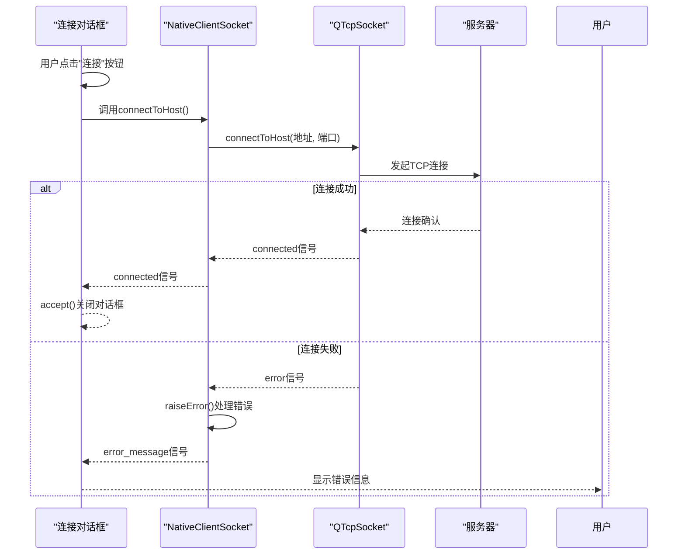

**图示来源**
- [connectiondialog.cpp](file://src/dialog/connectiondialog.cpp#L150-L190)
- [nativesocket.cpp](file://src/util/nativesocket.cpp#L100-L150)

**本节来源**
- [connectiondialog.cpp](file://src/dialog/connectiondialog.cpp)
- [connectiondialog.h](file://src/dialog/connectiondialog.h)
- [nativesocket.cpp](file://src/util/nativesocket.cpp)

### 服务器对话框分析
服务器对话框（ServerDialog）负责服务器的创建和房间管理功能，提供丰富的游戏配置选项。

#### 类结构分析
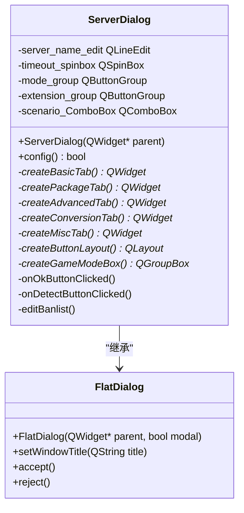

**图示来源**
- [serverdialog.h](file://src/dialog/serverdialog.h#L1-L50)
- [serverdialog.cpp](file://src/dialog/serverdialog.cpp#L1-L50)

#### 服务器配置流程
服务器对话框采用标签页设计，将配置项分类管理，提供直观的配置界面。

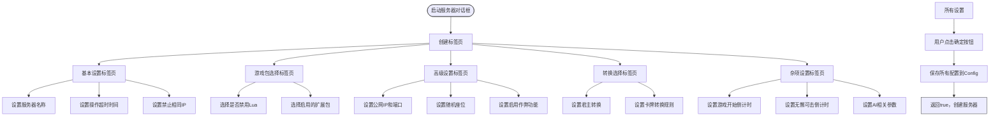

**图示来源**
- [serverdialog.cpp](file://src/dialog/serverdialog.cpp#L50-L300)

#### 服务器创建流程
服务器创建流程通过配置方法收集用户设置，并将其保存到全局配置中。

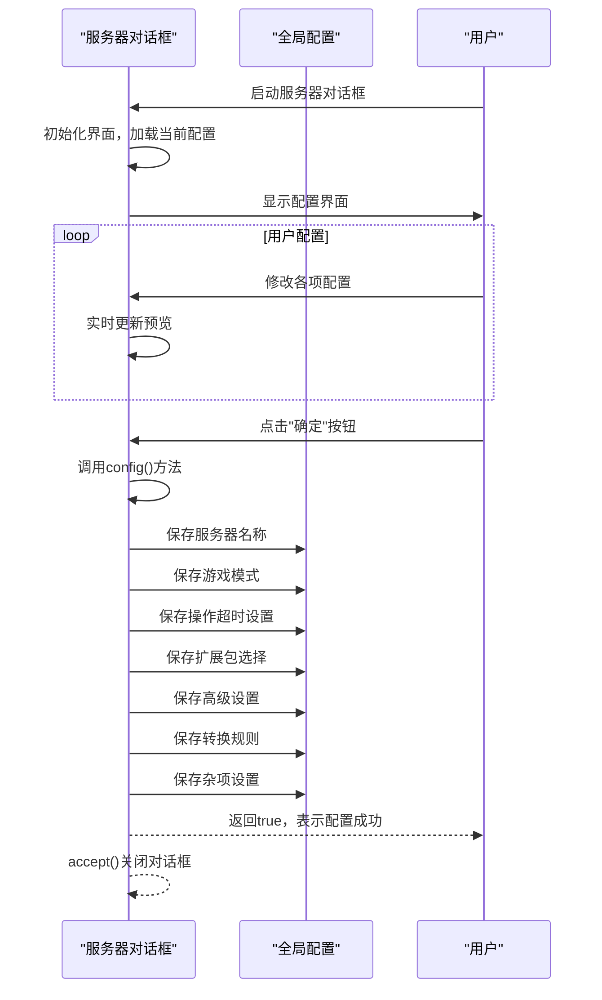

**图示来源**
- [serverdialog.cpp](file://src/dialog/serverdialog.cpp#L600-L700)

**本节来源**
- [serverdialog.cpp](file://src/dialog/serverdialog.cpp)
- [serverdialog.h](file://src/dialog/serverdialog.h)

### UDP探测对话框分析
UDP探测对话框（UdpDetectorDialog）负责局域网服务器发现和网络质量检测功能。

#### 类结构分析
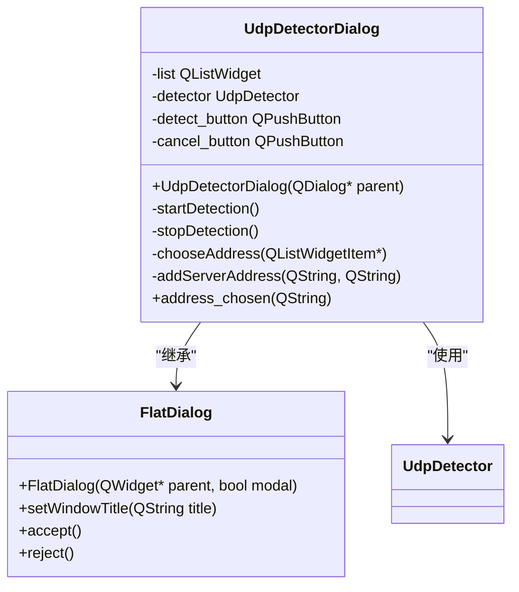

**图示来源**
- [udpdetectordialog.h](file://src/dialog/udpdetectordialog.h#L1-L30)
- [udpdetectordialog.cpp](file://src/dialog/udpdetectordialog.cpp#L1-L50)

#### 网络质量检测流程
UDP探测对话框通过广播和响应机制实现局域网服务器发现。

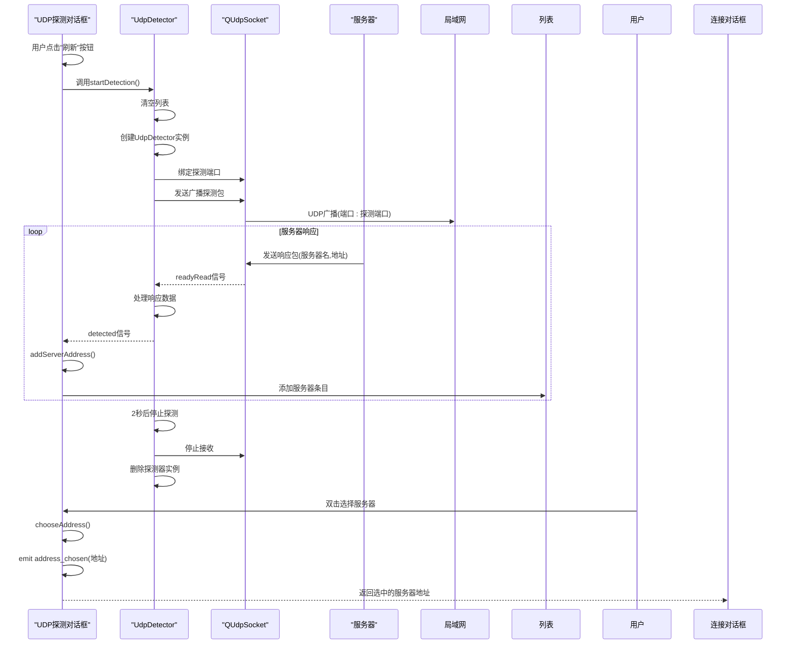

**图示来源**
- [udpdetectordialog.cpp](file://src/dialog/udpdetectordialog.cpp#L50-L90)

**本节来源**
- [udpdetectordialog.cpp](file://src/dialog/udpdetectordialog.cpp)
- [udpdetectordialog.h](file://src/dialog/udpdetectordialog.h)

### 原生套接字模块分析
原生套接字模块（NativeSocket）提供底层网络通信功能，封装了TCP和UDP协议的实现。

#### 类结构分析
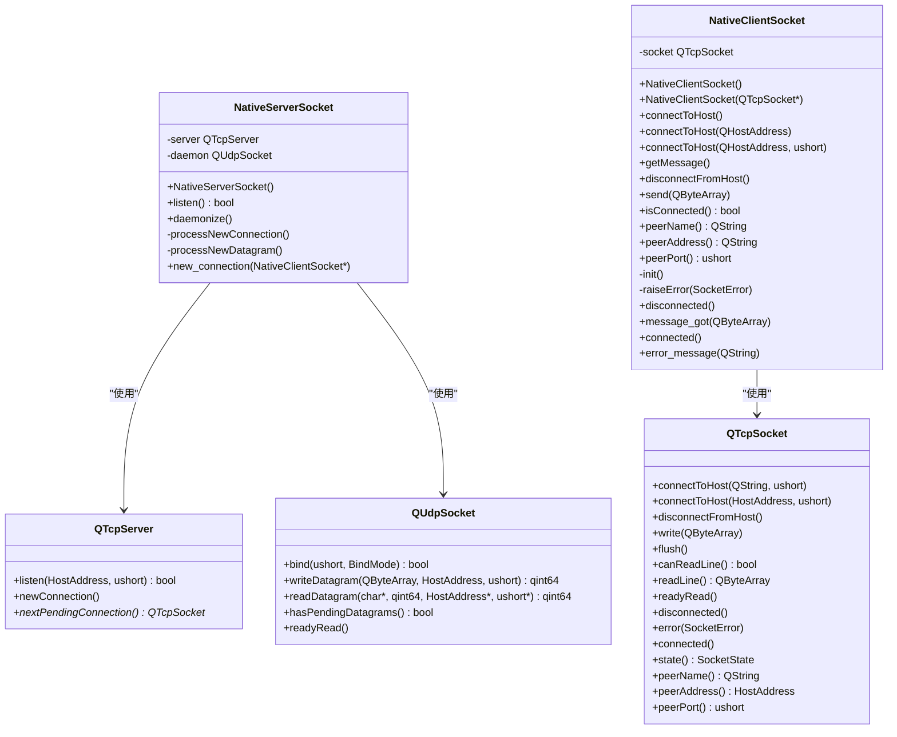

**图示来源**
- [nativesocket.h](file://src/util/nativesocket.h)
- [nativesocket.cpp](file://src/util/nativesocket.cpp)

#### 服务器监听流程
服务器通过原生套接字模块实现TCP监听和UDP探测响应。

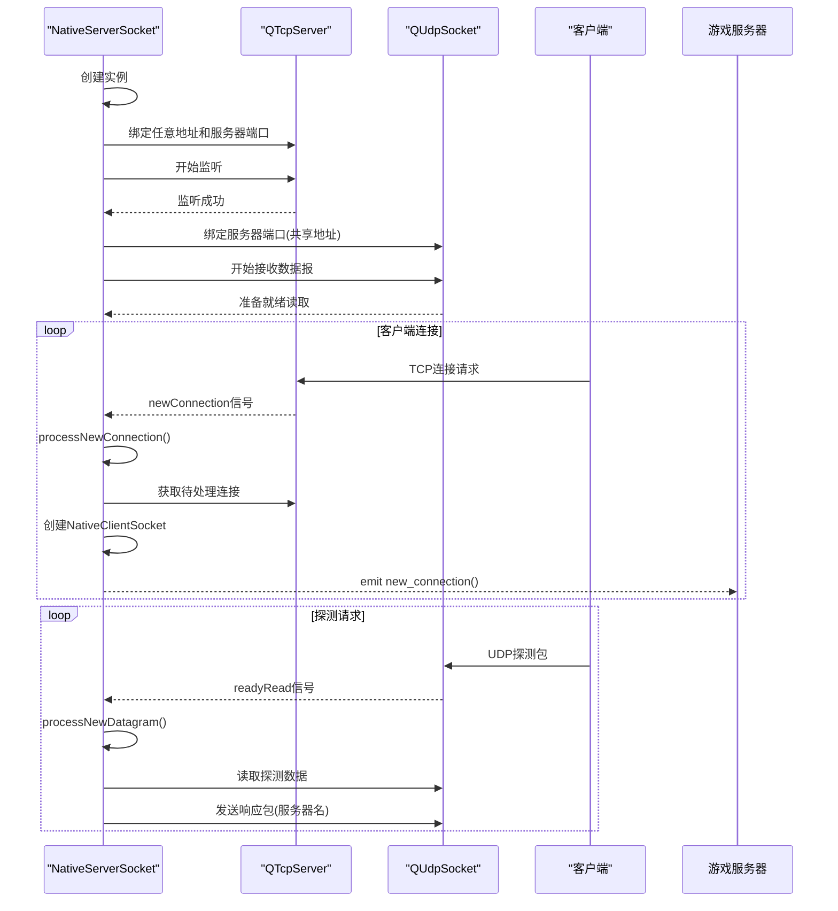

**图示来源**
- [nativesocket.cpp](file://src/util/nativesocket.cpp#L10-L50)

#### 客户端连接流程
客户端通过原生套接字模块实现与服务器的连接和通信。

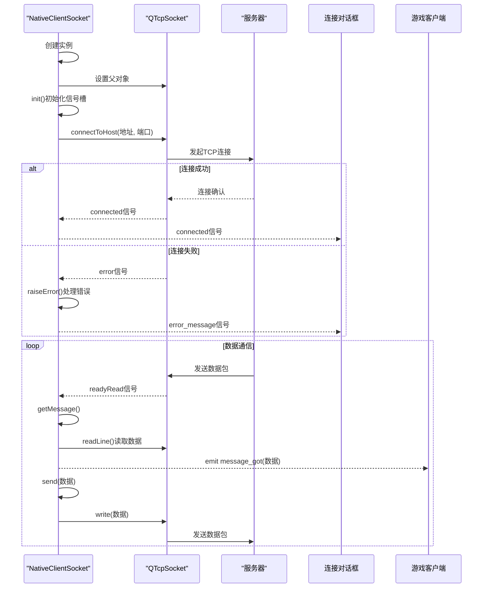

**图示来源**
- [nativesocket.cpp](file://src/util/nativesocket.cpp#L50-L150)

**本节来源**
- [nativesocket.cpp](file://src/util/nativesocket.cpp)
- [nativesocket.h](file://src/util/nativesocket.h)

## 依赖分析
网络管理组件之间存在清晰的依赖关系，通过分层设计降低了耦合度。

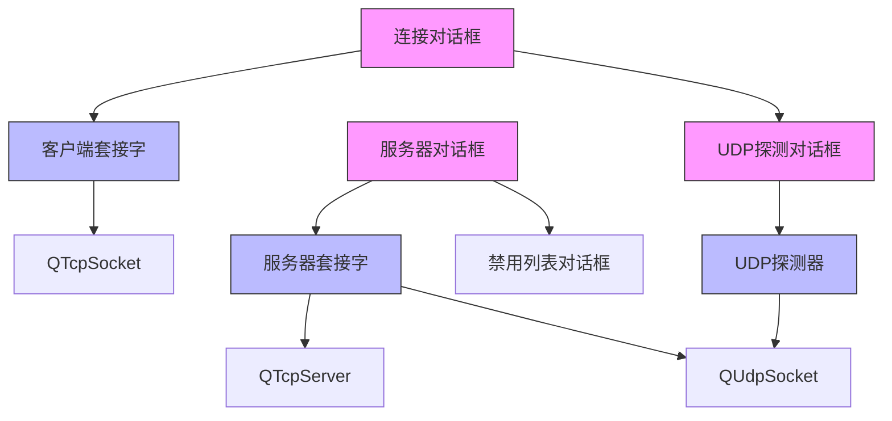

**图示来源**
- [connectiondialog.cpp](file://src/dialog/connectiondialog.cpp#L150-L160)
- [serverdialog.cpp](file://src/dialog/serverdialog.cpp#L700-L710)
- [udpdetectordialog.cpp](file://src/dialog/udpdetectordialog.cpp#L10-L20)

**本节来源**
- [src/dialog](file://src/dialog)
- [src/util](file://src/util)

## 性能考虑
系统在网络通信方面进行了多项性能优化：

1. **连接复用**：使用持久的TCP连接，避免频繁建立/断开连接的开销
2. **异步通信**：基于Qt信号槽机制实现异步非阻塞I/O，避免界面冻结
3. **批量发送**：通过flush()确保数据及时发送，减少网络延迟
4. **资源管理**：及时释放不再使用的套接字资源，防止内存泄漏
5. **超时控制**：设置合理的操作超时时间，避免长时间等待

**本节来源**
- [nativesocket.cpp](file://src/util/nativesocket.cpp)
- [connectiondialog.cpp](file://src/dialog/connectiondialog.cpp)

## 故障排除指南

### 常见连接问题及解决方案
| 问题现象 | 可能原因 | 解决方案 |
|--------|--------|--------|
| 连接被拒绝或超时 | 服务器未启动或端口错误 | 检查服务器是否运行，确认端口号正确 |
| 主机未找到 | IP地址错误或网络不通 | 验证IP地址正确性，检查网络连接 |
| 远程主机关闭连接 | 服务器主动断开 | 检查服务器日志，确认是否有踢出操作 |
| 套接字访问错误 | 权限不足或端口被占用 | 以管理员权限运行或更换端口号 |
| 未知错误 | 网络环境异常 | 检查防火墙设置，尝试重启网络 |

### 网络配置检查清单
1. **服务器端检查**：
   - 确认服务器已成功启动
   - 检查服务器端口是否被防火墙阻止
   - 验证服务器名称和IP地址配置正确
   - 确认没有启用"禁止相同IP"导致连接被拒

2. **客户端检查**：
   - 验证服务器IP地址和端口号正确
   - 检查本地网络连接是否正常
   - 确认用户名不为空且符合长度要求
   - 尝试使用UDP探测功能发现局域网服务器

3. **防火墙和NAT穿越**：
   - 在路由器上设置端口转发（端口9527）
   - 将游戏程序添加到防火墙白名单
   - 对于NAT环境，确保使用公网IP或DDNS服务
   - 考虑使用UPnP自动配置端口映射

**本节来源**
- [nativesocket.cpp](file://src/util/nativesocket.cpp#L180-L200)
- [connectiondialog.cpp](file://src/dialog/connectiondialog.cpp#L100-L150)

## 结论
本文档详细分析了《三国杀：霸业》网络管理对话框的架构与实现。系统采用分层设计，将UI界面与底层网络功能分离，通过清晰的接口进行通信。连接对话框、服务器对话框和UDP探测对话框各司其职，共同构成了完整的网络管理功能。原生套接字模块封装了TCP/UDP协议的复杂性，为上层提供了简洁的API接口。系统在用户体验方面考虑周全，提供了输入验证、错误提示、局域网探测等实用功能。对于复杂网络环境，通过合理的错误处理和配置选项，提高了系统的健壮性和可用性。