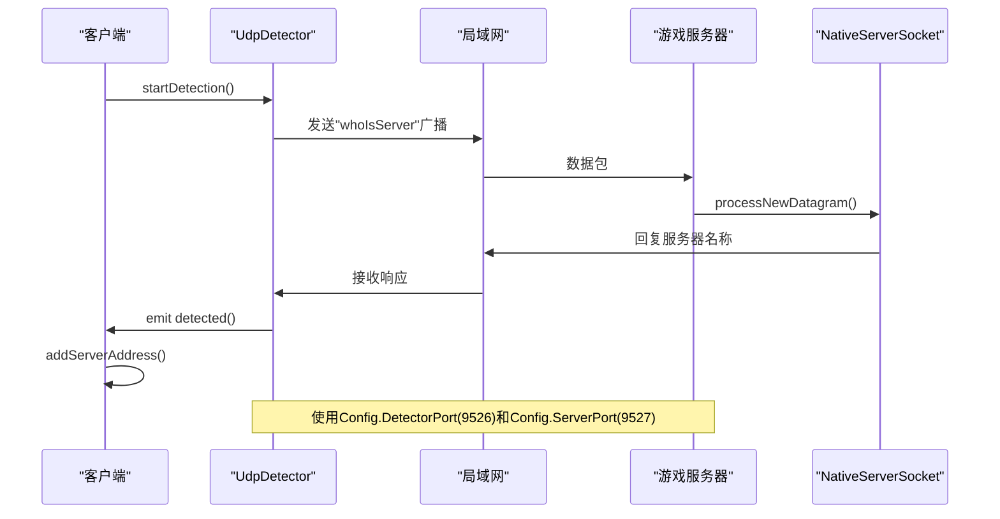
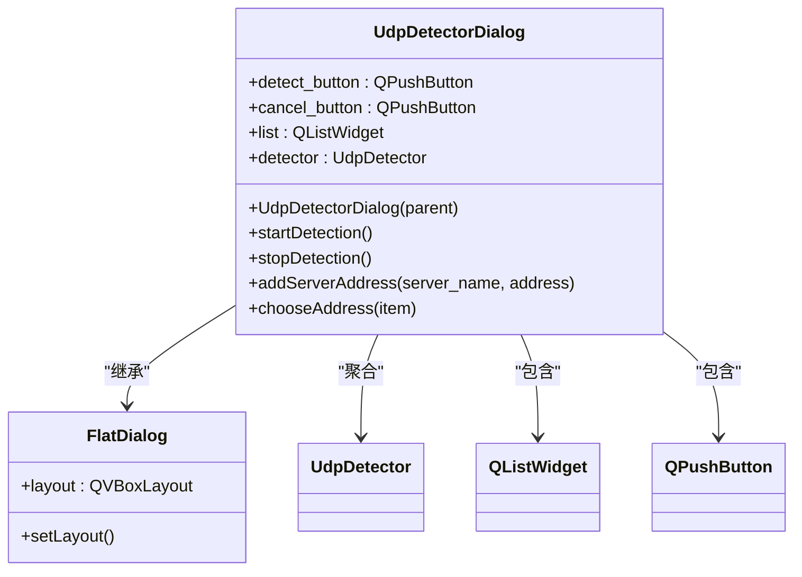
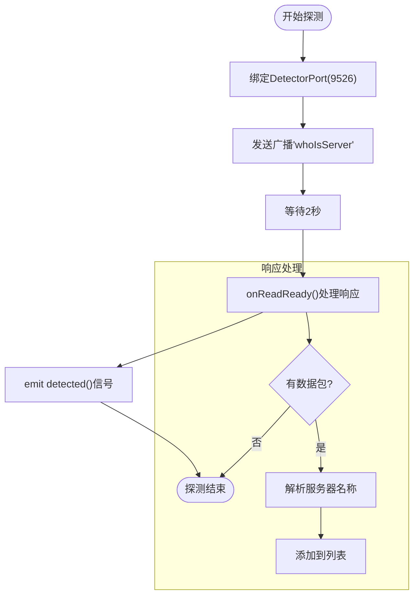
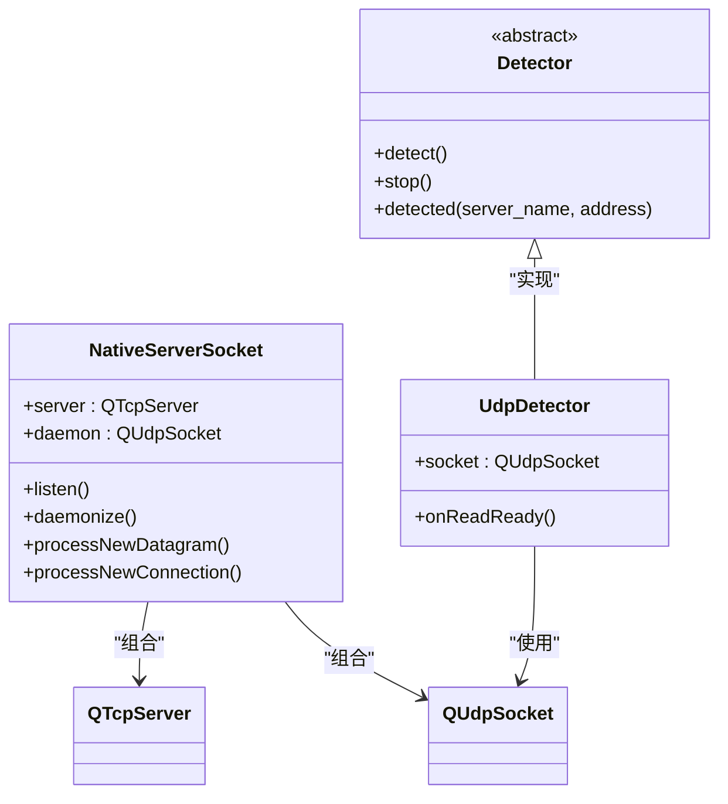

# 网络质量检测对话框

<cite>
**本文档引用文件**   
- [udpdetectordialog.cpp](file://src/dialog/udpdetectordialog.cpp)
- [detector.h](file://src/util/detector.h)
- [detector.cpp](file://src/util/detector.cpp)
- [nativesocket.cpp](file://src/util/nativesocket.cpp)
- [settings.h](file://src/core/settings.h)
- [settings.cpp](file://src/core/settings.cpp)
</cite>

## 目录
1. [简介](#简介)
2. [项目结构](#项目结构)
3. [核心组件](#核心组件)
4. [架构概述](#架构概述)
5. [详细组件分析](#详细组件分析)
6. [依赖分析](#依赖分析)
7. [性能考虑](#性能考虑)
8. [故障排除指南](#故障排除指南)
9. [结论](#结论)

## 简介
本文档深入分析《三国杀：霸业》客户端中实现的局域网服务器探测机制，重点解析基于UDP广播的网络发现功能。系统通过`UdpDetectorDialog`类提供图形化界面，允许用户扫描本地网络中可用的游戏服务器。该机制依赖于UDP广播请求与响应协议，结合Qt网络编程模型实现高效的服务发现。文档将详细阐述探测流程、信号槽通信机制、线程安全设计以及与底层Socket操作的集成方式。

## 项目结构
项目采用模块化分层架构，网络探测功能主要分布在`src/dialog`和`src/util`目录下。UI组件与业务逻辑分离，遵循Qt框架的MVC设计模式。

```mermaid
graph TB
subgraph "UI 层"
UDD["UdpDetectorDialog"]
end
subgraph "工具层"
Detector["Detector"]
UdpDetector["UdpDetector"]
NativeSocket["NativeServerSocket"]
end
subgraph "配置层"
Settings["Settings"]
end
UDD --> Detector : "使用"
UDD --> Settings : "读取端口"
Detector --> UdpDetector : "继承"
NativeSocket --> Detector : "响应探测"
Settings --> UDD : "提供配置"
Settings --> NativeSocket : "提供端口"
```

**图示来源**
- [udpdetectordialog.cpp](file://src/dialog/udpdetectordialog.cpp#L1-L96)
- [detector.h](file://src/util/detector.h#L1-L58)
- [nativesocket.cpp](file://src/util/nativesocket.cpp#L1-L204)
- [settings.h](file://src/core/settings.h#L1-L140)

**本节来源**
- [project_structure](file://project_structure#L1-L200)

## 核心组件
核心组件包括`UdpDetectorDialog`（UI界面）、`UdpDetector`（UDP探测器）、`NativeServerSocket`（服务器守护）和`Settings`（全局配置）。这些组件协同工作，实现服务发现功能。`UdpDetectorDialog`负责用户交互，`UdpDetector`执行底层网络操作，`NativeServerSocket`使服务器可被发现，`Settings`统一管理端口等参数。

**本节来源**
- [udpdetectordialog.cpp](file://src/dialog/udpdetectordialog.cpp#L1-L96)
- [detector.h](file://src/util/detector.h#L1-L58)

## 架构概述
系统采用客户端-服务器探测架构，基于UDP广播实现服务发现。客户端发送广播询问，服务器监听并响应，形成一对多的发现模式。



**图示来源**
- [detector.cpp](file://src/util/detector.cpp#L1-L60)
- [nativesocket.cpp](file://src/util/nativesocket.cpp#L1-L204)
- [settings.cpp](file://src/core/settings.cpp#L1-L169)

## 详细组件分析

### UDP探测对话框分析
`UdpDetectorDialog`类实现图形化服务发现界面，继承自`FlatDialog`，提供现代化UI体验。

#### 类结构分析


**图示来源**
- [udpdetectordialog.cpp](file://src/dialog/udpdetectordialog.cpp#L1-L96)

**本节来源**
- [udpdetectordialog.cpp](file://src/dialog/udpdetectordialog.cpp#L1-L96)

### UDP探测器分析
`UdpDetector`类实现核心网络探测逻辑，基于Qt的`QUdpSocket`进行UDP通信。

#### 探测流程分析


**图示来源**
- [detector.cpp](file://src/util/detector.cpp#L1-L60)

**本节来源**
- [detector.cpp](file://src/util/detector.cpp#L1-L60)

### 服务器守护分析
`NativeServerSocket`类使游戏服务器可被发现，通过UDP守护进程响应探测请求。

#### 守护机制分析


**图示来源**
- [nativesocket.cpp](file://src/util/nativesocket.cpp#L1-L204)
- [detector.h](file://src/util/detector.h#L1-L58)

**本节来源**
- [nativesocket.cpp](file://src/util/nativesocket.cpp#L1-L204)

## 依赖分析
系统各组件间存在明确的依赖关系，形成清晰的调用链。

```mermaid
graph LR
UDD["UdpDetectorDialog"] --> UD["UdpDetector"]
UD --> QS["QUdpSocket"]
NSS["NativeServerSocket"] --> QS
UDD --> SET["Settings"]
NSS --> SET
SET --> UDD : "提供DetectorPort"
SET --> NSS : "提供ServerPort"
style UDD fill:#f9f,stroke:#333
style UD fill:#bbf,stroke:#333
style NSS fill:#f96,stroke:#333
style SET fill:#9f9,stroke:#333
```

**图示来源**
- [settings.h](file://src/core/settings.h#L1-L140)
- [settings.cpp](file://src/core/settings.cpp#L1-L169)

**本节来源**
- [settings.h](file://src/core/settings.h#L1-L140)
- [settings.cpp](file://src/core/settings.cpp#L1-L169)

## 性能考虑
探测机制设计考虑了性能与用户体验的平衡。探测周期固定为2秒（通过`QTimer::singleShot(2000, ...)`），避免网络拥塞。使用UDP广播而非TCP连接，减少网络开销。`QUdpSocket::ShareAddress`选项允许多个进程共享端口，提高兼容性。建议在高延迟网络中增加超时时间，在低延迟网络中可适当缩短。

## 故障排除指南
常见问题及解决方案：

1. **无法发现服务器**：
   - 检查防火墙是否阻止UDP端口9526和9527
   - 确认服务器已启动`daemonize()`守护进程
   - 验证`Config.DetectorPort`和`Config.ServerPort`配置正确

2. **探测结果延迟**：
   - 检查网络是否支持广播
   - 确认没有网络设备过滤UDP广播包
   - 查看是否有其他程序占用相同端口

3. **界面无响应**：
   - 确保探测在独立线程或异步执行
   - 检查信号槽连接是否正确
   - 验证`QListWidget`更新是否在主线程

**本节来源**
- [udpdetectordialog.cpp](file://src/dialog/udpdetectordialog.cpp#L1-L96)
- [nativesocket.cpp](file://src/util/nativesocket.cpp#L1-L204)

## 结论
`UdpDetectorDialog`实现了一套高效、可靠的局域网服务发现机制，通过UDP广播与响应模式，结合Qt信号槽机制，提供了良好的用户体验。系统设计模块化，配置集中化，便于维护和扩展。未来可优化方向包括：增加多播支持、实现探测超时可配置、添加网络质量评估功能。