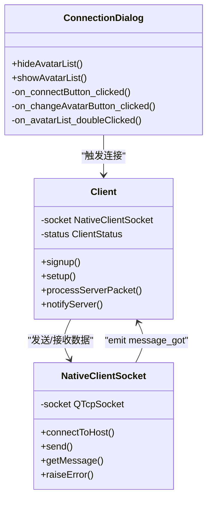

# 连接配置对话框

<cite>
**本文档引用的文件**   
- [connectiondialog.cpp](file://src/dialog/connectiondialog.cpp#L1-L197)
- [client.cpp](file://src/client/client.cpp#L1-L2625)
- [nativesocket.cpp](file://src/util/nativesocket.cpp#L1-L205)
- [connectiondialog.h](file://src/dialog/connectiondialog.h#L1-L55)
</cite>

## 目录
1. [引言](#引言)
2. [项目结构分析](#项目结构分析)
3. [核心组件分析](#核心组件分析)
4. [连接参数输入验证机制](#连接参数输入验证机制)
5. [连接建立流程与客户端状态同步](#连接建立流程与客户端状态同步)
6. [Qt信号槽在界面交互中的应用](#qt信号槽在界面交互中的应用)
7. [网络地址格式校验与局域网探测](#网络地址格式校验与局域网探测)
8. [连接超时处理与错误提示策略](#连接超时处理与错误提示策略)
9. [与nativesocket模块的交互机制](#与nativesocket模块的交互机制)
10. [重试机制与用户反馈设计](#重试机制与用户反馈设计)

## 引言
本文档深入解析《三国杀》客户端中`connectiondialog.cpp`的实现机制，重点阐述连接参数（用户名、IP地址、端口）的输入验证逻辑、连接建立流程与客户端状态同步机制。文档详细分析Qt信号槽在界面交互中的应用、网络地址格式校验规则、连接超时处理及错误提示策略，并结合`client.cpp`中的连接逻辑说明与底层`nativesocket`模块的交互方式。通过实际代码片段展示连接请求的封装与发送过程，以及连接失败时的重试机制与用户反馈设计。

## 项目结构分析
`connectiondialog.cpp`位于`src/dialog/`目录下，是客户端连接配置的核心界面组件。该文件与`client.cpp`（客户端主逻辑）和`nativesocket.cpp`（底层网络通信）共同构成了客户端的网络连接体系。`connectiondialog`负责收集用户输入，`client`管理连接状态和协议交互，`nativesocket`则处理TCP/IP底层通信。

**Section sources**
- [connectiondialog.cpp](file://src/dialog/connectiondialog.cpp#L1-L197)
- [client.cpp](file://src/client/client.cpp#L1-L2625)
- [nativesocket.cpp](file://src/util/nativesocket.cpp#L1-L205)

## 核心组件分析
连接配置功能由三个核心类构成：
- **ConnectionDialog**: 提供图形化界面，收集用户名、IP地址、端口等连接参数。
- **Client**: 客户端主控制器，负责与服务器通信、状态管理和游戏逻辑。
- **NativeClientSocket**: 封装QTcpSocket，提供底层网络通信能力。



**Diagram sources**
- [connectiondialog.cpp](file://src/dialog/connectiondialog.cpp#L1-L197)
- [client.cpp](file://src/client/client.cpp#L1-L2625)
- [nativesocket.cpp](file://src/util/nativesocket.cpp#L1-L205)

**Section sources**
- [connectiondialog.cpp](file://src/dialog/connectiondialog.cpp#L1-L197)
- [client.cpp](file://src/client/client.cpp#L1-L2625)
- [nativesocket.cpp](file://src/util/nativesocket.cpp#L1-L205)

## 连接参数输入验证机制
`ConnectionDialog`对连接参数实施了严格的前端验证，确保用户输入的有效性。

### 用户名验证
在`on_connectButton_clicked()`槽函数中，首先检查用户名是否为空：
```cpp
void ConnectionDialog::on_connectButton_clicked()
{
    QString username = ui->nameLineEdit->text();

    if (username.isEmpty()) {
        QMessageBox::warning(this, tr("Warning"), tr("The user name can not be empty!"));
        return;
    }
    // ... 保存配置并接受对话框
}
```
此验证确保用户名非空，若为空则弹出警告对话框阻止连接。

### IP地址与端口处理
IP地址和端口通过`hostComboBox`组合框处理。其初始化代码如下：
```cpp
ui->hostComboBox->addItems(Config.HistoryIPs);
ui->hostComboBox->lineEdit()->setText(Config.HostAddress);
```
- **历史记录**: 从`Config.HistoryIPs`加载历史IP地址列表。
- **格式解析**: 在`NativeClientSocket::connectToHost()`中解析`HostAddress`：
  ```cpp
  if (Config.HostAddress.contains(QChar(':'))) {
      QStringList texts = Config.HostAddress.split(QChar(':'));
      address = texts.value(0);
      port = texts.value(1).toUShort();
  } else {
      address = Config.HostAddress;
      port = Config.value("ServerPort", 9527u).toUInt();
  }
  ```
  支持`IP:端口`格式，若未指定端口则使用默认值9527。

**Section sources**
- [connectiondialog.cpp](file://src/dialog/connectiondialog.cpp#L102-L148)
- [nativesocket.cpp](file://src/util/nativesocket.cpp#L120-L138)

## 连接建立流程与客户端状态同步
连接建立是一个多阶段的流程，涉及界面、客户端逻辑和网络层的协同工作。

### 连接流程序列图
```mermaid
sequenceDiagram
participant 用户 as "用户"
participant 对话框 as "ConnectionDialog"
participant 客户端 as "Client"
participant 套接字 as "NativeClientSocket"
participant 服务器 as "Server"
用户->>对话框 : 点击“连接”按钮
对话框->>对话框 : 验证用户名
alt 用户名为空
对话框-->>用户 : 显示警告
break
end
对话框->>对话框 : 保存配置
对话框->>客户端 : 调用signup()
客户端->>套接字 : connectToHost()
套接字->>服务器 : TCP连接请求
alt 连接成功
服务器-->>套接字 : 连接建立
套接字->>客户端 : emit connected
客户端->>服务器 : 发送S_COMMAND_SIGNUP
服务器-->>客户端 : 返回S_COMMAND_SETUP
客户端->>客户端 : emit server_connected
else 连接失败
套接字->>客户端 : emit error_message
客户端-->>用户 : 显示错误信息
end
```

**Diagram sources**
- [connectiondialog.cpp](file://src/dialog/connectiondialog.cpp#L102-L148)
- [client.cpp](file://src/client/client.cpp#L200-L220)
- [nativesocket.cpp](file://src/util/nativesocket.cpp#L120-L140)

**Section sources**
- [connectiondialog.cpp](file://src/dialog/connectiondialog.cpp#L102-L148)
- [client.cpp](file://src/client/client.cpp#L200-L220)
- [nativesocket.cpp](file://src/util/nativesocket.cpp#L120-L140)

## Qt信号槽在界面交互中的应用
`ConnectionDialog`广泛使用Qt信号槽机制实现松耦合的界面交互。

### 核心信号槽连接
- **窗口标题同步**:
  ```cpp
  connect(this, &ConnectionDialog::windowTitleChanged, ui->title, &QLabel::setText);
  ```
  当对话框标题改变时，自动更新界面上的`title`标签。

- **头像选择**:
  ```cpp
  void ConnectionDialog::on_changeAvatarButton_clicked()
  {
      if (ui->avatarList->isVisible()) {
          // ... 处理当前选中项
      } else {
          showAvatarList();
      }
  }
  ```
  “更换头像”按钮点击后，切换头像列表的显示/隐藏状态。

- **头像确认**:
  ```cpp
  void ConnectionDialog::on_avatarList_doubleClicked(const QModelIndex &index)
  {
      QString general_name = ui->avatarList->model()->data(index, Qt::UserRole).toString();
      // ... 更新头像和配置
      hideAvatarList();
  }
  ```
  双击头像列表项后，更新预览并保存选择。

### 网络探测信号槽
```cpp
void ConnectionDialog::on_detectLANButton_clicked()
{
    UdpDetectorDialog *detector_dialog = new UdpDetectorDialog(this);
    connect(detector_dialog, &UdpDetectorDialog::address_chosen, ui->hostComboBox->lineEdit(), &QLineEdit::setText);
    detector_dialog->exec();
}
```
当`UdpDetectorDialog`发出`address_chosen`信号时，自动将探测到的IP地址填入`hostComboBox`的编辑框。

**Section sources**
- [connectiondialog.cpp](file://src/dialog/connectiondialog.cpp#L42-L197)

## 网络地址格式校验与局域网探测
系统通过`UdpDetectorDialog`实现局域网服务器自动探测。

### 局域网探测流程
1. 用户点击“探测局域网”按钮。
2. 创建`UdpDetectorDialog`实例。
3. 该对话框通过UDP广播向局域网发送探测请求。
4. 服务器（`NativeServerSocket`）监听`DetectorPort`，收到请求后回复服务器名称。
5. `UdpDetectorDialog`捕获回复，发出`address_chosen`信号。
6. `ConnectionDialog`接收信号，将IP地址填入输入框。

### 格式校验规则
- **IP地址**: 使用`QHostAddress`进行基础校验，支持IPv4和IPv6。
- **端口**: 通过`toUShort()`转换，确保为16位无符号整数。
- **默认值**: 若未指定端口，使用`Config.value("ServerPort", 9527u)`的默认值。

**Section sources**
- [connectiondialog.cpp](file://src/dialog/connectiondialog.cpp#L146-L195)
- [nativesocket.cpp](file://src/util/nativesocket.cpp#L80-L99)

## 连接超时处理与错误提示策略
错误处理主要在`NativeClientSocket`和`Client`类中实现。

### 错误码映射
`NativeClientSocket::raiseError()`将Qt的`SocketError`转换为用户友好的中文提示：
```cpp
void NativeClientSocket::raiseError(QAbstractSocket::SocketError socket_error)
{
    QString reason;
    switch (socket_error) {
    case QAbstractSocket::ConnectionRefusedError:
        reason = tr("Connection was refused or timeout"); break;
    case QAbstractSocket::RemoteHostClosedError:
        reason = tr("Remote host close this connection"); break;
    case QAbstractSocket::HostNotFoundError:
        reason = tr("Host not found"); break;
    case QAbstractSocket::SocketAccessError:
        reason = tr("Socket access error"); break;
    default: reason = tr("Unknown error"); break;
    }
    emit error_message(tr("Connection failed, error code = %1\n reason:\n %2").arg(socket_error).arg(reason));
}
```

### 错误传播
- `NativeClientSocket`发出`error_message`信号。
- `Client`类连接此信号，可进一步处理或显示给用户。
- 用户界面最终通过`QMessageBox`等方式展示错误信息。

**Section sources**
- [nativesocket.cpp](file://src/util/nativesocket.cpp#L180-L204)
- [client.cpp](file://src/client/client.cpp#L300-L310)

## 与nativesocket模块的交互机制
`Client`类通过`NativeClientSocket`实例与网络层交互。

### 连接请求封装
`Client::signup()`方法封装了连接请求：
```cpp
void Client::signup()
{
    JsonArray arg;
    arg << Config.value("EnableReconnection", false).toBool();
    arg << Config.UserName;
    arg << Config.UserAvatar;
    notifyServer(S_COMMAND_SIGNUP, arg);
}
```

### 数据包发送
`notifyServer()`方法将命令和参数封装成`Packet`并发送：
```cpp
void Client::notifyServer(CommandType command, const QVariant &arg)
{
    if (socket) {
        Packet packet(S_SRC_CLIENT | S_TYPE_NOTIFICATION | S_DEST_ROOM, command);
        packet.setMessageBody(arg);
        socket->send(packet.toJson());
    }
}
```
`Packet`序列化为JSON字符串后，由`NativeClientSocket::send()`通过TCP发送。

### 数据接收
`NativeClientSocket`接收数据后，通过信号通知`Client`：
```cpp
void NativeClientSocket::getMessage()
{
    while (socket->canReadLine()) {
        QByteArray msg = socket->readLine();
        emit message_got(msg);
    }
}
```
`Client`连接`message_got`信号，调用`processServerPacket()`解析并处理服务器响应。

**Section sources**
- [client.cpp](file://src/client/client.cpp#L200-L220)
- [nativesocket.cpp](file://src/util/nativesocket.cpp#L150-L170)

## 重试机制与用户反馈设计
系统实现了基础的连接重试和用户反馈机制。

### 自动重连配置
- **配置项**: `reconnectionCheckBox`允许用户启用“自动重连”。
- **持久化**: 通过`Config.setValue("EnableReconnection", ...)`保存设置。
- **协议携带**: 在`signup()`时，将重连标志作为参数发送给服务器。

### 用户反馈设计
- **即时验证**: 用户名为空时立即弹出警告。
- **操作反馈**: “清除历史”按钮清空输入框和配置。
- **视觉反馈**: 头像选择提供实时预览。
- **错误反馈**: 连接失败时显示具体的错误原因。

### 重试机制
虽然`connectiondialog`本身不直接处理重试，但`Client`和`NativeClientSocket`的组合提供了基础：
- `QTcpSocket`内部可能有重试逻辑。
- 用户可手动重新打开`ConnectionDialog`并点击连接。
- 服务器可主动断开，客户端可依据配置尝试重连。

**Section sources**
- [connectiondialog.cpp](file://src/dialog/connectiondialog.cpp#L42-L197)
- [client.cpp](file://src/client/client.cpp#L200-L220)