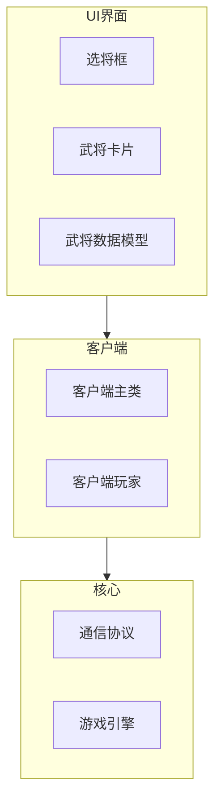
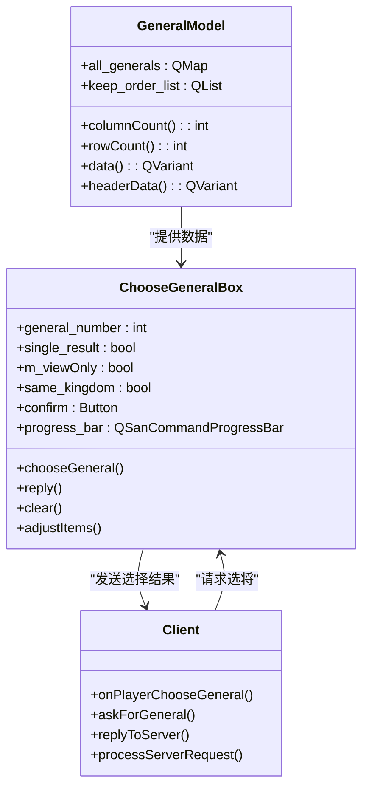
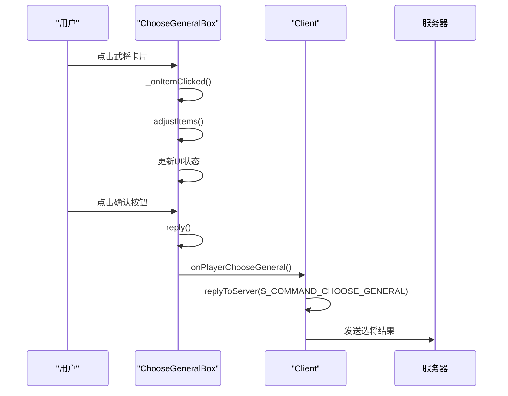
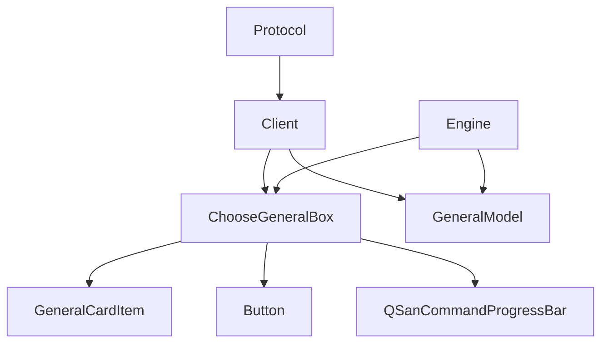

# 标准选将流程

<cite>
**本文档引用的文件**   
- [choosegeneralbox.cpp](file://src/ui/choosegeneralbox.cpp)
- [generalmodel.cpp](file://src/dialog/generalmodel.cpp)
- [client.cpp](file://src/client/client.cpp)
- [client.h](file://src/client/client.h)
- [protocol.h](file://src/core/protocol.h)
</cite>

## 目录
1. [简介](#简介)
2. [项目结构](#项目结构)
3. [核心组件](#核心组件)
4. [架构概述](#架构概述)
5. [详细组件分析](#详细组件分析)
6. [依赖分析](#依赖分析)
7. [性能考虑](#性能考虑)
8. [故障排除指南](#故障排除指南)
9. [结论](#结论)

## 简介
本文档详细分析了《三国杀》游戏中标准选将流程的实现机制。重点阐述了选将界面的初始化、武将列表渲染、用户交互响应及状态管理逻辑。文档说明了GeneralModel数据模型如何与服务器同步武将池信息，描述了倒计时控件与网络事件的协同机制。同时涵盖了玩家点击选将后的请求封装、服务器响应处理、UI状态更新的完整闭环流程，并结合代码示例说明了信号槽机制在选将过程中的应用。此外，还提供了对异常情况（如网络延迟、重复选择）的处理策略和调试方法。

## 项目结构
本项目采用分层架构设计，主要分为客户端、核心引擎、服务器和UI界面四个部分。选将功能主要集中在客户端的UI模块和核心协议处理模块中。



**图示来源**
- [choosegeneralbox.cpp](file://src/ui/choosegeneralbox.cpp)
- [client.cpp](file://src/client/client.cpp)
- [protocol.h](file://src/core/protocol.h)

**本节来源**
- [choosegeneralbox.cpp](file://src/ui/choosegeneralbox.cpp)
- [client.cpp](file://src/client/client.cpp)

## 核心组件
选将流程的核心组件包括ChooseGeneralBox（选将框）、GeneralCardItem（武将卡片）和GeneralModel（武将数据模型）。这些组件通过信号槽机制与客户端进行通信，实现了选将界面的动态更新和用户交互。

**本节来源**
- [choosegeneralbox.cpp](file://src/ui/choosegeneralbox.cpp)
- [generalmodel.cpp](file://src/dialog/generalmodel.cpp)

## 架构概述
选将流程的架构采用MVC（Model-View-Controller）模式，其中GeneralModel作为数据模型，ChooseGeneralBox作为视图，客户端作为控制器。这种设计实现了数据与界面的分离，提高了代码的可维护性和可扩展性。



**图示来源**
- [generalmodel.cpp](file://src/dialog/generalmodel.cpp#L15-L181)
- [choosegeneralbox.cpp](file://src/ui/choosegeneralbox.cpp#L15-L719)
- [client.cpp](file://src/client/client.cpp#L15-L2625)

## 详细组件分析

### ChooseGeneralBox分析
ChooseGeneralBox是选将界面的核心组件，负责管理选将框的显示、用户交互和状态更新。

#### 选将框初始化
当服务器发送S_COMMAND_CHOOSE_GENERAL命令时，客户端的askForGeneral方法会被调用，创建并显示ChooseGeneralBox实例。

```cpp
void Client::askForGeneral(const QVariant &arg) {
    JsonArray args = arg.value<JsonArray>();
    Q_ASSERT(args.size() >= 3);
    
    QStringList generals = args[0].toString().split("+");
    bool view_only = args[1].toBool();
    bool single_result = args[2].toBool();
    QString reason = args[3].toString();
    bool can_convert = args[4].toBool();
    bool same_kingdom = args[5].toBool();
    
    emit generals_got(generals, single_result, can_convert, same_kingdom);
}
```

**图示来源**
- [client.cpp](file://src/client/client.cpp#L15-L2625)

**本节来源**
- [client.cpp](file://src/client/client.cpp#L15-L2625)

#### 武将列表渲染
ChooseGeneralBox的chooseGeneral方法负责渲染武将列表，根据武将数量自动调整布局。

```cpp
void ChooseGeneralBox::chooseGeneral(const QStringList &_generals, bool view_only, bool single_result, const QString &reason, const Player *player, const bool can_convert, const bool same_kingdom)
{
    clear();
    QStringList generals = _generals;
    this->single_result = single_result;
    this->same_kingdom = same_kingdom;
    this->reason = reason;
    
    general_number = generals.length();
    prepareGeometryChange();

    items.clear();
    selected.clear();
    int z = generals.length();

    foreach (const QString &general, generals) {
        int skinId = 0;
        if (player) {
            if (player->getGeneralName() == general)
                skinId = player->getHeadSkinId();
            else
                skinId = player->getDeputySkinId();
        }

        GeneralCardItem *general_item = new GeneralCardItem(general, skinId);
        general_item->setProperty("source", general);
        general_item->setFlag(QGraphicsItem::ItemIsFocusable);
        general_item->setZValue(z--);

        if (view_only || single_result) {
            general_item->setFlag(QGraphicsItem::ItemIsMovable, false);
        } else {
            general_item->setAutoBack(true);
            connect(general_item, &GeneralCardItem::released, this, &ChooseGeneralBox::_adjust);
            if (!Sanguosha->getConvertGenerals(general).isEmpty() && can_convert) {
                Button *button = new Button(Sanguosha->translate("convert_general"), 0.45);
                button->setPos((93 - button->boundingRect().width()) / 2, 130 - button->boundingRect().height());
                button->setParentItem(general_item);
                button->setObjectName(general);
                connect(button, &Button::clicked, this, &ChooseGeneralBox::_onConvertButtonClicked);
            }
        }

        if (!view_only) {
            connect(general_item, &GeneralCardItem::clicked, this, &ChooseGeneralBox::_onItemClicked);
            if (!single_result)
                connect(general_item, &GeneralCardItem::general_changed, this, &ChooseGeneralBox::adjustItems);
        }

        if (!single_result && !view_only) {
            const General *hero = Sanguosha->getGeneral(general);
            foreach (const QString &other, generals) {
                if (general != other && hero->isCompanionWith(other)) {
                    general_item->showCompanion();
                    break;
                }
            }
        }

        items << general_item;
        general_item->setParentItem(this);
    }

    moveToCenter();
    show();
}
```

**图示来源**
- [choosegeneralbox.cpp](file://src/ui/choosegeneralbox.cpp#L15-L719)

**本节来源**
- [choosegeneralbox.cpp](file://src/ui/choosegeneralbox.cpp#L15-L719)

#### 用户交互响应
ChooseGeneralBox通过信号槽机制处理用户交互，包括武将卡片点击、位置调整和确认选择等操作。



**图示来源**
- [choosegeneralbox.cpp](file://src/ui/choosegeneralbox.cpp#L15-L719)
- [client.cpp](file://src/client/client.cpp#L15-L2625)

**本节来源**
- [choosegeneralbox.cpp](file://src/ui/choosegeneralbox.cpp#L15-L719)
- [client.cpp](file://src/client/client.cpp#L15-L2625)

### GeneralModel分析
GeneralModel是武将数据模型，负责管理武将列表的数据和显示。

```cpp
GeneralModel::GeneralModel(const QMap<const General *, int> &list, QList<const General *> &keepOrderList)
    : all_generals(list), keep_order_list(keepOrderList)
{
}

int GeneralModel::columnCount(const QModelIndex &parent) const
{
    if (parent.isValid())
        return 0;

    return ColumnTypesCount;
}

int GeneralModel::rowCount(const QModelIndex &parent) const
{
    if (parent.isValid())
        return 0;

    return all_generals.count();
}

QVariant GeneralModel::data(const QModelIndex &index, int role) const
{
    const int row = index.row();
    if (row < 0 || row >= all_generals.size())
        return QVariant();

    const General *general = keep_order_list.at(row);
    switch (role) {
    case Qt::UserRole: return general->objectName();
    case Qt::DisplayRole: {
        switch (index.column()) {
        case TitleColumn: return general->getTitle(all_generals.value(general));
        case NameColumn: return Sanguosha->translate(general->objectName());
        case KingdomColumn: {
            QString kingdom = Sanguosha->translate(general->getKingdom());
            if (general->isDoubleKingdoms()) {
                kingdom.append("/");
                kingdom.append(Sanguosha->translate(general->getSubordinateKingdom()));
            }
            return kingdom;
        }
        case GenderColumn: return general->isMale() ? tr("Male") : (general->isFemale() ? tr("Female") : tr("NoGender"));
        case MaxHpColumn: {
            QString maxHp;
            if (general->objectName().startsWith("jg_")) {
                maxHp = QString::number(general->getMaxHpHead());
            } else if (general->getMaxHpHead() == general->getMaxHpDeputy()) {
                maxHp = QString::number((float)general->getMaxHpHead() / 2);
            } else {
                maxHp = QString::number((float)general->getMaxHpHead() / 2);
                if (general->getMaxHpHead() != general->getDoubleMaxHp()) {
                    maxHp.prepend("(");
                    maxHp.append(")");
                }
                maxHp.append("/");
                QString deputy_max_hp = QString::number((float)general->getMaxHpDeputy() / 2);
                if (general->getMaxHpDeputy() != general->getDoubleMaxHp()) {
                    deputy_max_hp.prepend("(");
                    deputy_max_hp.append(")");
                }
                maxHp.append(deputy_max_hp);
            }
            return maxHp;
        }
        case PackageColumn: return Sanguosha->translate(general->getPackage());
        }
    }
    case Qt::DecorationRole: {
        if (index.column() == NameColumn) {
            if (general->isLord()) {
                QIcon icon("image/system/roles/lord.png");
                return icon;
            }
            if (general->getKingdom() == "careerist") {
                QIcon icon("image/system/roles/renegade.png");
                return icon;
            }
        }
        break;
    }
    case Qt::ToolTipRole: {
        switch (index.column()) {
        case TitleColumn:
        case NameColumn: {
            if (Sanguosha->isGeneralHidden(general->objectName())) {
                return tr("<font color=%1>This general is hidden</font>")
                    .arg(Config.SkillDescriptionInToolTipColor.name());
            } else {
                return QString();
            }
        }
        case PackageColumn: {
            if (Config.value("LuaPackages", QString()).toString().split("+").contains(general->getPackage())) {
                return tr("<font color=%1>This is an Lua extension</font>").arg(Config.SkillDescriptionInToolTipColor.name());
            } else {
                return QString();
            }
        }
        default: return QString();
        }
    }
    case Qt::TextAlignmentRole: return Qt::AlignCenter;
    case Qt::BackgroundRole: {
        switch (index.column()) {
        case TitleColumn:
        case NameColumn: {
            if (Sanguosha->isGeneralHidden(general->objectName()))
                return QBrush(Qt::gray);
            else
                break;
        }
        case PackageColumn: {
            if (Config.value("LuaPackages", QString()).toString().split("+").contains(general->getPackage())) {
                return QBrush(QColor(0x66, 0xCC, 0xFF));
            } else {
                break;
            }
        }
        default: break;
        }
    }
    }

    return QVariant();
}
```

**图示来源**
- [generalmodel.cpp](file://src/dialog/generalmodel.cpp#L15-L181)

**本节来源**
- [generalmodel.cpp](file://src/dialog/generalmodel.cpp#L15-L181)

## 依赖分析
选将流程涉及多个组件之间的依赖关系，主要包括UI组件、客户端逻辑和核心协议。



**图示来源**
- [choosegeneralbox.cpp](file://src/ui/choosegeneralbox.cpp)
- [client.cpp](file://src/client/client.cpp)
- [generalmodel.cpp](file://src/dialog/generalmodel.cpp)

**本节来源**
- [choosegeneralbox.cpp](file://src/ui/choosegeneralbox.cpp)
- [client.cpp](file://src/client/client.cpp)
- [generalmodel.cpp](file://src/dialog/generalmodel.cpp)

## 性能考虑
选将流程的性能主要体现在界面渲染效率和网络通信延迟上。通过以下措施优化性能：
1. 使用对象池技术复用武将卡片
2. 异步加载武将图片资源
3. 优化布局计算算法
4. 减少不必要的信号发射

## 故障排除指南
### 网络延迟处理
当网络延迟较高时，系统会自动延长倒计时时间，确保玩家有足够时间做出选择。

```cpp
if ((view_only || ServerInfo.OperationTimeout != 0)) {
    if (!progress_bar) {
        progress_bar = new QSanCommandProgressBar();
        progress_bar->setMaximumWidth(boundingRect().width() - 10);
        progress_bar->setMaximumHeight(12);
        progress_bar->setTimerEnabled(true);
        progress_bar_item = new QGraphicsProxyWidget(this);
        progress_bar_item->setWidget(progress_bar);
        progress_bar_item->setPos(boundingRect().center().x() - progress_bar_item->boundingRect().width() / 2, boundingRect().height() - 20);
        connect(progress_bar, &QSanCommandProgressBar::timedOut, this, &ChooseGeneralBox::reply);
    }
    if (view_only) {
        Countdown countdown;
        countdown.max = 10000;
        countdown.type = Countdown::S_COUNTDOWN_USE_SPECIFIED;
        progress_bar->setCountdown(countdown);
    } else
        progress_bar->setCountdown(QSanProtocol::S_COMMAND_CHOOSE_GENERAL);
    progress_bar->show();
}
```

### 重复选择处理
系统通过状态管理防止重复选择，确保每个玩家只能选择一次武将。

```cpp
void ChooseGeneralBox::reply()
{
    if (progress_bar != NULL) {
        progress_bar->hide();
        progress_bar->deleteLater();
        progress_bar = NULL;
    }

    if (m_viewOnly)
        return clear();

    QString generals;
    if (!selected.isEmpty()) {
        generals = selected.first()->objectName();
        if (selected.length() == 2)
            generals += ("+" + selected.last()->objectName());
    }

    ClientInstance->onPlayerChooseGeneral(generals);
}
```

**本节来源**
- [choosegeneralbox.cpp](file://src/ui/choosegeneralbox.cpp#L15-L719)
- [client.cpp](file://src/client/client.cpp#L15-L2625)

## 结论
标准选将流程通过精心设计的MVC架构实现了高效、稳定的武将选择功能。ChooseGeneralBox作为核心UI组件，与GeneralModel数据模型和Client客户端逻辑紧密协作，通过信号槽机制实现了流畅的用户交互体验。系统还考虑了网络延迟、重复选择等异常情况的处理，确保了游戏的稳定性和公平性。