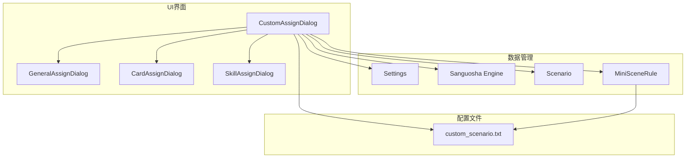
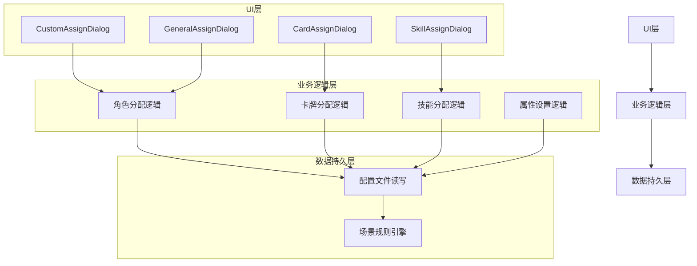
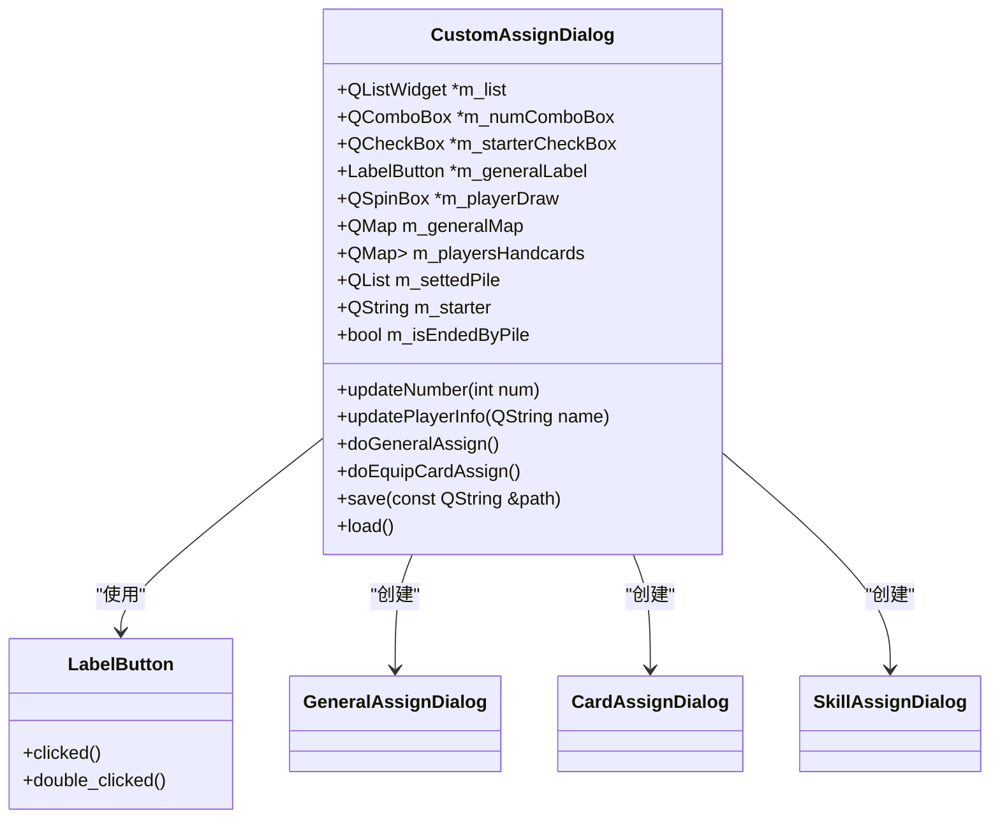
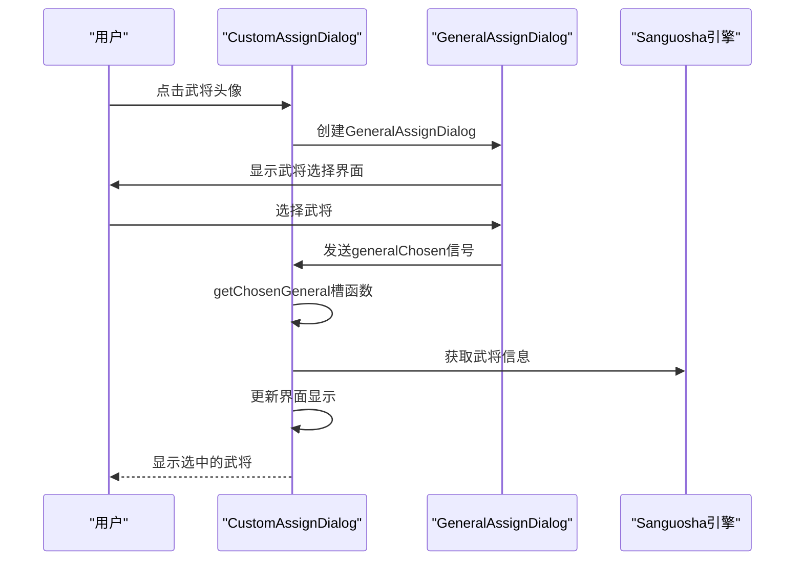
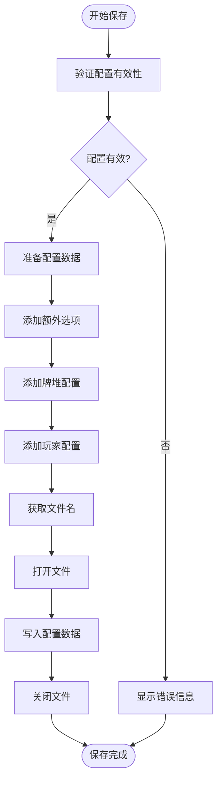
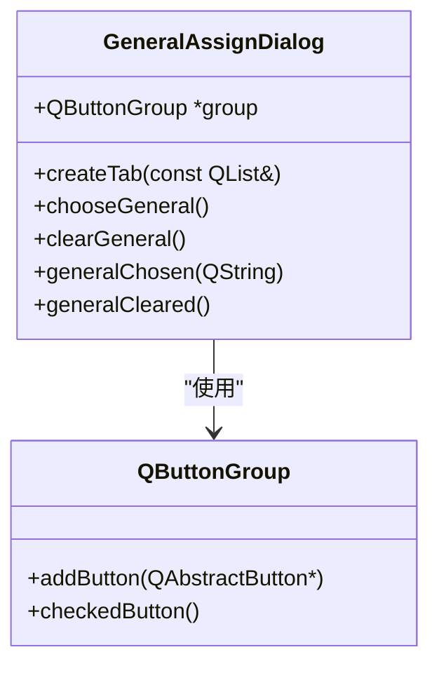
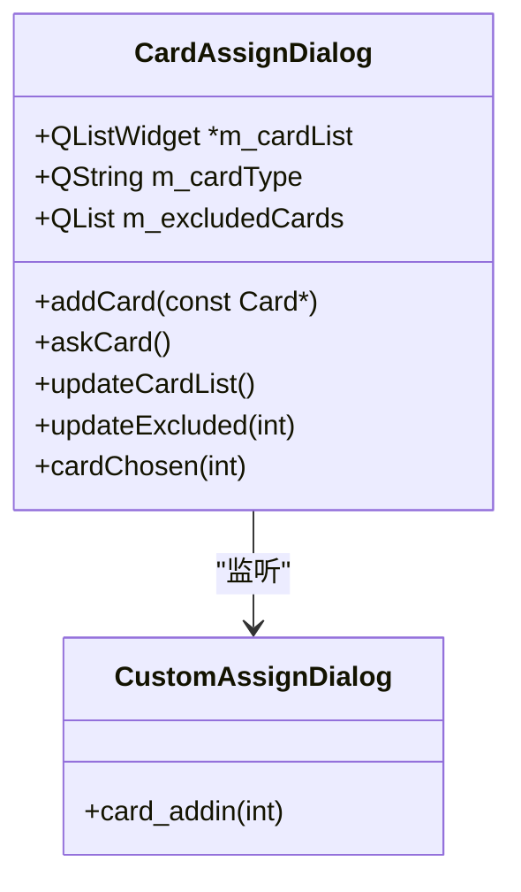
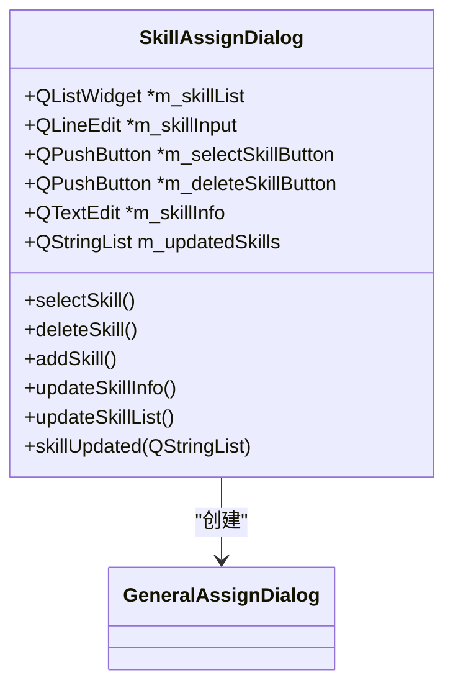
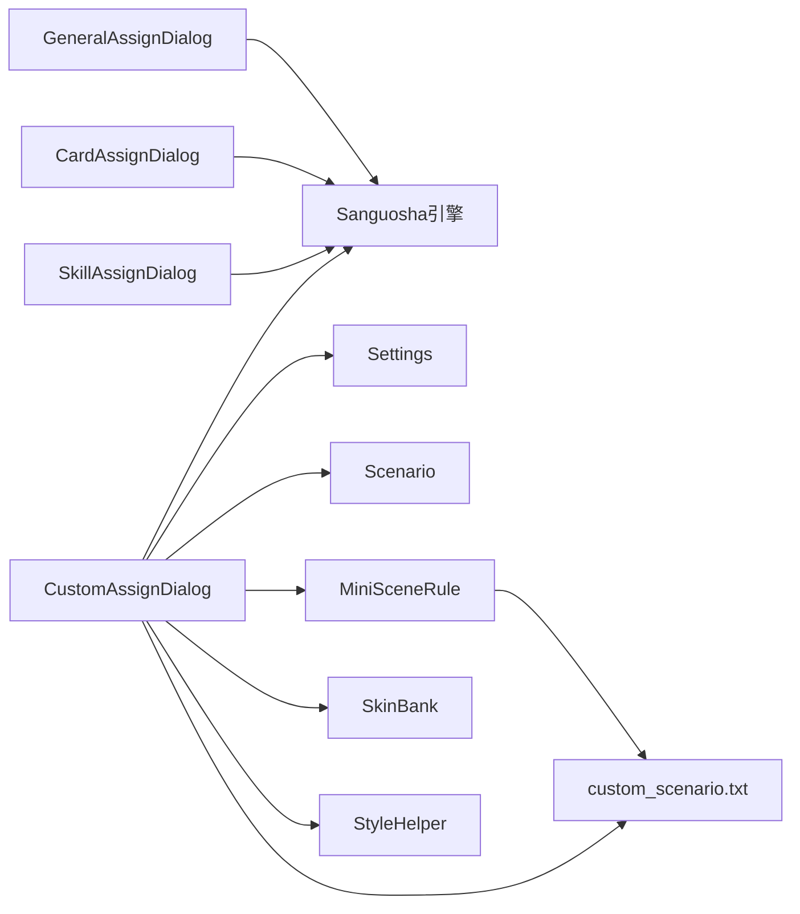

# 自定义角色分配

<cite>
**本文档引用文件**   
- [customassigndialog.cpp](file://src/dialog/customassigndialog.cpp#L0-L1957)
- [customassigndialog.h](file://src/dialog/customassigndialog.h#L0-L308)
- [custom_scenario.txt](file://etc/customScenes/custom_scenario.txt)
- [miniscenarios.cpp](file://src/scenario/miniscenarios.cpp)
- [scenerule.h](file://src/scenario/scenerule.h)
- [scenario.cpp](file://src/scenario/scenario.cpp)
</cite>

## 目录
1. [简介](#简介)
2. [项目结构分析](#项目结构分析)
3. [核心组件解析](#核心组件解析)
4. [架构概览](#架构概览)
5. [详细组件分析](#详细组件分析)
6. [依赖关系分析](#依赖关系分析)
7. [性能考量](#性能考量)
8. [故障排查指南](#故障排查指南)
9. [结论](#结论)

## 简介
本文档深入解析《三国杀》自定义角色分配对话框的实现原理，重点分析`customassigndialog.cpp`中针对特殊游戏模式（如剧情模式、挑战模式）的角色分配策略。文档详细说明了界面中禁用武将、锁定武将、强制分配等高级功能的技术实现，包括与服务器规则引擎的交互协议和配置参数传递机制。同时，文档描述了该对话框如何读取自定义场景配置（etc/customScenes）、处理管理员指令以及同步多客户端视图的一致性保障措施。结合实际使用场景，提供了配置示例和常见问题排查指南。

## 项目结构分析
自定义角色分配功能主要由`src/dialog`目录下的`customassigndialog.cpp`和`customassigndialog.h`文件实现，其配置文件存储在`etc/customScenes`目录下。该功能依赖于核心引擎、场景管理、UI组件等多个模块，形成了一个完整的自定义场景配置系统。

**图示来源**
- [customassigndialog.cpp](file://src/dialog/customassigndialog.cpp#L0-L1957)
- [customassigndialog.h](file://src/dialog/customassigndialog.h#L0-L308)
- [etc/customScenes/custom_scenario.txt](file://etc/customScenes/custom_scenario.txt)

## 核心组件解析
自定义角色分配对话框的核心功能包括武将分配、卡牌配置、角色属性设置和特殊规则定义。系统通过`CustomAssignDialog`类管理所有配置状态，使用多个子对话框（`GeneralAssignDialog`、`CardAssignDialog`、`SkillAssignDialog`）实现具体功能。

**组件来源**
- [customassigndialog.cpp](file://src/dialog/customassigndialog.cpp#L0-L1957)
- [customassigndialog.h](file://src/dialog/customassigndialog.h#L0-L308)

## 架构概览
自定义角色分配系统采用分层架构设计，分为UI层、业务逻辑层和数据持久层。UI层负责用户交互，业务逻辑层处理配置逻辑，数据持久层负责配置的读写操作。

**图示来源**
- [customassigndialog.cpp](file://src/dialog/customassigndialog.cpp#L0-L1957)
- [customassigndialog.h](file://src/dialog/customassigndialog.h#L0-L308)
- [scenerule.h](file://src/scenario/scenerule.h)

## 详细组件分析

### 自定义分配对话框分析
`CustomAssignDialog`是自定义角色分配的核心类，负责管理所有配置状态和用户交互。

#### 类结构分析

**图示来源**
- [customassigndialog.h](file://src/dialog/customassigndialog.h#L0-L308)
- [customassigndialog.cpp](file://src/dialog/customassigndialog.cpp#L0-L1957)

#### 武将分配流程

**图示来源**
- [customassigndialog.cpp](file://src/dialog/customassigndialog.cpp#L1300-L1350)
- [customassigndialog.h](file://src/dialog/customassigndialog.h#L150-L155)

#### 配置保存流程

**图示来源**
- [customassigndialog.cpp](file://src/dialog/customassigndialog.cpp#L1700-L1900)

### 武将选择对话框分析
`GeneralAssignDialog`负责提供武将选择界面，支持按势力分类显示武将。

**图示来源**
- [customassigndialog.h](file://src/dialog/customassigndialog.h#L200-L215)
- [customassigndialog.cpp](file://src/dialog/customassigndialog.cpp#L1600-L1700)

### 卡牌分配对话框分析
`CardAssignDialog`用于选择和分配卡牌，支持排除已分配的卡牌。

**图示来源**
- [customassigndialog.h](file://src/dialog/customassigndialog.h#L240-L255)
- [customassigndialog.cpp](file://src/dialog/customassigndialog.cpp#L1800-L1900)

### 技能分配对话框分析
`SkillAssignDialog`允许为角色分配额外技能，支持从武将技能中选择或手动输入技能名称。

**图示来源**
- [customassigndialog.h](file://src/dialog/customassigndialog.h#L260-L280)
- [customassigndialog.cpp](file://src/dialog/customassigndialog.cpp#L1900-L2000)

## 依赖关系分析
自定义角色分配系统依赖于多个核心模块，形成了复杂的依赖网络。

**图示来源**
- [customassigndialog.cpp](file://src/dialog/customassigndialog.cpp#L1-L50)
- [customassigndialog.h](file://src/dialog/customassigndialog.h#L1-L30)

## 性能考量
自定义角色分配系统的性能主要受以下因素影响：
1. 武将和卡牌数量：大量武将和卡牌会导致界面加载变慢
2. 配置文件大小：复杂的配置会导致读写操作耗时增加
3. 内存使用：存储所有配置状态需要大量内存

优化建议：
- 使用延迟加载技术，只在需要时加载武将和卡牌数据
- 对配置文件进行压缩，减少I/O操作时间
- 使用对象池技术，复用已创建的对话框实例

## 故障排查指南
### 常见问题及解决方案

**问题1：无法保存配置**
- **可能原因**：没有设置起始玩家
- **解决方案**：确保至少有一个玩家被设置为起始玩家

**问题2：武将选择界面为空**
- **可能原因**：武将包被禁用
- **解决方案**：检查`Config.BanPackages`设置，确保所需武将包未被禁用

**问题3：配置加载失败**
- **可能原因**：配置文件格式错误
- **解决方案**：检查配置文件是否符合指定格式，确保每行以"general:"、"setPile:"或"extraOptions:"开头

**问题4：技能无法添加**
- **可能原因**：技能名称错误或不存在
- **解决方案**：检查技能内部名称是否正确，参考`lang`目录下的翻译文件

**组件来源**
- [customassigndialog.cpp](file://src/dialog/customassigndialog.cpp#L1700-L1900)
- [customassigndialog.h](file://src/dialog/customassigndialog.h)

## 结论
自定义角色分配系统为《三国杀》提供了强大的场景配置能力，支持复杂的剧情模式和挑战模式。通过模块化设计，系统实现了良好的可扩展性和可维护性。未来可以考虑增加更多高级功能，如条件触发、事件脚本等，进一步提升自定义场景的灵活性和表现力。