# 角色选择对话框

<cite>
**本文档引用的文件**   
- [choosegeneralbox.cpp](file://src\ui\choosegeneralbox.cpp)
- [customassigndialog.cpp](file://src\dialog\customassigndialog.cpp)
- [generalmodel.cpp](file://src\dialog\generalmodel.cpp)
- [choosegeneralbox.h](file://src\ui\choosegeneralbox.h)
- [generalmodel.h](file://src\dialog\generalmodel.h)
</cite>

## 目录
1. [引言](#引言)
2. [项目结构](#项目结构)
3. [核心组件](#核心组件)
4. [架构概述](#架构概述)
5. [详细组件分析](#详细组件分析)
6. [依赖分析](#依赖分析)
7. [性能考虑](#性能考虑)
8. [故障排除指南](#故障排除指南)
9. [结论](#结论)

## 引言
本文档详细阐述了《三国杀》游戏中角色选择系统的实现机制。重点分析了选将流程的状态管理、UI交互逻辑、数据模型以及网络同步机制。文档覆盖了从玩家选择武将到服务器确认的完整流程，包括特殊模式下的自定义分配策略、倒计时控制、冲突处理和异常恢复机制。

## 项目结构
角色选择系统主要由UI组件、对话框和数据模型三大部分构成。UI组件负责呈现选将界面和处理用户交互，对话框提供自定义配置功能，数据模型则管理武将数据的展示和查询。


**图示来源**
- [choosegeneralbox.h](file://src\ui\choosegeneralbox.h#L54-L101)
- [customassigndialog.cpp](file://src\dialog\customassigndialog.cpp#L45-L150)
- [generalmodel.h](file://src\dialog\generalmodel.h#L30-L85)

## 核心组件
角色选择系统的核心组件包括`ChooseGeneralBox`、`CustomAssignDialog`和`GeneralModel`。这些组件协同工作，实现了从武将展示、选择到确认的完整流程。

**组件来源**
- [choosegeneralbox.cpp](file://src\ui\choosegeneralbox.cpp#L111-L119)
- [customassigndialog.cpp](file://src\dialog\customassigndialog.cpp#L45-L150)
- [generalmodel.cpp](file://src\dialog\generalmodel.cpp#L15-L20)

## 架构概述
系统采用MVC（Model-View-Controller）架构模式，将数据、界面和控制逻辑分离。`GeneralModel`作为数据模型，`ChooseGeneralBox`作为视图和控制器，`Client`作为外部协调者。


**图示来源**
- [choosegeneralbox.h](file://src\ui\choosegeneralbox.h#L54-L101)
- [generalmodel.h](file://src\dialog\generalmodel.h#L30-L85)
- [customassigndialog.cpp](file://src\dialog\customassigndialog.cpp#L45-L150)

## 详细组件分析

### 选将流程状态管理
`ChooseGeneralBox`类实现了选将流程的状态管理，通过`items`和`selected`两个列表来跟踪武将卡项的状态。


**图示来源**
- [choosegeneralbox.cpp](file://src\ui\choosegeneralbox.cpp#L200-L300)
- [choosegeneralbox.h](file://src\ui\choosegeneralbox.h#L60-L65)

**组件来源**
- [choosegeneralbox.cpp](file://src\ui\choosegeneralbox.cpp#L200-L300)

### UI交互逻辑
选将界面的UI交互逻辑主要通过信号-槽机制实现。当玩家点击武将卡时，触发`_onItemClicked()`槽函数，处理选择逻辑。

```mermaid
flowchart TD
A["玩家点击武将卡"] --> B{_onItemClicked()}
B --> C{"single_result?"}
C --> |是| D["添加到selected<br/>调用reply()"]
C --> |否| E{"已选择?"}
E --> |是| F["从selected移除<br/>添加回items"]
E --> |否| G{"已有选择?"}
G --> |是| H["添加到selected"]
G --> |否| I["检查是否有匹配武将"]
I --> |无匹配| J["返回"]
H --> K["调用adjustItems()"]
F --> K
K --> L["更新界面状态"]
```

**图示来源**
- [choosegeneralbox.cpp](file://src\ui\choosegeneralbox.cpp#L500-L550)
- [choosegeneralbox.h](file://src\ui\choosegeneralbox.h#L95-L97)

**组件来源**
- [choosegeneralbox.cpp](file://src\ui\choosegeneralbox.cpp#L500-L550)

### 自定义分配策略
`CustomAssignDialog`类实现了特殊模式下的角色分配策略，支持禁用武将、锁定武将等功能。


**图示来源**
- [customassigndialog.cpp](file://src\dialog\customassigndialog.cpp#L150-L200)
- [customassigndialog.cpp](file://src\dialog\customassigndialog.cpp#L400-L450)

**组件来源**
- [customassigndialog.cpp](file://src\dialog\customassigndialog.cpp#L150-L200)

### 数据模型与网络同步
`GeneralModel`类作为数据模型，管理武将数据的展示和查询，与服务器选将规则协同工作。


**图示来源**
- [generalmodel.cpp](file://src\dialog\generalmodel.cpp#L30-L80)
- [choosegeneralbox.cpp](file://src\ui\choosegeneralbox.cpp#L200-L250)

**组件来源**
- [generalmodel.cpp](file://src\dialog\generalmodel.cpp#L30-L80)

### 倒计时与异常处理
系统实现了倒计时控制和异常恢复机制，确保选将流程的稳定性和公平性。

```mermaid
flowchart TD
A["启动选将流程"] --> B{"view_only?"}
B --> |否| C["创建进度条<br/>progress_bar"]
C --> D["设置倒计时<br/>S_COMMAND_CHOOSE_GENERAL"]
D --> E["连接timedOut信号"]
E --> F["超时调用reply()"]
F --> G["发送选择结果"]
B --> |是| H["设置固定倒计时"]
H --> I["10秒后自动关闭"]
I --> J["不发送选择"]
K["网络中断"] --> L["clear()"]
L --> M["清理所有资源"]
M --> N["隐藏界面"]
N --> O["等待重连"]
```



**图示来源**
- [choosegeneralbox.cpp](file://src\ui\choosegeneralbox.cpp#L350-L400)
- [choosegeneralbox.cpp](file://src\ui\choosegeneralbox.cpp#L600-L650)

**组件来源**
- [choosegeneralbox.cpp](file://src\ui\choosegeneralbox.cpp#L350-L400)

## 依赖分析
系统各组件之间的依赖关系清晰，遵循高内聚低耦合的设计原则。


**图示来源**
- [choosegeneralbox.h](file://src\ui\choosegeneralbox.h#L54-L101)
- [customassigndialog.cpp](file://src\dialog\customassigndialog.cpp#L45-L150)
- [generalmodel.h](file://src\dialog\generalmodel.h#L30-L85)

## 性能考虑
系统在性能方面做了多项优化：
- 使用`qStableSort`保持初始顺序，避免不必要的重排
- 采用`QMap`和`QList`高效管理数据
- 只在必要时更新界面，减少重绘
- 使用对象池模式管理临时对象

## 故障排除指南
常见问题及解决方案：

**问题：选将界面无法显示**
- 检查`chooseGeneral`方法的参数是否正确
- 确认`generals`列表不为空
- 验证`Sanguosha`引擎是否已正确初始化

**问题：武将选择无响应**
- 检查`_onItemClicked`槽函数是否正确连接
- 确认`items`和`selected`列表状态正常
- 验证`ClientInstance`是否可用

**问题：倒计时不工作**
- 检查`progress_bar`是否成功创建
- 确认`ServerInfo.OperationTimeout`设置正确
- 验证`timedOut`信号是否连接到`reply`槽

**组件来源**
- [choosegeneralbox.cpp](file://src\ui\choosegeneralbox.cpp#L200-L800)
- [customassigndialog.cpp](file://src\dialog\customassigndialog.cpp#L150-L1000)

## 结论
角色选择系统通过精心设计的架构和实现，提供了稳定、高效的选将体验。系统采用MVC模式分离关注点，使用信号-槽机制实现松耦合的组件通信，通过状态管理确保流程的正确性。自定义分配功能为特殊模式提供了灵活的配置选项，而倒计时和异常处理机制则保证了系统的健壮性。整体设计既满足了功能需求，又考虑了性能和可维护性。