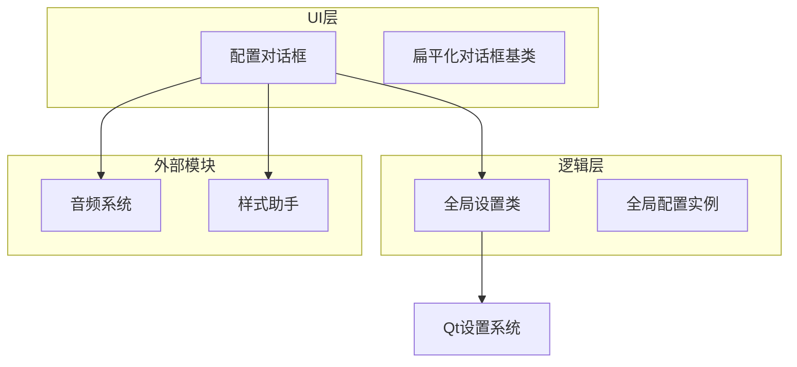
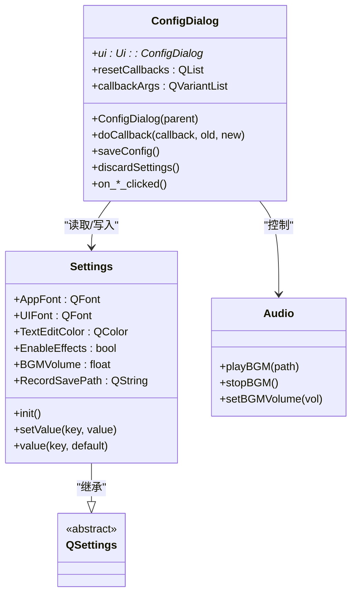
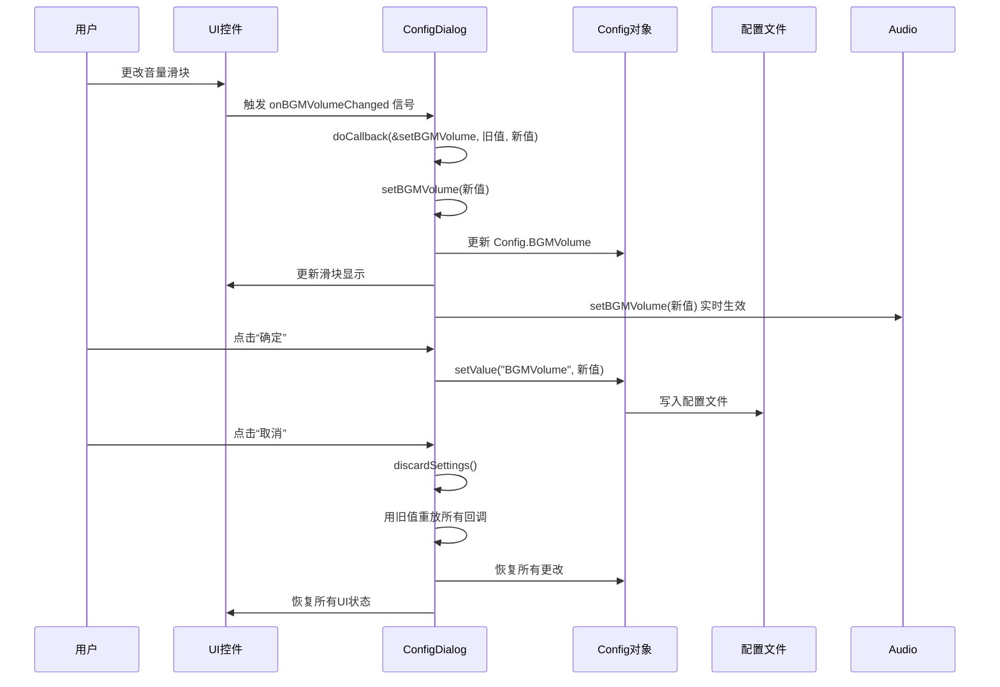
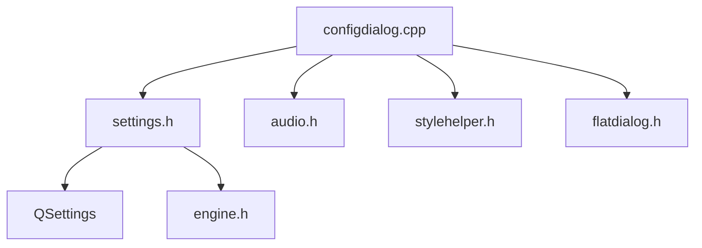

# 配置对话框

<cite>
**本文档引用的文件**   
- [configdialog.cpp](file://src/dialog/configdialog.cpp)
- [configdialog.h](file://src/dialog/configdialog.h)
- [settings.h](file://src/core/settings.h)
- [settings.cpp](file://src/core/settings.cpp)
</cite>

## 目录
1. [简介](#简介)
2. [项目结构](#项目结构)
3. [核心组件](#核心组件)
4. [架构概述](#架构概述)
5. [详细组件分析](#详细组件分析)
6. [依赖分析](#依赖分析)
7. [性能考虑](#性能考虑)
8. [故障排除指南](#故障排除指南)
9. [结论](#结论)

## 简介
本文档详细描述了《三国杀：霸业》游戏客户端中配置对话框（ConfigDialog）的实现机制。重点分析了`configdialog.cpp`文件中实现的设置界面数据绑定机制与配置持久化逻辑，解释了如何通过Qt的信号与槽机制同步UI控件与内部设置状态。文档涵盖了配置项的分类组织方式（如音频、显示、网络等）、配置验证流程、默认值管理、实时应用与重启生效的区别处理，以及与其他模块（如音频系统）的协同更新机制。

## 项目结构
该项目是一个基于Qt框架的桌面游戏客户端，采用模块化设计。核心功能被划分为多个目录，如`src/core`存放核心引擎和设置，`src/dialog`存放各种对话框界面，`src/ui`存放UI组件。配置系统主要由`src/dialog/configdialog.*`和`src/core/settings.*`文件构成，通过`Config`全局单例对象进行数据共享。



**图示来源**
- [configdialog.cpp](file://src/dialog/configdialog.cpp)
- [settings.h](file://src/core/settings.h)

**本节来源**
- [configdialog.cpp](file://src/dialog/configdialog.cpp#L1-L50)
- [settings.h](file://src/core/settings.h#L1-L20)

## 核心组件
配置对话框的核心功能是实现用户界面与持久化设置之间的双向数据绑定。它通过`Config`全局对象（`Settings`类的实例）作为数据源，并利用Qt的信号与槽机制实现UI控件的实时更新和状态同步。关键组件包括：
- **ConfigDialog类**：负责UI布局、事件处理和与`Config`对象的交互。
- **Settings类**：继承自`QSettings`，提供类型安全的成员变量来存储各种配置项，并负责从配置文件初始化默认值。
- **doCallback机制**：一个用于实现撤销/重做和临时更改的回调系统。

**本节来源**
- [configdialog.cpp](file://src/dialog/configdialog.cpp#L25-L100)
- [settings.h](file://src/core/settings.h#L15-L80)

## 架构概述
整个配置系统的架构遵循了MVC（Model-View-Controller）模式的简化变体。`Settings`类充当Model，持有所有配置数据；`ConfigDialog`既是View也是Controller，负责展示数据和处理用户输入。



**图示来源**
- [configdialog.cpp](file://src/dialog/configdialog.cpp#L10-L50)
- [settings.h](file://src/core/settings.h#L20-L40)

## 详细组件分析

### 配置数据绑定与同步机制
`ConfigDialog`在构造函数中初始化时，会从`Config`全局对象读取当前设置，并将其值填充到对应的UI控件中，实现从Model到View的单向绑定。

```cpp
// 在 ConfigDialog 构造函数中
ui->bgPathLineEdit->setText(Config.BackgroundImage); // 从 Config 读取并设置到 UI
ui->enableEffectCheckBox->setChecked(Config.EnableEffects);
ui->bgmVolumeSlider->setValue(100 * Config.BGMVolume);
```

当用户与UI交互时（如点击复选框、拖动滑块），会触发相应的槽函数（如`onEffectsEnabledChanged`），这些槽函数再调用`doCallback`方法。

#### 回调与临时更改机制
`doCallback`方法是实现配置临时更改和撤销功能的核心。它接收一个成员函数指针（`Callback`）、旧值和新值。它会将该回调函数和旧值记录在`resetCallbacks`和`callbackArgs`列表中，然后立即执行该回调函数来更新`Config`对象和UI。

```cpp
void ConfigDialog::doCallback(Callback callback, const QVariant &oldValue, const QVariant &newValue) {
    if (!resetCallbacks.contains(callback)) {
        resetCallbacks << callback; // 记录回调，用于撤销
        callbackArgs << oldValue;   // 记录旧值，用于撤销
    }
    (this->*callback)(newValue); // 立即执行回调，更新状态
}
```

当用户点击“确定”按钮时，`saveConfig()`函数被调用，它将`Config`对象中的所有更改通过`setValue`方法持久化到磁盘配置文件中，并清空回调列表。

```cpp
void ConfigDialog::saveConfig() {
    Config.setValue("EnableEffects", ui->enableEffectCheckBox->isChecked());
    Config.setValue("BGMVolume", Config.BGMVolume);
    // ... 其他设置项
    resetCallbacks.clear(); // 清空，表示更改已保存
    callbackArgs.clear();
}
```

如果用户点击“取消”按钮，`discardSettings()`函数被调用，它会遍历`resetCallbacks`和`callbackArgs`，用记录的旧值重新执行所有回调，从而将`Config`对象和UI恢复到打开对话框时的状态。

```cpp
void ConfigDialog::discardSettings() {
    const int n = resetCallbacks.size();
    for (int i = 0; i < n; ++i)
        (this->*(resetCallbacks[i]))(callbackArgs.at(i)); // 用旧值重放回调
    resetCallbacks.clear();
    callbackArgs.clear();
}
```



**图示来源**
- [configdialog.cpp](file://src/dialog/configdialog.cpp#L150-L200)
- [settings.cpp](file://src/core/settings.cpp#L100-L120)

**本节来源**
- [configdialog.cpp](file://src/dialog/configdialog.cpp#L100-L520)
- [configdialog.h](file://src/dialog/configdialog.h#L41-L74)

### 配置项分类与布局
配置对话框通过标签页（Tab）对配置项进行了清晰的分类：

1.  **显示设置 (Tab 1)**：包含背景图片(`BackgroundImage`)、桌面背景图片(`TableBgImage`)、应用字体(`AppFont`)、文本编辑字体(`UIFont`)和颜色等。
2.  **音频设置 (Tab 2)**：包含背景音乐路径、音效开关、阵亡语音开关、背景音乐和音效的音量控制。
3.  **游戏设置 (Tab 3)**：包含各种游戏行为选项，如自动目标选择、智能选牌、自动保存游戏记录、聊天泡泡显示时长等。

这种分类方式使得用户可以快速找到并修改相关设置，提升了用户体验。

**本节来源**
- [configdialog.cpp](file://src/dialog/configdialog.cpp#L50-L100)

### 配置持久化与默认值管理
配置的持久化由`Settings`类完成，它继承自Qt的`QSettings`。`QSettings`会自动将键值对保存到平台特定的配置位置（如Windows的注册表或INI文件）。

`Settings`类的`init()`函数负责管理默认值。它在程序启动时被调用，通过`value(key, default)`方法读取配置。如果配置文件中不存在该键，则返回提供的默认值，并将其写入`Config`对象。

```cpp
// 在 settings.cpp 中
void Settings::init() {
    AppFont = value("AppFont", QApplication::font("QMainWindow")).value<QFont>();
    EnableEffects = value("EnableEffects", true).toBool();
    BackgroundImage = value("BackgroundImage", "image/backdrop/bg.jpg").toString();
    // ...
}
```

这确保了即使配置文件损坏或首次运行，程序也能使用合理的默认值启动。

**本节来源**
- [settings.cpp](file://src/core/settings.cpp#L50-L150)
- [settings.h](file://src/core/settings.h)

### 实时应用与重启生效
该配置系统巧妙地区分了需要立即生效和可以延迟生效的设置。

- **实时生效**：大多数设置在用户操作UI时就通过`doCallback`机制立即更新`Config`对象，并可能触发其他模块的即时响应。例如，更改`BGMVolume`会立即调用`Audio::setBGMVolume()`来改变正在播放的音乐音量。
- **重启生效**：一些核心设置，如应用字体(`AppFont`)或背景图片，虽然在`Config`对象中被修改，但其视觉效果可能需要重启应用才能完全应用。`doCallback`机制确保了这些更改被记录，如果用户点击“确定”，更改将被保存，下次启动时`init()`函数会读取新值并应用。

**本节来源**
- [configdialog.cpp](file://src/dialog/configdialog.cpp#L200-L250)
- [settings.cpp](file://src/core/settings.cpp#L100-L120)

### 与其他模块的协同更新
配置对话框通过直接调用其他模块的API来实现协同更新。

- **与音频系统协同**：当用户更改背景音乐路径或开关状态时，`setBgMusic`和`setBGMEnabled`等回调函数会直接调用`Audio::playBGM()`、`Audio::stopBGM()`和`Audio::setBGMVolume()`等静态方法，实现音频的即时控制。
- **与样式系统协同**：当用户更改工具提示背景色时，`setTooltipBackgroundColor`函数会重新生成并应用包含新颜色的QSS样式表，从而立即改变UI外观。

```cpp
void ConfigDialog::setBgMusic(const QVariant &path) {
    // ... 更新UI和Config对象
#ifdef AUDIO_SUPPORT
    Audio::stopBGM(); // 停止当前音乐
    Audio::playBGM(fileName); // 播放新音乐
#endif
}
```

**本节来源**
- [configdialog.cpp](file://src/dialog/configdialog.cpp#L250-L300)

## 依赖分析
配置对话框模块依赖于多个核心模块，形成了清晰的依赖关系。



**图示来源**
- [configdialog.cpp](file://src/dialog/configdialog.cpp#L1-L20)
- [settings.h](file://src/core/settings.h#L1-L10)

**本节来源**
- [configdialog.cpp](file://src/dialog/configdialog.cpp#L1-L50)
- [settings.h](file://src/core/settings.h#L1-L20)

## 性能考虑
该配置系统的性能表现良好：
- **内存**：`Config`对象作为单例全局存在，避免了重复创建。`resetCallbacks`和`callbackArgs`列表仅在对话框打开期间占用少量内存。
- **I/O**：配置文件的读写只在程序启动（`init`）和用户确认更改（`saveConfig`）时发生，避免了频繁的磁盘I/O操作。
- **CPU**：信号与槽的连接和回调执行都是轻量级操作，对性能影响极小。

## 故障排除指南
- **问题：更改设置后没有效果**。
  - **检查**：确认是否点击了“确定”按钮。临时更改只在对话框打开期间有效。
  - **检查**：查看`set*`回调函数中是否有`#ifdef AUDIO_SUPPORT`等条件编译宏，确保相关功能已编译。
- **问题：配置文件未保存**。
  - **检查**：确认`saveConfig()`函数是否被正确调用（连接了`accepted`信号）。
  - **检查**：检查`QSettings`的存储路径是否有写入权限。
- **问题：默认值未正确加载**。
  - **检查**：确认`Settings::init()`函数是否在程序启动时被调用。

**本节来源**
- [configdialog.cpp](file://src/dialog/configdialog.cpp#L350-L520)
- [settings.cpp](file://src/core/settings.cpp#L1-L170)

## 结论
`ConfigDialog`的设计体现了良好的软件工程实践。它通过清晰的职责划分、有效的数据绑定机制（`doCallback`）和与`QSettings`的无缝集成，实现了一个功能完整、用户体验良好的配置系统。其模块化设计和明确的依赖关系使得代码易于维护和扩展。该系统成功地平衡了实时反馈和配置持久化的需求，为《三国杀：霸业》提供了稳定可靠的设置管理功能。